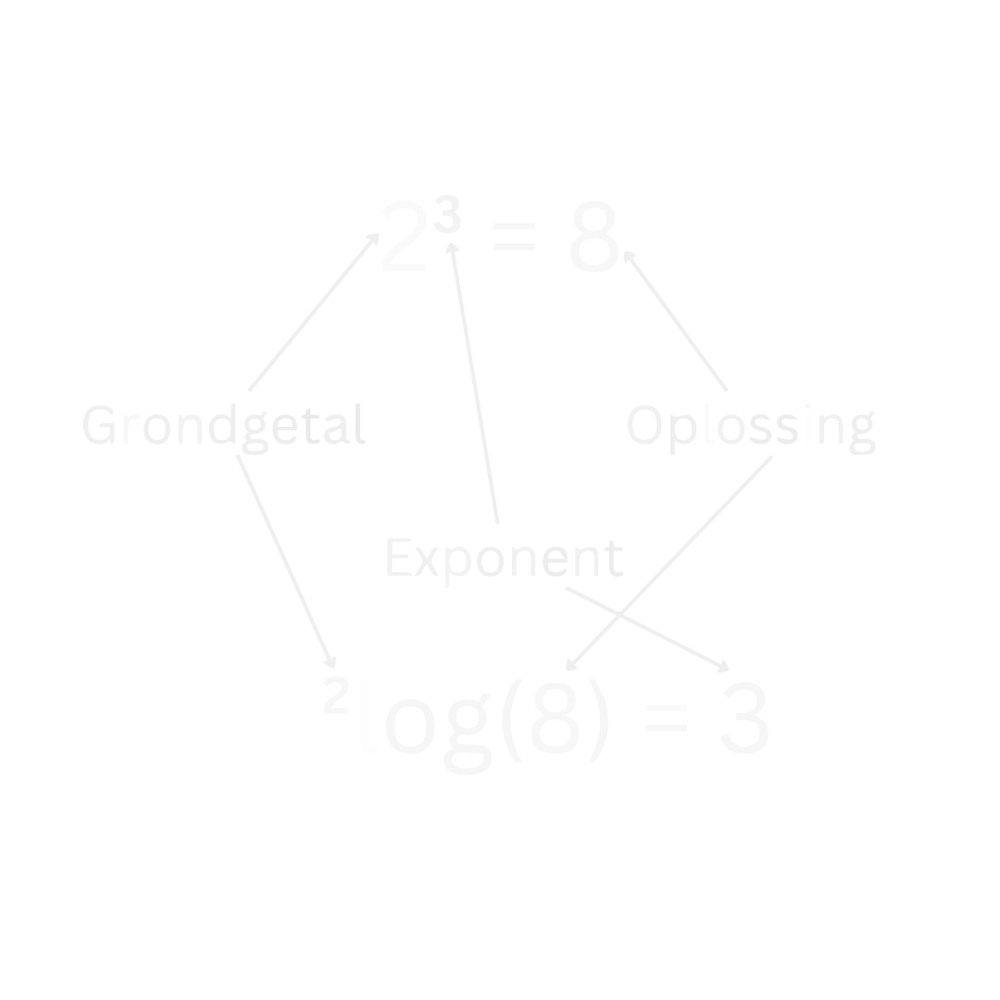

# Basisvaardigheden

## Formules Omschrijven
Het kunnen omschrijven van formules is een belangrijke vaardigheid, ook bij vakken waar wiskunde gebruikt wordt, zoals natuurkunde. Sommige mensen vinden het moeilijk vanwege de letters, maar laten we het eenvoudiger maken met een voorbeeld.

Stel je hebt deze formule:

$$A = \frac{B}{C},$$

en we willen erachter komen wat $B$ op zichzelf is, zoals $B = \ ...$ . Hoe doen we dat? We moeten aan beide kanten van het '$=$'-teken hetzelfde doen. In dit geval vermenigvuldigen we beide kanten met $C$. Dat zorgt ervoor dat de $C$ aan de rechterkant verdwijnt en aan de linkerkant verschijnt:

!!! quote ""
    $$\large{A * C = B.}$$

Als je dit nog een beetje abstract vindt, probeer het dan eens met getallen in plaats van letters. Bijvoorbeeld:

$$3 = \frac{6}{2}.$$

Waarschijnlijk is het nu makkelijker te zien dat als we de $6$ vrij willen maken, dat we de twee naar de andere kant moeten verplaatsen om te krijgen:

$$3 * 2 = 6.$$

Dit is eigenlijk dezelfde stap als dat we ook hebben gedaan met de letters.

Laten we nu proberen $C$ vrij te maken zodat we krijgen $C = \ ...$ . We gaan door met:

$$A * C = B.$$

Nu kunnen we beide kanten delen door $A$, en dan krijgen we:

!!! quote ""
    $$\large{C = \frac{B}{A}.}$$

Als we dit controleren met ons getallen voorbeeld, waar $2 = \frac{6}{3}$, klopt het!

!!! tip ""

## Vergelijkingen Omschrijven
Vergelijkingen omschrijven is eigenlijk hetzelfde als een formule omschrijven. In beide gevallen doe je aan beide kanten van het '$=$'-teken hetzelfde, waardoor de vorm van de formule of vergelijking verandert. Laten we kijken naar een paar voorbeelden van vergelijkingen:

### **Voorbeeld 1**

$$2x = 4.$$

De meesten zullen in een keer zien dat dit betekent dat $x = 2$. Maar laten we het wiskundig bekijken. We delen beide kanten door $2$ en vinden dan inderdaad:

!!! quote ""
    $$\Large{x = 2.}$$

### **Voorbeeld 2**

$$35x + 17 = 262.$$

We doen weer hetzelfde als eerst, maar nu beginnen we door alle termen met $x$ links te houden en alle getallen rechts van het '$=$'-teken te zetten. We trekken $17$ af aan beide kanten van het '$=$'-teken en krijgen dan:

$$35x = 262 - 17$$

$$35x = 245$$

Nu delen we beide kanten door $35$ en vinden:

!!! quote ""
    $$\Large{x = 7.}$$

### **Voorbeeld 3**

$$\frac{1}{2}x - \frac{1}{12} = -\frac{1}{3} x + 2$$

Dit lijkt ingewikkelder, maar het stappenplan is precies hetzelfde. We brengen alle termen met $x$ aan de linkerkant, en de getallen aan de rechterkant. Stap voor stap krijgen we:

- $+\frac{1}{12}$ aan beide kanten geeft:

$$\frac{1}{2}x = -\frac{1}{3} x + 2\frac{1}{12}$$

- $+\frac{1}{3}x$ aan beide kanten geeft:

$$\frac{1}{2}x + \frac{1}{3} x  =  2\frac{1}{12}$$

- Combineer deze twee breuken (zie eventueel [getallen voorbeeld 3](#getallen-voorbeeld-breuken) bij de [Regels bij Breuken](#regels-bij-breuken)):

$$\frac{5}{6}x =  2\frac{1}{12}$$

- Deel beide kanten door $\frac{5}{6}$ om te vinden:

!!! quote ""
    $$\Large{x =  2\frac{1}{2}}$$

!!! tip ""

## Breuken
Breuken worden vaak gebruikt in de wiskunde. Het is daarom belangrijk om goed te leren rekenen met deze breuken. Daarom staan de belangrijkste regels en hoe je met breuken moet rekenen hier op een rijtje.

??? note "Begrippen 'teller' en 'noemer'"
    Bij breuken gebruiken we vaak de termen "teller" en "noemer". De teller is het getal boven de deelstreep en de noemer is het getal onder de deelstreep. Dus in de volgende breuk:

    $$\large{\frac{a}{b},}$$

    is $a$ de teller en $b$ de noemer.

Voor breuken gelden er de volgende regels:

???+ Belangrijk
    ### **Regels bij Breuken**

    1. $$\large{\frac{a}{b} + \frac{c}{b} = \frac{a + c}{b}}$$  

    2. $$\large{\frac{a}{b} - \frac{c}{b} = \frac{a - c}{b}}$$

    3. $$\large{\frac{a}{b} + \frac{c}{d} = \frac{a * d + b * c}{b * d}}$$

    4. $$\large{\frac{a}{b} - \frac{c}{d} = \frac{a * d - b * c}{b * d}}$$

    5. $$\large{\frac{a}{b} * \frac{c}{d} = \frac{a * c}{b * d}}$$

    6. $$\large{\frac{\frac{a}{b}}{\frac{c}{d}} = \frac{a}{b} * \frac{d}{c} = \frac{a * d}{b * c}}$$

Vaak ziet dit er nog abstract uit, dus in het onderstaande voorbeeld is er voor elke regel een getallen voorbeeld weergegeven om de regels te verduidelijken.

??? example "Getallen Voorbeeld Breuken"
    ### **Getallen Voorbeeld Breuken**
    1. $$\large{\frac{2}{6} + \frac{1}{6} = \frac{2 + 1}{6} = \frac{3}{6} = \frac{1}{2}}$$

    2. $$\large{\frac{2}{6} - \frac{1}{6} = \frac{2 - 1}{6} = \frac{1}{6}}$$

    3. $$\large{\frac{1}{2} + \frac{1}{3} = \frac{1*3 + 2*1}{2*3} = \frac{5}{6}}$$

    4. $$\large{\frac{1}{2} - \frac{1}{3} = \frac{1*3 - 2*1}{2*3} = \frac{1}{6}}$$

    5. $$\large{\frac{3}{4} * \frac{2}{6} = \frac{3 * 2}{4 * 6} = \frac{6}{24} = \frac{1}{4}}$$

    6. $$\large{\frac{\frac{1}{2}}{\frac{1}{4}} = \frac{1}{2} * \frac{4}{1} = \frac{4}{2} = 2}$$

We zien dus dat we bij optellen en aftrekken eerst gelijke noemers moeten hebben om op te kunnen tellen volgens regel $1$ en $2$ van de [Regels bij Breuken](#regels-bij-breuken). Als we geen gelijke noemers hebben, moeten we regel $3$ en $4$ gebruiken. Maar waar komen regel $3$ en $4$ vandaan? Dat wordt in dit onderstaande bewijs toegelicht. 

??? abstract "Waar komen regel 3 en 4 vandaan?"
    Voor [regel $3$](#regels-bij-breuken) hebben we een bewijs. We beginnen met beide termen keer 1 te doen:

    $$\large{\frac{a}{b} + \frac{c}{d} = \frac{a}{b} * 1 + \frac{c}{d} * 1.}$$

    We weten dat een getal gedeeld door zichzelf altijd gelijk is aan 1, dus we kunnen 1 op deze manier schrijven:

    $$\large{\frac{a}{b} + \frac{c}{d} = \frac{a}{b} * \frac{d}{d} + \frac{c}{d} * \frac{b}{b}.}$$

    Met [regel $5$](#regels-bij-breuken) kunnen we dit herschrijven tot:

    $$\large{\frac{a}{b} + \frac{c}{d} = \frac{a * d}{b * d} + \frac{c * b}{d * b}.}$$

    Omdat de volgorde bij vermenigvuldigen niet uitmaakt, kunnen we dit ook schrijven als:

    $$\large{\frac{a}{b} + \frac{c}{d} = \frac{a * d}{b * d} + \frac{b * c}{b * d}}$$

    Nu zien we dat de noemers gelijk zijn en we de twee tellers gewoon bij elkaar kunnen optellen volgens [regel $1$](#regels-bij-breuken):

    !!! quote ""
        $$\large{\frac{a}{b} + \frac{c}{d} = \frac{a * d + b * c}{b * d}}$$

    Voor aftrekken gelden precies dezelfde stappen, dus voor dat bewijs moet je dezelfde stappen doorlopen en het plus-teken vervangen met een min-teken.

!!! tip ""

## Operaties met variabelen
Een operatie klinkt als een lastig woord, maar dit betekent gewoon dingen zoals optellen, aftrekken, vermenigvuldigen en delen.

Alle onderstaande regels gaan twee kanten op, dus je kan iets in de linker vorm altijd schrijven als iets in de rechter vorm, en andersom. 

???+ Belangrijk
    ### **Regels bij operaties met variabelen**
    1. $$\large{nA + mA \iff (n + m)A}$$

    2. $$\large{nA - mA \iff (n - m)A}$$

    3. $$\large{(A + B) (C + D) \iff AC + AD + BC + BD}$$

    4. $$\large{(A - B) (C - D) \iff AC - AD - BC + BD}$$

    5. $$\large{A(B*C) \iff A*B*C}$$

??? example "Getallen Voorbeelden"
    Laten we eerst kijken naar optellen en aftrekken:

    1. $$\large{3A + A = 4A}$$

    2. $$\large{3A - A = 2A}$$

    3. $$\large{2A + (3A - B) = 5A - B}$$

    Nu voorbeelden van dingen die je niet verder kan versimpelen:

    - $$\large{2A + B}$$

    - $$\large{2A - B}$$

    Dus met dezelfde variabelen mag je optellen en aftrekken, met verschillende variabelen mag dit niet. 

    Laten we nu kijken naar vermenigvuldigen en delen:

    1. $$\large{2A * A = 2A^2}$$

    2. $$\large{2A * 3B = 6AB}$$

    3. $$\large{\frac{2A}{4A} = \frac{1}{2}}.$$

    Maar dit kan dan weer niet verder worden versimpelt:

    - $$\large{\frac{2A}{3B}}$$

    En nu combinaties:

    1. $$\large{2A \left(4A + 3B\right) = 8A^2 + 6AB}$$

    2. $$\large{2A \left(\frac{2B}{4A} + \frac{A}{3B}\right) = B + \frac{2A^2}{3B}}$$

!!! tip ""

## Machten en Wortels
### **Regels met Machten**

???+ Belangrijk
    ####  Kwadratisch haakjes wegwerken
    1. $$\large{\left(a + b\right)^2 \equiv \left(a + b \right) \left(a + b \right) = a^2 + 2ab + b^2}$$

    2. $$\large{\left(a - b\right)^2 \equiv \left(a - b \right) \left(a - b \right) = a^2 - 2ab + b^2}$$

    3. $$\large{ \left(a + b \right) \left(a - b \right) = a^2 - b^2}$$

??? note "Extra Toelichting regel 1-3"
    **
Regel 1
**

    Dit hebben we opgelost door de haakjes weg te werken op de volgende manier. :

    $$\large{\left(a + b \right) \left(a + b \right) = a \left( a + b \right) + b \left( a + b \right)}$$

    En nu werken we beide haakjes uit:

    $$\large{a \left( a + b \right) + b \left( a + b \right) = a^2 + ab + ba + b^2}$$

    En omdat de volgorde niet uitmaakt voor vermenigvuldigen kunnen we dit versimpelen tot:

    $$\large{a^2 + ab + ba + b^2 = a^2 + 2ab + b^2}$$

    Onze eindconclusie is dus:

    !!! quote ""
        $$\large{\left(a + b \right) \left(a + b \right) = a^2 + 2ab + b^2}$$

    (zie ook regel 3 van [Regels bij operaties met variabelen](#regels-bij-operaties-met-variabelen))

    **
Regel 2
**
    Eigenlijk gaat dit op dezelfde manier als bij de vorige regel:

    $$\large{\left(a - b \right) \left(a - b \right) = a \left( a - b \right) - b \left( a - b \right).}$$

    We werken weer beide haakjes uit:

    $$\large{a \left( a - b \right) - b \left( a - b \right) = a^2 - ab - (ba - b^2).}$$

    We weten dat min * min is plus, en dus wordt de $b^2$ term positief:

    $$\large{a^2 - ab - ba -- b^2 = a^2 - 2ab + b^2.}$$

    Onze eindconclusie wordt dus:

    !!! quote ""
        $$\large{\left(a - b \right) \left(a - b \right) = a^2 - 2ab + b^2 }$$

    (zie ook regel 4 van [Regels bij operaties met variabelen](#regels-bij-operaties-met-variabelen))

    **
Regel 3
**
    En weer is dit vergelijkbaar aan de vorige twee regels:

    $$\large{\left(a + b \right) \left(a - b \right) = a \left( a - b \right) + b \left( a - b \right)}$$

    $$\large{a \left( a - b \right) + b \left( a - b \right) = a^2 - ab + ba - b^2 }$$

    Nu zien we dat de kruistermen tegen elkaar wegvallen en we dus overhouden:

    $$\large{a^2 - ab + ba - b^2 = a^2 - b^2.}$$

    Onze eindconclusie wordt dus ook:

    !!! quote ""
        $$\large{\left(a + b \right) \left(a - b \right) = a^2 - b^2 }$$

### **Controle met Getallen Voorbeeld**
Dus bij optellen en aftrekken moet je voorzichtig zijn dat je niet alleen de twee variabelen kwadrateerd en bij elkaar optelt of aftrekt, zonder rekening te houden met de kruistermen. We kunnen dit ook altijd controleren met een getallen voorbeeld:

$$(2 + 3)^2 \neq 2^2 + 3^2$$

$$(5)^2 \neq 4 + 9$$

$$25 \neq 13$$

waarbij $\neq$ dus betekent: "is **niet** gelijk aan". Als we wel rekening houden met de kruistermen, dan zien we dat het wel klopt:

$$(2 + 3)^2 = 2^2 + 2*2*3 + 3^2 = 4 + 12 + 9 = 25$$

De volgende regels gelden wel voor alle soorten machten:

???+ Belangrijk

    #### Machten in het Algemeen

    4. $$\large{(a*b)^n = a^n*b^n}$$

    5. $$\large{\left(\frac{a}{b}\right)^n = \frac{a^n}{b^n}}$$

    6. $$\large{ a^n * a^m = a^{n + m}}$$

    7. $$\large{ \frac{a^n}{a^m} = a^{n - m}}$$

    6. $$\large{\left(a^n\right)^m = a^{n * m}}$$

Voor wortels gelden dus precies dezelfde regels als voor machten, wat logisch is aangezien je een wortel kan schrijven als tot de macht $\frac{1}{2}$:

$$\sqrt{x} \equiv x^{\frac{1}{2}}$$

???+ Belangrijk
    ### **Regels met wortels**
    1. $$\large{\sqrt{a + b} \rightarrow} \ \small{\mathrm{kan \ niet \ verder \ worden \ versimpelt}}$$

    2. $$\large{\sqrt{a - b} \rightarrow} \ \small{\mathrm{kan \ niet \ verder \ worden \ versimpelt}}$$

    3. $$\large{\sqrt{a * b} = \sqrt{a} * \sqrt{b}}$$

    4. $$\large{\sqrt{\frac{a}{b}} = \frac{\sqrt{a}}{\sqrt{b}}}$$

    5. $$\large{\sqrt{\sqrt{a}} = \sqrt[4]{a}}$$

    6. $$\large{\sqrt{a^2} = a}$$

    7. $$\large{\sqrt[m]{a^n} = a^{\frac{n}{m}}}$$

??? note "Opmerking Regel 6"
    Bij de regel 6 staat er dat

    $$\large{\sqrt{a^2} = a}$$

    Maar dit geldt eigenlijk alleen als $a$ een positief getal is. Want als $a$ een negatief getal is, dan wordt het getal na het kwadraat positief en met de wortel blijft het positief. Bijvoorbeeld:

    $$\large{\sqrt{(-2)^2} = \sqrt{4} = 2 \neq -2}$$

    Om dit probleem op te lossen moeten we de absolute waarde nemen van $a$. De absolute waarde is als volgt gedenifieerd:

    $$\large{ |a| = \left\{ \begin{array}{ c l } a & \quad \textrm{als } a \geq 0 \\ -a & \quad \textrm{als } a < 0 \end{array} \right.}$$

    Dit zorgt er dus voor dat het getal altijd positief is. Bijvoorbeeld:
    
    $$\large{|-2| = 2, \ \mathrm{en} \ |2| = 2.}$$

    En dus voor volledige correctheid moeten we de absolute waarde nemen van $a$:

    !!! quote ""
        $$\large{\sqrt{a^2} = |a|}$$

!!! tip ""

## Logaritmes
Een logaritme is eigenlijk het omgekeerde van een exponent. Met andere woorden:

$$\large{\log{(10^2)} = 2 = 10^{\log{(2)}}}$$

Ze heffen dus elkaar op.

Net zoals een exponent heeft een logaritme een grondgetal.

<figure markdown>
  { width="300"}
  <figcaption>Figuur 1. Vergelijking exponent en logaritme. Een exponent vergroot hier het antwoord, en het logaritme doet het omgekeerde.</figcaption>
</figure>

??? note "Opmerking Notatie"
    ### **Opmerking Notatie**
    De afspraak is dat als er geen grondgetal staat bij de logaritme, dat we er dan vanuit gaan dat het een $^{10} \! \log$ is, dus een logaritme met een grondgetal 10.

???+ Belangrijk
    ### **Regels met Logaritmes**

    1. $$\large{^a \! \log{(a^n)} = n = \Large{a^{^a \! \log{(n)}}}}$$

    2. $$\large{^a \! \log{(b^n)} = n * \ ^a \! \log{(b)}}$$

    3. $$\large{^a \! \log{(b*c)} =  ^a \! \log{(b)} + ^a \! \log{(c)}}$$

    4. $$\large{^a \! \log{(\frac{b}{c})} =  ^a \! \log{(b)} - ^a \! \log{(c)}}$$

    5. $$\large{^a \! \log{(b)} = \frac{^c \! \log{(b)}}{^c \! \log{(a)}}}$$

??? note "Opmerking $\ln$"
    ### **Opmerking ln**
    Voor een logaritme met een speciaal grondgetal hebben we een aparte notatie. Namelijk voor het grondgetal $e$, het getal van euler.

    $$\large{^e \log \equiv \ln}$$

    Dus in plaats van een logaritme met een grondgetal $e$ schrijven we $\ln$, wat staat voor "natuurlijke logaritme". Maar dit is alleen een verschil in notatie en dus zijn alle regels gewoon hetzelfde als met logaritmes die een ander grondgetal hebben.

??? note "Domein en Bereik"
    ### **Domein en Bereik**
    **
Exponent
**
    Het domein van een exponent met een positief grondgetal is alle reële getallen:

    $$\large{\textrm{Domein} = \langle \leftarrow, \rightarrow \rangle \textrm{ of } \mathbb{R}}$$

    Het bereik is echter alle getallen groter dan $0$, want je kan nooit een negatief getal krijgen als het grondgetal niet negatief is. Dus $2^x > 0$ voor alle waardes van $x$:

    $$\large{\textrm{Bereik} = \langle 0, \rightarrow \rangle}$$

    **
Logaritme
**

    Omdat een logaritme de inverse is van een exponent, is het domein en bereik precies omgekeerd. Er geldt dus dat:

    $$\large{\textrm{Domein} = \langle 0, \rightarrow \rangle}$$

    Dit betekent dus dat een logaritme alleen gedefinieerd is voor getallen groter dan $0$. Voor $0$ of kleiner dan $0$ is er dus geen oplossing (net zoals dat er voor een wortel geen oplossing is voor een negatief getal). 
    
    Het bereik van een logaritme is dus het domein van een exponent en dus alle reële getallen:

    $$\large{\textrm{Bereik} = \langle \leftarrow, \rightarrow \rangle \textrm{ of } \mathbb{R}}$$

### **Voorbeelden Logaritmes**
??? example "Voorbeeld 1: $^3 \! \log{(x)} = 2$"
    **
Bereken x: $^3 \! \log{(x)} = 2$
**
    **
Uitwerking
**

    We hebben hier een logaritme met een grondgetal $3$. Dit betekent dat we aan beide kanten van het '$=$'-teken de exponent kunnen nemen met $3$ als grondgetal om van ons logaritme af te komen:

    $$\Large{3^{^3 \log{(x)}} = 3^2}$$

    Dit mogen we doen, omdat we aan beide kanten van het '$=$'-teken dezelfde bewerking doen. Nu kunnen we dit versimpelen met behulp van regel 1 van de [Regels met Logaritmes](#regels-met-logaritmes):

    $$\Large{x = 3^2}$$

    En dus:

    !!! quote ""
        $$\Large{x = 9}$$

??? example "Voorbeeld 2: $\log{(x^4)} = 3$"
    **
Bereken x: $\log{(x^4)} = 3$
**
    **
Uitwerking
**

    Net zoals bij het vorig voorbeeld is ons doel uiteindelijk de logaritme wegwerken. Maar we moeten nu eerst van de vierde macht afkomen. Dit doen we met behulp van regel 2 van de [Regels met Logaritmes](#regels-met-logaritmes):

    $$\Large{4 \log{(x)} = 3}$$

    Nu delen we aan beide kanten van het '$=$'-teken door $4$ om alleen de logaritme aan de linkerkant over te houden:

    $$\Large{\log{(x)} = \frac{3}{4}}$$

    Er staat hier geen grondgetal bij de logaritme, wat dus betekent dat het een grondgetal $10$ heeft (zie [Opmerking Notatie](#opmerking-notatie)). We nemen nu aan beide kanten de exponent met $10$ als grondgetal om van ons logaritme af te komen:

    $$\Large{10^{\log{(x)}} = 10^{\frac{3}{4}}}$$

    En we kunnen dit weer versimpelen met regel 1 van de [Regels met Logaritmes](#regels-met-logaritmes):

    $$\Large{x = 10^{\frac{3}{4}}}$$

    En omdat we weten dat we deze $4$ in de noemer van de exponent kunnen schrijven als een vierdemachtswortel (zie regel 7 van [Regels met Wortels](#regels-met-wortels)), wordt ons eindantwoord:

    $$\Large{x = \sqrt[4]{10^3}}$$

    En dus:

    !!! quote ""
        $$\Large{x = \sqrt[4]{1000}}$$

    ??? note "Alternatieve uitwerking"
        Als we willen kunnen we ook eerst het logaritme wegwerken en daarna pas rekening houden met de vierdemacht:

        $$\Large{10^{\log{(x^4)}} = 10^3}$$

        $$\Large{x^4 = 1000}$$

        $$\Large{\sqrt[4]{x^4} = \sqrt[4]{1000}}$$

        !!! quote ""
            $$\Large{x = \sqrt[4]{1000}}$$

??? example "Voorbeeld 3: $^2 \! \log{(4x)} = - ^2 \! \log{(3x)} + 6$"
    **
Bereken x: $^2 \! \log{(4x)} = - ^2 \! \log{(3x)} + 6$
**
    **
Uitwerking
**

    We willen eerst alle termen met $x$ aan de linkerkant hebben. Dit doen we door aan beide kanten van het '$=$'-teken $+ ^2 \! \log{(3x)}$ toe te voegen, zodat het rechts wegvalt:

    $$\Large{^2 \! \log{(4x)} + ^2 \! \log{(3x)} = 6}$$

    Nu kunnen we dit met behulp van regel 3 van de [Regels met Logaritmes](#regels-met-logaritmes) samenvoegen tot $1$ logaritme:

    $$\Large{^2 \! \log{(4x * 3x)} = 6}$$

    $$\Large{^2 \! \log{(12x^2)} = 6}$$

    Nu kunnen we weer het logaritme weg werken door aan beide kanten de exponent te nemen met $2$ als grondgetal:

    $$\Large{2^{^2 \log{(12x^2)}} = 2^6}$$

    $$\Large{12x^2 = 64,}$$

    (zie eventueel regel 1 van de [Regels met Logaritmes](#regels-met-logaritmes)). We delen beide kanten door $12$ om alleen $x^2$ over te houden:

    $$\Large{x^2 = \frac{16}{3}}$$

    En nu nemen we aan beide kanten de wortel om over te houden (zie eventueel de [Regels met Wortels](#regels-met-wortels)):

    !!! quote ""
        $$\Large{x = \frac{4}{\sqrt{3}}}$$

    ??? note "Opmerking Negatieve Oplossing"
        De oplettenden zullen misschien opgemerkt hebben dat we hier alleen de positieve oplossing hebben gegeven, terwijl een vergelijking van de vorm [$x^2 = c$](kwadratische_vergelijkingen.md#oplossen-vorm-x2-c) een positieve en een negatieve oplossing heeft. Dus de twee oplossingen zouden dan zijn:

        $$\large{x = \frac{4}{\sqrt{3}} \ \vee \ x = -\frac{4}{\sqrt{3}}}$$

        Maar let op wat er gebeurt als we de negatieve oplossing weer invullen in de vergelijking:

        $$\large{^2 \! \log{(4 * -\frac{4}{\sqrt{3}})} = - ^2 \! \log{(3 * -\frac{4}{\sqrt{3}})} + 6}$$

        $$\large{^2 \! \log{(-\frac{16}{\sqrt{3}})} = - ^2 \! \log{(-\frac{12}{\sqrt{3}})} + 6}$$

        We krijgen nu dus negatieve getallen in onze logaritmes. Maar we weten dat het [domein](#domein-en-bereik) van een logaritme alleen positieve getallen zijn, en dus dat een logaritme van een negatief getal niet gedefinieerd is. De oplossing $x = -\frac{4}{\sqrt{3}}$ voldoet dus niet aan de vergelijking en dus is het ook geen oplossing.

??? example "Voorbeeld 4: $^{25} \! \log{(4x^4)} - 2 = ^5 \! \log{(2x)}$"
    **
Bereken x: $^{25} \! \log{(4x^4)} - 2 = ^5 \! \log{(2x)}$
**
    **
Uitwerking
**

    Net zoals bij het vorig voorbeeld willen we eerst alle termen met $x$ aan de linkerkant hebben en alle getallen aan de rechterkant:

    $$\Large{^{25} \! \log{(4x^4)} - ^5 \! \log{(2x)} = 2}$$

    We kunnen nu alleen niet meteen onze logaritmes combineren, want ze hebben andere grondgetallen. Dit betekent dat we van een van de twee logaritmes het grondgetal moeten veranderen met behulp van regel 5 van de [Regels met Logaritmes](#regels-met-logaritmes): 
    
    $$\Large{\frac{^{5} \! \log{(4x^4)}}{^5 \! \log{(25)}} - ^5 \! \log{(2x)} = 2}$$

    In dit geval veranderen we de $^{25} \! \log$ naar een $^{5} \! \log$. Andersom is ook goed, zolang we maar twee logaritmes hebben met hetzelfde grondgetal. Nu werken we de $5 \! \log{(25)}$ uit:

    $$\Large{\frac{^{5} \! \log{(4x^4)}}{2} - ^5 \! \log{(2x)} = 2}$$

    En dit kunnen we weer schrijven als:

    $$\Large{\frac{1}{2} * ^{5} \! \log{(4x^4)} - ^5 \! \log{(2x)} = 2}$$

    Met behulp van regel 2 van de [Regels met Logaritmes](#regels-met-logaritmes) kunnen we de $\frac{1}{2}$ in de logaritme halen:

    $$\Large{ ^{5} \! \log{\left(\left(4x^4\right)^{\frac{1}{2}}\right)} - ^5 \! \log{(2x)} = 2,}$$

    oftewel:

    $$\Large{ ^{5} \! \log{\left(\sqrt{4x^4}\right)} - ^5 \! \log{(2x)} = 2}$$

    $$\Large{ ^{5} \! \log{\left(2x^2\right)} - ^5 \! \log{(2x)} = 2}$$

    Nu kunnen we met regel 4 van de [Regels met Logaritmes](#regels-met-logaritmes) dit combineren tot $1$ logaritme:

    $$\Large{ ^{5} \! \log{\left(\frac{2x^2}{2x}\right)} = 2}$$

    $$\Large{ ^{5} \! \log{\left(x\right)} = 2}$$

    Nu nemen we aan beide kanten de exponent met $5$ als grondgetal om van het logaritme af te komen:

    $$\Large{5^{^{5} \log{(x)}} = 5^2}$$

    En dus met regel 1 van de [Regels met Logaritmes](#regels-met-logaritmes):

    !!! quote ""
        $$\Large{x = 25}$$