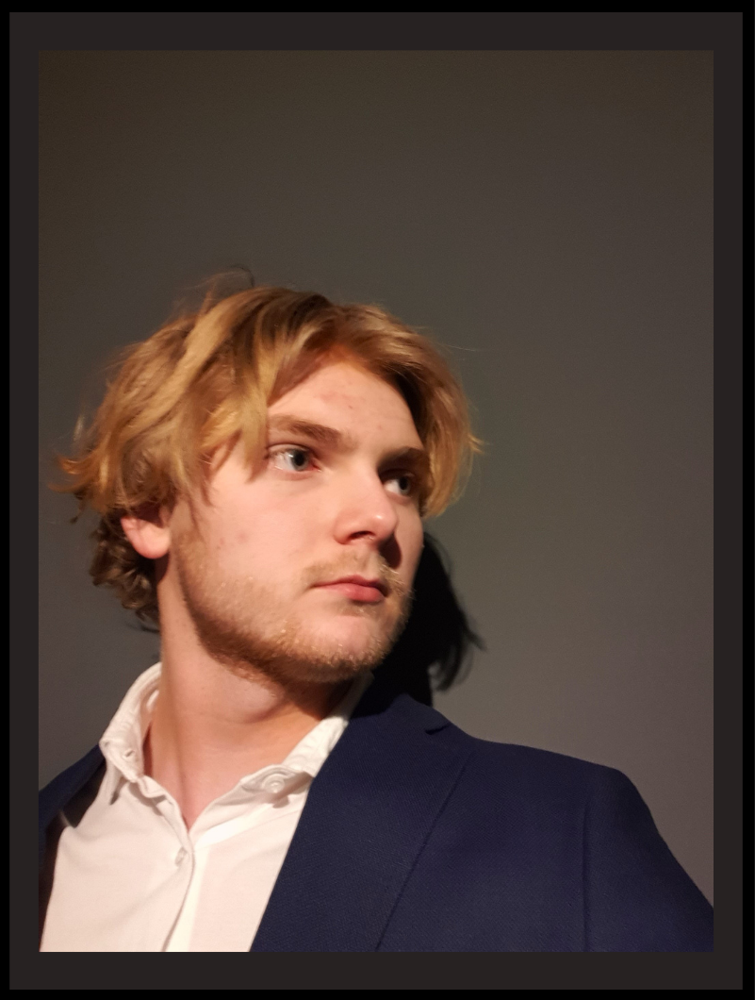

# Contact
**
Welkom bij Wiskundewijs!
**

Ik ben **Marc Serrano Altena**, een tweedejaars student Natuur- en Sterrenkunde aan de UvA en VU.

{ width="200" align=right}

Ik ben begonnen met het schrijven van deze site, omdat het voor mij voelde alsof de meeste wiskunde methodes **te snel door de stof** gaan en dat **niet alle stappen duidelijk** zijn. Ook is het vaak lastig om de juiste theorie te vinden die nou net jouw vraag kan beantwoorden.

Daarom heb ik dit probleem geprobeerd op te lossen met deze site. Maar het kan natuurlijk zo zijn dat je het nog steeds niet helemaal begrijpt en met vragen zit. Daarom biedt ik **persoonlijk een-op-een bijles** aan, om op die manier jou nóg beter te kunnen helpen met de stof begrijpen.

De bijles is **fysiek** aan huis (Regio Noord-Holland) voor **€25** per uur of **online** voor **€20** per uur.

Maar waarom ben ik de **juiste keuze**?

Niet alleen heb ik dankzij mijn vaardigheden momenteel een **gemiddelde van 8.6** voor mijn studie waar wiskundige kennis erg belangrijk is, maar ik heb ook **jaren ervaring als bijlesdocent**. Zelfs toen ik zelf nog op de middelbare school zat, gaf ik al wiskunde bijles aan lagerejaars leerlingen. 

Ben je geïntereseerd? Stuur mij dan een e-mail om in contact te komen of laat jouw ouders dit doen!

[E-mail :material-email:](mailto:<Marc.Serrano.Altena@gmail.com>){ .md-button .md-button--primary }

*Werkt de knop niet? Stuur een e-mail naar "Marc.Serrano.Altena@gmail.com".*