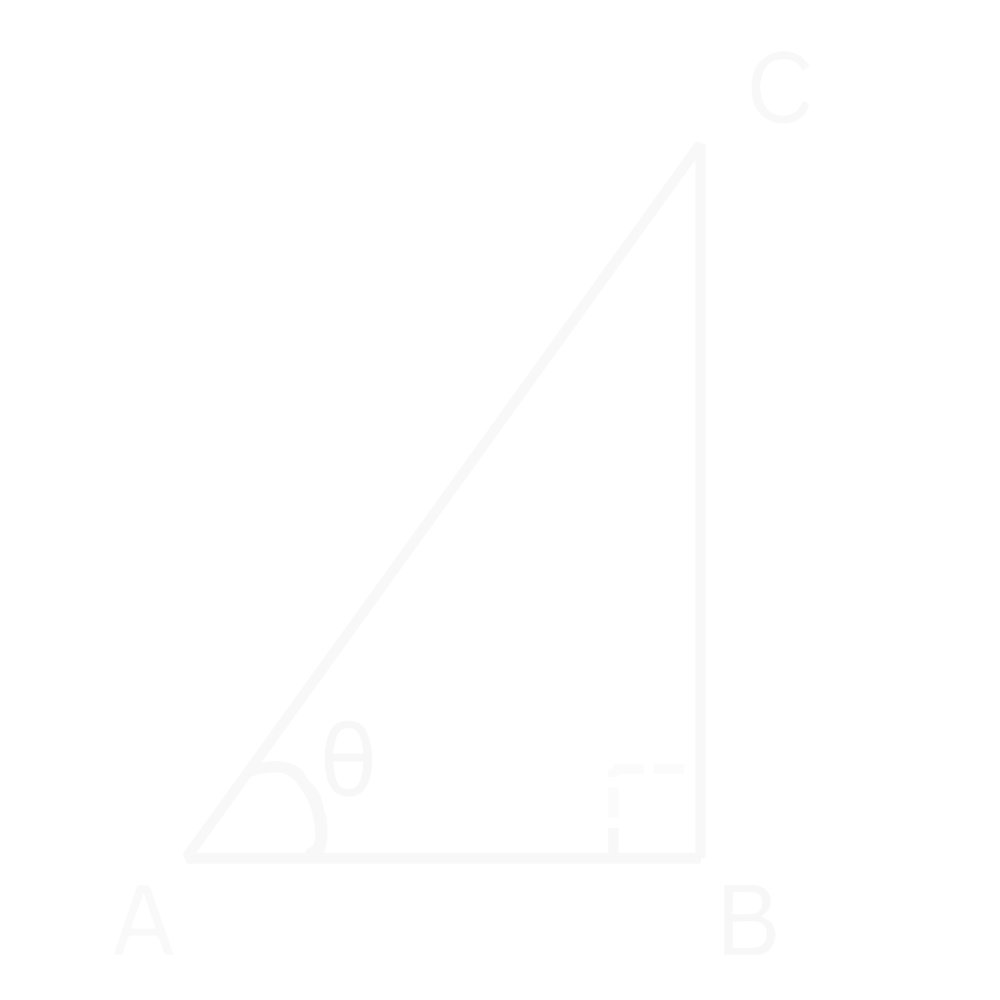
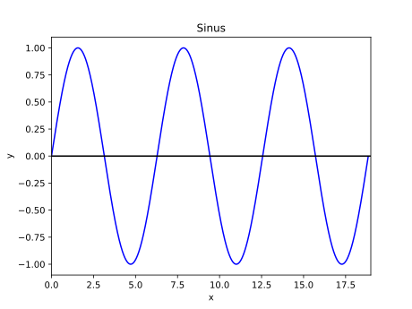
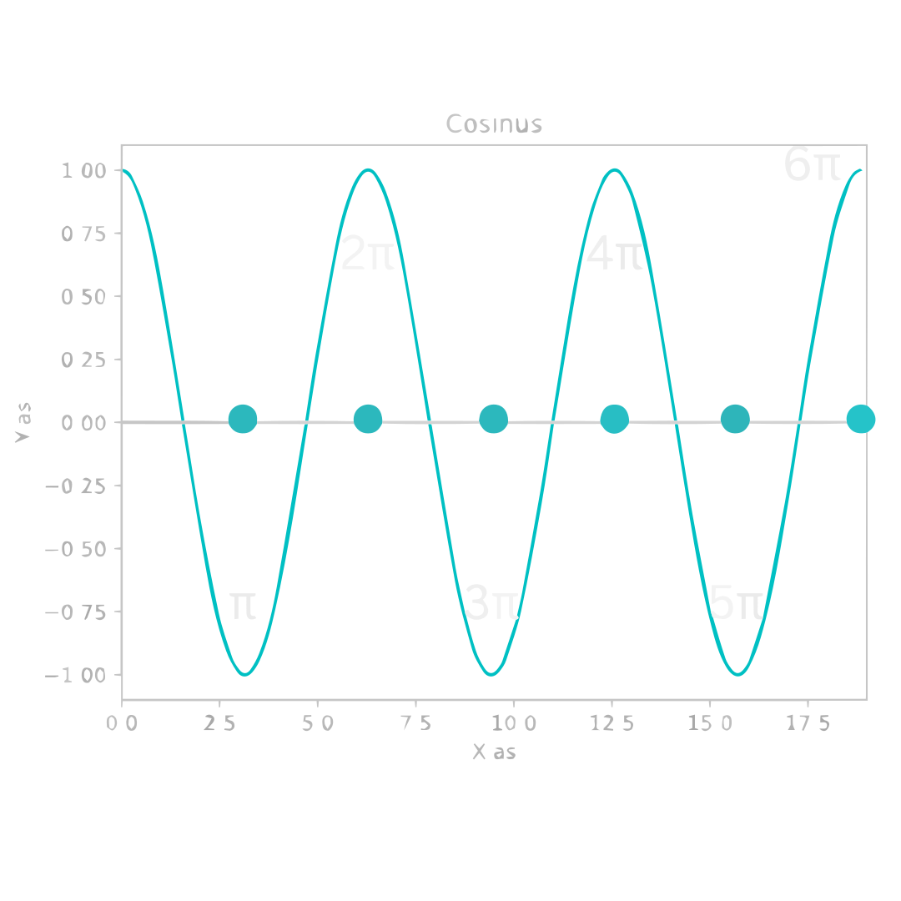
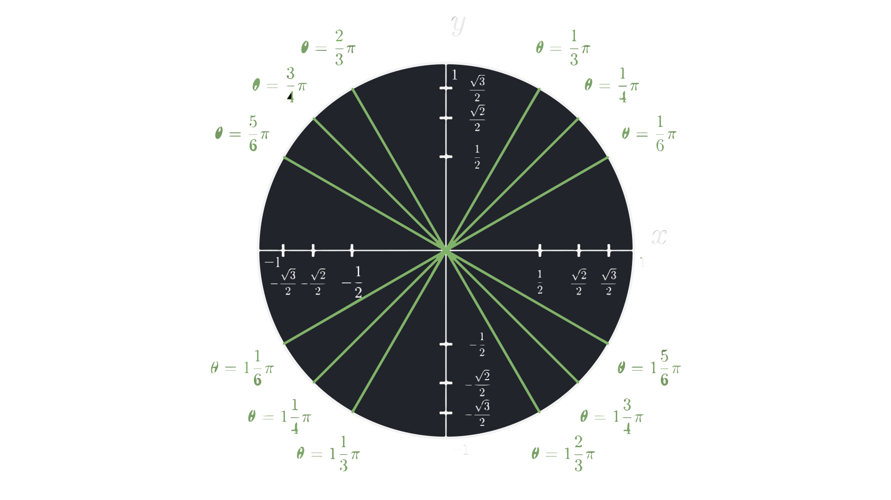

# Goniometrie
Goniometrie gaat vooral over driehoeken en over de goniometrische functies: sinus ($\sin$), cosinus ($\cos$) en tangens ($\tan$). Deze goniometrische functies kunnen we gebruiken om verschillende zijdes te bepalen als we alleen maar 1 zijde hebben en een hoek, in plaats van twee zijdes. Want als we niet twee zijdes hebben, kunnen we geen Pythagoras gebruiken. Deze functies zijn dus erg handig! Maar hoe gebruiken we ze?

In Figuur 1 is er een rechte driehoek getekend. Hier zijn drie punten gegeven en de hoek.

<figure markdown>
  { width="300"}
  <figcaption>Figuur 1. Een rechte driehoek, met een hoek θ en punten A, B en C.</figcaption>
</figure>

Stel nu eens voor dat we de zijde $AB$ en de hoek $\theta$ weten en dat we achter de lengte van zijde $BC$ willen komen. 

Zoals eerder gezegd, kunnen we dit probleem niet oplossen met Pythagoras. Hiervoor hebben we de goniometrische funties nodig. In dit geval gebruiken we de tangens omdat we de aanliggende zijde hebben $(AB)$ en we de overstaande zijde willen weten $(BC)$ (zie [Regels Goniometrische Functies](#regels-goniometrische-functies)). We krijgen dan:

$$\tan{(\theta)} = \frac{BC}{AB}.$$

Dit kunnen we dan omschrijven om $BC$ vrij te maken:

$$BC = AB \tan{(\theta)}.$$

## Regels Goniometrische Functies
Dit zijn de regels voor de goniometrische functies.

!!! Belangrijk
    $$\large{\sin{(\theta)} = \frac{\mathrm{Overstaand}}{\mathrm{Schuin}}}$$

    $$\large{\cos{(\theta)} = \frac{\mathrm{Aanliggend}}{\mathrm{Schuin}}}$$

    $$\large{\tan{(\theta)} = \frac{\mathrm{Overstaand}}{\mathrm{Aanliggend}}}$$

Dit kan je onthouden met het ezelsbruggetje: "SOS CAS TOA"

??? note "Overstaand, Aanliggend en Schuin"
    "Overstaand", "Aanliggend" en "Schuin" gaan over de zijdes ten opzichte van de hoek.
    
     Als we kijken naar figuur 1 (hieronder herhaalt), dan is in dit geval:
     
    "Overstaand" de zijde $BC$, "Aanliggend" de zijde $AB$ en "Schuin" de zijde $AC$.

    <figure markdown>
        { width="200"}
    </figure>

## De Sinus en Cosinus functies
Zowel de sinus als de cosinus functie, zijn periodieke functies. Dit betekent dat de functie zich herhaalt over een bepaalt interval. In dit geval is dat over een domein van $2 \pi$. We zeggen dan dat de functie en periode heeft van $2 \pi$ (zie ook Figuur 2 en Figuur 3). 

In formule form houdt dit in dat:

???+ Belangrijk
    $$\large{\sin{(x + 2 \pi)} = \sin{(x)}}$$

    $$\large{\cos{(x + 2 \pi)} = \cos{(x)}}$$

<figure markdown>
  { width="450"}
  <figcaption>Figuur 2. De sinus functie over een domein van [0, 6π].</figcaption>
</figure>

<figure markdown>
  { width="450"}
  <figcaption>Figuur 3. De cosinus functie over een domein van [0, 6π].</figcaption>
</figure>

Het feit dat deze functies periodiek zijn, is een belangrijk punt als we vergelijkingen moeten oplossen. Laten we naar de volgende vraag kijken:

**
Bereken x: $\cos{(x)} = 1$
**

We kunnen in Figuur 3 (of op de [eenheidscirkel](#de-eenheidscirkel)) aflezen dat dit geldt voor $x = 0$. Maar omdat de functie zich herhaalt, geldt dit ook voor $x = 2 \pi, \ x = 4 \pi, \ x = 6 \pi$, etc.. Om met al deze oplossingen rekening te houden, schrijven we:

$$\cos{(x)} = \cos{(0)},$$

want $\cos{(0)} = 1$. Om dus met alle oplossing reking te houden, schrijven dit dus als:

$$x = k * 2 \pi,$$

waarbij er geldt dat:

$$k = 0, 1, 2, 3, ...$$

Laten we naar nog een vraag kijken:

**
Bereken x: $\sin{(x)} = 0$
**

We zien nu in Figuur 2 dat dit geldt voor $x = 0, \ x = \pi, \ x = 2 \pi, \ x = 3 \pi$, etc.. We beginnen weer met het schrijven van het getal als een sinus. Dit wordt dan:

$$\sin{(x)} = \sin{(0)}$$

En we hebben dus net gezien dat we er geldt dat:

$$x = k * \pi.$$

Bij de vorige twee voorbeelden hebben we gewoon afgelezen hoe vaak het geldt, maar kunnen we ook een algemene oplossing verzinnen die altijd geldt? Het antwoord is ja! 

???+ Belangrijk
    ### Uitwerken sin/cos vergelijkingen

    Met een sinus:

    $$\large{\sin{(x)} = \sin{(a)}}$$

    geeft:

    $$\large{x = a + k * 2 \pi \ \vee \ x = \pi - a + k * 2 \pi}$$

    en met een cosinus:

    $$\large{\cos{(x)} = \cos{(a)}}$$

    geeft:

    $$\large{x = a + k * 2 \pi \ \vee \  x = - a + k * 2 \pi}$$

    waarbij er geldt dat:

    $$\large{k = 0, 1, 2, 3, ...}$$

In de $\cos$ en $\sin$ functies zit een bepaalde symmetrie. De sinus functie heeft een symmetrie punt op de oorsprong, terwijl de cosinus functie een symmetrie as heeft bij de $y$-as. Deze symmetrie is op de volgende manier weer te geven in formule form:

???+ Belangrijk
    ### Symmetrieformules
    
    1. $$\large{\sin{(-x)} = - \sin{(x)}}$$

    2. $$\large{\cos{(x)} = \cos{(-x)}}$$

    3. $$\large{\cos{(\pi - x)} = \cos{(-x)}}$$

    4. $$\large{\sin{(\pi - x)} = \sin{(x)}}$$

De cosinus functie is eigenlijk hetzelfde als de sinus functie, alleen is het $\frac{1}{2} \pi$ opgeschoven naar rechts. In formule form wordt dit dan:

???+ Belangrijk
    ### Sinus en Cosinus omschrijven

    1. $$\large{\sin{(x)} = \cos{(x - \frac{1}{2} \pi)}}$$

    2. $$\large{\cos{(x)} = \sin{(x + \frac{1}{2} \pi)}}$$

    Als je niet wilt onthouden bij welke functie je $+ \frac{1}{2} \pi$ doet, en bij welke je $- \frac{1}{2} \pi$, kan je het ook op de volgende manier omschrijven:

    ??? note "Andere omschrijving"
        1. $$\large{\sin{(x)} = \cos{(\frac{1}{2} \pi - x)}}$$

        2. $$\large{\cos{(x)} = \sin{(\frac{1}{2} \pi - x)}}$$

        En dit verband werkt ook altijd.

        ??? abstract "Bewijs"
            Dit kunnen we zelf bewijzen met behulp van de [Symmetrieformules](#symmetrieformules). 
            
            Laten we eerst kijken om van $\sin$ naar $\cos$ te gaan. Als we [regel 2](#symmetrieformules) gebruiken zien we het eigenlijk al meteen:

            $$\large{\cos{(x - \frac{1}{2} \pi)} = \cos{(-(x - \frac{1}{2} \pi))} = \cos{(\frac{1}{2} \pi - x)}}$$

            Nu kijken we om van $\cos$ naar $\sin$ te gaan. Hiervoor gebruiken we [regel 4](#symmetrieformules):

            $$\large{\sin{(x + \frac{1}{2} \pi)} = \sin{(\pi - (x + \frac{1}{2} \pi))} = }$$

            $$\large{\sin{(\pi - \frac{1}{2} \pi - x)} = \sin{(\frac{1}{2} \pi - x)}}$$

### Voorbeelden
??? example "Voorbeeld 1: $\cos{(2x)} = 0$"
    **
Bereken x: $\cos{(2x)} = 0$
**
    **
Uitwerking
**

    We lossen dit op door eerst van de $0$ een $\cos$ te maken. In dit geval kunnen we in Figuur 3 of met de [Eenheidscirkel](#de-eenheidscirkel) zien dat dit geldt bij $\cos{(\frac{1}{2} \pi)}$.

    We kunnen dus zeggen dat:

    $$\large{\cos{(2x)} = \cos{(\frac{1}{2} \pi)}}$$

    En dus kunnen we zeggen dat (zie [uitwerken sin/cos](#uitwerken-sincos-vergelijkingen)):

    $$\large{2x = \frac{1}{2} \pi + k * 2 \pi \ \vee \ 2x = - \frac{1}{2} \pi + k *2 \pi}$$

    En nu delen we alles door $2$ om te vinden dat:

    !!! quote ""
        $$\large{x = \frac{1}{4} \pi + k * \pi \ \vee \ x = - \frac{1}{4} \pi + k * \pi}$$

??? example "Voorbeeld 2: $\sin{(3x)} = \cos{(-x)}$"
    **
Bereken x: $\sin{(3x)} = \cos{(-x)}$
**
    **
Uitwerking
**

    Als eerst beginnen we met het realiseren dat we dit ook kunnen schrijven als:

    $$\large{\sin{(3x)} = \cos{(x)},}$$

    zie de [Symmetrieformules](#symmetrieformules). Nu moeten we de $\cos$ omschrijven naar een $\sin$ (of andersom). Dit doen we met [deze](#sinus-en-cosinus-omschrijven) regel:

    $$\large{\sin{(3x)} = \sin{(x + \frac{1}{2} \pi)}.}$$

    Nu kunnen we dit uitwerken (zie [uitwerken sin/cos](#uitwerken-sincos-vergelijkingen)):

    $$\large{3x = x + \frac{1}{2} \pi + k * 2 \pi \ \vee \ 3x = \pi - (x + \frac{1}{2} \pi + k * 2 \pi)}$$

    $$\large{3x = x + \frac{1}{2} \pi + k * 2 \pi \ \vee \ 3x = \frac{1}{2} \pi - x + k * 2 \pi}$$

    Nu doen we alle termen met $x$ naar de linkerkant:

    $$\large{2x = \frac{1}{2} \pi + k * 2 \pi \ \vee \ 4x = \frac{1}{2} \pi + k * 2 \pi}$$

    Nu delen we alles door $2$ en $4$ respectievelijk om te vinden:
    
    !!! quote ""
        $$\large{x = \frac{1}{4} \pi + k * \pi \ \vee \ x = \frac{1}{8} \pi + k * \frac{1}{2} \pi}$$

??? example "Voorbeeld 3: $\cos{(3x + \pi)} = \cos{(x + \frac{1}{2} \pi)}$ op het interval $[0, \ 2 \pi]$"
    **
Bereken x: $\cos{(3x + \pi)} = \cos{(x + \frac{1}{2} \pi)}$ op het interval $[0, \ 2 \pi]$
**
    **
Uitwerking
**

    We hebben hier aan beide kanten al iets met $\cos$ staan, dus we kunnen dit meteen gaan uitwerken:

    $$\large{3x + \pi = x + \frac{1}{2} \pi + k * 2 \pi \ \vee \ 3x + \pi = - (x + \frac{1}{2} \pi) + k * 2 \pi}$$

    $$\large{3x + \pi = x + \frac{1}{2} \pi + k * 2 \pi \ \vee \ 3x + \pi = - x - \frac{1}{2} \pi + k * 2 \pi}$$

    Nu alle termen met $x$ naar de linkerkant en alle getallen rechts:

    $$\large{2x = - \frac{1}{2} \pi + k * 2 \pi \ \vee \ 4x = - 1 \frac{1}{2} \pi + k * 2 \pi}$$

    En nu alles gedeelt door $2$ en $4$ respectievelijk:

    $$\large{x = - \frac{1}{4} \pi + k * \pi \ \vee \ x = - \frac{3}{8} \pi + k * \frac{1}{2} \pi}$$

    Maar let op! Nu wordt er gevraagd naar alle oplossingen op het interval $[0, \ 2 \pi]$. Dit betekent dat we alle verschillende waardes voor $k$ moeten invullen totdat we alle verschillende waardes tussen $0$ en $2 \pi$ gehad hebben.

    |  | Linker vergelijking | Rechter vergelijking |    
    | - | - | - |    
    | $\large{k = 0}$ | $\large{x = - \frac{1}{4} \pi}$ | $\large{x = - \frac{3}{8} \pi}$ |    
    | $\large{k = 1}$ | $\large{x = \frac{3}{4} \pi}$ | $\large{x = \frac{1}{8} \pi}$ |
    | $\large{k = 2}$ | $\large{x = 1 \frac{3}{4} \pi}$ | $\large{x = \frac{5}{8} \pi}$ |
    | $\large{k = 3}$ | $\large{x = 2 \frac{3}{4} \pi}$ | $\large{x = 1 \frac{1}{8} \pi}$ |
    | $\large{k = 4}$ | $\large{x = 3 \frac{3}{4} \pi}$ | $\large{x = 1 \frac{5}{8} \pi}$  |
    | $\large{k = 5}$ | $\large{x = 4 \frac{3}{4} \pi}$ | $\large{x = 2 \frac{1}{8} \pi}$ |

    Uit deze waardes noteren we alle waardes voor $x$ die op het interval liggen. Dat zijn de waardes bij $k = 1$ en $k = 2$ bij de linker vergelijking en de waardes bij $k = 1,2,3,4$ bij de rechter vergelijking. Ons eindantwoord wordt dan:

    !!! quote ""
        $\Large{x = \frac{1}{8} \pi \ \vee \ x = \frac{5}{8} \pi \ \vee \ x = \frac{3}{4} \pi \ \vee \ x = 1 \frac{1}{8} \pi \ \vee \ x = 1 \frac{5}{8} \pi \ \vee \ x = 1 \frac{3}{4} \pi}$

## De Eenheidscirkel
De eenheidscirkel is een manier om de verschillende waardes van $\sin$ en $\cos$ te bepalen bij verschillende hoeken. De eenheidscirkel is een cirkel met een straal van $1$, vandaar dat het de eenheidscirkel wordt genoemt. In het onderstaande filmpje wordt de eenheidscirkel geschetst en wordt er kort een trucje vertelt hoe je de waardes kan achterhalen van $\sin$ en $\cos$ bij verschillende hoeken door alleen maar $3$ hoeken en $3$ bijbehorende waardes te onthouden.

???+ video
    <video controls>
    <source src="../videos/UnitCircle.mp4" type="video/mp4">
    </video>

    *
Filmpje: Een schets van de eenheidscirkel met de verschillende cosinus en sinus waardes bij verschillende hoeken. De x-coördinaten zijn de cosinus waardes en de y-coördinaten zijn de sinus waardes.
*

Laten we eerst kijken hoe we de eenheidscirkel kunnen gebruiken.

<figure markdown>
  { width="1000"}
  <figcaption>Figuur 4. Eenheidscirkel uit het filmpje. De hoeken zijn in het groen weergegeven, de sinus waardes zijn de y-coördinaten bij elke hoek, de cosinus waardes de x-coördinaten bij elke hoek.</figcaption>
</figure>

Stel dus dat we bijvoorbeeld er achter willen komen wat $\sin{(\frac{1}{3} \pi)}$ is. Als we de eenheidscirkel bij de hand hebben, kunnen we daar kijken en dan zien we dat bij een hoek van $\frac{1}{3} \pi$, het coördinaat $\left(\frac{1}{2}, \frac{1}{2} \sqrt{3} \right)$ hoort. We willen de sinus weten en dus moeten we het $y$-coördinaat gebruiken. Onze eindconclusie wordt dan:

$$\large{\sin{(\frac{1}{3} \pi)} = \frac{1}{2} \sqrt{3}}.$$

??? note "Opmerking: $x$-coördinaat hoort bij cosinus, $y$-coördinaat hoort bij sinus."
    Hiervoor wordt er gezegd dat het $x$-coördinaat bij de cosinus hoort en dat het $y$-coördinaat bij de sinus hoort. Maar hoezo is dit het geval? Dat wordt hieronder laten zien. 

    <figure markdown>
      { width="300"}
      <figcaption>Figuur 5. Eenheidscirkel met daarin een driehoek getekent met een bepaalde hoek θ.</figcaption>
    </figure>

    In Figuur 6 is er een driehoek getekent bij de hoek $\theta$. Hier is zijde $b$ onze overstaande zijde en zijde $a$ onze aanliggende zijde. Merk op dat lengte $a$ het $x$-coördinaat is van ons punt dat op de eenheidscirkel ligt, en lengte $b$ het $y$-coördinaat. We weten ook dat volgens onze [Goniometrische Regels](#regels-goniometrische-functies) dat er geldt dat:

    $$\large{\sin{(\theta)} = \frac{\mathrm{Overstaand}}{\mathrm{Schuin}},}$$

    $$\large{\cos{(\theta)} = \frac{\mathrm{Aanliggend}}{\mathrm{Schuin}},}$$

    en dus in dit geval:

    $$\large{\sin{(\theta)} = \frac{b}{c},}$$

    $$\large{\cos{(\theta)} = \frac{a}{c}.}$$

    Maar doordat dit een eenheidscirkel is, betekent het dat de cirkel een straal van $1$ heeft, en dus dat $c = 1$. Onze $\sin$ en $\cos$ wordt dan:

    $$\large{\sin{(\theta)} = b,}$$

    $$\large{\cos{(\theta)} = a.}$$

    En omdat we net zeiden dat lengte $a$ ons $x$-coördinaat is en lengte $b$ ons $y$-coördinaat, kunnen we zeggen dat:

    !!! quote ""
        $$\large{\sin{(\theta)} = x\mathrm{-coordinaat}}$$

        $$\large{\cos{(\theta)} = y\mathrm{-coordinaat}}$$

Maar we hebben niet altijd de eenheidscirkel bij de hand en is het dus handig om de eenheidscirkel te onthouden. Om niet alles te hoeven onthouden, kan het volgende trucje handig zijn.

### Trucje om de Eenheidscirkel te Onthouden
We onthouden de volgende waardes en hoeken en de volgorde van klein naar groot:

???+ Belangrijk
    Hoeken:

    $$\large{\frac{1}{6} \pi < \frac{1}{4} \pi <\frac{1}{3} \pi}$$

    Waardes:

    $$\large{\frac{1}{2} < \frac{1}{2} \sqrt{2} < \frac{1}{2} \sqrt{3}}$$

Nu kunnen we bepalen wat de waardes zijn door steeds bij elk kwart van de cirkel te kijken naar de voortgang van het begin punt van de kwart cirkel en het eindpunt. Dus hoe groter de hoek, hoe meer voortgang. Laten we weer kijken naar $\sin{(\frac{1}{3} \pi)}$.

We hebben de hoek $\theta = \frac{1}{3} \pi$ en dit is de grootste hoek uit de lijst van de $3$ hoeken. Dit betekent dus er de meeste voortgang is gemaakt van het begin punt naar het eindpunt. In dit geval is het begin punt van de kwart cirkel $(1, 0)$ en het eindpunt $(0, 1)$. Omdat er de meeste voortgang is gemaakt, moeten de waardes het dichtst bij het eindpunt zitten. Dit betekent dus dat het $x$-coördinaat de kleinste waarde is tussen $1$ en $0$, en het $y$-coördinaat de grootste waarde tussen $0$ en $1$ is. We nemen de sinus en we zijn dus alleen geïntereseerd in het $y$-coördinaat. De grootste waarde tussen $0$ en $1$ uit de lijst van de $3$ waardes is $\frac{1}{2} \sqrt{3}$ en dus kunnen we zeggen dat:

$$\large{\sin{(\frac{1}{3} \pi)} = \frac{1}{2} \sqrt{3}}.$$

??? note "Opmerking"
    Als de hoek groter is dan $\theta = \frac{1}{2} \pi$, en dus niet in het eerste kwadrant zit, moet je eerst de hoek van het begin punt aftrekken van de hoek die je wilt berekenen. Stel we hebben bijvoorbeeld de hoek $\theta = \frac{5}{6} \pi$, dan doen we dat eerst min de hoek van het begin punt, en dat is in dit geval $\frac{1}{2} \pi$, omdat dit in het tweede kwadrant zit (het kwart links boven van de cirkel). We krijgen dan $\theta = \frac{1}{3} \pi$ en dan zien we dat het dus de meeste voortgang is tussen het begin punt en het eind punt.

Als dit nog niet helemaal duidelijk was, staan hieronder nog een paar andere voorbeelden.

??? example "Voorbeeld 1: $\cos{(\frac{3}{4} \pi)}$"
    **
Bereken cos(3/4 π)
**
    **
Uitwerking
**

    We hebben hier een hoek van $\theta = \frac{3}{4} \pi$. Dat zit tussen het beginpunt van $\theta = \frac{1}{2} \pi$ en $\theta = \pi$. Omdat we niet in het eerste kwadrant zitten, doen we eerst onze hoek min de start hoek, en dan vinden we $\theta = \frac{1}{4}$. Dit betekent dat de voortgang precies in het midden zit, en dus ook dat de waarde precies in het midden is van onze waardes.
    
    Ons begin punt is $(0, 1)$ en ons eindpunt is $(-1, 0)$. We zeiden net al dat onze progressie precies in het midden zit van de twee waardes en dus is ons $x$-coördinaat $-\frac{1}{2} \sqrt{2}$ en ons $y$-coördinaat $\frac{1}{2} \sqrt{2}$. We namen de cosinus en dus moeten we de x-waarde hebben. Ons antwoord wordt dan:

    !!! quote ""
        $$\large{\cos{(\frac{3}{4} \pi)} = -\frac{1}{2} \sqrt{2}.}$$

??? example "Voorbeeld 2: $\sin{(1 \frac{1}{6} \pi)}$"
    **
Bereken sin(1 1/6 π)
**
    **
Uitwerking
**

    We hebben hier een hoek van $\theta = 1 \frac{1}{6}$ dat tussen de starthoek $\pi$ en de eindhoek $1 \frac{1}{2} \pi$ ligt. We halen dus eerst de starthoek van onze hoek af om te vinden $\theta = \frac{1}{6} \pi$. Er is dus de minste voortgang gemaakt tussen het start- en eindpunt uit de $3$ waardes die wij kunnen kiezen.
    
    Het startpunt is (-1, 0) en het eindpunt is (0, -1). We nemen de sinus, dus alleen het $y$-coördinaat is interessant. De minste voortgang hier betekent dus dat $y = - \frac{1}{2}$ en dus:

    !!! quote ""
        $$\large{\sin{(1 \frac{1}{6} \pi)} = - \frac{1}{2}.}$$

??? example "Voorbeeld 3: $\cos{(1 \frac{2}{3} \pi)}$"
    **
Bereken cos(1 2/3 π)
**
    **
Uitwerking
**

    We hebben hier een hoek van $\theta = 1 \frac{2}{3}$ dat tussen de starthoek $\theta = 1 \frac{1}{2} \pi$ en de eindhoek $2 \pi$ zit. Als eerst doen we onze hoek min onze starthoek: $\theta = \frac{1}{6} \pi$. Er is dus de minste voortgang gemaakt tussen ons startpunt en ons eindpunt. 
    
    Ons startpunt is $(0, -1)$ en ons eindpunt is $(1, 0)$. We nemen de cosinus en dus zijn we alleen geïntereseerd in het $x$-coördinaat. De minste voortgang geeft hier $x = \frac{1}{2}$ en dus:

    !!! quote ""
        $$\large{\cos{(1 \frac{2}{3} \pi)} = \frac{1}{2} .}$$

Maar je bent natuurlijk niet verplicht om dit trucje te gebruiken. Als je het handiger vindt om gewoon de eenheidscirkel helemaal uit je hoofd te leren, doe dat vooral!

## Goniometrische Vergelijkingen

Dit zijn goniometrische vergelijkingen die iets ingewikkelder zijn, maar vaak gebruikt worden.

???+ Belangrijk
    | Regels                                                                                      |
    | ------------------------------------------------------------------------------------------- |
    | $\Large{\tan{(\theta)} = \frac{\sin{(\theta)}}{\cos{(\theta)}}}$                            |
    | $\Large{\sin{(\theta)}^2 + \cos{(\theta)}^2 = 1}$                                           |
    | $\Large{\sin{(2 \theta)} = 2 \sin{(\theta)} \cos{(\theta)}}$                                |
    | $\Large{\cos{(2 \theta)} = 2 \cos^2{(\theta)} - 1}$                                         |
    | $\Large{\cos{(2 \theta)} = \cos^2{(\theta)} - \sin^2{(\theta)}}$                            |
    | $\Large{\cos{(2 \theta)} = 1 - 2 \sin^2{(\theta)}}$                                         |
    | $\Large{\sin{(\theta + \phi)} = \sin{(\theta)} \cos{(\phi)} + \cos{(\theta)} \sin{(\phi)}}$ |
    | $\Large{\sin{(\theta - \phi)} = \sin{(\theta)} \cos{(\phi)} - \cos{(\theta)} \sin{(\phi)}}$ |
    | $\Large{\cos{(\theta + \phi)} = \cos{(\theta)} \cos{(\phi)} - \sin{(\theta)} \sin{(\phi)}}$ |
    | $\Large{\cos{(\theta - \phi)} = \cos{(\theta)} \cos{(\phi)} + \sin{(\theta)} \sin{(\phi)}}$ |

De eerste twee vergelijkingen kunnen we bewijzen met behulp van de [Goniometrische Regels](#regels-goniometrische-functies) die we eerder hebben gezien.

??? abstract "Bewijs"
    **
Bewijs eerste vergelijking
** 

    Laten we als eerst kijken naar 

    $$\large{\tan{(\theta)} = \frac{\sin{(\theta)}}{\cos{(\theta)}}}$$

    Door de [Goniometrische Regels](#regels-goniometrische-functies) te gebruiken en de $\sin$ en $\cos$ in te vullen kunnen we dit herschrijven tot:

    $$\large{\tan{(\theta)} = \frac{\frac{\mathrm{Overstaand}}{\mathrm{Schuin}}}{\frac{\mathrm{Aanliggend}}{\mathrm{Schuin}}}}$$

    Dit kunnen we weer versimpelen door de $\mathrm{Schuin}$ in de teller en noemer tegen elkaar weg te delen. We houden dan over:

    $$\large{\tan{(\theta)} = \frac{\mathrm{Overstaand}}{\mathrm{Aanliggend}}}$$

    En dit is precies de formule die we in al de [Goniometrische Regels](#regels-goniometrische-functies) hebben staan, en dus klopt onze originele vergelijking voor $\tan$.

    **
Bewijs tweede vergelijking
**

    Laten we nu naar de tweede vergelijking kijken:

    $$\large{\sin{(\theta)}^2 + \cos{(\theta)}^2 = 1}$$

    Weer vullen we de definitie in van de $\sin$ en $\cos$ uit de [Goniometrische Regels](#regels-goniometrische-functies):

    $$\large{\frac{\mathrm{Overstaand}^2}{\mathrm{Schuin}^2} + \frac{\mathrm{Aanliggend}^2}{\mathrm{Schuin}^2} = 1}$$

    Omdat de noemers hetzelfde zijn kunnen we hier 1 breuk van maken:

    $$\large{\frac{\mathrm{Overstaand}^2 + \mathrm{Aanliggend}^2}{\mathrm{Schuin}^2} = 1}.$$

    Kunnen we dit nog verder versimpelen? Ja! We kunnen namelijk de met behulp van de [Stelling van Pythagoras](pythagoras.md) de teller herschrijven op deze manier:

    $$\large{\frac{\mathrm{Schuin}^2}{\mathrm{Schuin}^2} = 1},$$
    
    En omdat iets gedeelt door zichzelf altijd gelijk is aan 1, betekent dat dus dat deze vergelijking klopt en dus ook dat onze originele vergelijking klopt.

### Voorbeelden

??? example "Voorbeeld 1: $\sin^2{(x)}  = - \cos^2{(x)} + \tan{(x)}$"
    **
Bereken x: $\sin^2{(x)}  = - \cos^2{(x)} + \tan{(x)}$
**
    **
Uitwerking
**

    We beginnen eerst met de $\cos^2$ naar de linkerkant te doen:

    $$\large{\sin^2{(x)} + \cos^2{(x)} = \tan{(x)}}$$

    We kunnen nu regel 2 toepassen van de [Regels Goniometrische Vergelijkingen](#goniometrische-vergelijkingen):

    $$\large{\tan{(x)} = 1}$$

    We kunnen nu gebruik maken van regel 1 van de [Regels Goniometrische Vergelijkingen](#goniometrische-vergelijkingen) om dit te schrijven als:

    $$\large{\frac{\sin{(x)}}{\cos{(x)}} = 1}$$

    Nu kunnen we beide kanten vermenigvuldigen met $\cos$:

    $$\large{\sin{(x)} = \cos{(x)}}$$

    Nu kunnen we de $\cos$ omschrijven naar een $\sin$ (zie [uitwerken sin/cos](#uitwerken-sincos-vergelijkingen)):

    $$\large{\sin{(x)} = \sin{(x + \frac{1}{2} \pi)}}$$

    Dit kunnen we nu uitwerken:

    $$\large{x = x + \frac{1}{2} \pi + k * 2 \pi \ \vee \ x = \pi - (x + \frac{1}{2} \pi) + k * 2 \pi}$$

    $$\large{x = x + \frac{1}{2} \pi + k * 2 \pi \ \vee \ x = \frac{1}{2} \pi - x + k * 2 \pi}$$

    Nu halen we alle termen met x aan de linkerkant:

    $$\large{0 = \frac{1}{2} \pi + k * 2 \pi \ \vee \ 2x = \frac{1}{2} \pi + k * 2 \pi}$$

    Alle x termen zijn in de linker vergelijking weggevallen, dus daar hebben we niks meer aan. Met de rechter vergelijking kunnen we wel door. We delen aan beide kanten door $2$, om als eindantwoord te vinden:

    !!! quote ""
        $$\large{x = \frac{1}{4} \pi + k * \pi}$$