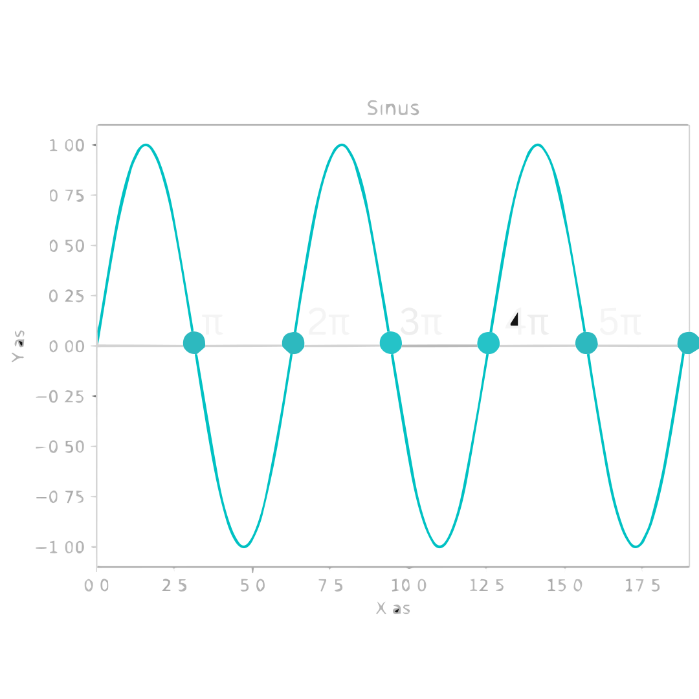

# Goniometrie
Goniometrie gaat vooral over driehoeken en over de goniometrische functies: sinus ($\sin$), cosinus ($\cos$) en tangens ($\tan$). Deze goniometrische functies kunnen we gebruiken om verschillende zijdes te bepalen als we alleen maar 1 zijde hebben en een hoek, in plaats van twee zijdes. Want als we niet twee zijdes hebben, kunnen we geen Pythagoras gebruiken. Deze functies zijn dus erg handig! Maar hoe gebruiken we ze?

In Figuur 1 is er een rechte driehoek getekend. Hier zijn drie punten gegeven en de hoek.

<figure markdown>
  { width="300"}
  <figcaption>Figuur 1. Een rechte driehoek, met een hoek θ en punten A, B en C.</figcaption>
</figure>

Stel nu eens voor dat we de zijde $AB$ en de hoek $\theta$ weten en dat we achter de lengte van zijde $BC$ willen komen. 

Zoals eerder gezegd, kunnen we dit probleem niet oplossen met Pythagoras. Hiervoor hebben we de goniometrische funties nodig. In dit geval gebruiken we de tangens omdat we de aanliggende zijde hebben $(AB)$ en we de overstaande zijde willen weten $(BC)$ (zie [Regels Goniometrische Functies](#regels-goniometrische-functies)). We krijgen dan:

$$\tan{(\theta)} = \frac{BC}{AB}.$$

Dit kunnen we dan omschrijven om $BC$ vrij te maken:

$$BC = AB \tan{(\theta)}.$$

## Regels Goniometrische Functies
Dit zijn de regels voor de goniometrische functies.

!!! Belangrijk
    $$\large{\sin{(\theta)} = \frac{\mathrm{Overstaand}}{\mathrm{Schuin}}}$$

    $$\large{\cos{(\theta)} = \frac{\mathrm{Aanliggend}}{\mathrm{Schuin}}}$$

    $$\large{\tan{(\theta)} = \frac{\mathrm{Overstaand}}{\mathrm{Aanliggend}}}$$

Dit kan je onthouden met het ezelsbruggetje: "SOS CAS TOA"

??? note "Opmerking"
    "Overstaand", "Aanliggend" en "Schuin" gaan over de zijdes ten opzichte van de hoek.
    
     Als we kijken naar figuur 1 (hieronder herhaalt), dan is in dit geval:
     
    "Overstaand" de zijde $BC$, "Aanliggend" de zijde $AB$ en "Schuin" de zijde $AC$.

    <figure markdown>
        { width="200"}
    </figure>

## De Sinus en Cosinus functies
Zowel de sinus als de cosinus functie, zijn periodieke functies. Dit betekent dat de functie zich herhaalt over een bepaalt interval. In dit geval is dat over een domein van $2 \pi$. We zeggen dan dat de functie en periode heeft van $2 \pi$. 

<figure markdown>
  { width="450"}
  <figcaption>Figuur 2. De sinus functie over een domein van [0, 6π].</figcaption>
</figure>

<figure markdown>
  { width="450"}
  <figcaption>Figuur 3. De cosinus functie over een domein van [0, 6π].</figcaption>
</figure>

## De Eenheidscirkel
De eenheidscirkel is een manier om de verschillende waardes van $\sin$ en $\cos$ te onthouden bij verschillende hoeken. In het onderstaande filmpje wordt de eenheidscirkel geschetst en wordt er kort vertelt hoe je de waardes kan achterhalen van $\sin$ en $\cos$ bij verschillende hoeken door alleen maar $3$ hoeken en $3$ bijbehorende waardes te onthouden.

???+ video
    <video controls>
    <source src="../videos/UnitCircle.mp4" type="video/mp4">
    </video>

    *
Een schets van de eenheidscirkel met de verschillende cosinus en sinus waardes bij verschillende hoeken. De x-coördinaten zijn de cosinus waardes en de y-coördinaten zijn de sinus waardes.
*

## Goniometrische Vergelijkingen

Dit zijn goniometrische vergelijkingen die iets ingewikkelder zijn, maar vaak gebruikt worden.

???+ Belangrijk
    | Regels                                                                                      |
    | ------------------------------------------------------------------------------------------- |
    | $\Large{\tan{(\theta)} = \frac{\sin{(\theta)}}{\cos{(\theta)}}}$                            |
    | $\Large{\sin{(\theta)}^2 + \cos{(\theta)}^2 = 1}$                                           |
    | $\Large{\sin{(2 \theta)} = 2 \sin{(\theta)} \cos{(\theta)}}$                                |
    | $\Large{\cos{(2 \theta)} = 2 \cos^2{(\theta)} - 1}$                                         |
    | $\Large{\cos{(2 \theta)} = \cos^2{(\theta)} - \sin^2{(\theta)}}$                            |
    | $\Large{\cos{(2 \theta)} = 1 - 2 \sin^2{(\theta)}}$                                         |
    | $\Large{\sin{(\theta + \phi)} = \sin{(\theta)} \cos{(\phi)} + \cos{(\theta)} \sin{(\phi)}}$ |
    | $\Large{\sin{(\theta + \phi)} = \sin{(\theta)} \cos{(\phi)} - \cos{(\theta)} \sin{(\phi)}}$ |
    | $\Large{\cos{(\theta + \phi)} = \cos{(\theta)} \cos{(\phi)} - \sin{(\theta)} \sin{(\phi)}}$ |
    | $\Large{\cos{(\theta + \phi)} = \cos{(\theta)} \cos{(\phi)} + \sin{(\theta)} \sin{(\phi)}}$ |

De eerste twee vergelijkingen kunnen we bewijzen met behulp van de [Goniometrische Regels](#regels-goniometrische-functies) die we eerder hebben gezien.

??? abstract "Bewijs"
    **
Bewijs eerste vergelijking
** 

    Laten we als eerst kijken naar 

    $$\large{\tan{(\theta)} = \frac{\sin{(\theta)}}{\cos{(\theta)}}}$$

    Door de [Goniometrische Regels](#regels-goniometrische-functies) te gebruiken en de $\sin$ en $\cos$ in te vullen kunnen we dit herschrijven tot:

    $$\large{\tan{(\theta)} = \frac{\frac{\mathrm{Overstaand}}{\mathrm{Schuin}}}{\frac{\mathrm{Aanliggend}}{\mathrm{Schuin}}}}$$

    Dit kunnen we weer versimpelen door de $\mathrm{Schuin}$ in de teller en noemer tegen elkaar weg te delen. We houden dan over:

    $$\large{\tan{(\theta)} = \frac{\mathrm{Overstaand}}{\mathrm{Aanliggend}}}$$

    En dit is precies de formule die we in al de [Goniometrische Regels](#regels-goniometrische-functies) hebben staan, en dus klopt onze originele vergelijking voor $\tan$.

    **
Bewijs tweede vergelijking
**

    Laten we nu naar de tweede vergelijking kijken:

    $$\large{\sin{(\theta)}^2 + \cos{(\theta)}^2 = 1}$$

    Weer vullen we de definitie in van de $\sin$ en $\cos$ uit de [Goniometrische Regels](#regels-goniometrische-functies):

    $$\large{\frac{\mathrm{Overstaand}^2}{\mathrm{Schuin}^2} + \frac{\mathrm{Aanliggend}^2}{\mathrm{Schuin}^2} = 1}$$

    Omdat de noemers hetzelfde zijn kunnen we hier 1 breuk van maken:

    $$\large{\frac{\mathrm{Overstaand}^2 + \mathrm{Aanliggend}^2}{\mathrm{Schuin}^2} = 1}.$$

    Kunnen we dit nog verder versimpelen? Ja! We kunnen namelijk de met behulp van de [Stelling van Pythagoras](pythagoras.md) de teller herschrijven op deze manier:

    $$\large{\frac{\mathrm{Schuin}^2}{\mathrm{Schuin}^2} = 1},$$
    
    En omdat iets gedeelt door zichzelf altijd gelijk is aan 1, betekent dat dus dat deze vergelijking klopt en dus ook dat onze originele vergelijking klopt.

