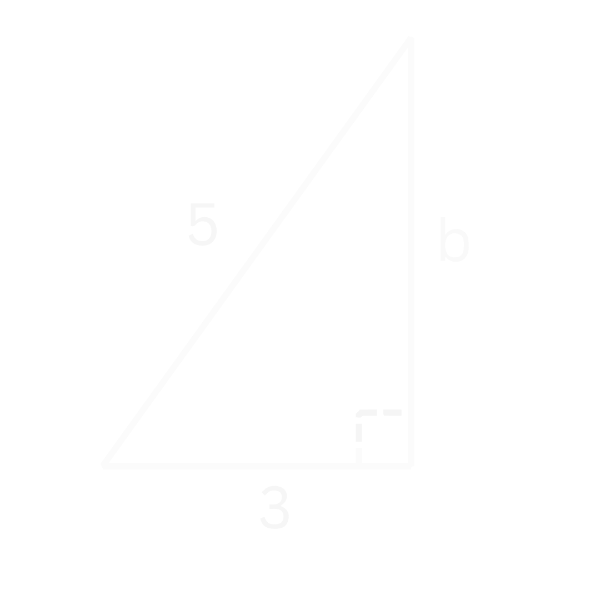

# De Stelling van Pythagoras
##Theorie

De stelling van Pythagoras zegt dat bij een rechte driehoek (zie Figuur 1) de twee rechte zijdes in het kwadraat samen gelijk zijn aan de schuine zijde in het kwadraat.

<figure markdown>
  { width="300"}
  <figcaption>Figuur 1. Een rechte driehoek, dus een driehoek waarbij 1 hoek 90° is.</figcaption>
</figure>

In formule form wordt de stelling van Pythagoras:

!!! belangrijk
    $$\LARGE{a^2 + b^2 = c^2}$$

Hieronder is er een filmpje om te laten zien waar de stelling van Pythagoras vandaan komt.
???+ video
    <video controls>
      <source src="../assets/videos/Pythagoras.mp4" type="video/mp4">
    </video>

    *
Filmpje: Visueel bewijs van de stelling van Pythagoras
*

## Voorbeelden 
??? example "Voorbeeld 1"
    ### Voorbeeld 1
    **
Vraag: Wat is de lengte van de schuine zijde $c$?
** 
    
    <figure markdown>
      { width="300"}
      <figcaption>Figuur 2. Een rechte driehoek met twee rechte zijdes met lengte 2.</figcaption>
    </figure>

    **
Uitwerking
**
    We beginnen met het opschrijven van de stelling van Pythagoras

    $$\large{a^2 + b^2 = c^2}$$

    We weten dat de rechte zijdes allebei een lengte van 2 hebben en dus dat $a = 2$ en $b = 2$. Dit kunnen we nu gaan invullen.

    $$\large{2^2 + 2^2 = c^2}$$

    $$\large{c^2 = 8}$$

    Nu nemen we aan beide kanten de wortel om van $c^2$ naar $c$ te gaan (zie eventueel de [Regels met Wortels](basisvaardigheden.md#regels-met-wortels))

    $$\large{c = \sqrt{8}}$$

    Dit kunnen we versimpelen tot:

    !!! quote ""
        $$\large{c = 2\sqrt{2}}$$
    
     

??? example "Voorbeeld 2"
    ### Voorbeeld 2
    **
Vraag: Wat is de lengte van de rechte zijde $b$?
** 

    <figure markdown>
      { width="300"}
      <figcaption>Figuur 3. Een rechte driehoek met 1 rechte zijde met lengte 3 en een schuine zijde met lengte 5.</figcaption>
    </figure>

    Net zoals bij het vorig [voorbeeld](#voorbeeld-1) beginnen we eerst met de stelling van Pythagoras opschrijven

    $$\large{a^2 + b^2 = c^2}$$

    Dan vullen we de gegevens in die we hebben. We weten dat 1 rechte zijde een lengte heeft van 3 en dat de schuine zijde een lengte heeft van 5. Oftewel $a=3$ en $c=5$. Laten we dit invullen:

    $$\large{3^2 + b^2 = 5^2}$$

    $$\large{9 + b^2 = 25}$$

    Dit kunnen we omschrijven door aan beide kanten van het '$=$' teken $-9$ te doen. We krijgen dan:

    $$\large{b^2 = 16}$$

    We nemen nu aan beide kanten de wortel:

    $$\large{b = \sqrt{16}}$$

    !!! quote ""
        $$\large{b = 4}$$ 
