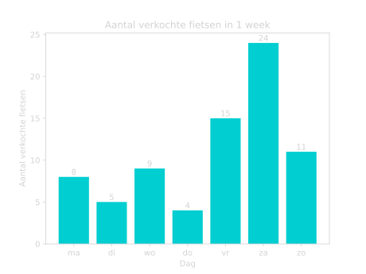
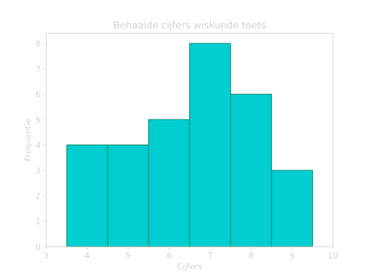
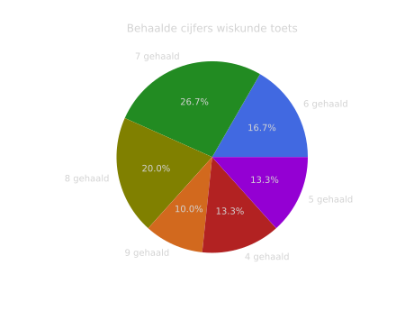
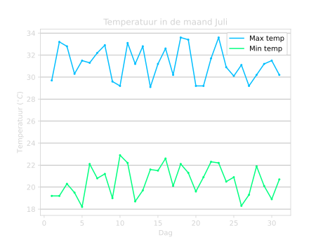

# Statistiek
We gebruiken statistiek om gegevens beter te kunnen begrijpen. Dit kunnen we doen door het op een begrijpelijke manier weer te geven. Bijvoorbeeld in een staafdiagram, histogram of een cirkeldiagram. Maar we kunnen ook bepaalde gegevens berekenen die ons meer informatie geven, zoals bijvoorbeeld het gemiddelde, de mediaan of de modus. Hiermee krijgen we beter grip op de data. 

## Data weergeven
We kunnen informatie handig weergeven in grafieken en in diagrammen. We kijken naar een paar verschillende type diagrammen en bekijken hoe je ze af moet lezen en zelf maken. 

### **Staafdiagrammen**
We beginnen met staafdiagrammen. Stel we willen bijvoorbeeld kijken naar het aantal fietsen dat een fietsenwinkel verkoopt in $1$ week. We krijgen de volgende data:

| Maandag   | Dinsdag   | Woensdag  | Donderdag | Vrijdag   | Zaterdag  | Zondag    |
| --------- | --------- | --------- | --------- | --------- | --------- | --------- |
| 8         | 5         | 9         | 4         | 15        | 24        | 11        |

We willen nu dit op een handige en duidelijke manier weergeven in een grafiek, zodat we de dagen goed met elkaar kunnen vergelijking. We kunnen dit doen door middel van een **staafdiagram**. In Figuur 1 is er een staafdiagram weergegeven van deze data. 

<figure markdown>
{ width="500"}
    <figcaption>Figuur 1. Staafdiagram van het aantal verkochte fietsen in 1 week.</figcaption>
</figure>

Hiermee kunnen we precies zien hoeveel fietsen er op elke dag zijn verkocht en zien we ook meteen wat de dag is waar er de meeste fietsen verkocht is en welke dag de minste fietsen. 

Namelijk op zaterdag waren er de meeste fietsen verkocht: $24$ fietsen, en op donderdag de minste fietsen: $4$ fietsen. 

???+ belangrijk
    We gebruiken vooral staafdiagrammen bij data waar we verschillende type categorieën of groepen met elkaar vergelijken. 
    
    Dus in dit geval zijn de verschillende groepen de verschillende dagen van de week.

### **Histogrammen**
Laten we nu kijken naar een klas die een wiskunde toets heeft gemaakt. Daarbij hebben de leerlingen verschillende cijfers gehaald, en die zijn weergegeven met een **histogram** in Figuur 2.

<figure markdown>
{ width="500"}
    <figcaption>Figuur 2. Histogram van de behaalde cijfers voor een wiskunde toets.</figcaption>
</figure>

We kunnen hier aflezen hoeveel leerlingen een bepaald cijfer hebben gehaald. Dus $4$ leerlingen hebben een $4$ gehaald, $8$ leerlingen een $7$ en $3$ leerlingen een $7$.

???+ belangrijk
    We gebruiken een histogram wanneer we continue data willen weergeven en het meer gaat om de absolute waardes van de dataverdeling. 
    
    Dus in dit geval gaat de cijferverdeling van een $4$ naar een $9$ en zien we hoeveel leerlingen een bepaald cijfer hebben gehaald.

### **Cirkeldiagrammen**
We kunnen het voorbeeld van net over de cijfers van een wiskunde toets ook weergeven in een **cirkeldiagram**.

<figure markdown>
{ width="500"}
    <figcaption>Figuur 3. Cirkeldiagram van de behaalde cijfers voor een wiskunde toets.</figcaption>
</figure>

In Figuur 3 kunnen aflezen welk percentage van de leerlingen een bepaald cijfer heeft gehaald. Dus $26.7 \%$ heeft een $7$ gehaald, $20 \%$ een $8$, $10 \%$ een 9, etc.

???+ belangrijk
    We gebruiken cirkeldiagrammen als we een kleine hoeveelheid verschillende groepen willen weergeven. En dan met name de relatieve grootte van de groepen, en niet zozeer de absolute hoeveelheden. 
    
    Dus in dit geval om te laten zien welk percentage van de leerlingen welk cijfer heeft gehaald en niet per se dat bijvoorbeeld het $8$ leerlingen waren die een $7$ hebben gehaald. 

### **Lijndiagrammen**
De laatste manier om data weer te geven is met een **lijndiagram**. We kijken nu naar de temperatuur in de maand Juli. 

<figure markdown>
{ width="500"}
    <figcaption>Figuur 4. Lijndiagram van de temperatuur in de maand Juli. De maximum temperatuur op een dag is aangegeven in het blauw, en de minimum temperatuur op een dag is aangegeven in het groen.</figcaption>
</figure>

We kunnen in Figuur 4 precies aflezen wat de minimum en maximum temperatuur is op elke dag van de maand Juli. Dus op 10 Juli was de minimum temperatuur ongeveer $23 \ ^{\circ} \textrm C$ en de maximum temperatuur ongeveer $29 \ ^{\circ} \textrm C$.

???+ belangrijk
    We gebruiken lijndiagrammen als we een relatie tussen twee waardes willen weergeven. Het is vooral nuttig om de groei of afname van een bepaalde waarde te laten zien. Bij lijndiagrammen kun je ook meerdere datasets vergelijken.

    In dit geval kijken we naar de relatie tussen de temperatuur en de tijd. We kunnen dan precies zijn hoe de temperatuur verandert in de tijd. We vergelijken ook twee datasets, namelijk die van de maximum temperatuur en die van de minimum temperatuur.  

## Gemiddelde
Het gemiddelde is handig om een uitspraak te kunnen doen over de hele dataset. Je kunt over het algemeen ermee kijken waar de meeste data zich bevindt en het maakt het vergelijken van verschillende datasets makkelijker. 

Laten we bijvoorbeeld naar twee verschillende klassen kijken: klas A en klas B. De twee verschillende klassen hebben net een toets gemaakt en de leerlingen hebben verschillende cijfers gehaald. De cijfers van beide klassen is weergegeven met een histogram in Figuur 5.  

<figure markdown>
{ width="500"}
    <figcaption>Figuur 5. Histogram van de behaalde cijfers voor een wiskunde toets van klas A en klas B.</figcaption>
</figure>

We zien hier dat de cijfers van klas A over het algemeen hoger zijn dan die van klas B. Om te bekijken hoeveel klas A het precies over het algemeen beter heeft gedaan, is het handig om de gemiddeldes te berekenen en die te vergelijken.  

We berekenen een gemiddelde op de volgende manier:

???+ Belangrijk
    ### **Gemiddelde berekenen**

    - Tel alle getallen bij elkaar op
    - Deel het door het aantal getallen

    $$\Large{\textrm{Gemiddelde} = \frac{\textrm{Som van de getallen}}{\textrm{Aantal getallen}}}$$

??? example "Simpel Voorbeeld"
    Dus bijvoorbeeld voor de getallen $\large{2, 4, 6, 8}$ kunnen we het gemiddelde als volgt berekenen:

    - We tellen alle getallen bij elkaar op:

    $$\large{2 + 4 + 6 + 8 = 20}$$

    - Dan delen we het door het aantal getallen:

    $$\large{\frac{20}{4} = 5}$$

    Het gemiddelde van deze reeks getallen is dus $5$.

Om het gemiddelde van de twee klassen te bepalen moeten we dus eerst alle cijfers van alle leerlingen bij elkaar op tellen. Hiervoor hebben we voor elk cijfer nodig hoeveel leerlingen dat cijfer hebben gehaald. Uit Figuur 5 kunnen we de volgende tabel maken:

    

<h2 style="margin-left:70px;">klas A</h2>

<table style="float:left;">
  <tr>
    <th>Cijfers</th>
    <th>Frequentie</th>
  </tr>
  <tr>
    <td>4.5</td>
    <td>5</td>
  </tr>
  <tr>
    <td>5.0</td>
    <td>4</td>
  </tr>
  <tr>
    <td>5.5</td>
    <td>5</td>
  </tr>
  <tr>
    <td>6.0</td>
    <td>6</td>
  </tr>
  <tr>
    <td>6.5</td>
    <td>7</td>
  </tr>
  <tr>
    <td>7.0</td>
    <td>7</td>
  </tr>
  <tr>
    <td>7.5</td>
    <td>9</td>
  </tr>
  <tr>
    <td>8.0</td>
    <td>8</td>
  </tr>
  <tr>
    <td>8.5</td>
    <td>6</td>
  </tr>
  <tr>
    <td>9.0</td>
    <td>4</td>
  </tr>
  <tr>
    <td>9.5</td>
    <td>1</td>
  </tr>
</table>

    

    

<h2 style="margin-left:100px;">klas B</h2>
<table style="float:left; margin-left:20px;">
  <tr>
    <th>Cijfers</th>
    <th>Frequentie</th>
  </tr>
  <tr>
    <td>3.0</td>
    <td>5</td>
  </tr>
  <tr>
    <td>3.5</td>
    <td>6</td>
  </tr>
  <tr>
    <td>4.0</td>
    <td>9</td>
  </tr>
  <tr>
    <td>4.5</td>
    <td>10</td>
  </tr>
  <tr>
    <td>5.0</td>
    <td>11</td>
  </tr>
  <tr>
    <td>5.5</td>
    <td>9</td>
  </tr>
  <tr>
    <td>6.0</td>
    <td>8</td>
  </tr>
  <tr>
    <td>6.5</td>
    <td>7</td>
  </tr>
  <tr>
    <td>7.0</td>
    <td>3</td>
  </tr>
</table>

    

Om nu het gemiddelde te berekenen, berekenen we eerst de som van alle cijfers. We beginnen met klas A. We doen eigenlijk steeds de frequentie keer het cijfer en dit tellen we dan allemaal bij elkaar op:

<!-- Sorted Dictionary 1: {4.5: 5, 5.0: 4, 5.5: 5, 6.0: 6, 6.5: 7, 7.0: 7, 7.5: 9, 8.0: 8, 8.5: 6, 9.0: 4, 9.5: 1}
Sorted Dictionary 2: {3.0: 5, 3.5: 6, 4.0: 9, 4.5: 10, 5.0: 11, 5.5: 9, 6.0: 8, 6.5: 7, 7.0: 3} -->

$$\textrm{Som cijfers klas A} = 4.5*5 + 5.0*4 + 5.5*5 + 6.0*6 + 6.5*7 + 7.0*7 + 7.5*9 + 8.0*8 + 8.5*6 + 9.0*4 + 9.5*1$$

$$\textrm{Som cijfers klas A} = 428.5$$

Nu berekenen we het totaal aantal leerlingen. Dit zijn dus eigenlijk alle frequenties bij elkaar opgetelt, want elke leerling heeft maar 1 cijfer gehaald:

$$\textrm{Aantal leerlingen klas A} = 5 + 4 + 5 + 6 + 7 + 7 + 9 + 8 + 6 + 4 + 1$$

$$\textrm{Aantal leerlingen klas A} = 62$$

We kunnen nu het [gemiddelde berekenen](#gemiddelde-berekenen) door deze twee dingen door elkaar te delen:

$$\textrm{Gemiddelde klas A} = \frac{428.5}{62} \approx 6.9$$

Het gemiddelde van klas A is dus een $6.9$. 

Om het gemiddelde van klas B te bepalen doen we precies dezelfde stappen:

We tellen eerst weer alle cijfers keer de frequentie bij elkaar op:

$$\textrm{Som cijfers klas B} = 3.0*5 + 3.5*6 + 4.0*9 + 4.5*10 + 5.0*11 + 5.5*9 + 6.0*8 + 6.5*7 + 7.0*3$$

$$\textrm{Som cijfers klas B} = 336$$

Het totaal aantal leerlingen is de frequenties bij elkaar opgeteld:

$$\textrm{Aantal leerlingen klas B} =  5 + 6 + 9 + 10 + 11 + 9 + 8 + 7 + 3$$

$$\textrm{Aantal leerlingen klas B} = 68$$

En het gemiddelde wordt dan:

$$\textrm{Gemiddelde klas B} = \frac{336}{68} \approx 4.9$$

Het gemiddelde van klas B is dus een $4.9$. 

Dit betekent dus dat klas A gemiddeld $2$ cijferpunten hoger heeft gescoord op de toets. Dus sommige leerlingen van klas A hebben iets minder dan $2$ cijferpunten hoger gehaald (dan de gemiddelde leerling uit klas B) en andere leerlingen van klas A hebben juist iets meer dan $2$ cijferpunten hoger gehaald. Maar gemiddeld is dit dus $2$ cijferpunten hoger.

<figure markdown>
.svg){ width="500"}
    <figcaption>Figuur 5 (met gemiddelde). Histogram van de behaalde cijfers voor een wiskunde toets van klas A en klas B.</figcaption>
</figure>

## Mediaan en Modus
Soms is een gemiddelde echter niet representatief voor de meeste gevallen. Laten we kijken naar inkomens van $100$ mensen waar er $1$ biljonair bij zit. In Figuur 6 is het inkomen weergegeven van de andere $99$ mensen.

<figure markdown>
{ width="500"}
    <figcaption>Figuur 6. Inkomen van 99 mensen weergegeven in een histogram.</figcaption>
</figure>

Nu voegen we aan deze groep mensen de biljonair toe die een inkomen heeft van $1$ miljard. Nu berekenen we het gemiddelde. Als we dit doen, dan vinden we het volgende:

$$\large{\textrm{Gemiddelde} = \Large{\textrm{€}} \large 10.052.841}$$

Het gemiddelde is dus ongeveer $10$ miljoen! Maar dit is een vertekend beeld, want dit is niet representatief voor de mensen uit deze groep. Het gemiddelde is dus gevoelig voor extreem hoge/lage waardes. Daarom is het in dit geval handiger om de **mediaan** te gebruiken.

???+ Belangrijk
    ### **Mediaan bepalen**

    De mediaan is de middelste waarde uit een dataset wanneer de data gesorteerd is van laag naar hoog. Dus om de mediaan te bepalen kunnen we het volgende doen:
      
  
    - Sorteer de data van laag naar hoog
    - Is de data oneven? $\Longrightarrow$ Kies het middelste getal.
    - Is de data even? $\Longrightarrow$ Bereken het gemiddelde van de middelste twee getallen.

??? example "Simpel Voorbeeld"
    **
Oneven dataset
**
    Stel we hebben de volgende dataset: 

    $$\large{9,4,2,3,5}$$

    We sorteren deze dataset van laag naar hoog:

    $$\large{2,3,4,5,9}$$

    Deze data set is oneven en dus kunnen we gelijk het middelste getal kiezen. In dit geval is dit $4$ en dus wordt onze mediaan:

    !!! quote ""
        $$\large{\textrm{Mediaan} = 4}$$

    **
Even dataset
**

    Stel we hebben nu de volgende dataset

    $$\large{5,4,8,12,78,2}$$

    We sorteren dit weer van laag naar hoog:

    $$\large{2,4,5,8,12,78}$$

    Deze dataset is even en dus moeten we het gemiddelde nemen van de middelste twee getallen. De middelste twee getallen zijn $5$ en $8$ en dus wordt onze mediaan:

    !!! quote ""
        $$\large{\textrm{Mediaan} = \frac{5 + 8}{2} = 6.5}$$