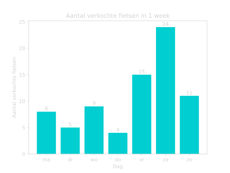

# Statistiek
We gebruiken statistiek om gegevens beter te kunnen begrijpen. Dit kunnen we doen door het op een begrijpelijke manier weer te geven. Bijvoorbeeld in een staafdiagram, histogram of een cirkeldiagram. Maar we kunnen ook bepaalde gegevens berekenen die ons meer informatie geven, zoals bijvoorbeeld het gemiddelde, de mediaan of de modus. Hiermee krijgen we beter grip op de data. 

## Data weergeven
We kunnen informatie handig weergeven in grafieken en in diagrammen. We kijken naar een paar verschillende type diagrammen en bekijken hoe je ze af moet lezen en zelf maken. 

### Staafdiagrammen
We beginnen met staafdiagrammen. 

<figure markdown>
{ width="500"}
    <figcaption>Figuur 1. Staafdiagram van het aantal verkochte fietsen in 1 week.</figcaption>
</figure>

### Histogrammen

### Cirkeldiagrammen

### Lijndiagrammen

## Gemiddelde

## Mediaan en Modus
