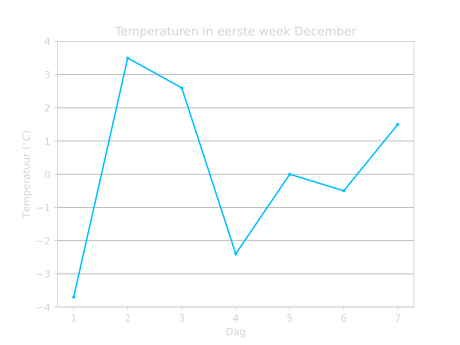
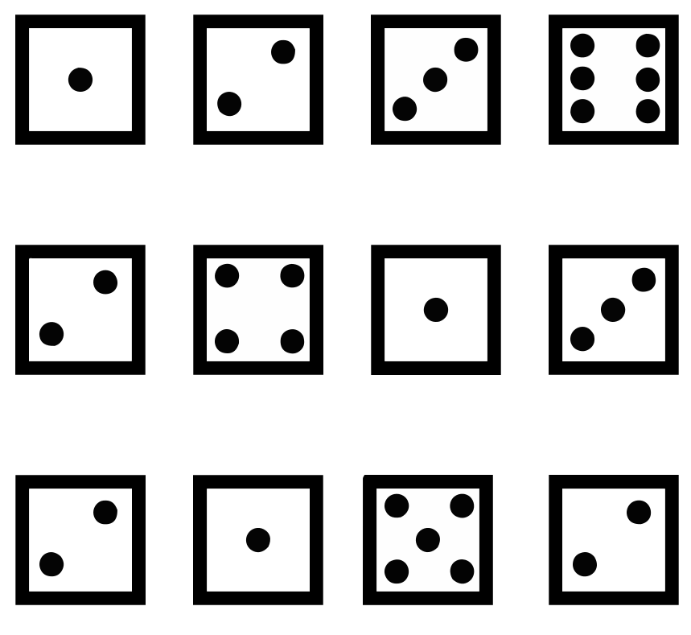

# Statistiek
We gebruiken statistiek om gegevens beter te kunnen begrijpen. Dit kunnen we doen door het op een begrijpelijke manier weer te geven. Bijvoorbeeld in een staafdiagram, histogram of een cirkeldiagram. Maar we kunnen ook bepaalde gegevens berekenen die ons meer informatie geven, zoals bijvoorbeeld het gemiddelde, de mediaan of de modus. Hiermee krijgen we beter grip op de data. 

## Data weergeven
We kunnen informatie handig weergeven in grafieken en in diagrammen. We kijken naar een paar verschillende type diagrammen en bekijken hoe je ze af moet lezen en zelf maken. 

### **Staafdiagrammen**
We beginnen met staafdiagrammen. Stel we willen bijvoorbeeld kijken naar het aantal fietsen dat een fietsenwinkel verkoopt in $1$ week. We krijgen de volgende data:

| Dag       | Aantal fietsen |
|-----------|----------------|
| Maandag   | 8              |
| Dinsdag   | 5              |
| Woensdag  | 9              |
| Donderdag | 4              |
| Vrijdag   | 15             |
| Zaterdag  | 24             |
| Zondag    | 11             |

We willen nu dit op een handige en duidelijke manier weergeven in een grafiek, zodat we de dagen goed met elkaar kunnen vergelijking. We kunnen dit doen door middel van een **staafdiagram**. In Figuur 1 is er een staafdiagram weergegeven van deze data. 

<figure markdown>
{ width="500"}
    <figcaption>Figuur 1. Staafdiagram van het aantal verkochte fietsen in 1 week.</figcaption>
</figure>

Hiermee kunnen we precies zien hoeveel fietsen er op elke dag zijn verkocht en zien we ook meteen wat de dag is waar er de meeste fietsen verkocht is en welke dag de minste fietsen. 

Namelijk op zaterdag waren er de meeste fietsen verkocht: $24$ fietsen, en op donderdag de minste fietsen: $4$ fietsen. 

???+ belangrijk
    **
Wanneer een Histogram?
**

    - Frequentie van verschillende groepen of categorieën weergeven en vergelijken
    - Frequenties vergelijken van dezelfde groep met meerdere datasets
    
Dus in dit geval zijn de verschillende groepen de verschillende dagen van de week en zien we hoeveel fietsen er verkocht zijn per dag.

### **Histogrammen**
Laten we nu kijken naar een klas die een wiskunde toets heeft gemaakt. Daarbij hebben de leerlingen verschillende cijfers gehaald, en die zijn weergegeven met een **histogram** in Figuur 2.

<figure markdown>
{ width="500"}
    <figcaption>Figuur 2. Histogram van de behaalde cijfers voor een wiskunde toets.</figcaption>
</figure>

We kunnen hier aflezen hoeveel leerlingen een bepaald cijfer hebben gehaald. Dus $4$ leerlingen hebben een $4$ gehaald, $8$ leerlingen een $7$ en $3$ leerlingen een $7$.

???+ Belangrijk
    **
Wanneer een Histogram?
**

    - Continue dataverdeling weergeven
    - Meerdere datasets tegelijk weergeven
    - Verdelingen van verschillende datasets vergelijken
    
Dus in dit geval gaat de cijferverdeling van een $4$ naar een $9$ en zien we hoeveel leerlingen een bepaald cijfer hebben gehaald.

### **Cirkeldiagrammen**
We kunnen het voorbeeld van net over de cijfers van een wiskunde toets ook weergeven in een **cirkeldiagram**.

<figure markdown>
{ width="500"}
    <figcaption>Figuur 3. Cirkeldiagram van de behaalde cijfers voor een wiskunde toets.</figcaption>
</figure>

In Figuur 3 kunnen aflezen welk percentage van de leerlingen een bepaald cijfer heeft gehaald. Dus $26.7 \%$ heeft een $7$ gehaald, $20 \%$ een $8$, $10 \%$ een 9, etc.

???+ Belangrijk
    **
Wanneer een Cirkeldiagram?
**

    - Vergelijken van (klein aantal) verschillende groepen 
    - Met name om relatieve/procentuele verschillen weer te geven
    
Dus in dit geval om te laten zien welk percentage van de leerlingen welk cijfer heeft gehaald, maar niet per se dat bijvoorbeeld het $8$ leerlingen waren die een $7$ hebben gehaald.

### **Lijndiagrammen**
De laatste manier om data weer te geven is met een **lijndiagram**. We kijken nu naar de temperatuur in de maand Juli. 

<figure markdown>
{ width="500"}
    <figcaption>Figuur 4. Lijndiagram van de temperatuur in de maand Juli. De maximum temperatuur op een dag is aangegeven in het blauw, en de minimum temperatuur op een dag is aangegeven in het groen.</figcaption>
</figure>

We kunnen in Figuur 4 precies aflezen wat de minimum en maximum temperatuur is op elke dag van de maand Juli. Dus op 10 Juli was de minimum temperatuur ongeveer $23 \ ^{\circ} \textrm C$ en de maximum temperatuur ongeveer $29 \ ^{\circ} \textrm C$.

???+ Belangrijk
    **
Wanneer een Lijndiagram?
**

    - Relatie tussen twee waardes weergeven
    - Met name handig om groei/afname weer te geven
    - Meerdere datasets tegelijk weergeven

In dit geval kijken we naar de relatie tussen de temperatuur en de tijd. We kunnen dan precies zijn hoe de temperatuur verandert in de tijd. We vergelijken ook twee datasets, namelijk die van de maximum temperatuur en die van de minimum temperatuur.

## Gemiddelde
Het gemiddelde is handig om een uitspraak te kunnen doen over de hele dataset. Je kunt over het algemeen ermee kijken waar de meeste data zich bevindt en het maakt het vergelijken van verschillende datasets makkelijker. 

Laten we bijvoorbeeld naar twee verschillende klassen kijken: klas A en klas B. De twee verschillende klassen hebben net een toets gemaakt en de leerlingen hebben verschillende cijfers gehaald. De cijfers van beide klassen is weergegeven met een histogram in Figuur 5.  

<figure markdown>
{ width="500"}
    <figcaption>Figuur 5. Histogram van de behaalde cijfers voor een wiskunde toets van klas A en klas B.</figcaption>
</figure>

We zien hier dat de cijfers van klas A over het algemeen hoger zijn dan die van klas B. Om te bekijken hoeveel klas A het precies over het algemeen beter heeft gedaan, is het handig om de gemiddeldes te berekenen en die te vergelijken.  

We berekenen een gemiddelde op de volgende manier:

???+ Belangrijk
    ### **Gemiddelde berekenen**

    - Tel alle getallen bij elkaar op
    - Deel het door het aantal getallen

    $$\Large{\textrm{Gemiddelde} = \frac{\textrm{Som van de getallen}}{\textrm{Aantal getallen}}}$$

??? example "Simpel Voorbeeld"
    Dus bijvoorbeeld voor de getallen $\large{2, 4, 6, 8}$ kunnen we het gemiddelde als volgt berekenen:

    - We tellen alle getallen bij elkaar op:

    $$\large{2 + 4 + 6 + 8 = 20}$$

    - Dan delen we het door het aantal getallen:

    $$\large{\frac{20}{4} = 5}$$

    Het gemiddelde van deze reeks getallen is dus $5$.

Om het gemiddelde van de twee klassen te bepalen moeten we dus eerst alle cijfers van alle leerlingen bij elkaar op tellen. Hiervoor hebben we voor elk cijfer nodig hoeveel leerlingen dat cijfer hebben gehaald. Uit Figuur 5 kunnen we de volgende tabel maken:

    

<h2 style="margin-left:70px;">Klas A</h2>

<table style="float:left;">
  <tr>
    <th>Cijfers</th>
    <th>Frequentie</th>
  </tr>
  <tr>
    <td>4.5</td>
    <td>5</td>
  </tr>
  <tr>
    <td>5.0</td>
    <td>4</td>
  </tr>
  <tr>
    <td>5.5</td>
    <td>5</td>
  </tr>
  <tr>
    <td>6.0</td>
    <td>6</td>
  </tr>
  <tr>
    <td>6.5</td>
    <td>7</td>
  </tr>
  <tr>
    <td>7.0</td>
    <td>7</td>
  </tr>
  <tr>
    <td>7.5</td>
    <td>9</td>
  </tr>
  <tr>
    <td>8.0</td>
    <td>8</td>
  </tr>
  <tr>
    <td>8.5</td>
    <td>6</td>
  </tr>
  <tr>
    <td>9.0</td>
    <td>4</td>
  </tr>
  <tr>
    <td>9.5</td>
    <td>1</td>
  </tr>
</table>

    

    

<h2 style="margin-left:100px;">Klas B</h2>
<table style="float:left; margin-left:20px;">
  <tr>
    <th>Cijfers</th>
    <th>Frequentie</th>
  </tr>
  <tr>
    <td>3.0</td>
    <td>5</td>
  </tr>
  <tr>
    <td>3.5</td>
    <td>6</td>
  </tr>
  <tr>
    <td>4.0</td>
    <td>9</td>
  </tr>
  <tr>
    <td>4.5</td>
    <td>10</td>
  </tr>
  <tr>
    <td>5.0</td>
    <td>11</td>
  </tr>
  <tr>
    <td>5.5</td>
    <td>9</td>
  </tr>
  <tr>
    <td>6.0</td>
    <td>8</td>
  </tr>
  <tr>
    <td>6.5</td>
    <td>7</td>
  </tr>
  <tr>
    <td>7.0</td>
    <td>3</td>
  </tr>
</table>

    

Om nu het gemiddelde te berekenen, berekenen we eerst de som van alle cijfers. We beginnen met klas A. We doen eigenlijk steeds de frequentie keer het cijfer en dit tellen we dan allemaal bij elkaar op:

<!-- Sorted Dictionary 1: {4.5: 5, 5.0: 4, 5.5: 5, 6.0: 6, 6.5: 7, 7.0: 7, 7.5: 9, 8.0: 8, 8.5: 6, 9.0: 4, 9.5: 1}
Sorted Dictionary 2: {3.0: 5, 3.5: 6, 4.0: 9, 4.5: 10, 5.0: 11, 5.5: 9, 6.0: 8, 6.5: 7, 7.0: 3} -->

$$\textrm{Som cijfers klas A} = 5 \times 4.5 + 4 \times 5.0 + 5 \times 5.5 + 6 \times 6.0 + 7 \times 6.5 + 7 \times 7.0 + 9 \times 7.5 + 8 \times 8.0 + 6 \times 8.5 + 4 \times 9.0 + 1 \times 9.5$$

$$\textrm{Som cijfers klas A} = 428.5$$

Nu berekenen we het totaal aantal leerlingen. Dit zijn dus eigenlijk alle frequenties bij elkaar opgetelt, want elke leerling heeft maar 1 cijfer gehaald:

$$\textrm{Aantal leerlingen klas A} = 5 + 4 + 5 + 6 + 7 + 7 + 9 + 8 + 6 + 4 + 1$$

$$\textrm{Aantal leerlingen klas A} = 62$$

We kunnen nu het [gemiddelde berekenen](#gemiddelde-berekenen) door deze twee dingen door elkaar te delen:

$$\textrm{Gemiddelde klas A} = \frac{428.5}{62} \approx 6.9$$

Het gemiddelde van klas A is dus een $6.9$. 

Om het gemiddelde van klas B te bepalen doen we precies dezelfde stappen:

We tellen eerst weer alle cijfers keer de frequentie bij elkaar op:

$$\textrm{Som cijfers klas B} = 5 \times 3.0 + 6 \times 3.5 + 9 \times 4.0 + 10 \times 4.5 + 11 \times 5.0 + 9 \times 5.5 + 8 \times 6.0 + 7 \times 6.5 + 3 \times 7.0$$

$$\textrm{Som cijfers klas B} = 336$$

Het totaal aantal leerlingen is de frequenties bij elkaar opgeteld:

$$\textrm{Aantal leerlingen klas B} =  5 + 6 + 9 + 10 + 11 + 9 + 8 + 7 + 3$$

$$\textrm{Aantal leerlingen klas B} = 68$$

En het gemiddelde wordt dan:

$$\textrm{Gemiddelde klas B} = \frac{336}{68} \approx 4.9$$

Het gemiddelde van klas B is dus een $4.9$. 

Dit betekent dus dat klas A gemiddeld $2$ cijferpunten hoger heeft gescoord op de toets. Dus sommige leerlingen van klas A hebben iets minder dan $2$ cijferpunten hoger gehaald (dan de gemiddelde leerling uit klas B) en andere leerlingen van klas A hebben juist iets meer dan $2$ cijferpunten hoger gehaald. Maar gemiddeld is dit dus $2$ cijferpunten hoger.

<figure markdown>
.svg){ width="500"}
    <figcaption>Figuur 5 (met gemiddelde). Histogram van de behaalde cijfers voor een wiskunde toets van klas A en klas B.</figcaption>
</figure>

### **Voorbeelden**
??? example "Voorbeeld 1: Gemiddelde temperatuur eerste week December"
    **
Bereken de gemiddelde temperatuur in de eerste week van December
**

    *De temperaturen van de eerste week van December zijn weergegeven in Figuur 1. Bereken de gemiddelde temperatuur van deze week.*
    <figure markdown>

    { width="450"}
        <figcaption>Figuur 1. Temperatuur in de eerste week van December.</figcaption>
    </figure>

    **
Uitwerking
**

    Om de gemiddelde temperatuur te berekenen maken we een tabel van de temperatuur op elke dag.

    

    | Dag | Temperatuur (°C) |
    |-----|------------------|
    | 1   | -3.7             |
    | 2   | 3.5              |
    | 3   | 2.6              |
    | 4   | -2.4             |
    | 5   | 0.0              |
    | 6   | -0.5             |
    | 7   | 1.5              |

    

    Nu kunnen we het [gemiddelde berekenen](#gemiddelde-berekenen). We bepalen eerst de som van alle temperaturen:

    $$\large{\textrm{Som} = -3.7 + 3.5 + 2.6 + -2.4 + 0.0 + -0.5 + 1.5}$$

    $$\large{\textrm{Som} = 1}$$

    Nu moeten we dit delen door het aantal dagen, dus door $7$. We vinden dan als gemiddelde:

    $$\large{\textrm{Gemiddelde} \frac{1}{7}}$$

    !!! quote ""
        $$\large{\textrm{Gemiddelde} \approx 0.14 \ ^{\circ}\textrm{C}}$$

    Als we dit tekenen in Figuur 1, dan kunnen we controleren dat dit antwoord inderdaad zou kunnen kloppen.

    <figure markdown>
    .svg){ width="450"}
        <figcaption>Figuur 1 (met Gemiddelde). Temperatuur in de eerste week van December.</figcaption>
    </figure>

??? example "Voorbeeld 2: Gemiddelde lengte van groep jongens en meisjes"
    **
Bereken de gemiddelde lengte van een groep met 5 jongens en 5 meisjes
**

    *Een groep van 5 jongens en 5 meisjes meten allemaal hun lengte, en dit is weergegeven in de onderstaande tabel. *
    
    *Bereken de gemiddelde lengte van de jongens en de gemiddelde lengte van de meisjes. Hoeveel zijn de jongens gemiddeld langer dan de meisjes?*

    |       | Lengte Meisje (cm) |       |       | Lengte Jongen (cm) |       |
    |-------|--------------------|-------|-------|--------------------|-------|
    | **1** | 161                |       | **1** | 176                |       |
    | **2** | 167                |       | **2** | 182                |       |
    | **3** | 172                |       | **3** | 187                |       |
    | **4** | 154                |       | **4** | 171                |       |
    | **5** | 176                |       | **5** | 191                |       |

    **
Uitwerking
**

    We beginnen met de [gemiddelde](#gemiddelde-berekenen) lengte te berekenen van de meisjes. We beginnen met alle lengtes bij elkaar op te tellen:

    $$\large{\textrm{Som meisjes} = 161 + 167 + 172 + 154 + 176}$$

    $$\large{\textrm{Som meisjes} = 830}$$

    Om het gemiddelde te berekenen delen we de som door het totaal aantal meisjes, dus door $5$:

    $$\large{\textrm{Gemiddelde meisjes}} = \frac{830}{5}$$

    !!! quote ""
        $$\large{\textrm{Gemiddelde meisjes}} = 166 \textrm{ cm}$$
    
    We herhalen deze stappen ook voor de jongens:

    $$\large{\textrm{Som jongens} = 176 + 182 + 187 + 171 + 191}$$

    $$\large{\textrm{Som jongens} = 907}$$

    Nu delen we de som weer door het totaal aantal jongens, dus ook door $5$:

    $$\large{\textrm{Gemiddelde jongens}} = \frac{907}{5}$$

    !!! quote ""
        $$\large{\textrm{Gemiddelde jongens}} = 181.4 \textrm{ cm}$$

    Hoeveel de jongens gemiddeld langer zijn dan de meisjes kunnen we bepalen door de twee gemiddeldes van elkaar af te trekken:

    $$\large{\textrm{Gemiddeld verschil} = 181.4 \textrm{ cm} - 166 \textrm{ cm}}$$

    !!! quote ""
        $$\large{\textrm{Gemiddeld verschil} = 15.4 \textrm{ cm}}$$

??? example "Voorbeeld 3: Gemiddelde leeftijd"
    **
Bereken de gemiddelde leeftijd van een opa en oma met/zonder hun kleinkinderen
**

    *Er zijn wat kleinkinderen op bezoek bij hun opa en oma. De kleinkinderen en hun grootouders verschillen best veel van leeftijd. Bereken de gemiddelde leeftijd van de kleinkinderen met hun grootouders en zonder hun grootouders. Hoeveel neemt het gemiddelde af als we de grootouders weglaten?*

    

    | Persoon | Leeftijd |
    |---------|----------|
    | **1**   |  78      |
    | **2**   |  74      |
    | **3**   |  17      |
    | **4**   |  15      |
    | **5**   |  19      |
    | **6**   |  24      |
    | **7**   |  11      |
    | **8**   |  21      |

    

    **
Uitwerking
**

    Het [gemiddelde](#gemiddelde-berekenen) berekenen we door eerst alle leeftijden bij elkaar op te tellen en dan te delen door het aantal mensen. We beginnen met het gemiddelde berekenen met de grootouders erbij, dus in dit geval zijn er $8$ mensen en dus delen we door $8$. 

    $$\large{\textrm{Som met grootouders} = 78 + 74 + 17 + 15 + 19 + 24 + 11 + 21}$$

    $$\large{\textrm{Som met grootouders} = 259}$$

    Het gemiddelde wordt dus:

    $$\large{\textrm{Gemiddelde met grootouders} = \frac{259}{8}}$$

    !!! quote ""
        $$\large{\textrm{Gemiddelde met grootouders} = 32.375 \approx 32 \textrm{ jaar}}$$

    Nu bereken we het gemiddelde zonder de grootouders. We berekenen eerst de som:
    
    $$\large{\textrm{Som zonder grootouders} = 17 + 15 + 19 + 24 + 11 + 21}$$

    $$\large{\textrm{Som zonder grootouders} = 107}$$

    Er zijn $6$ kleinkinderen en dus delen we door $6$.

    $$\large{\textrm{Gemiddelde zonder grootouders} = \frac{107}{6}}$$

    !!! quote ""
        $$\large{\textrm{Gemiddelde zonder grootouders} \approx 18 \textrm{ jaar}}$$

    Het gemiddelde neemt dus af met ongeveer:

    !!! quote ""
        $$\large{32 - 18 = 14 \textrm{ jaar}}$$ 

??? example "Voorbeeld 4: Gemiddelde cijfers met weging"
    **
Bereken het gewogen gemiddelde van alle cijfers.
**

    *Een leerling heeft de volgende cijfers gehaald (zie Figuur 2). Wat staat de leerling gemiddeld voor alle vakken samen als we de weging van de cijfers meenemen?*

    { width="250" align=right }

    Om het [gemiddelde](#gemiddelde-berekenen) te berekenen, berekenen we eerst de som van alle cijfers. Omdat we het gewogen gemiddelde willen, moeten we alle individuele cijfers vermenigvuldigen met de weging om ervoor te zorgen dat sommige cijfers zwaarder mee tellen dan andere:

    $$\large{\textrm{Som} = 4 \times 8.5 + 1 \times 6.3 + 1 \times 5.1 + 2 \times 8.9 + 2 \times 4.4 + 1.6 \times 8.1 + 5 \times 8.2 + 4 \times 9.1 }$$

    $$\large{\textrm{Som} = 162.36}$$

    Als we het aantal cijfers willen bepalen, dan moeten we de wegingen bij elkaar op tellen:

    $$\large{\textrm{Aantal cijfers} = 4 + 1 + 1 + 2 + 2 + 1.6 + 5 + 4}$$

    $$\large{\textrm{Aantal cijfers} = 20.6}$$

    

        Figuur 2. Cijfers voor verschillende vakken met hun verschillende wegingen.
    

    Nu delen we de som en het aantal cijfers om het gemiddelde te berekenen:

    $$\large{\textrm{Gemiddelde} = \frac{162.36}{20.6}}$$

    !!! quote ""
        $$\large{\textrm{Gemiddelde} \approx 7.9}$$

## Mediaan en Modus
Soms is een gemiddelde echter niet representatief voor de meeste gevallen. Laten we kijken naar inkomens van $100$ mensen waar er $1$ biljonair bij zit. In Figuur 6 is het inkomen weergegeven van de andere $99$ mensen.

<figure markdown>
{ width="500"}
    <figcaption>Figuur 6. Inkomen van 99 mensen weergegeven in een histogram.</figcaption>
</figure>

Nu voegen we aan deze groep mensen de biljonair toe die een inkomen heeft van $1$ miljard. Nu berekenen we het gemiddelde. Als we dit doen, dan vinden we het volgende:

$$\large{\textrm{Gemiddelde} = \Large{\textrm{€}} \large 10.052.841}$$

Het gemiddelde is dus ongeveer $10$ miljoen! Maar dit is een vertekend beeld, want dit is niet representatief voor de mensen uit deze groep. De biljonair zorgt er dus voor dat het gemiddelde heel erg hoog wordt. We zien dus dat het gemiddelde erg gevoelig is voor extreem hoge/lage waardes. Daarom is het in dit geval handiger om de **mediaan** te gebruiken.

???+ Belangrijk
    ### **Mediaan bepalen**

    De mediaan is de middelste waarde uit een dataset wanneer de data gesorteerd is van laag naar hoog. Dus om de mediaan te bepalen kunnen we het volgende doen:
      
  
    - Sorteer de data van laag naar hoog
    - Is de data oneven? $\Longrightarrow$ Kies het middelste getal.
    - Is de data even? $\Longrightarrow$ Bereken het gemiddelde van de middelste twee getallen.

??? example "Simpel Voorbeeld: Mediaan"
    **
Oneven dataset
**
    Stel we hebben de volgende dataset: 

    $$\large{9,4,2,3,5}$$

    We sorteren deze dataset van laag naar hoog:

    $$\large{2,3,4,5,9}$$

    Deze data set is oneven en dus kunnen we gelijk het middelste getal kiezen. In dit geval is dit $4$ en dus wordt onze mediaan:

    !!! quote ""
        $$\large{\textrm{Mediaan} = 4}$$

    **
Even dataset
**

    Stel we hebben nu de volgende dataset

    $$\large{5,4,8,12,78,2}$$

    We sorteren dit weer van laag naar hoog:

    $$\large{2,4,5,8,12,78}$$

    Deze dataset is even en dus moeten we het gemiddelde nemen van de middelste twee getallen. De middelste twee getallen zijn $5$ en $8$ en dus wordt onze mediaan:

    !!! quote ""
        $$\large{\textrm{Mediaan} = \frac{5 + 8}{2} = 6.5}$$

Dus als we de mediaan willen bepalen van de groep, dan moeten we eerst alle $100$ inkomens op volgorde van laag naar hoog zetten. $100$ is een even getal en dus berekenen we het gemiddelde van de middelste twee waardes. Als we dit doen, dan vinden we als mediaan:

$$\large{\textrm{Mediaan} = \Large{\textrm{€}} \large 55.834}$$

En we zien dat dit representatiever is voor de meeste mensen uit de groep dan het gemiddelde van €$10$ miljoen.

Apart van de **mediaan**, kunnen we ook de **modus** bepalen om meer grip op de data te krijgen. De modus verteld ons welk getal het vaakst voorkomt.

???+ Belangrijk
    ### **Modus bepalen**

    - De modus is het getal dat het vaakst voorkomt.
    - Het is handig om de data te sorteren van laag naar hoog om dit te bepalen.
    - Als er twee getallen zijn die allebei het meest voorkomen, dan is er geen modus.

??? example "Simpel Voorbeeld: Modus"
    **
Modus bepalen
**
    Stel we hebben de volgende dataset:

    $$\large{1,4,2,3,2}$$

    Om te bepalen welk getal het vaakst voorkomt, is het handig om de data te sorteren van laag naar hoog. Als we dit doen, dan vinden we:

    $$\large{1,2,2,3,4}$$

    We zien nu dat het getal $2$ het vaakst voorkomt en dus is onze modus $2$.

    $$\large{\textrm{Modus} = 2}$$

    **
Geen Modus
**

    Stel we hebben nu deze dataset:

    $$\large{1,3,4,3,6,4,7,8}$$

    We sorteren het eerst weer van laag naar hoog:

    $$\large{1,3,3,4,4,6,7,8}$$

    We zien nu dat $3$ en $4$ allebei het meest voorkomen en omdat dit dus twee getallen zijn, hebben we geen modus.

    $$\large{\textrm{Geen Modus}}$$

### **Voorbeelden**

??? example "Voorbeeld 1: Mediaan en de Modus van het aantal dobbelsteen ogen"
    **
Bepaal de Mediaan en de Modus van het aantal dobbelsteen ogen
**

    *Er is meerdere keren met een dobbelsteen gegooid en de uitslagen van het aantal ogen zijn hier rechts weergegeven in Figuur 1. Wat is de mediaan en wat is de modus van deze worpen?*

    **
Uitwerking
**

    { width="200" align=right }

    Om te bepalen wat de mediaan is, is het handig om de worpen te sorteren van laag naar hoog aantal ogen. Als we dit doen, dan vinden we:

    $$\large{1,1,1,2,2,2,2,3,3,4,5,6}$$

    Nu berekenen we de mediaan. Er waren $12$ worpen en dit is een even getal. We moeten dus de middelste twee getallen nemen en daar het gemiddelde van nemen. De middelste twee getallen zijn:

    

        Figuur 1. Weergave van de verschillende worpen van een dobbelsteen.
    

    $$\large{1,1,1,2,2, \boxed{2,2} ,3,3,4,5,6}$$

    Het gemiddelde van $2$ met zichzelf is gewoon $2$ en dus krijgen we:

    !!! quote ""
        $$\large{\textrm{Mediaan} = 2}$$

    Om de modus te bepalen moeten we kijken welk getal het vaakst voorkomt. Met de gesorteerde worpen kunnen we zien dat $2$ ogen het vaakst is gegooid en dus krijgen we:

    !!! quote ""
        $$\large{\textrm{Modus} = 2}$$

??? example "Voorbeeld 2: Mediaan en de Modus van de verschillende schoenmaten"
    **
Bepaal de Mediaan en de Modus van de verschillende schoenmaten
**

    *
Een groep leerlingen hebben allemaal gemeten wat hun schoenmaat is, en dit is weergegeven in Figuur 2. Bepaal van deze data de mediaan en de modus.
*

    { width="300" align=right }

    **
Uitwerking
**
    Om te bepalen wat de mediaan is, moeten we eerst alle schoenmaten sorteren van laag naar hoog. Als we dit doen, dan vinden we het volgende:

    $$\large{35, 36, 37, 38, 39, 40, 41, 42, 43, 44}$$

    De mediaan is het gemiddelde van de middelste twee getallen, want dit is een even dataset. De middelste twee getallen zijn:

    

        Figuur 2. De verschillende schoenmaten van de groep leerlingen.
    

    $$\large{35, 36, 37, 38, \boxed{39, 40} , 41, 42, 43, 44}$$

    De mediaan is dus het gemiddelde van $39$ en $40$:

    $$\large{\textrm{Mediaan} = \frac{39 + 40}{2}}$$

    !!! quote ""
        $$\large{\textrm{Mediaan} = 39.5}$$

    De modus is het getal dat het vaakst voorkomt. In dit geval komen alle getallen even vaak voor, en is er dus geen modus

    !!! quote ""
        $$\large{\textrm{Geen Modus}}$$

??? example "Voorbeeld 3: Mediaan en de Modus van het aantal huisdieren"
    **
Bepaal de Mediaan en de Modus van het aantal huisdieren
**

    *Leerlingen uit een klas hebben allemaal doorgegeven hoeveel huisdieren ze hadden, en dit is weergegeven in Figuur 3. Bepaal van deze data de mediaan en de modus.*

    <figure markdown>
    .svg){ width="500"}
        <figcaption>Figuur 3. Histogram van het aantal huisdieren per leerling.</figcaption>
    </figure>

    **
Uitwerking
**

    We kunnen uit de histogram van Figuur 3 meteen aflezen dat het getal dat het vaakst voorkomt $1$ is en dus is de modus $1$

    !!! quote ""
        $$\large{\textrm{Modus} = 1}$$

    Om de mediaan te bepalen zouden we de data uitkunnen schrijven, maar we kunnen het ook doen met de grafiek. De totaal aantal leerlingen is-:

    $$\large{\textrm{Aantal leerlingen} = 8 + 9 + 7 + 3 + 2 + 1}$$

    $$\large{\textrm{Aantal leerlingen} = 30}$$

    Dit is een even aantal en dus moeten we het gemiddelde nemen van de middelste twee getallen. De middelste twee getallen zijn het $15^{\textrm{e}}$ en het $16^{\textrm{e}}$ getal uit de gesorteerde dataset. 
    
    In Figuur 3 is de data al gesorteerd, dus daar kunnen we aflezen dat we eerst $8$ keer $0$ huisdieren hebben en daarna $9$ keer $1$ huisdier. Samen zijn dit de eerste $17$ getallen van de dataset en dus weten we dat zowel het $15^{\textrm{e}}$ als het $16^{\textrm{e}}$ getal $1$ moet zijn. Het gemiddelde van twee keer hetzelfde getal is het getal zelf, en dus vinden we dat de mediaan $1$ is. 

    !!! quote ""
        $$\large{\textrm{Mediaan} = 1}$$