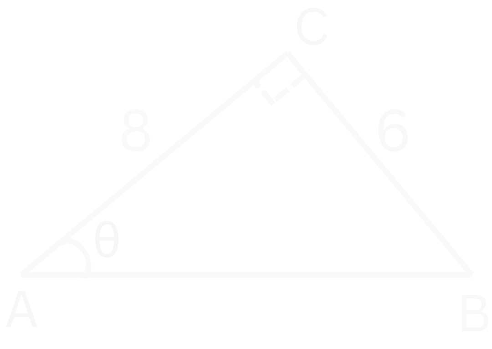
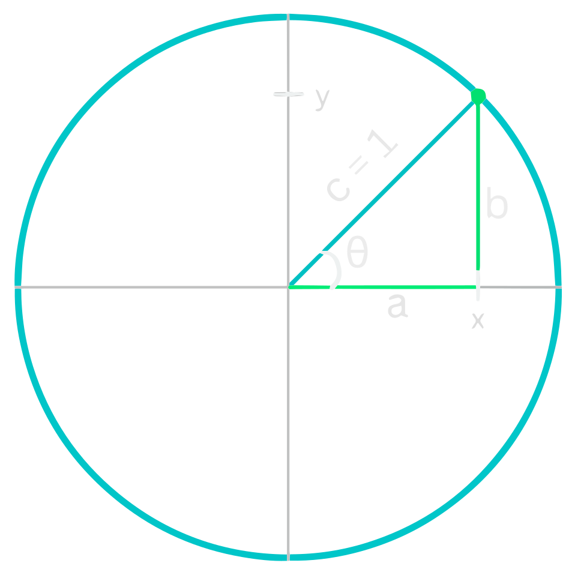
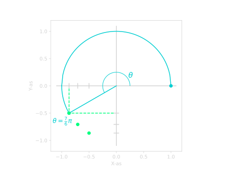

# *Goniometrie*
## **De Goniometrische Functies**

Goniometrie gaat vooral over driehoeken en wat we daar allemaal mee kunnen berekenen. We kunnen de goniometrische functies gebruiken om hiermee te helpen. We gebruiken ze als we een hoek en een zijde hebben van een rechthoekige driehoek. We kunnen dan de andere twee zijdes berekenen met de goede goniometrische functie. Dit is erg handig, want met [Pythagoras](pythagoras.md) kunnen we dit niet doen. 

Er zijn drie soorten goniometrische functies die we vaak gebruiken. De **sinus**, de **cosinus** en de **tangens**. Welke functie we gebruiken is afhankelijk van wat we hebben en wat we willen berekenen. Hieronder zie je het verband tussen de functies en de zijdes van een rechthoekige driehoek.

???+ Belangrijk
    ### **Goniometrische Functies**
    $$\large{\sin(\theta) = \frac{\mathrm{Overstaand}}{\mathrm{Schuin}}}$$

    $$\large{\cos(\theta) = \frac{\mathrm{Aanliggend}}{\mathrm{Schuin}}}$$

    $$\large{\tan(\theta) = \frac{\mathrm{Overstaand}}{\mathrm{Aanliggend}}}$$

Dit kan je onthouden met het ezelsbruggetje: "SOS CAS TOA". Dit kun je als volgt begrijpen:

- SOS: <u>S</u>inus is <u>O</u>verstaand gedeelt door <u>S</u>chuin.
- CAS: <u>C</u>osinus is <u>A</u>anliggend gedeelt door <u>S</u>chuin.
- TOA: <u>T</u>angens is <u>O</u>verstaand gedeelt door <u>A</u>anliggend.

??? note "Overstaand, Aanliggend en Schuin"
    *Overstaand*, *Aanliggend* en *Schuin* gaan over de verschillende zijdes van een rechthoekige driehoek. Dit is altijd bepaald ten opzichte van de hoek waar je naar kijkt. Dus in Figuur 1 kijken we ten opzichte van de hoek $\theta$. 
    
    Vanuit deze hoek $\theta$ bepalen we welke de overstaande zijde is en welke de aanliggende. De schuine zijde is altijd hetzelfde voor een rechthoekige driehoek. Dus dan maakt het niet uit vanaf welke hoek je kijkt.

    <figure markdown>
        { width="250"}
    </figure>
    *
Figuur 1. Een rechthoekige driehoek met de overstaande, aanliggende en schuine zijdes aangegeven.
*  

    De kenmerken van de verschillende soorten zijdes:
    
    - **Schuine zijde:** De zijde tegenover de hoek van $90 ^{\circ}$. Het is ook de langste zijde van de rechthoekige driehoek.
    - **Aanliggende zijde:** De andere zijde die samen met de schuine zijde de hoek $\theta$ maakt.
    - **Overstaande zijde:** De zijde tegenover de hoek $\theta$.

### **Zijdes Bepalen**

Laten we naar een voorbeeld kijken. In Figuur 2 hieronder hebben we een rechthoekige driehoek gegeven gekregen. 

<figure markdown>
{ width="300" align=middle}
</figure>
*
Figuur 2. Een rechthoekige driehoek met de hoek $\theta$ en de punten $A$, $B$ en $C$.
*  

Stel we willen zijde $BC$ bepalen en we weten dat $\theta = 60 ^{\circ}$ en $AB = 2$. Hoe pakken we dit dan aan?

Zoals we eerder zagen, kunnen we dit probleem niet oplossen met [Pythagoras](pythagoras.md). Hiervoor hebben we de goniometrische funties nodig. Maar welke moeten we gebruiken, de sinus, cosinus of de tangens? 

We hebben de hoek $\theta$ en de zijde $AB$. Dit is de overstaande zijde, want het is de zijde tegenover hoek $\theta$. Verder willen we zijde $BC$ weten. Dit is de aanliggende zijde, want het maakt samen met de schuine zijde de hoek $\theta$.

We zoeken dus een functie die iets met een overstaande en aanliggende zijde heeft. We kunnen bij de [goniometrische functies](#goniometrische-functies) zien dat we dus de **tangens** moeten gebruiken. Deze functie heeft namelijk beide zijdes die we willen. Laten we als eerst de tangens opschrijven:

$$\tan(\theta) = \frac{\mathrm{Overstaand}}{\mathrm{Aanliggend}}$$

De overstaande zijde is dus $BC$ en de aanliggende is $AB$:

$$\tan{(\theta)} = \frac{BC}{AB}.$$

Nu kunnen we dit [omschrijven](basisvaardigheden.md#formules-omschrijven) om $BC$ vrij te maken:

$$BC = AB \cdot \tan{(\theta)}.$$

Laten we nu de gegevens invullen die we hebben:

$$BC = 2 \cdot \tan{(60 ^{\circ})}.$$

Als we dit in een rekenmachine stoppen, dan vinden we:

!!! quote ""
    $$\large{BC \approx 3.46}$$

We kunnen in Figuur 2 controleren dat dit antwoord best zou kunnen kloppen.

### **Hoeken Bepalen**
We kunnen de [goniometrische functies](#goniometrische-functies) ook gebruiken om een hoek te bepalen. We hebben daarvoor $2$ zijdes van de rechthoekige driehoek nodig. 

We gebruiken dan de inverse van de goniometrische functie. Dit noteren we dan met een *arc* of met een $^{-1}$. 

???+ Belangrijk
    $$\large{\sin(\theta) = \frac{\mathrm{Overstaand}}{\mathrm{Schuin}} \iff \theta = \arcsin \! \left(\frac{\mathrm{Overstaand}}{\mathrm{Schuin}}\right)}$$

    $$\large{\cos(\theta) = \frac{\mathrm{Aanliggend}}{\mathrm{Schuin}} \iff \theta = \arccos \! \left(\frac{\mathrm{Aanliggend}}{\mathrm{Schuin}}\right)}$$

    $$\large{\tan(\theta) = \frac{\mathrm{Overstaand}}{\mathrm{Aanliggend}} \iff \theta = \arctan \! \left(\frac{\mathrm{Overstaand}}{\mathrm{Aanliggend}}\right)}$$

??? note "Notatie van de inverse goniometrische functies"
    Op een rekenmachine worden de inverse functies aangegeven met een $^{-1}$. Dus:
    
    - $\large{\sin^{-1}(x)}$
    - $\large{\cos^{-1}(x)}$
    - $\large{\tan^{-1}(x).}$
    
    Maar we raden het af om het zo op te schrijven, omdat dit verwarring kan opleveren. Want
    
    $$\Large{\sin^{-1}(x) \neq \frac{1}{\sin(x)}}$$
    
    De inverse betekent hier dus <u>**niet**</u> dat we $1$ gedeelt door de functie moeten doen. Maar bij $x^{-1}$ is dit juist wel het geval. Dit kan verwarrend zijn, dus om dit te vermijden schrijven wij de inverse van $\sin(x)$ als $\arcsin(x)$ op.

Laten we naar een voorbeeld kijken om te zien hoe dit werkt. In Figuur 3 hebben we een rechthoekige driehoek met zijdes $BC = 2$ en $AB = 2$. 

<figure markdown>
{ width="250"}
</figure>
*
Figuur 3. Een rechthoekige driehoek met zijdes $BC = 2$ en $AB = 2$.
*  

We willen nu de hoek $\theta$ bepalen. Om dit te doen, kijken we als eerst naar welke zijdes we hebben. 

We hebben de zijde $BC$ als overstaande zijde. Dit kunnen we herkennen aan het feit dat de zijde niet is verbonden met de hoek $\theta$. We hebben ook zijde $AB$ als aanliggende zijde. Dit weten we omdat het samen met de schuine zijde de hoek $\theta$ maakt. En $AB$ is niet de schuine zijde, want de schuine zijde is de zijde tegenover de $90 ^{\circ}$ hoek. 

We hebben dus de overstaande en de aanliggende zijde. Dit betekent dus dat we de **tangens** moeten gebruiken:

$$\tan(\theta) = \frac{\mathrm{Overstaand}}{\mathrm{Aanliggend}}$$

$$\tan(\theta) = \frac{BC}{AB}$$

Als we nu $BC = 2$ en $AB = 2$ invullen:

$$\tan(\theta) = \frac{2}{2}$$

$$\tan(\theta) = 1$$

Dus we weten dat de tangens van $\theta$ gelijk is aan $1$. We kunnen nu $\theta$ bepalen door de $\arctan$ te nemen:

$$\theta = \arctan(1)$$

Als we dit in onze rekenmachine stoppen (dus $\tan^{-1}(1)$), dan vinden we:

$$\theta = 45 ^{\circ}$$

En als we kijken in Figuur 3, dan kunnen we controleren dat dit een logisch antwoord is. Het ziet er namelijk ook uit als de helft van een rechte ($90 ^{\circ}$) hoek.

### **Voorbeelden**
??? example "Voorbeeld 1: Bereken zijde $BC$"
    **
Bereken zijde $BC$ in de onderstaande rechthoekige driehoek.
**

    <figure markdown>
        { width="300"}
    </figure>
    *
Figuur 4. Een rechthoekige driehoek met een hoek $\theta = 30 ^{\circ}$ en een zijde $AC = 4$.
*  

    **
Uitwerking
**

    We hebben dus de hoek $\theta=30 ^{\circ}$ en een zijde $AC = 4$. Zijde $AC$ is de schuine zijde, want het is de zijde tegenover de hoek van $90 ^{\circ}$. We willen zijde $BC$ bepalen en dat is de overstaande zijde. $BC$ is namelijk de zijde tegenover $\theta$.

    Dus onze functie moet iets met een schuine zijde hebben en iets met een overstaande zijde. Als we bij de [goniometrische functies](#goniometrische-functies) kijken, dan zien we dat we de **sinus** moeten gebruiken. Laten we deze opschrijven:

    $$\large{\sin(\theta) = \frac{\mathrm{Overstaand}}{\mathrm{Schuin}}}$$

    We weten dus dat $AC$ de schuine zijde is en $BC$ de overstaande:

    $$\large{\sin(\theta) = \frac{BC}{AC}}$$

    We willen $BC$ bepalen, dus laten we die vrij maken. We moeten dus de formule gaan [omschrijven](basisvaardigheden.md#formules-omschrijven):

    $$\large{BC = AC \cdot \sin(\theta)}$$

    Als we nu $AC = 4$ en $\theta = 30 ^{\circ}$ invullen:

    $$\large{BC = 4 \cdot \sin(30 ^{\circ})}$$

    Als we dit in een rekenmachine stoppen, dan vinden we:

    !!! quote ""
        $$\large{BC = 2}$$

    En als we dit controleren in Figuur 4, dan kunnen we zien dat dit een logisch antwoord is.

??? example "Voorbeeld 2: Bepaal de hoek $\theta$"
    **
Bepaal de hoek $\theta$ in de onderstaande rechthoekige driehoek.
**

    <figure markdown>
        { width="300"}
    </figure>
    *
Figuur 5. Een rechthoekige driehoek met zijdes $AC = 4$ en $AB = 3$.
*  

    **
Uitwerking
**

    We moeten de hoek $\theta$ bepalen, dus laten we eerst kijken naar welke zijdes we hebben. Zijde $AC$ is de schuine zijde, want het is de zijde tegenover de rechte hoek. Dat betekent dat $AB$ de aanliggende zijde is, want samen met de schuine zijde $AC$ maken ze $\theta$. 

    Dus we hebben de schuine en aanliggende zijde. Dit betekent dat we de **cosinus** moeten gebruiken:

    $$\large{\cos(\theta) = \frac{\mathrm{Aanliggend}}{\mathrm{Schuin}}}$$

    We vullen dus $AB$ in als aanliggende zijde en $AC$ als schuine zijde:

    $$\large{\cos(\theta) = \frac{AB}{AC}}$$

    We weten dat $AB = 3$ en $AC = 4$:

    $$\large{\cos(\theta) = \frac{3}{4}}$$

    Om de hoek te bepalen, nemen we de $\arccos$:

    $$\large{\theta = \arccos(\frac{3}{4})}$$

    Als we dit invullen op onze rekenmachine (dus $\cos^{-1}(\frac{3}{4})$), dan vinden we:

    $$\large{\theta = 41.41... ^{\circ}}$$

    Graden ronden we af op $1$ decimaal, dus ons eindantwoord wordt dan:

    !!! quote ""
        $$\large{\theta \approx 41.4 ^{\circ}}$$

    Voor VMBO is dit op gehele getallen:
    
    !!! quote ""
        $$\large{\theta \approx 41 ^{\circ}}$$

??? example "Voorbeeld 3: Bepaal de hoek $\theta$ en zijde $AB$"
    **
Bepaal de hoek $\theta$ in de onderstaande rechthoekige driehoek.
**

    <figure markdown>
        { width="300"}
    </figure>
    *
Figuur 6. Een rechthoekige driehoek met zijdes $AC = 8$ en $BC = 6$.
*  

    **
Uitwerking
**

    We willen de hoek $\theta$ en de zijde $AB$ bepalen, dus laten we als eerst beginnen met $\theta$.

    We hebben de zijdes $BC$ en de zijdes $AC$ gegeven. Zijde $BC$ is de overstaande zijde, want het is de zijde tegenover de hoek $\theta$. 

    Om te bepalen welke zijde $AC$ is, moeten we goed opletten. De zijde tegenover de rechte hoek is de schuine zijde. In dit geval is dat zijde $AB$. Dit betekent dus dat zijde $AC$ de aanliggende zijde is, want samen met de schuine zijde maken ze $\theta$.

    We hebben dus de overstaande en de aanliggende zijde, dus moeten we de **tangens** gebruiken:

    $$\tan(\theta) = \frac{\mathrm{Overstaand}}{\mathrm{Aanliggend}}$$

    We weten dus dat de overstaande zijde $BC$ is en de aanliggende $AC$:

    $$\tan(\theta) = \frac{BC}{AC}$$

    Nu kunnen we $BC = 6$ en $AC = 8$ invullen:

    $$\tan(\theta) = \frac{6}{8} = \frac{3}{4}$$

    Om $\theta$ te bepalen, kunnen we de $\arctan$ nemen:

    $$\large{\theta = \arctan(\frac{3}{4})}$$

    Als we dit invullen in onze rekenmachine (dus $\tan^{-1}(\frac{3}{4})$), dan vinden we:

    $$large{\theta = 36.869...}$$

    Graden ronden we af op $1$ decimaal, dus ons eindantwoord wordt:

    !!! quote ""
        $$\large{\theta = 36.9 ^{\circ}}$$

    Voor VMBO is dit op gehele getallen:

    !!! quote ""
        $$\large{\theta = 37 ^{\circ}}$$

    Nu willen we zijde $AB$ bepalen. We kunnen dit op meerdere manieren doen. We kunnen dit berekenen met de **sinus**, **cosinus** of met [Pythagoras](pythagoras.md). Wij kiezen er hier voor om het met de **sinus** te berekenen. Maar voel je vrij om de andere methodes te proberen om te kijken of je het beheerst!

    Voor de sinus hebben we iets met de overstaande en de schuine zijde:

    $$\large{\sin(\theta) = \frac{\mathrm{Overstaand}}{\mathrm{Schuin}}}$$

    We hebben net gezien dat de overstaande zijde $BC$ is en $AB$ de schuine zijde:

    $$\large{\sin(\theta) = \frac{BC}{AB}}$$

    We moeten nu deze formule [omschrijven](basisvaardigheden.md#formules-omschrijven) om AB vrij te maken:

    $$\large{AB \cdot \sin(\theta) = BC}$$

    $$\large{AB = \frac{BC}{\sin(\theta)}}$$

    Nu vullen we $\theta = 36.869...$ en $BC = 6$:

    $$\large{AB = \frac{6}{\sin(36.869... ^{\circ})}}$$

    Zorg er dus voor dat je $\theta$ niet tussendoor afrond, want dan krijg je ook een (iets) ander antwoord. Als we dit invullen op onze rekenmachine, dan vinden we:

    !!! quote ""
        $$\large{AB = 10}$$

 
## **De Sinus en Cosinus functies**
Laten we nu iets dieper ingaan op de **sinus** en **cosinus** functies. Wat deze functies bijzonder maakt, is dat het periodieke functies zijn. Dit betekent dat de functie zich herhaalt na een bepaalde tijd. In dit geval is dat elke $2 \pi$. Dus elke $2 \pi$ begint de functie weer opnieuw en herhaalt het zich weer. We zeggen dan dat deze functie een periode heeft van $2 \pi$ (zie ook Figuur 7 en Figuur 8). 

??? note "Graden vs Radialen"
    In de meetkunde gebruiken we vaak graden. Maar als we meer gaan kijken naar de goniometrische functies zelf en hun vorm, dan zijn radialen vaak handiger. 

    Radialen is een eenheid voor hoeken, net zoals graden. Radialen gaan niet van $0$ tot $360 ^{\circ}$, maar van $0$ tot $2 \pi$. We kiezen voor $2 \pi$ als eindpunt omdat dit de omtrek is van een cirkel met straal $1$. Dus als we $1$ rondje doen, hebben we $2 \pi$ afgelegd, $2$ rondjes hebben we $4 \pi$ afgelegd, $3$ rondjes $6 \pi$ enzovoort. Een half rondje is dan $\pi$ of $180 ^{\circ}$.

    We kunnen van radialen naar graden omrekenen en andersom:

    Om van graden naar radialen te gaan doen we:

    - Graden naar Radialen: $\large{\quad \theta_{grad} \cdot \Large \frac{2 \pi}{360 ^{\circ}} \large = \theta_{rad}}$
    - Radialen naar Graden: $\large{\quad \theta_{rad} \cdot \Large \frac{360 ^{\circ}}{2 \pi} \large = \theta_{grad}}$

<figure markdown>
  { width="500"}
    <figcaption>Figuur 7. De sinus functie over een domein van $[-3 \pi, 3 \pi]$. Je kan zien dat bij elke $2 \pi$ de functie weer begint op hetzelfde punt (stijgend bij $y=0$).</figcaption>
</figure>

<figure markdown>
  { width="500"}
    <figcaption>Figuur 8. De cosinus functie over een domein van $[-3 \pi, 3 \pi]$. Je kan zien dat de functie zich na elke $2 \pi$ herhaald. Dus de punten $\large \frac{5}{2} \pi$ en $\large - \frac{3}{2} \pi$ zijn hetzelfde als het punt $\large \frac{1}{2} \pi$.</figcaption>
</figure>

???+ Belangrijk
    ### **Periodiciteit van Sinus en Cosinus**
    Het feit dat de functie zich herhaald kunnen we ook terug zien in de functie zelf:

    $$\large{\sin(x + 2 \pi) = \sin(x)}$$

    $$\large{\cos(x + 2 \pi) = \cos(x)}$$

Dus dit betekent bijvoorbeeld dat:

- $\sin(\pi) = \sin(3 \pi)$
- $\cos(1 \frac{1}{2}) = \cos(- \frac{1}{2} \pi)$
- $\cos(4 \pi) = \cos(6 \pi)$
- $\sin(- \frac{1}{4} \pi) = \sin(1 \frac{3}{4} \pi)$
- etc.

Het feit dat deze functies periodiek zijn, is erg belangrijk als we er vergelijkingen mee gaan oplossen. Laten we kijken hoe dat moet.

 
### **Sinus en Cosinus vergelijkingen**

Stel we willen de volgende vergelijking oplossen:

$$\sin(x) = 0.$$

Hoe doen we dat? We willen dus kijken waar de **sinus** functie een $y$-waarde heeft van $0$. In Figuur 7 kunnen we aflezen dat dit geldt bij $x=0$, maar ook bij andere $x$-waardes. Namelijk $x = -2 \pi$, $x = -\pi$, $x = \pi$ en $x = 2 \pi$. En deze functie gaat oneindig lang door, dus dit blijft maar zo door gaan. Hoe noteren we dit wiskundig? 

We schrijven dit als volgt op:

!!! quote ""
    $$\large{x = k \cdot \pi}$$

$k$ kan hier elk geheel getal zijn. Dus $k = 0, \pm 1, \pm 2, \pm 3, ...$ 

De waardes van $k$ gaan oneindig lang door, en dat is ook wat we willen om onze oplossingen te beschrijven. Maar stel nou dat we alle oplossingen willen weten op het domein $[0, 2 \pi]$. Hoe doen we dat dan met de oplossing die we net hebben gevonden?

We moeten dan alle mogelijke waardes voor $k$ proberen die ons een $x$ geeft binnen het domein van $[0, 2\pi]$. Dus welke waardes van $k$ moeten we invullen in $x = k \cdot \pi$ om een $x$ te krijgen tussen $0$ en $2 \pi$?

Dit zijn de waardes $k = 0$, $k = 1$ en $k = 2$. Want als we $k = 3$ proberen, dan krijgen we $x = 3 \pi$ en dit is te groot. Als we aan de andere kant $k = -1$ proberen, dan krijgen we $x = -\pi$ en dit is weer te klein. Dus de oplossingen op het domein $[0, 2 \pi]$ worden:

!!! quote ""
    $$\large{x = 0 \ \vee \ x = \pi \ \vee \ x = 2 \pi}$$

Laten we naar een ander voorbeeld kijken. Stel we willen nu de volgende vergelijking oplossen:

$$\cos{(x)} = 1.$$

Hoe doen we dit? We moeten dus kijken voor welke $x$-waardes de cosinus een $y$-waarde heeft van $1$. In Figuur 8 kunnen we zien dat dit is bij $x = 0$. Maar ook bij $x = -2\pi$ en bij $x = 2\pi$. De functie herhaalt zich steeds, dus dit patroon herhaalt zich ook. Onze oplossing wordt dus:

!!! quote ""
    $$\large{x = k \cdot 2\pi}$$

$k$ kan weer elk geheel getal zijn. Dus de oplossingen op het domein $[0, 2 \pi]$ worden dan:

!!! quote ""
    $$\large{x = 0 \ \vee \ x = 2 \pi}$$

Dit is dus voor $k = 0$ of $k = 1$. Want als we andere waardes voor $k$ proberen, dan is $x$ niet meer tussen $0$ en $2 \pi$. Dus dit moeten de enige twee oplossingen zijn op het domein $[0, 2 \pi]$.

We hebben dit opgelost door de functies te schetsen, maar kunnen we het ook oplossen zonder een schets? Het antwoord is ja! Om goed te begrijpen hoe dit moet, moeten we eerst kijken naar de symmetrie in de sinus en cosinus functies. We zullen dat nodig hebben om de [algemene oplossing](#oplossen-van-sincos-vergelijkingen) te kunnen begrijpen.

 
### **Symmetrie**
De cosinus is gespiegeld in de $y$-as (zie eventueel Figuur 8). Dus alles links van de $y$-as is hetzelfde als rechts van de $y$-as. Links van de $y$-as is bij een negatieve $x$, rechts van de $y$-as is bij een positieve $x$. Dus met andere woorden:

$$\boxed{\cos(-x) = \cos(x)}$$

Bij de sinus is dit juist omgekeerd. Het is niet gespiegeld in de $y$-as, maar gespiegeld bij de oorsprong (zie eventueel Figuur 7). Dus alles dat rechts van de $y$-as positief is, wordt negatief links van de $y$-as. Andersom geldt dit natuurlijk ook. Dit betekent dus dat er geldt dat:

$$\boxed{\sin(-x) = - \sin(x)}$$

Apart van deze symmetrieën hebben de sinus en cosinus nog een andere symmetrie. Deze symmetrie is als je $\sin(-x)$ of $\cos(-x)$ met $\pi$ naar rechts verschuift. En ik denk dat dit makkelijker te zien is met wat filmpjes. Laten we beginnen met de symmetrie van de sinus functies.

???+ video
    **
Sinus symmetrie
**

    <video controls>
    <source src="../assets/videos/Sin.mp4" type="video/mp4">
    </video>

    *
Filmpje: Een sinus functie wordt aangepast om te bewijzen dat $\sin(x) = \sin(\pi - x)$. Eerst wordt de transformatie $\sin(x) \rightarrow \sin(-x)$ toegepast. Vervolgens wordt deze functie naar rechts verschoven met $\pi$. Deze nieuwe functie wordt beschreven door $\sin(\pi - x)$ en we zien dat dit precies hetzelfde is als onze oude functie $\sin(x)$.
*

We zien dus dat we een $\sin(x)$ functie op zo'n manier kunnen aanpassen dat we de functie $\sin(\pi - x)$ krijgen. En deze functie is weer precies dezelfde functie als de $\sin(x)$ die we eerst hadden. Dit betekent dus dat we de volgende symmetrie hebben:

$$\boxed{\sin(\pi - x) = \sin(x)}$$

Voor consinus functies hebben we een soort gelijke symmetrie.

???+ video
    **
Cosinus symmetrie
**

    <video controls>
    <source src="../assets/videos/Cos.mp4" type="video/mp4">
    </video>

    *
Filmpje: Een cosinus functie wordt aangepast om te bewijzen dat $-\cos(x) = \cos(\pi - x)$. Eerst verandert de $\cos(x)$ naar $-\cos(x)$ en tegelijkertijd wordt laten zien dat $\cos(x) = \cos(-x)$. Daarna wordt de $\cos(-x)$ functie naar rechts verschoven met $\pi$. Deze verplaatste functie wordt beschreven door $\cos(\pi - x)$ en dit is precies hetzelfde als $- \cos(x)$.
*

We zien dus dat als we een $\cos(-x)$ functie met $\pi$ naar rechts verschuiven, dat we dezelfde functie krijgen als $- \cos(x)$. Voor cosinus functies hebben we dus de volgende symmetrie:

$$\boxed{\cos(\pi - x) = -\cos(x)}$$

We zetten hieronder nog even alle symmetrieën op een rijtje.

???+ Belangrijk
    ### **Symmetrieformules**
    
    1. $$\large{\sin(-x) = - \sin(x)}$$

    2. $$\large{\cos(-x) = \cos(x)}$$

    3. $$\large{\sin(\pi - x) = \sin(x)}$$

    4. $$\large{\cos(\pi - x) = - \cos(x)}$$
    
Met deze kennis kunnen we nu sinus en cosinus vergelijking gaan oplossen. We hebben daarvoor de [symmetrieformules](#symmetrieformules) en de [periodiciteit](#periodiciteit-van-sinus-en-cosinus) van de functies nodig. Laten we eerst kijken naar een sinus vergelijking.

 
**
Sinus vergelijking oplossen
**

Laten we [weer](#sinus-en-cosinus-vergelijkingen) kijken naar de volgende vergelijking:

$$\sin(x) = 0.$$

Om dit op te lossen willen we eerst aan beide kanten een $\sin$ functie hebben. We moeten dus de $0$ schrijven als $\sin(a)$. We willen er dus achter komen van welk getal we de sinus moeten nemen om $0$ te krijgen. Om dit te doen kunnen we de $\arcsin$ van $0$ nemen (later zullen we de [eenheidscirkel](#de-eenheidscirkel) gebruiken). 

We krijgen dan dus $a = \arcsin(0)$. Als we dit invullen, dan vinden we $a = 0$. Dit betekent dus dat $\sin(0) = 0$. Onze vergelijking wordt dan dus:

$$\sin(x) = \sin(0)$$

Nu kunnen we aan beide kanten de sinus weghalen om te vinden:

$$x = 0$$

Dit is dus $1$ oplossing, maar we moeten nog rekening houden met de [periodiciteit](#periodiciteit-van-sinus-en-cosinus) en [symmetrie](#symmetrieformules). We weten dus dat de functie periodiek is en dat het elke $2\pi$ zich herhaalt. Dit betekent dus dat $x = 2\pi$, $x = 4\pi$, $x=6\pi$, etc. ook oplossingen zijn. Dus om hier rekening mee te houden schrijven we:

$$x = 0 + k \cdot 2\pi$$

$$x = k \cdot 2\pi$$

$k$ kan hier dus alle gehele getallen zijn. Maar we hebben ook nog de symmetrie die we in de [symmetrieformules](#symmetrieformules) hebben gezien. Dus we weten dat:

$$\sin(x) = \sin(\pi - x)$$

Dit betekent dus dat er moet gelden dat:

$$\sin(0) = \sin(\pi - 0)$$

Om hier rekening mee te houden moeten we nog een set oplossingen toevoegen:

$$x = k \cdot 2 \pi \ \vee \ x = \pi - 0 + k \cdot 2 \pi$$

$$x = k \cdot 2 \pi \ \vee \ x = \pi + k \cdot 2 \pi$$

In dit geval kunnen we deze twee verschillende sets combineren. Want we krijgen met de linker oplossing $x = 0, 2\pi, 4\pi, ...$ en met de rechter oplossing $x = \pi, 3 \pi, 5 \pi, ...$. Dus samen zijn onze oplossingen $x = 0, \pi, 2 \pi, 3\pi, 4\pi, 5\pi, ...$. Dit is hetzelfde als:

!!! quote ""
    $$\large{x = k \cdot \pi}$$

En dat is ook wat we [eerder](#sinus-en-cosinus-vergelijkingen) gevonden hadden. In het algemeen hebben we dus voor een vergelijking van de vorm:

$$\large{\sin(x) = \sin(a)}$$

de volgende oplossingen:

$$\large{x = a + k \cdot 2\pi \ \vee \ x = \pi - a + k \cdot 2\pi}$$

 
**
Cosinus vergelijking oplossen
**

We kijken nu [weer](#sinus-en-cosinus-vergelijkingen) naar de volgende cosinus vergelijking:

$$\cos(x) = 1$$

We willen hier ook weer aan beide kanten dezelfde functie hebben, dus aan beide kanten een cosinus. Dus van welk getal is de cosinus gelijk aan $1$. Dus wat is $a$ voor $\cos(a) = 1$? Als we de $\arccos$ nemen, dan vinden we $a = \arccos(1) = 0$.

We weten nu dus dat $\cos(0) = 1$. De vergelijking wordt dan dus:

$$\cos(x) = \cos(0)$$

Als we aan beide kanten de $\cos$ weg halen, dan vinden we dus dat $1$ van onze oplossingen is:

$$x = 0$$

Maar we moeten weer rekening houden met de [periodiciteit](#periodiciteit-van-sinus-en-cosinus) en de [symmetrie](#symmetrieformules) van de cosinus. Net zoals bij de sinus herhaalt de cosinus zich elke $2 \pi$, dus onze oplossingen herhaling zich ook op dezelfde manier:

$$x = 0 + k \cdot 2 \pi$$

$$x = k \cdot 2 \pi$$

Bij de cosinus hebben we een andere symmetrie dan bij de sinus. Bij de cosinus hebben we:

$$\cos(x) = \cos(-x)$$

Dus om hier rekening mee te houden moeten we nog een set oplossingen toevoegen:

$$x = k \cdot 2 \pi \ \vee -0 + k \cdot 2 \pi$$

$$x = k \cdot 2 \pi \ \vee k \cdot 2 \pi$$

Maar in dit geval geldt er dat $0 = -0$, dus dit kunnen we gewoon weer versimpelen naar wat we eerst hadden:

!!! quote ""
    $$\large{x = k \cdot 2 \pi}$$

En dat is ook wat we [eerder](#sinus-en-cosinus-vergelijkingen) gevonden hadden. In het algemeen hebben we dus voor een vergelijking van de vorm:

$$\cos(x) = \cos(a)$$

de volgende oplossingen:

$$x = a + k \cdot 2 \pi \ \vee \ x = -a + k \cdot 2 \pi$$

We hebben nu dus de algemene oplossingen gevonden voor sinus en cosinus vergelijkingen!

???+ Belangrijk
    ### **Algemene Oplossing**

     
    **
Sinus
**

    Een vergelijking van de vorm:

    $$\large{\sin(x) = \sin(a)}$$

    heeft de volgende oplossingen:

    $$\large{x = a + k \cdot 2 \pi \ \vee \ x = \pi - a + k \cdot 2 \pi}$$

    $k$ kan hier elk geheel getal zijn, dus $k = 0, \pm 1, \pm 2, \pm 3, ...$

     
    **
Cosinus
**

    Een vergelijking van de vorm:

    $$\large{\cos(x) = \cos(a)}$$

    heeft de volgende oplossingen:

    $$\large{x = a + k \cdot 2 \pi \ \vee \  x = - a + k \cdot 2 \pi}$$

    $k$ kan hier elk geheel getal zijn, dus $k = 0, \pm 1, \pm 2, \pm 3, ...$

**
Sinus en Cosinus naar elkaar omschrijven
**

De sinus en de cosinus functies lijken best veel op elkaar: ze hebben dezelfde vorm, herhalen elke $2 \pi$ en gaan beide van $-1$ tot $1$. Het enige verschil is dat ze op andere punten beginnen. De sinus begint bij $y=0$ en de cosinus bij $y=1$. Dat is het enige verschil tussen de twee functies.

Dus als we de sinus functie een klein beetje kunnen verschuiven zodat het bij $y=1$ begint, dan hebben we een cosinus gemaakt. Het blijkt dat we $\sin(x)$ met $\dfrac{1}{2} \pi$ naar links moeten verschuiven om dit te bereiken. De verschoven sinus krijgt de vorm $\sin(x + \frac{1}{2} \pi)$ en dit is dus hetzelfde als $\cos(x)$:

$$\boxed{\sin(x + \frac{1}{2} \pi) = \cos(x)}$$

???+ video
    <video controls>
    <source src="../assets/videos/SinToCos.mp4" type="video/mp4">
    </video>

We kunnen natuurlijk ook de cosinus naar rechts verschuiven met $\frac{1}{2} \pi$ in plaats van de sinus naar links te verschuiven. De verschoven cosinus krijgt dan de vorm $\cos(x - \frac{1}{2} \pi)$ en dit is dan gelijk aan $\sin(x)$:

$$\boxed{\cos(x - \frac{1}{2} \pi) = \sin(x)}$$

???+ video
    <video controls>
    <source src="../assets/videos/CosToSin.mp4" type="video/mp4">
    </video>

???+ Belangrijk
    ### **Sinus en Cosinus omschrijven**

    $$\large{\cos(x) = \sin(x + \frac{1}{2} \pi)}$$

    $$\large{\sin(x) = \cos(x - \frac{1}{2} \pi)}$$

    ??? note "Andere manier van omschrijven"
        Als je niet wilt onthouden bij welke functie je $+ \frac{1}{2} \pi$ doet en bij welke $- \frac{1}{2} \pi$, dan kun je het ook als volgt omschrijven:

        $$\large{\cos(x) = \sin(\frac{1}{2} \pi - x)}$$

        $$\large{\sin(x) = \cos(\frac{1}{2} \pi - x)}$$

        En dit verband werkt ook altijd.

        ??? abstract "Bewijs"
            Dit kunnen we zelf bewijzen met behulp van de [Symmetrieformules](#symmetrieformules). 
            
            Om van een cosinus naar een sinus te gaan, kunnen de volgende symmetrie gebruiken:

            $$\large{\sin(x) = \sin(\pi - x)}$$

            Als we dit toepassen op $\sin(x + \frac{1}{2} \pi)$, dan vinden we:

            $$\large{\sin(x + \frac{1}{2} \pi) = \sin(\pi - (x + \frac{1}{2} \pi))}$$

            Als we dit uitwerken, dan vinden we:

            $$\large{\sin(x + \frac{1}{2} \pi) = \sin(\pi - x - \frac{1}{2} \pi)}$$

            $$\large{\sin(x + \frac{1}{2} \pi) = \sin(\frac{1}{2} \pi - x)}$$

            Het verband $\cos(x) = \sin(x + \frac{1}{2} \pi)$ wordt dan dus:

            $$\large{\boxed{\cos(x) = \sin(\frac{1}{2} \pi - x)}}$$

            Om van een sinus naar een cosinus te gaan, kunnen we de volgende symmetrie gebruiken:
            
            $$\large{\cos(x) = \cos(-x)}$$

            Als we dit toepassen op $\cos(x - \frac{1}{2} \pi)$, dan vinden we:

            $$\large{\cos(x - \frac{1}{2} \pi) = \cos(-(x - \frac{1}{2} \pi))}$$

            Als we de haakjes uitwerken, vinden we:

            $$\large{\cos(x - \frac{1}{2} \pi) = \cos(\frac{1}{2} \pi - x)}$$

            Het verband $\sin(x) = \cos(x - \frac{1}{2} \pi)$ wordt dan dus:

            $$\large{\boxed{\sin(x) = \cos(\frac{1}{2} \pi - x)}}$$

### **Voorbeelden**
??? example "Voorbeeld 1: $\cos(2x) = 0$"
    **
Los op: $\cos(2x) = 0$
**
    **
Uitwerking
**

    Om dit op te lossen willen we eerst aan beide kanten een cosinus hebben. We moeten dus kijken van welk getal de cosinus $0$ geeft. Als we de $\arccos$ nemen van $0$, dan vinden we dat dit $\frac{1}{2} \pi$ is. Dus er geldt dat $0 = \cos(\frac{1}{2} \pi)$. Als we dit invullen, dan krijgen we:

    $$\large{\cos(2x) = \cos(\frac{1}{2} \pi)}$$

    Nu kunnen we de [algemene oplossing](#algemene-oplossing) gebruiken voor een cosinus:

    $$\large{2x = \frac{1}{2} \pi + k \cdot 2 \pi \ \vee \ 2x = - \frac{1}{2} \pi + k \cdot 2 \pi}$$

    Nu kunnen we alles door $2$ delen om als eindantwoord te vinden:

    !!! quote ""
        $$\large{x = \frac{1}{4} \pi + k \cdot \pi \ \vee \ x = - \frac{1}{4} \pi + k \cdot \pi}$$

     
    In dit geval kunnen we deze oplossingen ook combineren:

    - **Linker set:** $x = -\frac{3}{4} \pi, \frac{1}{4} \pi, 1 \frac{1}{4} \pi, 2 \frac{1}{4} \pi, ...$ *
    - **Rechter set:** $x = - \frac{1}{4} \pi, \frac{3}{4} \pi, 1 \frac{3}{4} \pi, ...$ *
    - **Gecombineerd:** $x = - \frac{3}{4} \pi, - \frac{1}{4} \pi, \frac{3}{4} \pi, 1 \frac{1}{4} \pi, 1 \frac{3}{4} \pi, ...$ *

    Deze combinatie kunnen beschrijven op de volgende manier:

    !!! quote ""
        $$\large{x = \frac{1}{4} \pi + k \cdot \frac{1}{2} \pi}$$

    **De oplossingen gaan ook door in het negatieve, maar die zijn hier weg gelaten om het overzichtelijk te houden.*

??? example "Voorbeeld 2: $\sin(3x) = \cos(-x)$"
    **
Los op: $\sin(3x) = \cos(-x)$
**
    **
Uitwerking
**

    Als eerst kunnen met de [symmetrieformule](#symmetrieformules) $\cos(x) = \cos(-x)$ dit ook schrijven als:

    $$\large{\sin(3x) = \cos(x),}$$

    Om dit op te lossen, moeten we óf van beide functies een sinus maken óf van beide functies een cosinus. We kiezen er hier voor om van beide functies een sinus te maken. We moeten dan dus de $\cos(x)$ [omschrijven](#sinus-en-cosinus-omschrijven) naar $\sin(x + \frac{1}{2} \pi)$:

    $$\large{\sin(3x) = \sin(x + \frac{1}{2} \pi).}$$

    Nu kunnen we dit oplossen volgens de [algemene oplossing](#algemene-oplossing):

    $$\large{3x = x + \frac{1}{2} \pi + k \cdot 2 \pi \ \vee \ 3x = \pi - (x + \frac{1}{2} \pi) + k \cdot 2 \pi}$$

    $$\large{3x = x + \frac{1}{2} \pi + k \cdot 2 \pi \ \vee \ 3x = \frac{1}{2} \pi - x + k \cdot 2 \pi}$$

    Nu doen we alle termen met $x$ naar de linkerkant:

    $$\large{2x = \frac{1}{2} \pi + k \cdot 2 \pi \ \vee \ 4x = \frac{1}{2} \pi + k \cdot 2 \pi}$$

    Nu delen we bij de linker oplossing alles door $2$ en bij de rechter oplossing alles door $4$:
    
    !!! quote ""
        $$\large{x = \frac{1}{4} \pi + k \cdot \pi \ \vee \ x = \frac{1}{8} \pi + k \cdot \frac{1}{2} \pi}$$

??? example "Voorbeeld 3: $\cos(3x + \pi) = \cos(x + \frac{1}{2} \pi)$ op het domein $[-\pi, \pi]$"
    **
Los op: $\cos(3x + \pi) = \cos(x + \frac{1}{2} \pi)$ op het domein $[-\pi, \pi]$
**
    **
Uitwerking
**

    We hebben hier aan beide kanten al een cosinus staan, dus we kunnen dit meteen gaan [uitwerken](#algemene-oplossing):

    $$\large{3x + \pi = x + \frac{1}{2} \pi + k \cdot 2 \pi \ \vee \ 3x + \pi = - (x + \frac{1}{2} \pi) + k \cdot 2 \pi}$$

    $$\large{3x + \pi = x + \frac{1}{2} \pi + k \cdot 2 \pi \ \vee \ 3x + \pi = - x - \frac{1}{2} \pi + k \cdot 2 \pi}$$

    Nu doen we eerst alle termen met $x$ naar de linkerkant:
    
    $$\large{2x + \pi = \frac{1}{2} \pi + k \cdot 2 \pi \ \vee \ 4x + \pi = - \frac{1}{2} \pi + k \cdot 2 \pi}$$
    
    En nu doen we alle getallen rechts:

    $$\large{2x = - \frac{1}{2} \pi + k \cdot 2 \pi \ \vee \ 4x = - 1 \frac{1}{2} \pi + k \cdot 2 \pi}$$

    Als laatst delen we nu bij de linker oplossing alles door $2$ en bij de rechter oplossing alles door $4$. Als we dit doen, dan vinden we alle oplossingen:

    $$\large{\boxed{x = - \frac{1}{4} \pi + k \cdot \pi \ \vee \ x = - \frac{3}{8} \pi + k \cdot \frac{1}{2} \pi}}$$

    Maar let op! We willen alleen de oplossingen hebben op het domein $[-\pi, \pi]$. Dus we moeten voor $k$ alle gehele getallen invullen die ons een oplossing geeft tussen $-\pi$ en $\pi$. Laten we eerst bij de linker oplossing wat waardes voor $k$ proberen:

    - $k = 0 \quad \Longrightarrow \quad x = - \frac{1}{4} \pi$
    - $k = 1 \quad \Longrightarrow \quad x = \frac{3}{4} \pi$

    En dit zijn de enige waardes van $k$ die ons een $x$ tussen $-\pi$ en $\pi$ geeft. $k = -1$ geeft ons $x = -1 \frac{1}{2} \pi$ en $k = 2$ geeft ons $x = 1 \frac{3}{4} \pi$ en dit ligt allebei niet tussen $-\pi$ en $\pi$.

    Nu kijken we naar de rechter oplossing:

    - $k = -1 \quad \Longrightarrow \quad x = -\frac{7}{8} \pi$
    - $k = 0 \quad \Longrightarrow \quad x = -\frac{3}{8} \pi$
    - $k = 1 \quad \Longrightarrow \quad x = \frac{1}{8} \pi$
    - $k = 2 \quad \Longrightarrow \quad x = \frac{5}{8} \pi$

    Dit zijn alle oplossingen bij de rechter vergelijking op het domein $[-\pi, \pi]$. Want voor $k = -2$ krijgen we $x = -1 \frac{3}{8} \pi$ en voor $k = 3$ krijgen we $x = 1 \frac{1}{8} \pi$.
    
    Alle oplossingen op het domein $[-\pi, \pi]$ zijn dus:

    !!! quote ""
        $\large{x = -\dfrac{7}{8} \pi \ \vee \ x = -\dfrac{3}{8} \pi \ \vee \ x = - \dfrac{1}{4} \pi \ \vee \ x = \dfrac{1}{8} \pi \ \vee \ x = \dfrac{3}{4} \pi \ \vee \ x = \dfrac{5}{8} \pi}$

## **De Eenheidscirkel**
De eenheidscirkel is eigenlijk gewoon een cirkel met een straal van lengte $1$. En we kunnen het gebruiken om verschillende waardes van sinus en cosinus te bepalen bij verschillende hoeken.

???+ video
    <video controls>
    <source src="../assets/videos/UnitCircle.mp4" type="video/mp4">
    </video>

    *
Filmpje: Een schets van de eenheidscirkel. Het $x$-coördinaat van een punt op de cirkel is de cosinus van de bijbehorende hoek. Het $y$-coördinaat van dat punt is de sinus van die bijbehorende hoek.
*

<figure markdown>
  { width="1000"}
    <figcaption>Figuur 9. De eenheidscirkel met de hoeken in het blauw weergegeven.</figcaption>
</figure>

We kunnen dus met de eenheidscirkel kijken wat de cosinus en sinus van een bepaalde hoek zijn. We kijken dan naar het $x$- en $y$-coördinaat van het punt op de cirkel dat hoort bij die hoek. Het $x$-coördinaat bij die hoek is hetzelfde als de cosinus van die hoek. En het $y$-coördinaat bij de hoek is hetzelfde als de sinus van die hoek. Hieronder kunnen zien we waarom dit het geval is.

??? abstract "Bewijs"
    We hebben hieronder de eenheidscirkel getekend met een willekeurige hoek $\theta$. Bij deze hoek hebben we een driehoek getekent met de straal als schuine zijde. Deze zijde heeft een lengte $1$, want de straal van een eenheidscirkel is altijd $1$.

    <figure markdown>
      { width="300"}
    </figure>
    *
Figuur 10. De eenheidscirkel met daarin een driehoek getekent met een bepaalde hoek $\theta$. $x$ en $y$ zijn het $x$- en $y$-coördinaat van het punt.
*  

    Zijde $b$ is hier de overstaande zijde en zijde $a$ is de aanliggende zijde (zie eventueel de opmerking bij [goniometrische functies](#goniometrische-functies)). Bij de [goniometrische functies](#goniometrische-functies) hebben de volgende verbanden gezien:

    $$\large{\sin(\theta) = \frac{\mathrm{Overstaand}}{\mathrm{Schuin}}}$$

    $$\large{\cos(\theta) = \frac{\mathrm{Aanliggend}}{\mathrm{Schuin}}}$$

    We hebben net gezien dat onze schuine zijde een lengte $1$ heeft. Als we dit invullen, dan delen we door $1$ en houden we dus alleen de teller over:

    $$\large{\sin(\theta) = \mathrm{Overstaand}}$$

    $$\large{\cos(\theta) = \mathrm{Aanliggend}}$$

    We hebben net ook gezien dat zijde $b$ onze overstaande zijde is en zijde $a$ de aanliggende. Dit kunnen we dus gaan invullen:

    $$\large{\sin{(\theta)} = b}$$

    $$\large{\cos{(\theta)} = a}$$

    Maar de lengte van $a$ is precies hetzelfde als het $x$-coördinaat van het punt. Want de zijde begint bij de oorsprong en eindigt bij $x$. En dus als we bij $0$ beginnen en een afstand $a$ afleggen om bij $x$ te komen, dan moet $x$ gelijk zijn aan de lengte $a$.
    
    We kunnen hetzelfde argument gebruiken voor $b$. We beginnen bij $y=0$ en gaan dan tot het $y$-coördinaat van het punt. Als we een afstand $b$ af moeten leggen om daar te komen, dan is het $y$ hetzelfde als de lengte $b$. 
    
    Als we dit invullen in de sinus en cosinus formules die we net gevonden hebben, dan krijgen we dus: 

    !!! quote ""
        $$\large{\sin(\theta) = x\textrm{-coordinaat}}$$

        $$\large{\cos(\theta) = y\textrm{-coordinaat}}$$

 
Stel dus dat we er bijvoorbeeld achter willen komen wat $\sin(\frac{1}{3} \pi)$ is. We kunnen dan op de eenheidscirkel zoeken naar de hoek $\frac{1}{3} \pi$. We willen de sinus weten van deze hoek, dus moeten we kijken naar het $y$-coordinaat van het punt bij deze hoek. In Figuur 9 kunnen we aflezen dat dit $\frac{\sqrt{3}}{2}$ is. Er geldt dus dat:

$$\large{\sin(\frac{1}{3} \pi) = \frac{\sqrt{3}}{2}}$$

Als we $\cos(\frac{1}{3} \pi)$ wilden weten, dan moeten we naar het $x$-coördinaat van dat punt kijken. We zien dat dit $\frac{1}{2}$ is, dus er geldt dat:

$$\large{\cos(\frac{1}{3} \pi) = \frac{1}{2}}$$

Maar we hebben niet altijd de eenheidscirkel bij de hand, bijvoorbeeld bij toetsen niet. Dus is het handig om de eenheidscirkel te onthouden. Maar dit kan wel een beetje een gedoe zijn. Dus om niet alles te hoeven onthouden, kan het volgende trucje handig zijn.

### **Trucje voor het Onthouden**
Met deze methode hoef je alleen de vorm van de eenheidscirkel te onthouden en $3$ hoeken en $3$ waardes. Met de vorm van de cirkel bedoelen we dat bij $\theta = 0$ we rechts op de cirkel zitten. En met elke $\frac{1}{2} \pi$ (dus $90 ^{\circ}$) gaan we een kwart rondje tegen de klok in.

Als je dit onthoudt, samen met de volgende hoeken en waardes kun je de hele eenheidscirkel zelf opstellen.

???+ Belangrijk
    #### **
Om te onthouden
**

    Hoeken:

    $$\Large{\boxed{\frac{1}{6} \pi < \frac{1}{4} \pi <\frac{1}{3} \pi}}$$

    Waardes:

    $$\Large{\boxed{\frac{1}{2} < \frac{1}{2} \sqrt{2} < \frac{1}{2} \sqrt{3}}}$$

Om te kijken hoe we dit moeten toepassen, kijken we weer naar $\sin(\frac{1}{3} \pi)$.

We delen de eenheidscirkel op in $4$ kwartjes. We beginnen bij het kwart rechtsboven en dan tellen we tegen de klok in verder. Elk kwart cirkel heeft zijn eigen start- en eindhoek. Bij het eerste kwart is dit een starthoek van $0$ en een eindhoek van $\frac{1}{2} \pi$, bij het tweede kwart een starthoek van $\frac{1}{2} \pi$ en een eindhoek van $\pi$, enzovoort. 

We hebben de hoek $\frac{1}{3} \pi$ en dit is tussen $0$ en $\frac{1}{2} \pi$. We zitten dus in het eerste kwart van de cirkel, dus het kwart rechtsboven. Als we dat weten, dan kijken we naar de voortgang om van het begin- naar het eindpunt te gaan. Hoe groter de hoek, hoe meer voortgang. Dus $\frac{1}{3} \pi$ is de grootste hoek van [de $3$ hoeken](#om-te-onthouden), dus we hebben de meeste voortgang gemaakt tussen het begin- en eindpunt. 

Het beginpunt is bij $(1,0)$ en het eindpunt is bij $(0,1)$. We nemen de sinus, dus we zijn alleen geïnteresseerd in het $y$-coördinaat. En we moeten dus kijken welke van [de $3$ waardes](#om-te-onthouden) ons de meeste voortgang geeft om van $y=0$ naar $y=1$ te gaan. De meeste voortgang hier is dus de waarde $y = \frac{1}{2}\sqrt{3}$. Dit is namelijk de grootste waarde tussen $0$ en $1$ van [de $3$ waardes](#om-te-onthouden). Onze sinus wordt dan dus:

$$\sin(\frac{1}{3} \pi) = \frac{1}{2}\sqrt{3}$$

En die $y$-waarde zien we ook als we de eenheidscirkel tekenen.

<figure markdown>
{ width="650"}
</figure>

Laten we nu kijken naar een voorbeeld waar we niet in het eerste kwart van de cirkel zitten. Dus stel we willen bepalen wat $\cos(\frac{5}{6} \pi)$ is. Hoe pakken we dit dan aan?

We hebben dus de hoek $\theta = \frac{5}{6} \pi$ en deze hoek zit tussen de starthoek $\frac{1}{2} \pi$ en de eindhoek $\pi$. Deze hoek zit dus in het tweede kwart van de cirkel, dus linksboven. Om met [dezelfde $3$ hoeken](#om-te-onthouden) te kunnen werken moeten we onze hoek min de starthoek doen:

$$\theta' = \frac{5}{6} \pi - \frac{1}{2} \pi$$

$$\theta' = \frac{1}{3} \pi$$

Hiermee kunnen we dezelfde stappen als net toepassen. Dit is de grootste hoek uit [de $3$ hoeken](#om-te-onthouden), dus er is de meeste voortgang gemaakt tussen ons begin- en eindpunt. Ons beginpunt is nu bij $(0, 1)$ en ons eindpunt is bij $(-1, 0)$. We nemen de consinus, dus we zijn alleen geïnteresseerd in het $x$-coördinaat. De meeste voortgang om van $x = 0$ naar $x = -1$ te gaan uit [de $3$ waardes](#om-te-onthouden) is bij $x = -\frac{1}{2} \sqrt{3}$. De cosinus wordt dan dus:

$$\large{\cos(\frac{5}{6} \pi) = - \frac{1}{2}\sqrt{3}}$$

En dit $x$-coördinaat kunnen we ook zien als we de eenheidscirkel tekenen.

<figure markdown>
{ width="650"}
</figure>

Als dit misschien nog niet helemaal duidelijk was, staan hieronder nog een paar andere voorbeelden om ermee te oefenen.

#### **
Voorbeelden
**

??? example "Voorbeeld 1: $\cos(\frac{3}{4} \pi)$"
    **
Bepaal: $\cos(\frac{3}{4} \pi)$
**
    **
Uitwerking
**

    We hebben hier een hoek van $\theta = \frac{3}{4} \pi$ en dat zit tussen de starthoek $\frac{1}{2} \pi$ en de eindhoek $\pi$. We nemen de cosinus, dus we zijn alleen geïnteresseerd in het $x$-coördinaat. Om dit te bepalen, moeten we eerst onze hoek min de starthoek doen:
    
    $$\large{\theta' = \frac{3}{4} \pi - \frac{1}{2} \pi}$$

    $$\large{\theta' = \frac{1}{4} \pi}$$

    Dit is de middelste hoek uit [de $3$ hoeken](#om-te-onthouden). Dus onze voorgang om van het begin- naar het eindpunt te gaan zit in het midden. Ons startpunt is bij $(0, 1)$ en ons eindpunt is bij $(-1, 0)$. 
    
    We kijken dus alleen naar het $x$-coördinaat, dus we moeten kijken naar de voortgang om van $x=0$ naar $x=-1$ te gaan. De middelste waarde tussen $0$ en $-1$ uit [de $3$ waardes](#om-te-onthouden) is $x = -\frac{1}{2}\sqrt{2}$. De cosinus wordt dus: 

    !!! quote ""
        $$\large{\cos(\frac{3}{4} \pi) = -\frac{1}{2} \sqrt{2}}$$

    En dit $x$-coördinaat zien we ook als we de eenheidscirkel tekenen.

    <figure markdown>
    { width="550"}
    </figure>

??? example "Voorbeeld 2: $\sin(1 \frac{1}{6} \pi)$"
    **
Bepaal: $\sin(1 \frac{1}{6} \pi)$
**
    **
Uitwerking
**

    We hebben hier een hoek van $\theta = 1 \frac{1}{6}$ en dit zit tussen de starthoek $\pi$ en de eindhoek $1 \frac{1}{2} \pi$. We nemen de sinus, dus we zijn alleen geïnteresseerd in het $y$-coördinaat. Om dit te bepalen doen we onze hoek min de starthoek:

    $$\large{\theta' = 1 \frac{1}{6} \pi - \pi}$$

    $$\large{\theta' = \frac{1}{6} \pi}$$
    
    Deze hoek is de kleinste hoek uit [de $3$ hoeken](#om-te-onthouden), dus we hebben de minste voortgang gemaakt tussen ons begin- en eindpunt. Ons beginpunt is bij $(-1,0)$ en ons eindpunt is bij $(0, -1)$. Dus we moeten kijken welke [waarde](#om-te-onthouden) van de $3$ de minste voortgang geeft om van $y=0$ naar $y=-1$ te gaan. Dit is bij $y = -\frac{1}{2}$. De sinus wordt dan dus: 
    
    !!! quote ""
        $$\large{\sin(1 \frac{1}{6} \pi) = - \frac{1}{2}}$$
    
    Deze $y$-waarde zien we ook als de eenheidscirkel tekenen.

    <figure markdown>
    { width="550"}
    </figure>

??? example "Voorbeeld 3: $\cos(1 \frac{2}{3} \pi)$"
    **
Bepaal: $\cos(1 \frac{2}{3} \pi)$
**
    **
Uitwerking
**

    We hebben hier een hoek van $\theta = 1 \frac{2}{3}$ dat tussen de starthoek $\theta = 1 \frac{1}{2} \pi$ en de eindhoek $2 \pi$ zit. Als eerst doen we onze hoek min de starthoek: 
    
    $$\large{\theta' = 1 \frac{2}{3} \pi - 1 \frac{1}{2} \pi}$$

    $$\large{\theta' = \frac{1}{6} \pi}$$
    
    Deze hoek is de kleinste uit [de $3$ hoeken](#om-te-onthouden) en dus is er de minste voortgang gemaakt tussen ons start- en eindpunt. 
    
    Ons startpunt is $(0, -1)$ en ons eindpunt is $(1, 0)$. We nemen de cosinus en we zijn dus alleen geïntereseerd in het $x$-coördinaat. De minste voortgang om van $x = 0$ naar $x = 1$ te gaan is bij $x = \frac{1}{2}$. De cosinus van $1 \frac{2}{3} \pi$ is dus:

    !!! quote ""
        $$\large{\cos(1 \frac{2}{3} \pi) = \frac{1}{2}}$$

    En dit $x$-coördinaat kunnen we ook zien als we het tekenen.

    <figure markdown>
    { width="550"}
    </figure>

Maar je bent natuurlijk niet verplicht om dit trucje te gebruiken. Als je het handiger vindt om gewoon de eenheidscirkel helemaal uit je hoofd te leren, doe dat vooral!

 
## **Goniometrische Vergelijkingen**

Deze goniometrische vergelijkingen worden vaak gebruikt om wat lastigere vergelijkingen op te lossen.

???+ Belangrijk
    **
Regels
**

    **
Basis
**

    1. $$\large{\tan(\theta) = \dfrac{\sin(\theta)}{\cos(\theta)}}$$
    1. $$\large{\sin^2(\theta) + \cos^2(\theta) = 1}$$

    **
Verdubbelingsformules
**

    1. $$\large{\sin(2 \theta) = 2 \sin(\theta) \cos(\theta)}$$
    1. $$\large{\cos(2 \theta) = 2 \cos^2(\theta) - 1}$$
    1. $$\large{\cos(2 \theta) = \cos^2(\theta) - \sin^2(\theta)}$$
    1. $$\large{\cos(2 \theta) = 1 - 2 \sin^2(\theta)}$$

    **
Som- en Verschilformules
**

    1. $$\large{\sin(\theta + \phi) = \sin(\theta) \cos(\phi) + \cos(\theta) \sin(\phi)}$$
    1. $$\large{\sin(\theta - \phi) = \sin(\theta) \cos(\phi) - \cos(\theta) \sin(\phi)}$$
    1. $$\large{\cos(\theta + \phi) = \cos(\theta) \cos(\phi) - \sin(\theta) \sin(\phi)}$$
    1. $$\large{\cos(\theta - \phi) = \cos(\theta) \cos(\phi) + \sin(\theta) \sin(\phi)}$$

De eerste twee basisvergelijkingen kunnen we zelf bewijzen met de [goniometrische functies](#goniometrische-functies) die we eerder hebben gezien.

??? abstract "Bewijs"
    **
Bewijs eerste vergelijking
** 

    We kijken als eerst naar de eerste vergelijking: 

    $$\large{\tan(\theta) = \frac{\sin(\theta)}{\cos(\theta)}}$$

    Laten we proberen om de sinus en cosinus te herschrijven zodat we er een tangens uit krijgen. We kunnen dit doen door gebruik te maken van de formules bij de [goniometrische functies](#goniometrische-functies):

    $$\large{\frac{\sin(\theta)}{\cos(\theta)} = \frac{\frac{\mathrm{Overstaand}}{\mathrm{Schuin}}}{\frac{\mathrm{Aanliggend}}{\mathrm{Schuin}}}}$$

    Dit kunnen we weer versimpelen door de "$\mathrm{Schuin}$" in de teller en noemer tegen elkaar weg te delen. We houden dan over:

    $$\large{\frac{\sin(\theta)}{\cos(\theta)} = \frac{\mathrm{Overstaand}}{\mathrm{Aanliggend}}}$$

    Maar we hadden bij [Goniometrische Functies](#goniometrische-functies) gezien dat dit de definitie van een tangens was. Er geldt dus dat:

    !!! quote ""
        $$\large{\frac{\sin(\theta)}{\cos(\theta)} = \tan(\theta)}$$

    En dit is precies wat we moesten bewijzen.
    
     
    **
Bewijs tweede vergelijking
**

    Laten we nu naar de tweede vergelijking kijken:

    $$\large{\sin^2(\theta) + \cos^2(\theta) = 1}$$

    Laten we proberen om hier zelf op te komen door de sinus en cosinus te herschrijven. We doen dit weer door de formules bij de [goniometrische functies](#goniometrische-functies) te gebruiken:

    $$\large{\sin^2(\theta) + \cos^2(\theta) = \frac{\mathrm{Overstaand}^2}{\mathrm{Schuin}^2} + \frac{\mathrm{Aanliggend}^2}{\mathrm{Schuin}^2}}$$

    Omdat de noemers hetzelfde zijn kunnen we hier 1 breuk van maken (zie eventueel [Regels bij Breuken](basisvaardigheden.md#regels-bij-breuken)):

    $$\large{\sin^2(\theta) + \cos^2(\theta) = \frac{\mathrm{Overstaand}^2 + \mathrm{Aanliggend}^2}{\mathrm{Schuin}^2}}.$$

    Kunnen we dit nog verder versimpelen? Ja! Met de [Stelling van Pythagoras](pythagoras.md) weten we dat de twee rechthoekszijdes in het kwadraat gelijk zijn aan de schuine zijde in het kwadraat. Dus we kunnen de teller herschrijven op deze manier:

    $$\large{\sin^2(\theta) + \cos^2(\theta) = \frac{\mathrm{Schuin}^2}{\mathrm{Schuin}^2}}$$
    
    En omdat iets gedeelt door zichzelf altijd gelijk is aan 1, vinden we dus dat:
    
    !!! quote ""
        $$\large{\sin^2(\theta) + \cos^2(\theta) = 1}$$
    
    en dit is precies wat we moesten bewijzen.

### **Voorbeelden**

??? example "Voorbeeld 1: $\sin^2(x)  = - \cos^2(x) + \tan(x)$"
    **
Bereken x: $\sin^2(x)  = - \cos^2(x) + \tan(x)$
**
    **
Uitwerking
**

    We beginnen eerst met aan beide kanten $+\cos^2(x)$ te doen, zodat deze term naar de linkerkant komt:

    $$\large{\sin^2(x) + \cos^2(x) = \tan(x)}$$

    We kunnen nu de [tweede basisvergelijking](#goniometrische-vergelijkingen) gebruiken:

    $$\large{\tan(x) = 1}$$

    Als we nu de [eerste basisvergelijking](#goniometrische-vergelijkingen) gebruiken, dan kunnen we dit schrijven als:

    $$\large{\frac{\sin(x)}{\cos(x)} = 1}$$

    Nu kunnen we beide kanten vermenigvuldigen met $\cos(x)$:

    $$\large{\sin(x) = \cos(x)}$$

    We willen nu óf aan beide kanten een cosinus hebben óf aan beide kanten een sinus. We kiezen er hier voor om de cosinus [om te schrijven](#sinus-en-cosinus-omschrijven) naar een sinus:

    $$\large{\sin(x) = \sin(x + \frac{1}{2} \pi)}$$

    Dit kunnen we nu oplossen met de [algemene oplossing](#algemene-oplossing):

    $$\large{x = x + \frac{1}{2} \pi + k \cdot 2 \pi \ \vee \ x = \pi - (x + \frac{1}{2} \pi) + k \cdot 2 \pi}$$

    $$\large{x = x + \frac{1}{2} \pi + k \cdot 2 \pi \ \vee \ x = \frac{1}{2} \pi - x + k \cdot 2 \pi}$$

    Nu halen we alle termen met $x$ naar de linkerkant:

    $$\large{0 = \frac{1}{2} \pi + k \cdot 2 \pi \ \vee \ 2x = \frac{1}{2} \pi + k \cdot 2 \pi}$$

    Alle termen met $x$ zijn in de linker vergelijking weggevallen, dus daar hebben we niks meer aan. Met de rechter vergelijking kunnen we wel nog door. We delen dan aan beide kanten alles door $2$ om te vinden:

    !!! quote ""
        $$\large{x = \frac{1}{4} \pi + k \cdot \pi}$$

??? example "Voorbeeld 2: $\frac{1}{2} \sin(x) \cos(x) = \frac{1}{4}$"
    **
Bereken x: $\frac{1}{2} \sin(x) \cos(x) = \frac{1}{4}$
**
    **
Uitwerking
**

    We zien hier een $\sin(x) \cos(x)$ term, dus is het handig om dit te herschrijven met behulp van de [Verdubbelingsformules](#goniometrische-vergelijkingen). We doen dan aan beide kanten keer $4$ om links $2 \sin(x) \cos(x)$ te krijgen:

    $$\large{2 \sin(x) \cos(x) = 1}$$

    Nu kunnen we dus de [verdubbelingsformule](#goniometrische-vergelijkingen) gebruiken:

    $$\large{\sin(2x) = 1}$$

    Nu willen we aan beide kanten een sinus hebben om dit te kunnen oplossen. We moeten dus kijken welke hoek $1$ geeft als we de sinus nemen. We kunnen de [eenheidscirkel](#de-eenheidscirkel) gebruiken of de $\arcsin$ nemen van $1$. We vinden dan dat $1 = \sin(\frac{1}{2} \pi)$ en dit kunnen we dus gaan invullen:

    $$\large{\sin{(2x)} = \sin{(\frac{1}{2} \pi)}}$$

    Als we dit nu [uitwerken](#algemene-oplossing), dan vinden we:

    $$\large{2x = \frac{1}{2} \pi + k \cdot 2 \pi \ \vee \ 2x = \pi - \frac{1}{2} \pi + k \cdot 2 \pi}$$

    $$\large{2x = \frac{1}{2} \pi + k \cdot 2 \pi \ \vee \ 2x = \frac{1}{2} \pi + k \cdot 2 \pi}$$

    In dit geval zijn dus beide oplossingen hetzelfde. We houden dus alleen over:

    $$\large{2x = \frac{1}{2} \pi + k \cdot 2 \pi}$$

    Nu delen we beide kanten door $2$ om te vinden dat:

    !!! quote ""
        $$\large{x = \frac{1}{4} \pi + k \cdot \pi}$$