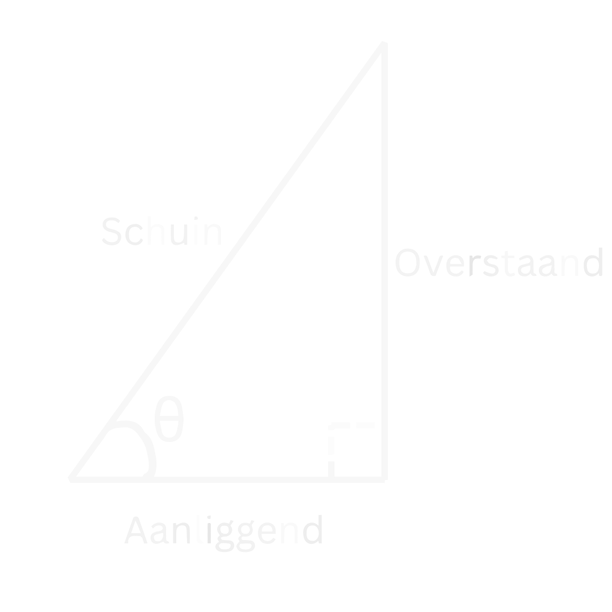
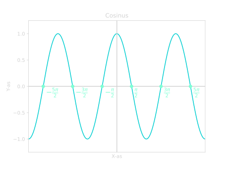

# *Goniometrie*
Goniometrie gaat vooral over driehoeken en wat we daar allemaal mee kunnen berekenen. We kunnen de goniometrische functies gebruiken om hiermee te helpen. We gebruiken ze als we een hoek en een zijde hebben van een rechthoekige driehoek. We kunnen dan de andere twee zijdes berekenen met de goede goniometrische functie. Dit is erg handig, want met [Pythagoras](pythagoras.md) kunnen we dit niet doen. 

Er zijn drie soorten goniometrische functies die we vaak gebruiken. De **sinus**, de **cosinus** en de **tangens**. Welke functie we gebruiken is afhankelijk van wat we hebben en wat we willen berekenen. Hieronder zie je het verband tussen de functies en de zijdes van een rechthoekige driehoek.

???+ Belangrijk
    ## **De Goniometrische Functies**
    $$\large{\sin(\theta) = \frac{\mathrm{Overstaand}}{\mathrm{Schuin}}}$$

    $$\large{\cos(\theta) = \frac{\mathrm{Aanliggend}}{\mathrm{Schuin}}}$$

    $$\large{\tan(\theta) = \frac{\mathrm{Overstaand}}{\mathrm{Aanliggend}}}$$

Dit kan je onthouden met het ezelsbruggetje: "SOS CAS TOA". Dit kun je als volgt begrijpen:

- SOS: <u>S</u>inus is <u>O</u>verstaand gedeelt door <u>S</u>chuin.
- CAS: <u>C</u>osinus is <u>A</u>anliggend gedeelt door <u>S</u>chuin.
- TOA: <u>T</u>angens is <u>O</u>verstaand gedeelt door <u>A</u>anliggend.

??? note "Overstaand, Aanliggend en Schuin"
    *Overstaand*, *Aanliggend* en *Schuin* gaan over de verschillende zijdes van een rechthoekige driehoek. Dit is altijd bepaald ten opzichte van de hoek waar je naar kijkt. Dus in Figuur 1 kijken we ten opzichte van de hoek $\theta$. 
    
    Vanuit deze hoek $\theta$ bepalen we welke de overstaande zijde is en welke de aanliggende. De schuine zijde is altijd hetzelfde voor een rechthoekige driehoek. Dus dan maakt het niet uit vanaf welke hoek je kijkt.

    <figure markdown>
        { width="250"}
    </figure>
    *
Figuur 1. Een rechthoekige driehoek met de overstaande, aanliggende en schuine zijdes aangegeven.
*  

    De kenmerken van de verschillende soorten zijdes:
    
    - **Schuine zijde:** De zijde tegenover de hoek van $90 ^{\circ}$. Het is ook de langste zijde van de rechthoekige driehoek.
    - **Aanliggende zijde:** De andere zijde die samen met de schuine zijde de hoek $\theta$ maakt.
    - **Overstaande zijde:** De zijde tegenover de hoek $\theta$.

### **Zijdes Bepalen**

Laten we naar een voorbeeld kijken. In Figuur 2 hieronder hebben we een rechthoekige driehoek gegeven gekregen. 

<figure markdown>
{ width="300" align=middle}
</figure>
*
Figuur 2. Een rechthoekige driehoek met de hoek $\theta$ en de punten $A$, $B$ en $C$.
*  

Stel we willen zijde $BC$ bepalen en we weten dat $\theta = 60 ^{\circ}$ en $AB = 2$. Hoe pakken we dit dan aan?

Zoals we eerder zagen, kunnen we dit probleem niet oplossen met [Pythagoras](pythagoras.md). Hiervoor hebben we de goniometrische funties nodig. Maar welke moeten we gebruiken, de sinus, cosinus of de tangens? 

We hebben de hoek $\theta$ en de zijde $AB$. Dit is de overstaande zijde, want het is de zijde tegenover hoek $\theta$. Verder willen we zijde $BC$ weten. Dit is de aanliggende zijde, want het maakt samen met de schuine zijde de hoek $\theta$.

We zoeken dus een functie die iets met een overstaande en aanliggende zijde heeft. We kunnen bij de [goniometrische functies](#de-goniometrische-functies) zien dat we dus de **tangens** moeten gebruiken. Deze functie heeft namelijk beide zijdes die we willen. Laten we als eerst de tangens opschrijven:

$$\tan(\theta) = \frac{\mathrm{Overstaand}}{\mathrm{Aanliggend}}$$

De overstaande zijde is dus $BC$ en de aanliggende is $AB$:

$$\tan{(\theta)} = \frac{BC}{AB}.$$

Nu kunnen we dit [omschrijven](basisvaardigheden.md#formules-omschrijven) om $BC$ vrij te maken:

$$BC = AB \cdot \tan{(\theta)}.$$

Laten we nu de gegevens invullen die we hebben:

$$BC = 2 \cdot \tan{(60 ^{\circ})}.$$

Als we dit in een rekenmachine stoppen, dan vinden we:

!!! quote ""
    $$\large{BC \approx 3.46}$$

We kunnen in Figuur 2 controleren dat dit antwoord best zou kunnen kloppen.

### **Hoeken Bepalen**
We kunnen de [goniometrische functies](#de-goniometrische-functies) ook gebruiken om een hoek te bepalen. We hebben daarvoor $2$ zijdes van de rechthoekige driehoek nodig. 

We gebruiken dan de inverse van de goniometrische functie. Dit noteren we dan met een *arc* of met een $^{-1}$. 

???+ Belangrijk
    $$\large{\sin(\theta) = \frac{\mathrm{Overstaand}}{\mathrm{Schuin}} \iff \theta = \arcsin \! \left(\frac{\mathrm{Overstaand}}{\mathrm{Schuin}}\right)}$$

    $$\large{\cos(\theta) = \frac{\mathrm{Aanliggend}}{\mathrm{Schuin}} \iff \theta = \arccos \! \left(\frac{\mathrm{Aanliggend}}{\mathrm{Schuin}}\right)}$$

    $$\large{\tan(\theta) = \frac{\mathrm{Overstaand}}{\mathrm{Aanliggend}} \iff \theta = \arctan \! \left(\frac{\mathrm{Overstaand}}{\mathrm{Aanliggend}}\right)}$$

??? note "Notatie van de inverse goniometrische functies"
    Op een rekenmachine worden de inverse functies aangegeven met een $^{-1}$. Dus:
    
    - $\large{\sin^{-1}(x)}$
    - $\large{\cos^{-1}(x)}$
    - $\large{\tan^{-1}(x).}$
    
    Maar we raden het af om het zo op te schrijven, omdat dit verwarring kan opleveren. Want
    
    $$\Large{\sin^{-1}(x) \neq \frac{1}{\sin(x)}}$$
    
    De inverse betekent hier dus <u>**niet**</u> dat we $1$ gedeelt door de functie moeten doen. Maar bij $x^{-1}$ is dit juist wel het geval. Dit kan verwarrend zijn, dus om dit te vermijden schrijven wij de inverse van $\sin(x)$ als $\arcsin(x)$ op.

Laten we naar een voorbeeld kijken om te zien hoe dit werkt. In Figuur 3 hebben we een rechthoekige driehoek met zijdes $BC = 2$ en $AB = 2$. 

<figure markdown>
{ width="250"}
</figure>
*
Figuur 3. Een rechthoekige driehoek met zijdes $BC = 2$ en $AB = 2$.
*  

We willen nu de hoek $\theta$ bepalen. Om dit te doen, kijken we als eerst naar welke zijdes we hebben. 

We hebben de zijde $BC$ als overstaande zijde. Dit kunnen we herkennen aan het feit dat de zijde niet is verbonden met de hoek $\theta$. We hebben ook zijde $AB$ als aanliggende zijde. Dit weten we omdat het samen met de schuine zijde de hoek $\theta$ maakt. En $AB$ is niet de schuine zijde, want de schuine zijde is de zijde tegenover de $90 ^{\circ}$ hoek. 

We hebben dus de overstaande en de aanliggende zijde. Dit betekent dus dat we de **tangens** moeten gebruiken:

$$\tan(\theta) = \frac{\mathrm{Overstaand}}{\mathrm{Aanliggend}}$$

$$\tan(\theta) = \frac{BC}{AB}$$

Als we nu $BC = 2$ en $AB = 2$ invullen:

$$\tan(\theta) = \frac{2}{2}$$

$$\tan(\theta) = 1$$

Dus we weten dat de tangens van $\theta$ gelijk is aan $1$. We kunnen nu $\theta$ bepalen door de $\arctan$ te nemen:

$$\theta = \arctan(1)$$

Als we dit in onze rekenmachine stoppen (dus $\tan^{-1}(1)$), dan vinden we:

$$\theta = 45 ^{\circ}$$

En als we kijken in Figuur 3, dan kunnen we controleren dat dit een logisch antwoord is. Het ziet er namelijk ook uit als de helft van een rechte ($90 ^{\circ}$) hoek.

### **Voorbeelden**
??? example "Voorbeeld 1: Bereken zijde $BC$"
    **
Bereken zijde $BC$ in de onderstaande rechthoekige driehoek.
**

    <figure markdown>
        { width="300"}
    </figure>
    *
Figuur 4. Een rechthoekige driehoek met een hoek $\theta = 30 ^{\circ}$ en een zijde $AC = 4$.
*  

    **
Uitwerking
**

    We hebben dus de hoek $\theta=30 ^{\circ}$ en een zijde $AC = 4$. Zijde $AC$ is de schuine zijde, want het is de zijde tegenover de hoek van $90 ^{\circ}$. We willen zijde $BC$ bepalen en dat is de overstaande zijde. $BC$ is namelijk de zijde tegenover $\theta$.

    Dus onze functie moet iets met een schuine zijde hebben en iets met een overstaande zijde. Als we bij de [goniometrische functies](#de-goniometrische-functies) kijken, dan zien we dat we de **sinus** moeten gebruiken. Laten we deze opschrijven:

    $$\large{\sin(\theta) = \frac{\mathrm{Overstaand}}{\mathrm{Schuin}}}$$

    We weten dus dat $AC$ de schuine zijde is en $BC$ de overstaande:

    $$\large{\sin(\theta) = \frac{BC}{AC}}$$

    We willen $BC$ bepalen, dus laten we die vrij maken. We moeten dus de formule gaan [omschrijven](basisvaardigheden.md#formules-omschrijven):

    $$\large{BC = AC \cdot \sin(\theta)}$$

    Als we nu $AC = 4$ en $\theta = 30 ^{\circ}$ invullen:

    $$\large{BC = 4 \cdot \sin(30 ^{\circ})}$$

    Als we dit in een rekenmachine stoppen, dan vinden we:

    !!! quote ""
        $$\large{BC = 2}$$

    En als we dit controleren in Figuur 4, dan kunnen we zien dat dit een logisch antwoord is.

??? example "Voorbeeld 2: Bepaal de hoek $\theta$"
    **
Bepaal de hoek $\theta$ in de onderstaande rechthoekige driehoek.
**

    <figure markdown>
        { width="300"}
    </figure>
    *
Figuur 5. Een rechthoekige driehoek met zijdes $AC = 4$ en $AB = 3$.
*  

    **
Uitwerking
**

    We moeten de hoek $\theta$ bepalen, dus laten we eerst kijken naar welke zijdes we hebben. Zijde $AC$ is de schuine zijde, want het is de zijde tegenover de rechte hoek. Dat betekent dat $AB$ de aanliggende zijde is, want samen met de schuine zijde $AC$ maken ze $\theta$. 

    Dus we hebben de schuine en aanliggende zijde. Dit betekent dat we de **cosinus** moeten gebruiken:

    $$\large{\cos(\theta) = \frac{\mathrm{Aanliggend}}{\mathrm{Schuin}}}$$

    We vullen dus $AB$ in als aanliggende zijde en $AC$ als schuine zijde:

    $$\large{\cos(\theta) = \frac{AB}{AC}}$$

    We weten dat $AB = 3$ en $AC = 4$:

    $$\large{\cos(\theta) = \frac{3}{4}}$$

    Om de hoek te bepalen, nemen we de $\arccos$:

    $$\large{\theta = \arccos(\frac{3}{4})}$$

    Als we dit invullen op onze rekenmachine (dus $\cos^{-1}(\frac{3}{4})$), dan vinden we:

    $$\large{\theta = 41.41... ^{\circ}}$$

    Graden ronden we af op $1$ decimaal, dus ons eindantwoord wordt dan:

    !!! quote ""
        $$\large{\theta \approx 41.4 ^{\circ}}$$

    Voor VMBO is dit op gehele getallen:
    
    !!! quote ""
        $$\large{\theta \approx 41 ^{\circ}}$$

??? example "Voorbeeld 3: Bepaal de hoek $\theta$ en zijde $AB$"
    **
Bepaal de hoek $\theta$ in de onderstaande rechthoekige driehoek.
**

    <figure markdown>
        { width="300"}
    </figure>
    *
Figuur 6. Een rechthoekige driehoek met zijdes $AC = 8$ en $BC = 6$.
*  

    **
Uitwerking
**

    We willen de hoek $\theta$ en de zijde $AB$ bepalen, dus laten we als eerst beginnen met $\theta$.

    We hebben de zijdes $BC$ en de zijdes $AC$ gegeven. Zijde $BC$ is de overstaande zijde, want het is de zijde tegenover de hoek $\theta$. 

    Om te bepalen welke zijde $AC$ is, moeten we goed opletten. De zijde tegenover de rechte hoek is de schuine zijde. In dit geval is dat zijde $AB$. Dit betekent dus dat zijde $AC$ de aanliggende zijde is, want samen met de schuine zijde maken ze $\theta$.

    We hebben dus de overstaande en de aanliggende zijde, dus moeten we de **tangens** gebruiken:

    $$\tan(\theta) = \frac{\mathrm{Overstaand}}{\mathrm{Aanliggend}}$$

    We weten dus dat de overstaande zijde $BC$ is en de aanliggende $AC$:

    $$\tan(\theta) = \frac{BC}{AC}$$

    Nu kunnen we $BC = 6$ en $AC = 8$ invullen:

    $$\tan(\theta) = \frac{6}{8} = \frac{3}{4}$$

    Om $\theta$ te bepalen, kunnen we de $\arctan$ nemen:

    $$\large{\theta = \arctan(\frac{3}{4})}$$

    Als we dit invullen in onze rekenmachine (dus $\tan^{-1}(\frac{3}{4})$), dan vinden we:

    $$large{\theta = 36.869...}$$

    Graden ronden we af op $1$ decimaal, dus ons eindantwoord wordt:

    !!! quote ""
        $$\large{\theta = 36.9 ^{\circ}}$$

    Voor VMBO is dit op gehele getallen:

    !!! quote ""
        $$\large{\theta = 37 ^{\circ}}$$

    Nu willen we zijde $AB$ bepalen. We kunnen dit op meerdere manieren doen. We kunnen dit berekenen met de **sinus**, **cosinus** of met [Pythagoras](pythagoras.md). Wij kiezen er hier voor om het met de **sinus** te berekenen. Maar voel je vrij om de andere methodes te proberen om te kijken of je het beheerst!

    Voor de sinus hebben we iets met de overstaande en de schuine zijde:

    $$\large{\sin(\theta) = \frac{\mathrm{Overstaand}}{\mathrm{Schuin}}}$$

    We hebben net gezien dat de overstaande zijde $BC$ is en $AB$ de schuine zijde:

    $$\large{\sin(\theta) = \frac{BC}{AB}}$$

    We moeten nu deze formule [omschrijven](basisvaardigheden.md#formules-omschrijven) om AB vrij te maken:

    $$\large{AB \cdot \sin(\theta) = BC}$$

    $$\large{AB = \frac{BC}{\sin(\theta)}}$$

    Nu vullen we $\theta = 36.869...$ en $BC = 6$:

    $$\large{AB = \frac{6}{\sin(36.869... ^{\circ})}}$$

    Zorg er dus voor dat je $\theta$ niet tussendoor afrond, want dan krijg je ook een (iets) ander antwoord. Als we dit invullen op onze rekenmachine, dan vinden we:

    !!! quote ""
        $$\large{AB = 10}$$

## **De Sinus en Cosinus functies**
Laten we nu iets dieper ingaan op de **sinus** en **cosinus** functies. Wat deze functies bijzonder maakt, is dat het periodieke functies zijn. Dit betekent dat de functie zich herhaalt na een bepaalde tijd. In dit geval is dat elke $2 \pi$. Dus elke $2 \pi$ begint de functie weer opnieuw en herhaalt het zich weer. We zeggen dan dat deze functie een periode heeft van $2 \pi$ (zie ook Figuur 7 en Figuur 8). 

??? note "Graden vs Radialen"
    In de meetkunde gebruiken we vaak graden. Maar als we meer gaan kijken naar de goniometrische functies zelf en hun vorm, dan zijn radialen vaak handiger. 

    Radialen is een eenheid voor hoeken, net zoals graden. Radialen gaan niet van $0$ tot $360 ^{\circ}$, maar van $0$ tot $2 \pi$. We kiezen voor $2 \pi$ als eindpunt omdat dit de omtrek is van een cirkel met straal $1$. Dus als we $1$ rondje doen, hebben we $2 \pi$ afgelegd, $2$ rondjes hebben we $4 \pi$ afgelegd, $3$ rondjes $6 \pi$ enzovoort. Een half rondje is dan $\pi$ of $180 ^{\circ}$.

    We kunnen van radialen naar graden omrekenen en andersom:

    Om van graden naar radialen te gaan doen we:

    - Graden naar Radialen: $\large{\quad \theta_{grad} \cdot \Large \frac{2 \pi}{360 ^{\circ}} \large = \theta_{rad}}$
    - Radialen naar Graden: $\large{\quad \theta_{rad} \cdot \Large \frac{360 ^{\circ}}{2 \pi} \large = \theta_{grad}}$

<figure markdown>
  { width="500"}
    <figcaption>Figuur 7. De sinus functie over een domein van $[-3 \pi, 3 \pi]$. Je kan zien dat bij elke $2 \pi$ de functie weer begint op hetzelfde punt (stijgend bij $y=0$).</figcaption>
</figure>

<figure markdown>
  { width="500"}
    <figcaption>Figuur 8. De cosinus functie over een domein van $[-3 \pi, 3 \pi]$. Je kan zien dat de functie zich na elke $2 \pi$ herhaald. Dus de punten $\large \frac{5}{2} \pi$ en $\large - \frac{3}{2} \pi$ zijn hetzelfde als het punt $\large \frac{1}{2} \pi$.</figcaption>
</figure>

???+ Belangrijk
    ### **Periodiciteit van Sinus en Cosinus**
    Het feit dat de functie zich herhaald kunnen we ook terug zien in de functie zelf:

    $$\large{\sin(x + 2 \pi) = \sin(x)}$$

    $$\large{\cos(x + 2 \pi) = \cos(x)}$$

    Dus dit betekent bijvoorbeeld dat:

    - $\large \sin(\pi) = \sin(3 \pi)$
    - $\large \cos(1 \frac{1}{2}) = \cos(- \frac{1}{2} \pi)$
    - $\large \cos(4 \pi) = \cos(6 \pi)$
    - $\large \sin(- \frac{1}{4} \pi) = \sin(1 \frac{3}{4} \pi)$
    - etc.

### **Sinus en Cosinus vergelijkingen**

Het feit dat deze functies periodiek zijn, is erg belangrijk als we er vergelijkingen mee gaan oplossen. Laten we kijken hoe dat moet.

Stel we willen de volgende vergelijking oplossen:

$$\sin(x) = 0.$$

Hoe doen we dat? We willen dus kijken waar de **sinus** functie een $y$-waarde heeft van $0$. In Figuur 7 kunnen we aflezen dat dit geldt bij $x=0$, maar ook bij andere $x$-waardes. Namelijk $x = -2 \pi$, $x = -\pi$, $x = \pi$ en $x = 2 \pi$. En deze functie gaat oneindig lang door, dus dit blijft maar zo door gaan. Hoe noteren we dit wiskundig? 

We schrijven dit als volgt op:

!!! quote ""
    $$\large{x = k \cdot \pi}$$

En $k$ is hier een geheel getal. Dus $k = 0, \pm 1, \pm 2, \pm 3, ...$ 

De waardes van $k$ gaan oneindig lang door, en dat is ook wat we willen om onze oplossingen te beschrijven. Maar stel nou dat we alle oplossingen willen weten in het domein $[0, 2 \pi]$. Hoe doen we dat dan met de oplossing die we net hebben gevonden?

We moeten dan alle mogelijke waardes voor $k$ proberen die ons een $x$ geeft binnen het domein van $[0, 2\pi]$. Dus welke waardes van $k$ moeten we invullen in $x = k \cdot \pi$ om een $x$ te krijgen tussen $0$ en $2 \pi$?

Dit zijn de waardes $k = 0$, $k = 1$ en $k = 2$. Want als we $k = 3$ proberen, dan krijgen we $x = 3 \pi$ en dit is te groot. Als we aan de andere kant $k = -1$ proberen, dan krijgen we $x = -\pi$ en dit is weer te klein. Dus de oplossingen in het domein $[0, 2 \pi]$ worden:

!!! quote ""
    $$\large{x = 0 \ \vee \ x = \pi \ \vee \ x = 2 \pi}$$

Laten we naar een ander voorbeeld kijken. Stel we willen nu de volgende vergelijking oplossen:

$$\cos{(x)} = 1.$$

Hoe doen we dit? We moeten dus kijken voor welke $x$-waardes de cosinus een $y$-waarde heeft van $1$. In Figuur 8 kunnen we zien dat dit is bij $x = 0$. Maar ook bij $x = -2\pi$ en bij $x = 2\pi$. De functie herhaalt zich steeds, dus dit patroon herhaalt zich ook. Onze oplossing wordt dus:

!!! quote ""
    $$\large{x = k \cdot 2\pi}$$

$k$ is hier weer een geheel getal. Dus de oplossingen in het domein $[0, 2 \pi]$ worden dan:

!!! quote ""
    $$\large{x = 0 \ \vee \ x = 2 \pi}$$

Dit is dus voor $k = 0$ of $k = 1$. Als we andere waardes voor $k$ proberen, dan is $x$ niet meer tussen $0$ en $2 \pi$. Dus $x = 0$ en $x = 2 \pi$ moeten de enige twee oplossingen zijn in het domein $[0, 2 \pi]$.

We hebben dit opgelost door de functies te schetsen, maar kunnen we het ook oplossen zonder een schets? Het antwoord is ja! Om goed te begrijpen hoe dit moet, moeten we eerst kijken naar de symmetrie in de sinus en cosinus functies. 

### **Symmetrie**
De cosinus is gespiegeld in de $y$-as (zie eventueel Figuur 8). Dus alles links van de $y$-as is hetzelfde als rechts van de $y$-as. Links van de $y$-as is bij een negatieve $x$, rechts van de $y$-as is bij een positieve $x$. Dus met andere woorden:

$$\boxed{\cos(-x) = \cos(x)}$$

Bij de sinus is dit juist omgekeerd. Het is niet gespiegeld in de $y$-as, maar gespiegeld bij de oorsprong (zie eventueel Figuur 7). Dus alles dat rechts van de $y$-as positief is, wordt negatief links van de $y$-as. Andersom geldt dit natuurlijk ook. Dit betekent dus dat er geldt dat:

$$\boxed{\sin(-x) = - \sin(x)}$$

???+ video
    <video controls>
    <source src="../assets/videos/Sin.mp4" type="video/mp4">
    </video>

    *
Filmpje: Een sinus functie wordt aangepast om te bewijzen dat $\sin(x) = \sin(\pi - x)$. Eerst wordt de transformatie $\sin(x) \rightarrow \sin(-x)$ toegepast. Vervolgens wordt deze functie naar rechts verschoven met $\pi$. Deze nieuwe functie wordt beschreven door $\sin(\pi - x)$ en we zien dat dit precies hetzelfde is als onze oude functie $\sin(x)$.
*

???+ video
    <video controls>
    <source src="../assets/videos/Cos.mp4" type="video/mp4">
    </video>

    *
Filmpje: Een cosinus functie wordt aangepast om te bewijzen dat $-\cos(x) = \cos(\pi - x)$. Eerst verandert de $\cos(x)$ naar $-\cos(x)$ en tegelijkertijd wordt laten zien dat $\cos(x) = \cos(-x)$. Daarna wordt de $\cos(-x)$ functie naar rechts verschoven met $\pi$. Deze verplaatste functie wordt beschreven door $\cos(\pi - x)$ en dit is precies hetzelfde als $- \cos(x)$.
*

???+ Belangrijk
    ### **Symmetrieformules**
    
    1. $$\large{\sin(-x) = - \sin(x)}$$

    2. $$\large{\cos(-x) = \cos{(x)}}$$

    3. $$\large{\sin(\pi - x) = \sin(x)}$$

    4. $$\large{\cos(\pi - x) = - \cos(x)}$$
    

???+ Belangrijk
    ### **Oplossen van sin/cos vergelijkingen**

    Een vergelijking van de vorm:

    $$\large{\sin(x) = \sin(a)}$$

    geeft de volgende oplossingen:

    $$\large{x = a + k \cdot 2 \pi \ \vee \ x = \pi - a + k \cdot 2 \pi}$$

    Een vergelijking van de vorm:

    $$\large{\cos(x) = \cos(a)}$$

    geeft de volgende oplossingen:

    $$\large{x = a + k \cdot 2 \pi \ \vee \  x = - a + k \cdot 2 \pi}$$

    Hier is $k$ een geheel getal, dus $k$ is:

    $$\large{k = 0, \pm 1, \pm 2, \pm 3, ...}$$

Om een vergelijking met een sinus of cosinus op te lossen, moeten we aan beide kanten dezelfde functie hebben. Dus aan beide kanten van het '$=$'-teken een sinus of aan beide kanten een cosinus. Dus bij de vergelijking:

$$\sin(x) = 1,$$

moeten we de $0$ als een sinus functie opschrijven. We kunnen in Figuur 7 (of later de [Eenheidscirkel](#de-eenheidscirkel)) aflezen dat $\sin(\frac{1}{2} \pi) = 1$. Dus we kunnen de vergelijking schrijven als:

$$\sin(x) = \sin(\frac{1}{2} \pi)$$

En nu kunnen we aan beide kanten de sinus weghalen.

De cosinus functie is eigenlijk hetzelfde als de sinus functie, alleen is het $\frac{1}{2} \pi$ opgeschoven naar rechts. In formule form wordt dit dan:

???+ Belangrijk
    ### **Sinus en Cosinus omschrijven**

    1. $$\large{\sin{(x)} = \cos{(x - \frac{1}{2} \pi)}}$$

    2. $$\large{\cos{(x)} = \sin{(x + \frac{1}{2} \pi)}}$$

     
    **
Alternatieve manier
**

    Als je niet wilt onthouden bij welke functie je $+ \frac{1}{2} \pi$ doet, en bij welke je $- \frac{1}{2} \pi$, kan je het ook op de volgende manier omschrijven:

    1. $$\large{\sin{(x)} = \cos{(\frac{1}{2} \pi - x)}}$$

    2. $$\large{\cos{(x)} = \sin{(\frac{1}{2} \pi - x)}}$$

    En dit verband werkt ook altijd.

    ??? abstract "Bewijs"
        Dit kunnen we zelf bewijzen met behulp van de [Symmetrieformules](#symmetrieformules). 
        
        Laten we eerst kijken om van $\sin$ naar $\cos$ te gaan. Als we [regel 2](#symmetrieformules) gebruiken zien we het eigenlijk al meteen:

        $$\large{\cos{(x - \frac{1}{2} \pi)} = \cos{(-(x - \frac{1}{2} \pi))} = \cos{(\frac{1}{2} \pi - x)}}$$

        Nu kijken we om van $\cos$ naar $\sin$ te gaan. Hiervoor gebruiken we [regel 4](#symmetrieformules):

        $$\large{\sin{(x + \frac{1}{2} \pi)} = \sin{(\pi - (x + \frac{1}{2} \pi))} = }$$

        $$\large{\sin{(\pi - \frac{1}{2} \pi - x)} = \sin{(\frac{1}{2} \pi - x)}}$$

### **Voorbeelden**
??? example "Voorbeeld 1: $\cos{(2x)} = 0$"
    **
Bereken x: $\cos{(2x)} = 0$
**
    **
Uitwerking
**

    We lossen dit op door eerst van de $0$ een $\cos$ te maken. In dit geval kunnen we in Figuur 3 of met de [Eenheidscirkel](#de-eenheidscirkel) zien dat dit geldt bij $\cos{(\frac{1}{2} \pi)}$.

    We kunnen dus zeggen dat:

    $$\large{\cos{(2x)} = \cos{(\frac{1}{2} \pi)}}$$

    En dus kunnen we zeggen dat (zie [uitwerken sin/cos](#uitwerken-sincos-vergelijkingen)):

    $$\large{2x = \frac{1}{2} \pi + k * 2 \pi \ \vee \ 2x = - \frac{1}{2} \pi + k *2 \pi}$$

    En nu delen we alles door $2$ om te vinden dat:

    !!! quote ""
        $$\large{x = \frac{1}{4} \pi + k * \pi \ \vee \ x = - \frac{1}{4} \pi + k * \pi}$$

??? example "Voorbeeld 2: $\sin{(3x)} = \cos{(-x)}$"
    **
Bereken x: $\sin{(3x)} = \cos{(-x)}$
**
    **
Uitwerking
**

    Als eerst beginnen we met het realiseren dat we dit ook kunnen schrijven als:

    $$\large{\sin{(3x)} = \cos{(x)},}$$

    zie de [Symmetrieformules](#symmetrieformules). Nu moeten we de $\cos$ omschrijven naar een $\sin$ (of andersom). Dit doen we met [deze](#sinus-en-cosinus-omschrijven) regel:

    $$\large{\sin{(3x)} = \sin{(x + \frac{1}{2} \pi)}.}$$

    Nu kunnen we dit uitwerken (zie [uitwerken sin/cos](#uitwerken-sincos-vergelijkingen)):

    $$\large{3x = x + \frac{1}{2} \pi + k * 2 \pi \ \vee \ 3x = \pi - (x + \frac{1}{2} \pi + k * 2 \pi)}$$

    $$\large{3x = x + \frac{1}{2} \pi + k * 2 \pi \ \vee \ 3x = \frac{1}{2} \pi - x + k * 2 \pi}$$

    Nu doen we alle termen met $x$ naar de linkerkant:

    $$\large{2x = \frac{1}{2} \pi + k * 2 \pi \ \vee \ 4x = \frac{1}{2} \pi + k * 2 \pi}$$

    Nu delen we alles door $2$ en $4$ respectievelijk om te vinden:
    
    !!! quote ""
        $$\large{x = \frac{1}{4} \pi + k * \pi \ \vee \ x = \frac{1}{8} \pi + k * \frac{1}{2} \pi}$$

??? example "Voorbeeld 3: $\cos{(3x + \pi)} = \cos{(x + \frac{1}{2} \pi)}$ op het interval $[0, \ 2 \pi]$"
    **
Bereken x: $\cos{(3x + \pi)} = \cos{(x + \frac{1}{2} \pi)}$ op het interval $[0, \ 2 \pi]$
**
    **
Uitwerking
**

    We hebben hier aan beide kanten al iets met $\cos$ staan, dus we kunnen dit meteen gaan uitwerken:

    $$\large{3x + \pi = x + \frac{1}{2} \pi + k * 2 \pi \ \vee \ 3x + \pi = - (x + \frac{1}{2} \pi) + k * 2 \pi}$$

    $$\large{3x + \pi = x + \frac{1}{2} \pi + k * 2 \pi \ \vee \ 3x + \pi = - x - \frac{1}{2} \pi + k * 2 \pi}$$

    Nu alle termen met $x$ naar de linkerkant en alle getallen rechts:

    $$\large{2x = - \frac{1}{2} \pi + k * 2 \pi \ \vee \ 4x = - 1 \frac{1}{2} \pi + k * 2 \pi}$$

    En nu alles gedeelt door $2$ en $4$ respectievelijk:

    $$\large{x = - \frac{1}{4} \pi + k * \pi \ \vee \ x = - \frac{3}{8} \pi + k * \frac{1}{2} \pi}$$

    Maar let op! Nu wordt er gevraagd naar alle oplossingen op het interval $[0, \ 2 \pi]$. Dit betekent dat we alle verschillende waardes voor $k$ moeten invullen totdat we alle verschillende waardes tussen $0$ en $2 \pi$ gehad hebben.

    |  | Linker vergelijking | Rechter vergelijking |    
    | - | - | - |    
    | $\large{k = 0}$ | $\large{x = - \frac{1}{4} \pi}$ | $\large{x = - \frac{3}{8} \pi}$ |    
    | $\large{k = 1}$ | $\large{x = \frac{3}{4} \pi}$ | $\large{x = \frac{1}{8} \pi}$ |
    | $\large{k = 2}$ | $\large{x = 1 \frac{3}{4} \pi}$ | $\large{x = \frac{5}{8} \pi}$ |
    | $\large{k = 3}$ | $\large{x = 2 \frac{3}{4} \pi}$ | $\large{x = 1 \frac{1}{8} \pi}$ |
    | $\large{k = 4}$ | $\large{x = 3 \frac{3}{4} \pi}$ | $\large{x = 1 \frac{5}{8} \pi}$  |
    | $\large{k = 5}$ | $\large{x = 4 \frac{3}{4} \pi}$ | $\large{x = 2 \frac{1}{8} \pi}$ |

    Uit deze waardes noteren we alle waardes voor $x$ die op het interval liggen. Dat zijn de waardes bij $k = 1$ en $k = 2$ bij de linker vergelijking en de waardes bij $k = 1,2,3,4$ bij de rechter vergelijking. Ons eindantwoord wordt dan:

    !!! quote ""
        $\Large{x = \frac{1}{8} \pi \ \vee \ x = \frac{5}{8} \pi \ \vee \ x = \frac{3}{4} \pi \ \vee \ x = 1 \frac{1}{8} \pi \ \vee \ x = 1 \frac{5}{8} \pi \ \vee \ x = 1 \frac{3}{4} \pi}$

## **De Eenheidscirkel**
De eenheidscirkel is een manier om de verschillende waardes van $\sin$ en $\cos$ te bepalen bij verschillende hoeken. De eenheidscirkel is een cirkel met een straal van $1$, vandaar dat het de eenheidscirkel wordt genoemt. In het onderstaande filmpje wordt de eenheidscirkel geschetst en wordt er kort een trucje vertelt hoe je de waardes kan achterhalen van $\sin$ en $\cos$ bij verschillende hoeken door alleen maar $3$ hoeken en $3$ bijbehorende waardes te onthouden.

???+ video
    <video controls>
    <source src="../assets/videos/UnitCircle.mp4" type="video/mp4">
    </video>

    *
Filmpje: Een schets van de eenheidscirkel met de verschillende cosinus en sinus waardes bij verschillende hoeken. De x-coördinaten zijn de cosinus waardes en de y-coördinaten zijn de sinus waardes.
*

Laten we eerst kijken hoe we de eenheidscirkel kunnen gebruiken.

<figure markdown>
  { width="1000"}
    <figcaption>Figuur 4. De eenheidscirkel. De hoeken zijn in het blauw weergegeven. De sinus van de hoek is het $y$-coördinaat, en de cosinus van de hoek is het $x$-coördinaat (zie eventueel de opmerking hieronder voor toelichting).</figcaption>
</figure>

Stel dus dat we bijvoorbeeld er achter willen komen wat $\sin{(\frac{1}{3} \pi)}$ is. Als we de eenheidscirkel bij de hand hebben, kunnen we daar kijken en dan zien we dat bij een hoek van $\frac{1}{3} \pi$, het coördinaat $\left(\frac{1}{2}, \frac{1}{2} \sqrt{3} \right)$ hoort. We willen de sinus weten en dus moeten we het $y$-coördinaat gebruiken. Onze eindconclusie wordt dan:

$$\large{\sin{(\frac{1}{3} \pi)} = \frac{1}{2} \sqrt{3}}.$$

??? note "Opmerking: $x$-coördinaat hoort bij cosinus, $y$-coördinaat hoort bij sinus."
    Hiervoor wordt er gezegd dat het $x$-coördinaat bij de cosinus hoort en dat het $y$-coördinaat bij de sinus hoort. Maar hoezo is dit het geval? Dat wordt hieronder laten zien. 

    <figure markdown>
      { width="300"}
      <figcaption>Figuur 5. Eenheidscirkel met daarin een driehoek getekent met een bepaalde hoek θ.</figcaption>
    </figure>

    In Figuur 6 is er een driehoek getekent bij de hoek $\theta$. Hier is zijde $b$ onze overstaande zijde en zijde $a$ onze aanliggende zijde. Merk op dat lengte $a$ het $x$-coördinaat is van ons punt dat op de eenheidscirkel ligt, en lengte $b$ het $y$-coördinaat. We weten ook dat volgens onze [Goniometrische Regels](#regels-goniometrische-functies) dat er geldt dat:

    $$\large{\sin{(\theta)} = \frac{\mathrm{Overstaand}}{\mathrm{Schuin}},}$$

    $$\large{\cos{(\theta)} = \frac{\mathrm{Aanliggend}}{\mathrm{Schuin}},}$$

    en dus in dit geval:

    $$\large{\sin{(\theta)} = \frac{b}{c},}$$

    $$\large{\cos{(\theta)} = \frac{a}{c}.}$$

    Maar doordat dit een eenheidscirkel is, betekent het dat de cirkel een straal van $1$ heeft, en dus dat $c = 1$. Onze $\sin$ en $\cos$ wordt dan:

    $$\large{\sin{(\theta)} = b,}$$

    $$\large{\cos{(\theta)} = a.}$$

    En omdat we net zeiden dat lengte $a$ ons $x$-coördinaat is en lengte $b$ ons $y$-coördinaat, kunnen we zeggen dat:

    !!! quote ""
        $$\large{\sin{(\theta)} = x\mathrm{-coordinaat}}$$

        $$\large{\cos{(\theta)} = y\mathrm{-coordinaat}}$$

Maar we hebben niet altijd de eenheidscirkel bij de hand en is het dus handig om de eenheidscirkel te onthouden. Om niet alles te hoeven onthouden, kan het volgende trucje handig zijn.

### **Trucje om de Eenheidscirkel te Onthouden**
We onthouden de volgende waardes en hoeken en de volgorde van klein naar groot:

???+ Belangrijk
    Hoeken:

    $$\large{\frac{1}{6} \pi < \frac{1}{4} \pi <\frac{1}{3} \pi}$$

    Waardes:

    $$\large{\frac{1}{2} < \frac{1}{2} \sqrt{2} < \frac{1}{2} \sqrt{3}}$$

Nu kunnen we bepalen wat de waardes zijn door steeds bij elk kwart van de cirkel te kijken naar de voortgang van het begin punt van de kwart cirkel en het eindpunt. Dus hoe groter de hoek, hoe meer voortgang. Laten we weer kijken naar $\sin{(\frac{1}{3} \pi)}$.

We hebben de hoek $\theta = \frac{1}{3} \pi$ en dit is de grootste hoek uit de lijst van de $3$ hoeken. Dit betekent dus er de meeste voortgang is gemaakt van het begin punt naar het eindpunt. In dit geval is het begin punt van de kwart cirkel $(1, 0)$ en het eindpunt $(0, 1)$. Omdat er de meeste voortgang is gemaakt, moeten de waardes het dichtst bij het eindpunt zitten. Dit betekent dus dat het $x$-coördinaat de kleinste waarde is tussen $1$ en $0$, en het $y$-coördinaat de grootste waarde tussen $0$ en $1$ is. We nemen de sinus en we zijn dus alleen geïntereseerd in het $y$-coördinaat. De grootste waarde tussen $0$ en $1$ uit de lijst van de $3$ waardes is $\frac{1}{2} \sqrt{3}$ en dus kunnen we zeggen dat:

$$\large{\sin{(\frac{1}{3} \pi)} = \frac{1}{2} \sqrt{3}}.$$

??? note "Opmerking"
    Als de hoek groter is dan $\theta = \frac{1}{2} \pi$, en dus niet in het eerste kwadrant zit, moet je eerst de hoek van het begin punt aftrekken van de hoek die je wilt berekenen. Stel we hebben bijvoorbeeld de hoek $\theta = \frac{5}{6} \pi$, dan doen we dat eerst min de hoek van het begin punt, en dat is in dit geval $\frac{1}{2} \pi$, omdat dit in het tweede kwadrant zit (het kwart links boven van de cirkel). We krijgen dan $\theta = \frac{1}{3} \pi$ en dan zien we dat het dus de meeste voortgang is tussen het begin punt en het eind punt.

Als dit nog niet helemaal duidelijk was, staan hieronder nog een paar andere voorbeelden.

??? example "Voorbeeld 1: $\cos{(\frac{3}{4} \pi)}$"
    **
Bereken cos(3/4 π)
**
    **
Uitwerking
**

    We hebben hier een hoek van $\theta = \frac{3}{4} \pi$. Dat zit tussen het beginpunt van $\theta = \frac{1}{2} \pi$ en $\theta = \pi$. Omdat we niet in het eerste kwadrant zitten, doen we eerst onze hoek min de start hoek, en dan vinden we $\theta = \frac{1}{4}$. Dit betekent dat de voortgang precies in het midden zit, en dus ook dat de waarde precies in het midden is van onze waardes.
    
    Ons begin punt is $(0, 1)$ en ons eindpunt is $(-1, 0)$. We zeiden net al dat onze progressie precies in het midden zit van de twee waardes en dus is ons $x$-coördinaat $-\frac{1}{2} \sqrt{2}$ en ons $y$-coördinaat $\frac{1}{2} \sqrt{2}$. We namen de cosinus en dus moeten we de x-waarde hebben. Ons antwoord wordt dan:

    !!! quote ""
        $$\large{\cos{(\frac{3}{4} \pi)} = -\frac{1}{2} \sqrt{2}.}$$

??? example "Voorbeeld 2: $\sin{(1 \frac{1}{6} \pi)}$"
    **
Bereken sin(1 1/6 π)
**
    **
Uitwerking
**

    We hebben hier een hoek van $\theta = 1 \frac{1}{6}$ dat tussen de starthoek $\pi$ en de eindhoek $1 \frac{1}{2} \pi$ ligt. We halen dus eerst de starthoek van onze hoek af om te vinden $\theta = \frac{1}{6} \pi$. Er is dus de minste voortgang gemaakt tussen het start- en eindpunt uit de $3$ waardes die wij kunnen kiezen.
    
    Het startpunt is (-1, 0) en het eindpunt is (0, -1). We nemen de sinus, dus alleen het $y$-coördinaat is interessant. De minste voortgang hier betekent dus dat $y = - \frac{1}{2}$ en dus:

    !!! quote ""
        $$\large{\sin{(1 \frac{1}{6} \pi)} = - \frac{1}{2}.}$$

??? example "Voorbeeld 3: $\cos{(1 \frac{2}{3} \pi)}$"
    **
Bereken cos(1 2/3 π)
**
    **
Uitwerking
**

    We hebben hier een hoek van $\theta = 1 \frac{2}{3}$ dat tussen de starthoek $\theta = 1 \frac{1}{2} \pi$ en de eindhoek $2 \pi$ zit. Als eerst doen we onze hoek min onze starthoek: $\theta = \frac{1}{6} \pi$. Er is dus de minste voortgang gemaakt tussen ons startpunt en ons eindpunt. 
    
    Ons startpunt is $(0, -1)$ en ons eindpunt is $(1, 0)$. We nemen de cosinus en dus zijn we alleen geïntereseerd in het $x$-coördinaat. De minste voortgang geeft hier $x = \frac{1}{2}$ en dus:

    !!! quote ""
        $$\large{\cos{(1 \frac{2}{3} \pi)} = \frac{1}{2} .}$$

Maar je bent natuurlijk niet verplicht om dit trucje te gebruiken. Als je het handiger vindt om gewoon de eenheidscirkel helemaal uit je hoofd te leren, doe dat vooral!

## **Goniometrische Vergelijkingen**

Dit zijn goniometrische vergelijkingen die iets ingewikkelder zijn, maar vaak gebruikt worden.

???+ Belangrijk
    | Regels                                                                                      |
    | ------------------------------------------------------------------------------------------- |
    | $\Large{\tan{(\theta)} = \frac{\sin{(\theta)}}{\cos{(\theta)}}}$                            |
    | $\Large{\sin{(\theta)}^2 + \cos{(\theta)}^2 = 1}$                                           |
    | $\Large{\sin{(2 \theta)} = 2 \sin{(\theta)} \cos{(\theta)}}$                                |
    | $\Large{\cos{(2 \theta)} = 2 \cos^2{(\theta)} - 1}$                                         |
    | $\Large{\cos{(2 \theta)} = \cos^2{(\theta)} - \sin^2{(\theta)}}$                            |
    | $\Large{\cos{(2 \theta)} = 1 - 2 \sin^2{(\theta)}}$                                         |
    | $\Large{\sin{(\theta + \phi)} = \sin{(\theta)} \cos{(\phi)} + \cos{(\theta)} \sin{(\phi)}}$ |
    | $\Large{\sin{(\theta - \phi)} = \sin{(\theta)} \cos{(\phi)} - \cos{(\theta)} \sin{(\phi)}}$ |
    | $\Large{\cos{(\theta + \phi)} = \cos{(\theta)} \cos{(\phi)} - \sin{(\theta)} \sin{(\phi)}}$ |
    | $\Large{\cos{(\theta - \phi)} = \cos{(\theta)} \cos{(\phi)} + \sin{(\theta)} \sin{(\phi)}}$ |

De eerste twee vergelijkingen kunnen we bewijzen met behulp van de [Goniometrische Regels](#regels-goniometrische-functies) die we eerder hebben gezien.

??? abstract "Bewijs"
    **
Bewijs eerste vergelijking
** 

    Laten we als eerst kijken naar 

    $$\large{\tan{(\theta)} = \frac{\sin{(\theta)}}{\cos{(\theta)}}}$$

    Door de [Goniometrische Regels](#regels-goniometrische-functies) te gebruiken en de $\sin$ en $\cos$ in te vullen kunnen we dit herschrijven tot:

    $$\large{\tan{(\theta)} = \frac{\frac{\mathrm{Overstaand}}{\mathrm{Schuin}}}{\frac{\mathrm{Aanliggend}}{\mathrm{Schuin}}}}$$

    Dit kunnen we weer versimpelen door de $\mathrm{Schuin}$ in de teller en noemer tegen elkaar weg te delen. We houden dan over:

    $$\large{\tan{(\theta)} = \frac{\mathrm{Overstaand}}{\mathrm{Aanliggend}}}$$

    En dit is precies de formule die we in al de [Goniometrische Regels](#regels-goniometrische-functies) hebben staan, en dus klopt onze originele vergelijking voor $\tan$.

    **
Bewijs tweede vergelijking
**

    Laten we nu naar de tweede vergelijking kijken:

    $$\large{\sin{(\theta)}^2 + \cos{(\theta)}^2 = 1}$$

    Weer vullen we de definitie in van de $\sin$ en $\cos$ uit de [Goniometrische Regels](#regels-goniometrische-functies):

    $$\large{\frac{\mathrm{Overstaand}^2}{\mathrm{Schuin}^2} + \frac{\mathrm{Aanliggend}^2}{\mathrm{Schuin}^2} = 1}$$

    Omdat de noemers hetzelfde zijn kunnen we hier 1 breuk van maken:

    $$\large{\frac{\mathrm{Overstaand}^2 + \mathrm{Aanliggend}^2}{\mathrm{Schuin}^2} = 1}.$$

    Kunnen we dit nog verder versimpelen? Ja! We kunnen namelijk de met behulp van de [Stelling van Pythagoras](pythagoras.md) de teller herschrijven op deze manier:

    $$\large{\frac{\mathrm{Schuin}^2}{\mathrm{Schuin}^2} = 1},$$
    
    En omdat iets gedeelt door zichzelf altijd gelijk is aan 1, betekent dat dus dat deze vergelijking klopt en dus ook dat onze originele vergelijking klopt.

### **Voorbeelden**

??? example "Voorbeeld 1: $\sin^2{(x)}  = - \cos^2{(x)} + \tan{(x)}$"
    **
Bereken x: $\sin^2{(x)}  = - \cos^2{(x)} + \tan{(x)}$
**
    **
Uitwerking
**

    We beginnen eerst met de $\cos^2$ naar de linkerkant te doen:

    $$\large{\sin^2{(x)} + \cos^2{(x)} = \tan{(x)}}$$

    We kunnen nu regel 2 toepassen van de [Regels Goniometrische Vergelijkingen](#goniometrische-vergelijkingen):

    $$\large{\tan{(x)} = 1}$$

    We kunnen nu gebruik maken van regel 1 van de [Regels Goniometrische Vergelijkingen](#goniometrische-vergelijkingen) om dit te schrijven als:

    $$\large{\frac{\sin{(x)}}{\cos{(x)}} = 1}$$

    Nu kunnen we beide kanten vermenigvuldigen met $\cos$:

    $$\large{\sin{(x)} = \cos{(x)}}$$

    Nu kunnen we de $\cos$ omschrijven naar een $\sin$ (zie [uitwerken sin/cos](#uitwerken-sincos-vergelijkingen)):

    $$\large{\sin{(x)} = \sin{(x + \frac{1}{2} \pi)}}$$

    Dit kunnen we nu uitwerken:

    $$\large{x = x + \frac{1}{2} \pi + k * 2 \pi \ \vee \ x = \pi - (x + \frac{1}{2} \pi) + k * 2 \pi}$$

    $$\large{x = x + \frac{1}{2} \pi + k * 2 \pi \ \vee \ x = \frac{1}{2} \pi - x + k * 2 \pi}$$

    Nu halen we alle termen met x aan de linkerkant:

    $$\large{0 = \frac{1}{2} \pi + k * 2 \pi \ \vee \ 2x = \frac{1}{2} \pi + k * 2 \pi}$$

    Alle x termen zijn in de linker vergelijking weggevallen, dus daar hebben we niks meer aan. Met de rechter vergelijking kunnen we wel door. We delen aan beide kanten door $2$, om als eindantwoord te vinden:

    !!! quote ""
        $$\large{x = \frac{1}{4} \pi + k * \pi}$$

??? example "Voorbeeld 2: $\frac{1}{2} \sin{(x)} \cos{(x)} = \frac{1}{4}$"
    **
Bereken x: $\frac{1}{2} \sin{(x)} \cos{(x)} = \frac{1}{4}$
**
    **
Uitwerking
**

    We zien hier een $\sin{(x)} \cos{(x)}$ term, dus is het handig om dit te herschrijven met behulp van regel 3 van de [Goniometrische Vergelijkingen](#goniometrische-vergelijkingen). Om dit te doen, doen we beide kanten keer $4$ om de $2 \sin{(x)} \cos{(x)}$ te krijgen die we nodig hebben:

    $$\large{2 \sin{(x)} \cos{(x)} = 1}$$

    Nu passen we dus regel 3 van de [Goniometrische Vergelijkingen](#goniometrische-vergelijkingen) toe:

    $$\large{\sin{(2x)} = 1}$$

    Nu willen we aan beide kanten een $\sin$ hebben. We maken dus van de $1$ een $\sin$. Met behulp van de eenheidscirkel kunnen we zien dat $\sin{(\frac{1}{2} \pi) = 1}$ en dus dat:

    $$\large{\sin{(2x)} = \sin{(\frac{1}{2} \pi)}}$$

    Als we dit nu [uitwerken](#uitwerken-sincos-vergelijkingen) vinden we:

    $$\large{2x = \frac{1}{2} \pi + k * 2 \pi \ \vee \ 2x = \pi - \frac{1}{2} \pi + k * 2 \pi}$$

    In dit geval geldt er dat $\pi - \frac{1}{2} \pi = \frac{1}{2} \pi$ en dus zijn beide oplossingen dezelfde oplossing. We houden dus alleen over:

    $$\large{2x = \frac{1}{2} \pi + k * 2 \pi}$$

    Nu delen we beide kanten door $2$ om te vinden dat:

    !!! quote ""
        $$\large{x = \frac{1}{4} \pi + k * \pi}$$