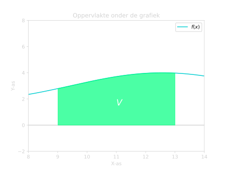
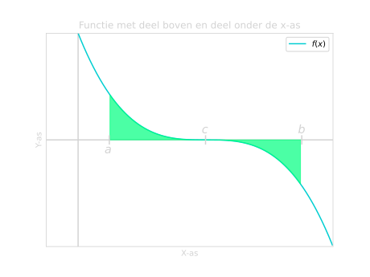
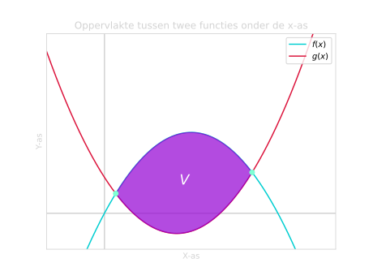

# *De Primitieve Functie*

## **Introductie Primitieven**

Een primitieve is eigenlijk precies het omgekeerde van een afgeleide. Stel we hebben bijvoorbeeld de volgende afgeleide:

$$f'(x) = 3x^2$$

En we willen bepalen wat de originele functie $f(x)$ is. Misschien zou je kunnen bedenken dat de functie dat hier bij hoort de volgende vorm heeft:

$$f(x) = x^3,$$

want als we $f(x)$ nu afleiden, dan krijgen we inderdaad $3x^2$. Maar we weten ook dat de afgeleide van een *constante* (dus een los getal zonder $x$) gelijk is aan $0$. We kunnen dus elke willekeurige constante bij $f(x)$ optellen en dan blijft de afgeleide $3x^2$. 

Dus bijvoorbeeld:

$$f_6(x) = x^3 + 6 \longrightarrow f_6'(x) = 3x^2$$

$$f_{13}(x) = x^3 + 13 \longrightarrow f_{13}'(x) = 3x^2$$

Omdat we elk willekeurig getal kunnen toevoegen, schrijven we het algemener op:

$$f(x) = x^3 + c$$

en deze $c$ noemen we de **integratieconstante**.

Wat we net hebben gedaan heet *primitiveren*. We bepalen dan de zogenaamde *primitieve* van een functie. Een primitieve is eigenlijk een functie die met afleiden weer terug gaat naar de originele functie. En we noteren een primitieve met een hoofdletter. Dus als:

$$g(x) = 3x^2,$$

dan is de primitieve:

$$G(x) = x^3 + c.$$

Net zoals bij de afgeleides hebben we bij primitiveren een tabel met veel voorkomende functies en hun primitieven.

???+ Belangrijk
    ### **Tabel met veel voorkomende functies**

    | Functie                            | Primitieve                                   |
    | ---------------------------------- | -------------------------------------------- |
    | $\large{f(x) = 0}$                 | $\large{F(x) = c}$                          |
    | $\large{f(x) = a}$                 | $\large{F(x) = ax + c}$                          |
    | $\large{f(x) = ax^n}$              | $\large{F(x) = \dfrac{1}{n + 1} \cdot ax^{n+1} + c}$           |
    | $\large{f(x) = e^x}$               | $\large{F(x) = e^x + c}$                        |
    | $\large{f(x) = a^x}$               | $\large{F(x) = \dfrac{a^x}{\ln(a)} + c}$         |
    | $\large{f(x) = \dfrac{1}{x}}$      | $\large{F(x) = \ln &#124; x &#124;}$         |
    | $\large{f(x) = \ln(x)}$            | $\large{F(x) = x \ln(x) - x + c}$                |
    | $\large{f(x) = \ ^a \! \log(x)}$   | $\large{F(x) = \dfrac{1}{\ln(a)} \cdot \left(x \ln(x) - x \right) + c}$ |
    | $\large{f(x) = \sin(x)}$           | $\large{F(x) = -\cos(x) + c}$                  |
    | $\large{f(x) = \cos(x)}$           | $\large{F(x) = \sin(x) + c}$                 |

    waarbij $n$ en $a$ constantes zijn (losse getallen zonder $x$). 
    
    $c$ is de zogenaamde *integratieconstante*. Deze constante komt er bij elke functie die je primitiveert erbij. Als we de primitieve zouden afleiden, dan zou deze constante namelijk weer verdwijnen.

     

    ### **Regels**

    Bij primitiveren hebben we geen [productregel](afgeleide.md#regels) of [quotiëntregel](afgeleide.md#regels), maar wel de [somregel](afgeleide.md#regels) en (deels) de omgekeerde [kettingregel](afgeleide.md#regels).

    |               | Functie                            | Primitieve                                                                                            |
    | ------------- | ---------------------------------- | ----------------------------------------------------------------------------------------------------- |
    | Somregel      | $\large{f(x) = g(x) + h(x)}$       | $\large{F(x) = G(x) + H(x)}$                                                                       |                                                 |
    | Kettingregel  | $\large{f(x) = f(ax + b)}$           | $\large F(x) = \frac{1}{a} \cdot F(ax + b)$ |

    ***
Let op!
***
    
    De kettingregel voor primitieven geldt alleen voor lineaire functies als binnenste functie. Er mag namelijk geen extra $x$ term bij komen door de kettingregel. Want door die extra $x$ term zou de afgeleide van deze primitieve niet meer de originele functie zijn.

### **Voorbeelden**

??? example "Voorbeeld 1: Bepaal de primitieve van $f(x) = 2x^2$"
    **
Bepaal de primitieve van de functie $f(x) = 2x^2$
**
    **
Uitwerking
**

    Deze functie is van de vorm $f(x) = ax^n$, met hier $a=2$ en $n=2$. Om de primitieve te bepalen bij zo'n vorm, moeten we eerst de macht $+1$ doen. Dus de $2$ in de macht wordt nu een $3$. En daarna doen we $1$ gedeeld door deze nieuwe macht ervoor (en vergeet de $+c$ niet):

    $$\large{F(x) = \dfrac{1}{3} \cdot 2 x^3 + c}$$

    Als we dit versimpelen, dan vinden we:

    !!! quote ""
        $$\large{F(x) = \dfrac{2}{3}x^3 + c}$$

??? example "Voorbeeld 2: Bepaal de primitieve van $f(x) = x^3 + 6x - 4$"
    **
Bepaal de primitieve van de functie $f(x) = x^3 + 6x - 4$
**
    **
Uitwerking
**

    Bij [Regels](#regels) zien we dat we bij primitiveren ook de somregel kunnen gebruiken, net zoals bij afgeleides. We kunnen dus van elke term apart de primitieve bepalen. Bij de eerste twee doen we de macht $+1$ en zetten we een factor $1$ gedeeld door deze nieuwe macht ervoor:   
    
    - Functie: $\quad x^{3}$ $\qquad \Longrightarrow \qquad$ Primitieve: $\quad \dfrac{1}{4}x^4$
    - Functie: $\quad 6x$ $\qquad \Longrightarrow \qquad$ Primitieve: $\quad \dfrac{1}{2} \cdot 6x^2 = 3x^2$

      
    De laatste term is gewoon een constante, dus van de vorm $f(x) = a$. De primitieve van deze vorm is $F(x) = ax$, dus plakken gewoon een $x$ aan het getal vast:   

    - Functie: $\quad -4$ $\qquad \Longrightarrow \qquad$ Primitieve: $\quad -4x$

      
    Als we dit nu allemaal samenvoegen (en $+c$ toevoegen), vinden we:

    !!! quote ""
        $$\large{F(x) = \dfrac{1}{4}x^4 + 3x^2 - 4x + c}$$

??? example "Voorbeeld 3: Bepaal de primitieve van $f(x) = (3x - 7)^2$"
    **
Bepaal de primitieve van de functie $f(x) = (3x - 7)^2$
**
    **
Uitwerking
**

    Om dit op te lossen werken we eerst de [haakjes](basisvaardigheden.md#kwadratisch-haakjes-wegwerken) uit:

    $$\large{f(x) = 9x^2 - 42x + 49}$$

    Nu kunnen we de primitieve nemen van de losse termen. Bij de eerste twee termen doen we de macht $+1$ en dan een factor $1$ gedeeld door deze nieuwe macht ervoor. Bij het losse getal voegen we alleen een $x$ toe:

    $$\large{F(x) = \dfrac{1}{3} \cdot 9x^3 - \dfrac{1}{2} \cdot 42x^2 + 49x + c}$$

    Als we dit versimpelen, dan vinden we:

    !!! quote ""
        $$\large{F(x) = 3x^3 - 21x^2 + 49x + c}$$

??? example "Voorbeeld 4: Bepaal de primitieve van $f(x) = 6\sqrt{x}$"
    **
Bepaal de primitieve van de functie $f(x) = 6\sqrt{x}$
**
    **
Uitwerking
**

    Om dit op te lossen moeten we het eerst schrijven in de vorm $f(x) = ax^n$. We doen dit door de wortel eerst als macht $\frac{1}{2}$ te schrijven:

    $$\large{f(x) = 6x^{\frac{1}{2}}}$$

    Nu staat de functie wel in de vorm $f(x) = ax^n$. Om deze vorm te primitiveren, doen we de macht $+1$. Dus van een macht $\frac{1}{2}$ gaan we naar een macht $1 \frac{1}{2}$. Daarna zetten we een factor van $1$ gedeeld door deze nieuwe macht ervoor:

    $$\large{F(x) = \dfrac{1}{1 \frac{1}{2}} \cdot 6x^{1 \frac{1}{2}} + c}$$

    Als we dit versimpelen:

    $$\large{F(x) = \dfrac{2}{3} \cdot 6x^{1 \frac{1}{2}} + c}$$

    $$\large{F(x) = 4x^{1 \frac{1}{2}} + c}$$

    We hadden in de vraag geen breuk in de macht, dus dat moeten we weer schrijven met wortels. We hebben een macht $1 \frac{1}{2}$, dus dat kunnen we schrijven als $x \sqrt{x}$. De $x$ komt van de $1$ in de macht, de $\sqrt{x}$ komt van de $\frac{1}{2}$.
    
    We krijgen dus:

    !!! quote ""
        $$\large{F(x) = 4x\sqrt{x} + c}$$

??? example "Voorbeeld 5: Bepaal de primitieve van $f(x) = \dfrac{3x\sqrt{x}}{2x^3}$"
    **
Bepaal de primitieve van de functie $f(x) = \dfrac{3x\sqrt{x}}{2x^3}$
**
    **
Uitwerking
**

    Om dit te primitieveren, moeten we deze functie eerst schrijven in de vorm $f(x) = ax^n$. Om dit te doen schrijven we de wortel eerst als een macht $\frac{1}{2}$:

    $$\large{f(x) = \dfrac{3x \cdot x^{\frac{1}{2}}}{2x^3}}$$

    We kunnen nu de $x$ termen in de teller combineren. We hebben twee $x$ termen keer elkaar, dus moeten we de machten bij elkaar op tellen. We weten dat $x = x^1$, dus krijgen we:

    $$\large{f(x) = \dfrac{3x^{1 + \frac{1}{2}}}{2x^3}}$$

    $$\large{f(x) = \dfrac{3x^{1 \frac{1}{2}}}{2x^3}}$$

    Nu kunnen we de twee overige $x$ termen door elkaar delen. Als we twee $x$ termen met elkaar delen, doen we de machten juist min elkaar:

    $$\large{f(x) = \dfrac{3}{2} \cdot x^{1 \frac{1}{2} - 3}}$$

    En nu kunnen we de macht versimpelen:

    $$\large{f(x) = \dfrac{3}{2} x^{-1 \frac{1}{2}}}$$

    Nu staat de functie in de vorm $f(x) = ax^n$ en kunnen we het primitiveren. We doen dan de macht $+1$ en halen een factor $1$ gedeeld door deze nieuwe macht ervoor. We krijgen dus als nieuwe macht $-1\frac{1}{2} + 1 = - \frac{1}{2}$:

    $$\large{F(x) = \dfrac{1}{-\frac{1}{2}} \cdot \dfrac{3}{2} x^{-\frac{1}{2}} + c}$$

    En als we dit versimpelen:

    $$\large{F(x) = -2 \cdot \dfrac{3}{2} x^{-\frac{1}{2}} + c}$$

    $$\large{F(x) = -3x^{-\frac{1}{2}} + c}$$

    We hadden in de vraag geen negatieve of breuk in de macht, dus dat moeten we weer schrijven als breuk en met wortels. We veranderen eerst de '$-$' in de macht met een breuk:

    $$\large{F(x) = -3 \cdot \dfrac{1}{x^{\frac{1}{2}}} + c}$$

    En de macht $\frac{1}{2}$ kunnen we ook schrijven als wortel:

    $$\large{F(x) = -3 \cdot \dfrac{1}{\sqrt{x}} + c}$$

    Als laatst kunnen we nog eventueel de $3$ in de breuk zetten:

    !!! quote ""
        $$\large{F(x) = - \dfrac{3}{\sqrt{x}} + c}$$

??? example "Voorbeeld 6: Bepaal de primitieve van $f(x) = 5\cos(x)$"
    **
Bepaal de primitieve van de functie $f(x) = 5\cos(x)$
**
    **
Uitwerking
**

    De primitieve van een cosinus kunnen we vinden in de [tabel](#tabel-met-veel-voorkomende-functies). We zien daar dat dit $\sin(x)$ is. In ons geval hebben we nog een factor $5$, maar die kunnen we er gewoon lekker voor laten staan: 

    !!! quote ""
        $$\large{F(x) = 5\sin(x) + c}$$

??? example "Voorbeeld 7: Bepaal de primitieve van $f(x) = \sin(2x)$"
    **
Bepaal de primitieve van de functie $f(x) = \sin(2x)$
**
    **
Uitwerking
**

    De primitieve van een sinus kunnen we opzoeken in de [tabel](#tabel-met-veel-voorkomende-functies). We zien daar dat dit $-\cos(x)$ is. Om onze functie $\sin(2x)$ te primitiveren, zou onze eerste gok misschien zijn:

    $$\large{\widetilde{F}(x) = -\cos(2x) + c}$$

    Maar als we dit weer gaan afleiden, dan krijgen we door de [kettingregel](afgeleide.md#regels) een extra factor $2$ ervoor:
    
    $$\large{\widetilde{F}'(x) = 2\sin(2x) \neq f(x)}$$
    
    Omdat we deze factor niet willen, moeten we die bij de primitieve weg compenseren door $\frac{1}{2}$ ervoor toe te voegen:

    !!! quote ""
        $$\large{F(x) = -\dfrac{1}{2}\cos(2x) + c}$$

     

    (Nu geldt er namelijk wel weer $F'(x) = f(x)$ )

??? example "Voorbeeld 8: Bepaal de primitieve van $f(x) = e^{4x + 7}$"
    **
Bepaal de primitieve van de functie $f(x) = e^{4x + 7}$
**
    **
Uitwerking
**

    We hebben hier te maken met een $e$ macht en we weten dat de afgeleide van een $e$ macht zichzelf is. Dit betekent dus ook dat de primitieve van een $e$ macht zichzelf moet zijn. Dus als eerste gok proberen we:

    $$\large{\widetilde{F}(x) = e^{4x + 7}}$$

    Maar als we deze functie weer afleiden, krijgen we door de [kettingregel](afgeleide.md#regels) een extra factor $4$ ervoor:

    $$\large{\widetilde{F}'(x) = 4 \cdot e^{4x + 7} \neq f(x)}$$

    Omdat we deze factor niet willen, compenseren we hem weg door in de primitieve $\frac{1}{4}$ toe te voegen:

    !!! quote ""
        $$\large{F(x) = \dfrac{1}{4}e^{4x + 7} + c}$$

    (Nu geldt er namelijk wel weer $F'(x) = f(x)$ )

??? example "Voorbeeld 9: Bepaal de primitieve van $f(x) = \dfrac{14}{x}$"
    **
Bepaal de primitieve van de functie $f(x) = \dfrac{14}{x}$
**
    **
Uitwerking
**

    *Let op!* We hebben hier een functie van de vorm $f(x) = \dfrac{1}{x}$, en niet van de vorm $f(x) = ax^n$.
    
    De primitieve van deze vorm kunnen we opzoeken in de [tabel](#tabel-met-veel-voorkomende-functies). We vinden daar dat het $F(x) = \ln|x|$ is. In ons geval hebben we nog een extra factor $14$, maar die kunnen we er gewoon lekker voor laten staan:

    !!! quote ""
        $$\large{F(x) = 14\ln|x|}$$

??? example "Voorbeeld 10: Bepaal de primitieve van $f(x) = \ ^2 \! \log(x)$"
    **
Bepaal de primitieve van de functie $f(x) = \ ^2 \! \log(x)$
**
    **
Uitwerking
**

    Deze functie is van de vorm $f(x) = \ ^a \! \log(x)$, met hier $a=2$. De primitieve van deze vorm kunnen we opzoeken in de [tabel](#tabel-met-veel-voorkomende-functies). Daar vinden we dat het van de vorm $F(x) = \dfrac{1}{\ln(a)} \cdot \left( x \ln(x) - x \right) + c$ is. In ons geval wordt dat dus:

    !!! quote ""
        $$\large{F(x) = \frac{1}{\ln(2)} \cdot \left( x \ln(x) - x \right) + c}$$

??? example "Voorbeeld 11: Bepaal de primitieve van $f(x) = \ln(9x - 2)$"
    **
Bepaal de primitieve van de functie $f(x) = \ln(9x - 2)$
**
    **
Uitwerking
**

    Deze functie is van de vorm $f(x) = \ln(x)$. In de [tabel](#tabel-met-veel-voorkomende-functies) kunnen we zien dat de primitieve van deze vorm $F(x) = x \ln(x) - x + c$ is. In ons geval hebben we geen $x$ maar $9x - 2$. We moeten dus alle $x$ in deze vorm vervangen voor $9x - 2$:

    $$\large{\widetilde{F}(x) = (9x - 2) \ln(9x-2) - (9x - 2) + c}$$

    Maar als we dit afleiden, dan zouden we door de [kettingregel](afgeleide.md#regels) een extra factor $9$ krijgen. Om die weg te compenseren, voegen wij een factor $\dfrac{1}{9}$ toe aan onze primitieve:

    $$\large{F(x) = \dfrac{1}{9} \cdot \left( (9x - 2) \ln(9x - 2) - (9x - 2) \right) + c}$$

    Dit kunnen we eventueel nog iets verder versimpelen:

    $$\large{F(x) = (x - \dfrac{2}{9}) \ln(9x - 2) - (x - \dfrac{2}{9}) + c}$$

    Omdat we al de integratieconstante $c$ hebben toegevoegd, kunnen we de $\frac{2}{9}$ op het einde weg laten. De integratieconstante $c$ staat namelijk al voor elk mogelijk getal, dus de extra $\frac{2}{9}$ voegt niks toe:

    !!! quote ""
        $$\large{F(x) = (x - \dfrac{2}{9}) \ln(9x - 2) - x + c}$$

## **Introductie Integralen**
We kunnen *integralen* gebruiken om een oppervlakte onder een grafiek te bepalen. Maar hoe werkt het en hoe lossen we zo'n integraal op?

### **Oppervlakte onder een grafiek**

Stel we willen de oppervlakte $V$ bepalen onder deze grafiek, hoe doen we dat?

<figure markdown>
{ width="500" }
    <figcaption>Figuur 1. Functie geplot met oppervlakte $V$ onder de grafiek.</figcaption>
</figure>

Deze oppervlakte heeft een lastige vorm, dus we kunnen het niet zomaar bepalen door lengte keer breedte te gebruiken... Of toch wel? 

Als we deze oppervlakte $V$ indelen in allemaal kleine rechthoeken, dan kunnen we de oppervlaktes van alle rechthoekjes bij elkaar optellen. En deze totale oppervlakte zou dan hetzelfde zijn als de oppervlakte $V$.

<figure markdown>
.svg){ width="500" }
    <figcaption>Figuur 2. Functie geplot met $10$ rechthoeken onder de grafiek. De breedte van de rechthoeken is $\Delta x$. De hoogte is de waarde van de functie bij de $x$ waar de rechthoek begint.</figcaption>
</figure>

De oppervlakte van één rechthoek kunnen we bepalen door lengte keer breedte te doen. De breedte van alle rechthoeken is hetzelfde, dus die noemen we $\Delta x$. Maar de lengte (hier hoogte) is afhankelijk van welke rechthoek we naar kijken.

Laten we bijvoorbeeld kijken naar het eerste rechthoekje. De hoogte van deze rechthoek is het $y$-coördinaat van de functie bij het begin van deze rechthoek. Dus als de rechthoek begint bij $x_1$, dan is de hoogte $f(x_1)$. De oppervlakte van het eerste rechthoekje wordt dan dus:

$$\textrm{Opp rechthoek 1} = f(x_1) \cdot \Delta x$$

En op dezelfde manier is de oppervlakte van rechthoek $2$:

$$\textrm{Opp rechthoek 2} = f(x_2) \cdot \Delta x$$

En zo kunnen we verder gaan voor de andere rechthoeken. De totale oppervlakte wordt dan:

$$\textrm{Opp alle rechthoeken} = f(x_1) \cdot \Delta x + f(x_2) \cdot \Delta x + f(x_3) \cdot \Delta x \ + \ ...$$

Dit wordt een beetje een gedoe om helemaal uit te schrijven, dus we schrijven het iets korter op:

$$\textrm{Opp alle rechthoeken} = \sum_{i=1}^{10} f(x_i) \cdot \Delta x$$

Hier is $\sum$ het sommatieteken. We zeggen hier dus eigenlijk "verander $i$ steeds van $1$ tot $10$ en tel al deze termen bij elkaar op".

Het enige probleem is dat dit niet helemaal hetzelfde is als oppervlakte $V$ (zie Figuur 2). We hebben namelijk aan de bovenkant een paar stukjes van $V$ niet meegenomen. Het is dus alleen maar een *benadering*.

Maar we kunnen de benadering wel beter maken door meer rechthoeken te gebruiken. Dit zijn er bijvoorbeeld $100$: 

<figure markdown>
.svg){ width="500" }
    <figcaption>Figuur 3. Functie geplot met $100$ rechthoeken onder de grafiek.</figcaption>
</figure>

Dit is bijvoorbeeld al een stuk beter. Het is nog steeds niet precies hetzelfde als oppervlakte $V$, maar we komen steeds meer in de buurt. We hebben nu dus:

$$\textrm{Opp alle rechthoeken} = \sum_{i=1}^{100} f(x_i) \cdot \Delta x$$

Als we meer rechthoekjes gebruiken, wordt de breedte van elke rechthoek ($\Delta x$) ook steeds kleiner. Dus als we deze breedte oneindig klein zouden kunnen maken, dan wordt onze benadering zó goed, dat het eigenlijk geen benadering meer is. 

We kunnen dus de oppervlakte van $V$ bepalen door oneindig veel rechthoeken te gebruiken. Om dit te doen laten we de breedte $\Delta x$ naar $0$ gaan:

$$V = \lim_{\Delta x \ \to \ 0} \ \sum_{i=1}^{n} f(x_i) \cdot \Delta x$$

En dit kunnen we ook noteren als:

$$V = \int_a^b f(x) \, dx$$

We schrijven $dx$ in plaats van $\Delta x$ om aan te geven dat het om een oneindig kleine afstand gaat. $a$ en $b$ zijn hier de grenzen van het oppervlak. Dus $a$ is het $x$-coördinaat van het begin van de oppervlakte, $b$ het $x$-coördinaat van het einde van de oppervlakte. Voor oppervlakte $V$ van Figuur 1 zou dus gelden: $a=9$ en $b=13$.

Deze notatie noemen we een *integraal*. En het mooie van zo'n integraal is dat we nu niet meer de oppervlakte van elke rechthoek apart bij elkaar op hoeven te tellen. Met oneindig veel rechthoeken zou je namelijk een tijdje bezig zijn...   

### **Integralen Uitwerken**

We kunnen een *integraal* uitwerken door de primitieve te gebruiken. Laten we hiernaar kijken met behulp van een voorbeeld. Stel we hebben bijvoorbeeld de volgende functie:

$$f(x) = 6x^2$$

In Figuur 1 is deze functie geschetst met een oppervlakte $V$ onder deze grafiek. 

<figure markdown>
 = 6x^2.svg){ width="500" }
    <figcaption>Figuur 4. De grafiek $f(x) = 6x^2$ geplot met oppervlakte $V$. Deze oppervlakte onder de functie $f(x)$ gaat van $x=0$ tot $x=1$.</figcaption>
</figure>

Zoals we bij de sectie [Oppervlakte onder een grafiek](#oppervlakte-onder-een-grafiek) hebben gezien, kunnen we de oppervlakte $V$ bepalen met een integraal. Een integraal heeft de volgende vorm:

$$V = \int_a^b f(x) \, dx,$$

waarbij $a$ en $b$ de grenzen zijn van de oppervlakte. Dus in ons geval start de oppervlakte van $V$ bij $x=0$ en eindigt bij $x=1$:

$$V = \int_0^1 f(x) \, dx$$

Nu vullen we $f(x)$ ook in:

$$V = \int_0^1 6x^2 \, dx$$

Nu moeten we de functie *integreren*. Dit is eigenlijk hetzelfde als primitiveren, alleen dan moeten we daarna nog de grenzen invullen:

$$V = \int_a^b f(x) \, dx = \left[ \, F(x) \, \right]_a^b = F(b) - F(a)$$

Laten we dus eerst de functie primitiveren. 

We hebben $6x^2$ als functie en dit is van de vorm $f(x) = ax^n$. Om deze vorm te primitiveren, moeten we de macht $+1$ doen en dan $1$ gedeeld door deze nieuwe macht ervoor zetten. 

We hadden een macht van $2$, dus dat wordt nu een $3$. En we zetten dan een factor $\frac{1}{3}$ ervoor:

$$F(x) = \dfrac{1}{3} \cdot 6 x^{3} + c$$

Als we dit versimpelen, krijgen we:

$$F(x) = 2 x^{3} + c$$

Onze integraal wordt dus:

$$V = \left[ \, 2x^3 + c \, \right]_0^1$$

Nu moeten we de grenzen gaan invullen en min elkaar doen. We krijgen dan dus:

$$V = 2 \cdot 1^3  + c - \left( 2 \cdot 0^3 + c \right)$$

$$V = 2 + c - c$$

We hebben $c - c$, dus dat wordt gewoon $0$:

!!! quote ""
    $$\large{V = 2}$$

 

De oppervlakte van $V$ is dus $2$.

Zoals we hier kunnen zien, doen we de $c$'s min elkaar en vallen ze tegen elkaar weg. Dit is altijd het geval bij dit soort integralen met grenzen, dus hoeven we hier de $+c$ term niet op te schrijven. 

Dus:

$$V = \int_0^1 6x^2 \, dx$$

wordt:

$$V = \left[ \, 2x^3 \, \right]_0^1 = 2 \cdot 1^3 - 2 \cdot 0^3 = 2$$

???+ Belangrijk

    #### **Algemene Vorm**

    Een integraal los je op door de primitieve te bepalen en daarna de grenzen in te vullen: 

    $$\large{V = \int_a^b f(x) \, dx = \left[ \, F(x) \, \right]_a^b = F(b) - F(a)}$$

    Hier zijn $a$ en $b$ de grenzen van de integraal. Dus bij een oppervlakte is $a$ de linkergrens van de oppervlakte, en $b$ de rechtergrens.

??? note "Bepaalde en Onbepaalde Integralen"
    We hebben net gekeken naar *bepaalde* integralen. Dit zijn integralen met grenzen, dus van de vorm:

    $$\large{V = \int_a^b f(x) \, dx = \left[\, F(x) \, \right]_a^b = F(b) - F(a)}$$

     

    We hebben ook *onbepaalde* integralen. Dit zijn integralen zonder grenzen. Dit lijkt misschien ingewikkeld, maar eigenlijk is het gewoon een andere manier om een primitieve op te schijven:

    $$\large{\int f(x) \, dx = F(x)}$$

### **Oppervlaktes onder de x-as**

Als een oppervlakte onder de $x$-as ligt, geeft dit een negatieve bijdrage aan een integraal. In het voorbeeld hierboven hebben we gezien dat de oppervlakte $V$ van Figuur 4 gelijk is aan $2$:

$$V = \int_0^1 6x^2 \, dx = 2$$

Maar stel dat we nu $-6x$ gebruiken in plaats van $6x$. Wat komt er dan uit de integraal?

$$V_2 = \int_0^1 -6x^2 \, dx$$

$$V_2 = \left[ \, -2x^3 \, \right]_0^1$$

$$V_2 = -2 \cdot 1^3 - -2 \cdot 0^3$$

$$V_2 = -2$$

Dus zoals we hier kunnen zien krijgen we precies dezelfde oppervlakte als bij $6x$, alleen dan nu negatief. En als we deze functie tekenen, dan zien we ook dat het dezelfde oppervlakte is als bij Figuur 4. Alleen dan nu is de oppervlakte onder de $x$-as:

<figure markdown>
 = -6x^2.svg){ width="500" }
    <figcaption>Figuur 5. De grafiek $f(x) = -6x^2$ geplot met oppervlakte $V$. Deze oppervlakte onder de functie $f(x)$ gaat van $x=0$ tot $x=1$.</figcaption>
</figure>

Maar omdat een oppervlakte niet negatief kan zijn, voegen we een '$-$' toe bij de integraal:

$$V_2 = - \int_0^1 -6x^2 \, dx$$

Dit zorgt ervoor dat de minnen tegen elkaar wegvallen zodat de oppervlakte weer positief wordt.

???+ Belangrijk
    **Algemene vorm onder de x-as**

    Als we een oppervlakte onder de $x$-as hebben, moeten we een '$-$' toevoegen aan de integraal:

    $$\large{V = - \int_a^b f(x) \, dx}$$

    Anders krijgen we namelijk een negatieve oppervlakte.

 

### **Deel boven en deel onder de x-as**

Als zowel een deel van een oppervlakte boven de $x$-as is als onder de $x$-as, moeten we goed opletten. Want alleen het gedeelte onder de $x$-as krijgt een extra '$-$'. Dit betekent dat we de hele oppervlakte moeten splitsen in het deel boven de $x$-as en het deel onder de $x$-as.

Laten we kijken naar de volgende functie:

$$f(x) = \sin(x)$$

Stel dat we de totale oppervlakte willen bepalen van vlakdeel $V$ dat tussen $x=-\pi$ en $x=\pi$ ligt. Dit heeft een deel onder de $x$-as ( $I$ ) en een deel boven de $x$-as ( $II$ ):

<figure markdown>
 = sin(x).svg){ width="500" }
    <figcaption>Figuur 6. De grafiek $f(x) = \sin(x)$ geplot met oppervlakte $I$ en $II$. Samen gaan deze oppervlaktes van $x=-\pi$ tot $x=\pi$. Oppervlakte $I$ ligt onder de $x$-as en oppervlakte $II$ ligt boven de $x$-as.</figcaption>
</figure>

Als we de totale oppervlakte willen berekenen, dan moeten we oppervlakte $I$ en oppervlakte $II$ apart berekenen. Want als we het als geheel proberen te integreren, dan krijgen we uit de integraal dat de totale oppervlakte $0$ is. En dit klopt natuurlijk niet. 

??? abstract "Bewijs dat $\int_{-\pi}^{\pi} \sin(x) \, dx$ uitkomt op $0$"
    We kunnen dit zelf ook gewoon berekenen met de kennis die we nu hebben. De oppervlakte onder $f(x) = \sin(x)$ gaat van $-\pi$ tot $\pi$. Onze integraal wordt dus:

    $$\large{V = \int_{-\pi}^{\pi} \sin(x) \, dx}$$

    We kunnen in de [tabel](#tabel-met-veel-voorkomende-functies) zien dat de primitieve van $\sin(x)$ is $-\cos(x)$:

    $$\large{V = \left[ \, -\cos(x) \, \right]_{-\pi}^{\pi}}$$

    Nu vullen we de grenzen in en doen ze min elkaar:

    $$\large{V = -\cos(\pi) - -\cos(-\pi)}$$

    $$\large{V = -\cos(\pi) + \cos(-\pi)}$$

    We weten dat zowel $\cos(\pi)$ als $\cos(-\pi)$ is $-1$, dus:

    $$\large{V = - -1 + -1}$$

    $$\large{V = 1 - 1}$$

    !!! quote ""
        $$\large{V = 0}$$

We beginnen eerst met de oppervlakte van $I$ te bepalen. Deze oppervlakte gaat van $x=-\pi$ tot $x=0$ en is onder de $x$-as. Onze integraal wordt dan dus:

$$I = - \int_{-\pi}^{0} \sin(x) \, dx$$

Nu kunnen we de primitieve nemen. In de [tabel](#tabel-met-veel-voorkomende-functies) zien we dat de primitieve van $\sin(x)$ gelijk is aan $-\cos(x)$:

$$I = -\left[ \, -\cos(x) \, \right]_{-\pi}^{0}$$

Nu vullen we de grenzen in en doen ze min elkaar:

$$I = -\left( -\cos(0) - -\cos(-\pi) \right)$$

$$I = -\left( -\cos(0) + \cos(-\pi) \right)$$

$$I = \cos(0) - \cos(-\pi)$$

Als we dit uitwerken, vinden we:

$$I = 1 - -1$$

$$\boxed{I = 2}$$

En nu kunnen we hetzelfde doen voor oppervlakte $II$. Deze oppervlakte gaat van $x=0$ tot $x=\pi$ en is boven de $x$-as. We krijgen dan:

$$II = \int_{0}^{\pi} \sin(x) \, dx$$

$$II = \left[ \, -\cos(x) \, \right]_{0}^{\pi}$$

$$II = -\cos(\pi) - -\cos(0)$$

$$II = -\cos(\pi) + \cos(0)$$

En als we dit uitwerken, krijgen we:

$$II = --1 + 1$$

$$\boxed{II = 2}$$

En nu kunnen we uiteindelijk de totale oppervlakte $V$ bepalen door $I$ en $II$ bij elkaar op te tellen:

$$V = I + II$$

$$V = 2 + 2$$

!!! quote ""
    $$\large{V = 4}$$

???+ Belangrijk
    **Algemeen deel boven deel onder x-as**

    Als een gedeelte van de oppervlakte boven de $x$-as is en een gedeelte onder de $x$-as, moeten we de integraal opsplitsen. We berekenen beide oppervlaktes apart en tellen ze daarna pas bij elkaar op:

    $$\large{V = \int_a^b f(x) \, dx \qquad \Longrightarrow \qquad V = \int_a^c f(x) \, dx \, + \int_c^b -f(x) \, dx}$$

    waarbij $c$ dus het snijpunt met de $x$-as tussen $a$ en $b$ is. We krijgen bij de tweede integraal een '$-$' omdat het [onder de $x$-as](#oppervlaktes-onder-de-x-as) ligt.

    <figure markdown>
    { width="450" }
        <figcaption>Figuur 7. Voorbeeld van een functie met een deel boven de $x$-as en een deel onder de $x$-as.</figcaption>
    </figure>

### **Voorbeelden**

??? example "Voorbeeld 1: Los op $I = \int_1^4 3x \, dx$"
    **
Los op $I = \int_1^4 3x \, dx$
**

    **
Uitwerking
**

    Om dit op te lossen moeten we eerst de functie $3x$ primitiveren. Deze functie is van de vorm $f(x) = ax^n$. Om de primitieve van deze vorm te bepalen, doen we de macht $+1$ en zetten $1$ gedeeld door deze nieuwe macht ervoor. We gaan dus van een macht $1$ naar een $2$ en zetten een factor $\frac{1}{2}$ ervoor:

    $$\large{I = \left[ \, \dfrac{1}{2} \cdot 3x^2 \, \right]_1^4}$$

    De integratieconstante $c$ mogen we weglaten omdat het toch wegvalt als we de grenzen invullen. Als we dit verder versimpelen, krijgen we:

    $$\large{I = \left[ \, 1 \dfrac{1}{2} x^2 \, \right]_1^4}$$

    Nu kunnen we de grenzen gaan invullen en min elkaar doen:

    $$\large{I = 1 \dfrac{1}{2} \cdot 4^2 - 1 \dfrac{1}{2} \cdot 1^2}$$

    En als we dit uitwerken, dan vinden we:

    $$\large{I = 1 \dfrac{1}{2} \cdot 16 - 1 \dfrac{1}{2}}$$

    $$\large{I = 24 - 1 \dfrac{1}{2}}$$

    !!! quote ""
        $$\large{I = 22 \dfrac{1}{2}}$$

??? example "Voorbeeld 2: Los op $I = \int_{-2}^{2} 2x^3 - 6x^2 + x - 3 \, dx$"
    **
Los op $I = \int_{-2}^{2} 2x^3 - 6x^2 + x - 3 \, dx$
**

    **
Uitwerking
**

    Om dit op te lossen moeten we eerst de functie primitiveren. 
    
    - De eerste $3$ termen hebben de vorm $f(x) = ax^n$ (we weten namelijk dat $x = x^1$). Dus daar doen we de macht $+1$ en zetten $1$ gedeeld door deze nieuwe macht ervoor. 
    
    - De laatste term is een los getal zonder $x$, dus daar voegen we gewoon een $x$ toe.

    We krijgen dus:

    $$\large{I = \left[ \, \dfrac{1}{4} \cdot 2x^4 + \dfrac{1}{3} \cdot -6x^3 + \dfrac{1}{2} x^2 - 3x \, \right]_{-2}^{2}}$$

    Als we dit versimpelen, krijgen we:

    $$\large{I = \left[ \, \dfrac{1}{2} x^4 - 2x^3 + \dfrac{1}{2} x^2 - 3x \, \right]_{-2}^{2}}$$

    Nu vullen we de grenzen in en doen ze min elkaar:

    $$\large{I = \left( \dfrac{1}{2} \cdot 2^4  - 2 \cdot 2^3 + \dfrac{1}{2} \cdot 2^2 - 3 \cdot 2 \right) - \left( \dfrac{1}{2} \cdot (-2)^4 - 2 \cdot (-2)^3 + \dfrac{1}{2} \cdot (-2)^2 - 3 \cdot -2 \right)}$$

    En als we dit uitwerken, krijgen we:

    $$\large{I = \left( \dfrac{1}{2} \cdot 16 - 2 \cdot 8 + \dfrac{1}{2} \cdot 4 - 6 \right) - \left( \dfrac{1}{2} \cdot 16 - 2 \cdot -8 + \dfrac{1}{2} \cdot 4 + 6 \right)}$$

    $$\large{I = \left( 8 - 16 + 2 - 6 \right)- \left( 8 + 16 + 2 + 6 \right)}$$

    $$\large{I = \left( -12 \right) - \left( 32 \right)}$$

    !!! quote ""
        $$\large{I = -44}$$

??? example "Voorbeeld 3: Bereken de oppervlakte van vlakdeel $V$ onder de functie $f(x) = -x^2 + 2x + 3$"
    *
Vlakdeel $V$ wordt ingesloten door de functie $f(x) = -x^2 + 2x + 3$, de $x$-as en de $y$-as.
*

     

    **a) Bereken de oppervlakte van vlakdeel $V$.**

    **b) De lijn $x=p$ verdeelt $V$ in twee gelijke oppervlaktes. Bepaal $p$ op $3$ decimalen nauwkeurig.**

    **
Uitwerking
**

     

    **a)**

    Laten we eerst een schets maken zodat we een beetje de situatie kunnen begrijpen:

    <figure markdown>
     = -x^2 + 2x + 3.svg){ width="500" }
        <figcaption>Figuur 1. De grafiek $f(x) = -x^2 + 2x + 3$ geplot met vlakdeel $V$. Vlakdeel $V$ wordt ingesloten door $f(x)$, de $x$-as en de $y$-as.</figcaption>
    </figure>

    Om de oppervlakte $V$ te bepalen, schrijven we eerst de [algemene vorm](#algemene-vorm) van een integraal op:

    $$\large{V = \int_a^b f(x) \, dx}$$

    Om dit op te lossen moeten we eerst de grenzen bepalen. We weten dat $V$ begint bij de $y$-as, dus bij $x=0.$ Vlakdeel $V$ eindigt bij het rechter snijpunt met de $x$-as, dus die moeten we eerst bepalen.

    De [snijpunten met de $x$-as](kwadratische_vergelijkingen.md#snijpunten-met-de-x-as) bepalen we door de volgende vergelijking op te lossen:

    $$\large{f(x) = 0}$$

    Dus als we $f(x)$ invullen:

    $$\large{-x^2 + 2x + 3 = 0}$$

    Om dit op te lossen, doen we eerst alles keer $-1$:

    $$\large{x^2 - 2x - 3 = 0}$$

    We kunnen dit nu oplossen door het te [ontbinden in factoren](kwadratische_vergelijkingen.md#ontbinden-in-factoren). We moeten dus twee getallen verzinnen die keer elkaar $-3$ zijn en plus elkaar $-2$. 
    
    Na een paar combinaties te proberen, vinden we de factoren $-3$ en $1$. We krijgen dus:

    $$\large{(x - 3)(x + 1) = 0}$$

    Hieruit volgt:

    $$\large{x - 3 = 0 \ \vee \ x + 1 = 0}$$

    $$\large{x = 3 \ \vee \ x = -1}$$

    We wilden het rechter snijpunt weten, dus we gebruiken het snijpunt $x=3$. De grenzen van de integraal zijn dus $a=0$ en $b=3$:

    $$\large{V = \int_0^3 f(x) \, dx}$$

    Nu kunnen we $f(x)$ invullen:

    $$\large{V = \int_0^3 -x^2 + 2x + 3 \, dx}$$

    Dit zijn allemaal termen plus elkaar, dus we kunnen gewoon alle losse termen apart integreren. 
    
    - De eerste twee termen zijn van de vorm $f(x) = ax^n$, want we kunnen $2x$ schrijven als $2x^1$. Om deze vorm te primitiveren, doen we doen we de macht $+1$ en dan $1$ gedeeld door deze nieuwe macht ervoor. 
    
    - De laatste term is alleen een getal, dus daar plakken we gewoon een $x$ aan vast.

    We krijgen dus:

    $$\large{V = \left[ \, -\dfrac{1}{3}x^3 + \dfrac{1}{2} \cdot 2x^2 + 3x \, \right]_0^3}$$

    En als we dit versimpelen:

    $$\large{V = \left[ \, -\dfrac{1}{3}x^3 + x^2 + 3x \, \right]_0^3}$$

    Nu kunnen we de grenzen invullen en min elkaar doen:

    $$\large{V = \left( -\dfrac{1}{3} \cdot 3^3 + 3^2 + 3 \cdot 3 \right) - \left( -\dfrac{1}{3} \cdot 0^3 + 0^2 + 3 \cdot 0 \right)}$$

    Als we dit versimpelen, vinden we:

    $$\large{V = \left( -\dfrac{1}{3} \cdot 27 + 9 + 9 \right) - (0)}$$

    $$\large{V = -9 + 18}$$

    !!! quote ""
        $$\large{V = 9}$$

      

    **b)**

    We weten dat de lijn $x=p$ het vlakdeel $V$ verdeelt in twee gelijke oppervlaktes. Laten we dit weer schetsen zodat we de situatie beter kunnen begrijpen:

    <figure markdown>
     = -x^2 + 2x + 3 (gesplitst).svg){ width="500" }
        <figcaption>Figuur 2. De grafiek $f(x) = -x^2 + 2x + 3$ geplot met vlakdeel $V$ verdeelt in $2$ gelijke delen. De twee delen worden gesplitst door de lijn $x=p$.</figcaption>
    </figure>

    We weten uit vraag a) dat de totale oppervlakte $V=9$ is, dus de oppervlakte van $I$ en $II$ zijn beide $4 \frac{1}{2}$:

    $$\large{I = 4\dfrac{1}{2} = II}$$

    We kunnen oppervlakte $I$ ook schrijven als integraal:

    $$\large{I = \int_0^p -x^2 + 2x + 3 \, dx}$$

    Oppervlakte $I$ gaat van $0$ tot $p$, dus vandaar dat dat ook de grenzen in de integraal zijn. We gebruiken hier oppervlakte $I$ om $p$ te bepalen, maar we hadden ook oppervlakte $II$ kunnen gebruiken. Het enige verschil is dat de grenzen dan niet van $0$ tot $p$ zouden gaan, maar van $p$ tot $3$. 
    
    Omdat we net gezegd hebben dat $I = 4 \dfrac{1}{2}$, krijgen we de volgende vergelijking:

    $$\large{\int_0^p -x^2 + 2x + 3 \, dx = 4 \dfrac{1}{2}}$$

    We kunnen nu de functie integreren (zie eventueel weer vraag a) ):

    $$\large{\left[ \, -\dfrac{1}{3} x^3 + x^2 + 3x \, \right]_0^p = 4 \dfrac{1}{2}}$$

    Nu vullen we de grenzen in en doen ze min elkaar:

    $$\large{\left( -\dfrac{1}{3} p^3 + p^2 + 3p \right) - \left( -\dfrac{1}{3} 0^3 + 0^2 + 30 \right) = 4 \dfrac{1}{2}}$$

    $$\large{-\dfrac{1}{3} p^3 + p^2 + 3p = 4 \dfrac{1}{2}}$$

    Dit is een vergelijking met een derdemacht, dus dit is lastig om met de hand op te lossen. Maar gelukkig stond er in de vraag geen algebraïsch of exact, dus mogen we het met onze grafische rekenmachine oplossen.

    We voeren in:

    $$\large{\left\{ \begin{array}{ l l } y_1 = -\dfrac{1}{3} x^3 + x^2 + 3x  \\ y_2 = 4 \dfrac{1}{2} \end{array} \right.}$$

    De optie intersect geeft:

    $$\large{\left\{ \begin{array}{ l l l } x_1 = -2.563913...  \\ x_2 = 1.209095... \\ x_3 = 4.354817... \end{array} \right.}$$

    We hebben hier $3$ oplossingen, maar welke van deze $3$ oplossingen is $p$? 
    
    We weten dat $p$ in het vlakdeel $V$ ligt, dus het moet een waarde tussen $0$ en $3$ zijn. Als we kijken naar de $3$ oplossingen, dan zien we dat alleen $x_2$ tussen $0$ en $3$ ligt. Oftewel:
    
    $$\large{p = 1.209095...}$$
    
    We moesten afronden op $3$ decimalen, dus we krijgen als eindantwoord:

    !!! quote ""
        $$\large{p \approx 1.209}$$

??? example "Voorbeeld 4: Bereken exact de oppervlakte van vlakdeel $V$ onder de functie $f(x) = \sqrt{x}$"
    *
Vlakdeel $V$ wordt ingesloten door de functie $f(x) = \sqrt{x}$, de $x$-as en de lijn $x = p$, met $p > 1$. Vlakdeel $W$ wordt ingesloten door de grafiek van $f(x)$, de $x$-as, de lijn $x=2$ en de lijn $x = 2p$
*

     

    ** Bereken exact de oppervlakte van vlakdeel $V$ als vlakdeel $W$ een factor $\sqrt{2}$ groter is dan $V$.**

    **
Uitwerking
**

     

    Als eerst is het handig om een schets te maken, zodat we beter kunnen begrijpen wat we moeten doen:

    <figure markdown>
     = sqrt(x).svg){ width="500" }
        <figcaption>Figuur 3. De grafiek $f(x) = \sqrt{x}$ geplot met vlakdeel $V$ en $W$. Vlakdeel $W$ is $\sqrt{2}$ keer groter dan vlakdeel $V$.</figcaption>
    </figure>

    Laten we eerst de oppervlakte van vlakdeel $V$ uitdrukken in $p$. Vlakdeel $V$ ligt tussen $x=0$ en $x=p$:

    $$\large{V = \int_0^p \sqrt{x} \, dx}$$

    Om dit op te lossen, willen we $\sqrt{x}$ eerst schrijven in de vorm $f(x) = ax^n$. We doen dit door de wortel te schrijven als een macht $\frac{1}{2}$:

    $$\large{V = \int_0^p x^{\frac{1}{2}} \, dx}$$

    Nu staat het in de vorm $f(x) = ax^n$ en kunnen we het gaan integreren. We doen dan de macht $+1$ en zetten $1$ gedeeld door deze nieuwe macht ervoor:

    $$\large{V = \left[ \, \dfrac{1}{1 \frac{1}{2}} \cdot x^{1\frac{1}{2}} \, \right]_0^p}$$

    En dit kunnen we versimpelen naar:

    $$\large{V = \left[ \, \dfrac{2}{3} x^{1\frac{1}{2}} \, \right]_0^p}$$

    Nu vullen we de grenzen in:

    $$\large{V = \dfrac{2}{3} p^{1\frac{1}{2}} - \dfrac{2}{3} \cdot 0^{1\frac{1}{2}}}$$

    $$\large{\boxed{V = \dfrac{2}{3} p^{1\frac{1}{2}}}}$$

    Nu doen we hetzelfde met de oppervlakte van $W$. Het is dezelfde functie, maar dan met andere grenzen. De grenzen gaan nu van $x=2$ tot $x=2p$:

    $$\large{W = \int_2^{2p} x^{\frac{1}{2}} \, dx}$$

    $$\large{W = \left[ \, \dfrac{2}{3} x^{1\frac{1}{2}} \, \right]_2^{2p}}$$

    En nu vullen we weer de grenzen in:

    $$\large{W = \dfrac{2}{3} (2p)^{1\frac{1}{2}} - \dfrac{2}{3} \cdot 2^{1\frac{1}{2}}}$$

    Als we dit versimpelen, krijgen we:

    $$\large{\boxed{W = \dfrac{4\sqrt{2}}{3} p^{1\frac{1}{2}} - \dfrac{4\sqrt{2}}{3}}}$$

    Nu dat we $V$ en $W$ hebben uitgedrukt in $p$, kunnen we een vergelijking opstellen. We weten namelijk dat:

    $$\large{W = \sqrt{2} \cdot V}$$

    Nu kunnen we allebei de oppervlaktes invullen en de vergelijking oplossen om $p$ te vinden:

    $$\large{\dfrac{4\sqrt{2}}{3} p^{1\frac{1}{2}} - \dfrac{4\sqrt{2}}{3} = \sqrt{2} \cdot \dfrac{2}{3} p^{1\frac{1}{2}}}$$

    $$\large{\dfrac{4\sqrt{2}}{3} p^{1\frac{1}{2}} - \dfrac{4\sqrt{2}}{3} = \dfrac{2\sqrt{2}}{3} p^{1\frac{1}{2}}}$$

    Nu kunnen we de termen met $p$ aan de linkerkant zetten en het getal rechts:

    $$\large{\dfrac{4\sqrt{2}}{3} p^{1\frac{1}{2}} - \dfrac{2\sqrt{2}}{3} p^{1\frac{1}{2}} = \dfrac{4\sqrt{2}}{3}}$$

    De ene term met $p^{1 \frac{1}{2}}$ heeft een factor $\frac{4\sqrt{2}}{3}$ en de andere heeft een factor $\frac{2\sqrt{2}}{3}$. Het enige verschil is dus dat de ene een $4$ heeft en de andere een $2$, dus we kunnen ze gewoon samenvoegen door $4 - 2$ te doen:

    $$\large{\dfrac{2\sqrt{2}}{3} p^{1\frac{1}{2}} = \dfrac{4\sqrt{2}}{3}}$$

    Nu delen we beide kanten door $\frac{2\sqrt{2}}{3}$:

    $$\large{p^{1\frac{1}{2}} = 2}$$

    We kunnen nu $p$ vrijmaken door beide kanten tot de macht $\dfrac{1}{1 \frac{1}{2}}$ te doen:

    $$\large{p = 2^{\frac{1}{1 \frac{1}{2}}}}$$

    Dit kunnen we nog versimpelen naar:

    $$\large{p = 2^{\frac{2}{3}}}$$

    Nu dat we $p$ hebben gevonden, kunnen we het in de formule voor $V$ stoppen om de oppervlakte van $V$ te bepalen:

    $$\large{V = \dfrac{2}{3} \cdot \left( 2^{\frac{2}{3}} \right)^{1\frac{1}{2}}}$$

    En als we dit uitwerken, vinden we:

    $$\large{V = \dfrac{2}{3} \cdot 2}$$

    !!! quote ""
        $$\large{V = 1 \dfrac{1}{3}}$$

??? example "Voorbeeld 5: Bereken de oppervlakte van vlakdeel $V$ onder de functie $f(x) = \dfrac{2}{x}$"
    *
Vlakdeel $V$ wordt ingesloten door de functie $f(x) = \dfrac{2}{x}$, de $x$-as, de lijn $x=-1$ en de lijn $x=p$, met $p < -1$.
*

     

    **a) Bereken de oppervlakte van vlakdeel $V$ met $p = 1000$.**

    **b) Bepaal de factor waarmee $p$ moet toenemen om de oppervlakte van $V$ te verdubbelen.**

    **
Uitwerking
**

     

    **a)**

    Laten we als eerst een schets maken om de situatie beter te kunnen begrijpen:

    <figure markdown>
     = 2 !divide! x.svg){ width="500" }
        <figcaption>Figuur 4. De grafiek $f(x) = \dfrac{1}{x}$ geplot met vlakdeel $V$. Het vlakdeel $V$ gaat van $x = -1000$ (te groot om weer te geven in de schets) tot $x = -1$.</figcaption>
    </figure>

    We zien in Figuur 4 dat deze oppervlakte [onder de $x$-as](#oppervlaktes-onder-de-x-as) ligt. Dit betekent dat we een '$-$' moeten toevoegen aan onze integraal. We hebben de grenzen al gekregen, dus onze integraal wordt:

    $$\large{V = - \int_{-1000}^{-1} \dfrac{2}{x} \, dx}$$
    
    In de [tabel](#tabel-met-veel-voorkomende-functies) kunnen we zien dat de primitieve van $\dfrac{1}{x}$ gelijk is aan $\ln|x|$. Nu hebben we nog een extra factor $2$, maar die kunnen we er gewoon voor laten staan:

    $$\large{V = - \left[ \, 2\ln|x| \, \right]_{-1000}^{-1}}$$

    Als we de grenzen invullen en min elkaar doen, krijgen we:

    $$\large{V = -\left( \,  2\ln|\! - \! 1| \ - \ 2\ln|\! - \! 1000| \, \right)}$$

    $$\large{V = -2\ln|\! - \! 1| \ + \ 2\ln|\! - \! 1000|}$$

    En nu zien we waarom de absolute waarde nemen hier zo belangrijk is. Want een logaritme van een negatief getal bestaat niet. Maar gelukkig maakt de absolute waarde het weer positief:

    $$\large{V = -2\ln(1) + 2\ln(1000)}$$

    Het logaritme van $1$ is altijd $0$ (want $e^0$ is $1$), dus we kunnen dit versimpelen naar:

    $$\large{V = 2\ln(1000)}$$

    We kunnen eventueel de $1000$ nog schrijven als $10^3$ en dan de derde macht uit de $\ln$ halen:

    $$\large{V = 3\cdot 2\ln(10)}$$

    !!! quote ""
        $$\large{V = 6\ln(10)}$$

      

    **b)**

    We willen dat de oppervlakte van $V$ verdubbelt, dus onze nieuwe oppervlakte wordt dan:

    $$\large{V = 2 \cdot 6\ln(10)}$$

    $$\large{V = 12\ln(10)}$$

    We willen dus bepalen bij welke $p$ een grens van $x=p$ een oppervlakte geeft van $V = 12\ln(10)$.
    
    We hebben de integraal bij a) al berekend, alleen laten we de $p$ nu staan in plaats van $-1000$ in te vullen bij de grenzen:

    $$\large{V = -\int_{p}^{-1} \dfrac{2}{x} \, dx}$$

    $$\large{V = -\left[ \, 2\ln|x| \, \right]_{p}^{-1}}$$

    Nu vullen we deze grenzen in en doen het min elkaar:

    $$\large{V = -\left( \, 2\ln|\! - \! 1| \ - \ 2\ln|p| \, \right)}$$

    $$\large{V = -2\ln|\! - \! 1| \ + \ 2\ln|p|}$$

    We weten dat $\ln(1)$ is $0$, dus dit kunnen we versimpelen naar:

    $$\large{V = 2\ln|p|}$$

    En nu kunnen we zeggen dit gelijk moet zijn aan de $12\ln(10)$ die we net hebben berekend:

    $$\large{2\ln|p| = 12\ln(10)}$$

    En deze vergelijking kunnen we gaan oplossen om $p$ te bepalen. We beginnen met aan beide kanten te delen door $2$:

    $$\large{\ln|p| = 6\ln(10)}$$

    Om de logaritmes weg te werken, stoppen we de $6$ eerst in de logaritme als macht:

    $$\large{\ln|p| = \ln(10^6)}$$

    Nu kunnen we de logaritme aan beide kanten weghalen:
    
    $$\large{|p| = 10^6}$$

    We hebben nu dat $|p|$ gelijk is aan $10^6$, dus dit betekent dat er twee opties zijn:

    $$\large{p = 10^6 \ \vee \ p = -10^6}$$

    We hebben in de vraag gekregen dat $p < -1$, dus de juiste oplossing is:

    $$\large{p = -10^6 = -1 \, 000 \, 000}$$

    We moesten in de vraag bepalen met welke factor $p$ groter werd. $p$ is van $-1000$ naar $-1 \, 000 \, 000$ gegaan, dus het is toegenomen met een $1000$:

    !!! quote ""
        $$\large{\textrm{Toename met een factor } 1000}$$ 

??? example "Voorbeeld 6: Bereken de oppervlakte van vlakdeel $V$ onder de functie $f(x) = \left( 4x - 7 \right)^3 - 10x + 18$"
    *
Vlakdeel $V$ wordt ingesloten door de functie $f(x) = \left( 4x - 7 \right)^3 - 10x + 18$, de $x$-as en de buitenste twee snijpunten met de $x$-as.
*

     

    **Bereken de oppervlakte van $V$ op $2$ decimalen nauwkeurig.**

    **
Uitwerking
**

    Laten we eerst beginnen met het maken van een schets, zodat we de situatie een beetje kunnen begrijpen:

    <figure markdown>
     = (4x-7)^3 -10x + 18.svg){ width="500" }
        <figcaption>Figuur 5. De grafiek $f(x) = \left( 4x - 7 \right)^3 - 10x + 18$ geplot met vlakdeel $V$. Vlakdeel $V$ ligt tussen de buitenste twee snijpunten met de $x$-as.<figcaption>
    </figure>

    We zien hier dat de oppervlakte $V$ bestaat uit [een deel boven en een deel onder de $x$-as](#deel-boven-en-deel-onder-de-x-as). We willen $V$ dus opsplitsen in het deel boven en het deel onder de $x$-as:

    <figure markdown>
     = (4x-7)^3 -10x + 18 (gesplitst).svg){ width="500" }
        <figcaption>Figuur 6. De grafiek $f(x) = \left( 4x - 7 \right)^3 - 10x + 18$ geplot met vlakdeel $I$ en vlakdeel $II$. Vlakdeel $I$ ligt tussen het linker en middelste snijpunt met de $x$-as. Vlakdeel $II$ ligt tussen het middelste en rechter snijpunt met de $x$-as.<figcaption>
    </figure>

    Om de oppervlakte van $V$ te kunnen bepalen, moeten we eerst de grenzen weten. We moeten dus de [snijpunten met de $x$-as](kwadratische_vergelijkingen.md#snijpunten-met-de-x-as) bepalen. Om dit te doen, moeten we $f(x)$ gelijk aan $0$ stellen:

    $$\large{f(x) = 0}$$

    $$\large{\left( 4x - 7 \right)^3 - 10x + 18 = 0}$$

    In de vraag staat geen algebraïsch of exact, dus we mogen onze grafische rekenmachine gebruiken om dit op te lossen.

    We voeren in:

    $$\large{\left\{ \begin{array}{ l l } y_1 = \left( 4x - 7 \right)^3 - 10x + 18  \\ y_2 = 0 \end{array} \right.}$$

    De optie intersect geeft:

    $$\large{\left\{ \begin{array}{ l l l } x_1 \approx 1.33175  \\ x_2 \approx 1.80084 \\ x_3 \approx 2.11740 \end{array} \right.}$$

    Laten we eerst de integraal opstellen voor $I$. We zeiden net dat die het linker en middelste snijpunt als grenzen heeft:

    $$\large{I = \int_{1.33175}^{1.80084} \left( 4x - 7 \right)^3 - 10x + 18 \, dx}$$ 

    Nu moeten we deze functie primitiveren. 
    
    - De eerste twee termen zijn van de vorm $f(x) = ax^n$. Om de primitieve te bepalen van deze vorm, moeten we de macht $+1$ doen en $1$ gedeeld door deze nieuwe macht ervoor zetten. 
    
    - De laatste term is gewoon een constante (getal zonder $x$), dus daar plakken we gewoon een $x$ aan vast.

    We krijgen dus:

    $$\large{\widetilde{I} = \left[ \, \dfrac{1}{4} \left( 4x - 7 \right)^4 - \dfrac{1}{2} \cdot 10x^2 + 18x \, \right]_{1.33175}^{1.80084}}$$ 

    Maar als we de eerste term zouden afleiden, dan krijgen we door de [kettingregel](afgeleide.md#regels) een extra factor $4$. Omdat we die factor niet willen hebben, moeten we bij de primitieve deze weg compenseren door een extra factor $\frac{1}{4}$ toe te voegen:

    $$\large{\widetilde{I} = \left[ \, \dfrac{1}{4} \cdot \dfrac{1}{4} \left( 4x - 7 \right)^4 - \dfrac{1}{2} \cdot 10x^2 + 18x \, \right]_{1.33175}^{1.80084}}$$

    Dit kunnen we nog iets versimpelen:

    $$\large{I = \left[ \, \dfrac{1}{16} \left( 4x + 7 \right)^4 - 5x^2 + 18x \, \right]_{1.33175}^{1.80084}}$$

    Nu moeten we de grenzen invullen en min elkaar doen:

    $$\large{I = \dfrac{1}{16} \left( 4 \cdot 1.80084 - 7 \right)^4 - 5 \cdot 1.80084^2 + 18 \cdot 1.80084 - \left( \dfrac{1}{16} \left( 4 \cdot 1.33175 - 7 \right)^4 - 5 \cdot 1.33175^2 + 18 \cdot 1.33175 \right)}$$

    En als we dit uitrekenen met een rekenmachine, dan vinden we:

    $$\large{\boxed{I = 0.606768454058562...}}$$

    Nu kunnen we hetzelfde doen voor $II$. We zagen eerder dat deze oppervlakte tussen het middelste snijpunt ($x \approx 1.80084$) en het rechter snijpunt ($x \approx 2.11740$) zit. Verder is deze oppervlakte [onder de $x$-as](#oppervlaktes-onder-de-x-as), dus we moeten nog een '$-$' toevoegen bij de integraal:

    $$\large{II = - \int_{1.80084}^{2.11740} \left( 4x - 7 \right)^3 - 10x + 18 \, dx}$$ 

    We hebben net al de primitieve bepaald:

    $$\large{II = - \left[ \, \dfrac{1}{16} \left( 4x + 7 \right)^4 - 5x^2 + 18x \, \right]_{1.80084}^{2.11740}}$$

    En nu vullen we de grenzen in:

    $$\large{II = - \left( \, \dfrac{1}{16} \left( 4 \cdot 2.11740 - 7 \right)^4 - 5 \cdot 2.11740^2 + 18 \cdot 2.11740 - \left( \dfrac{1}{16} \left( 4 \cdot 1.80084 - 7 \right)^4 - 5 \cdot 1.80084^2 + 18 \cdot 1.80084 \right) \, \right)}$$

    En als we dit uitrekenen met een rekenmachine, dan vinden we:

    $$\large{\boxed{II = 0.212291635293138...}}$$

    En nu kunnen we $V$ bepalen door $I$ en $II$ bij elkaar op te tellen:

    $$\large{V = 0.606768454058562... \ + \ 0.212291635293138...}$$

    $$\large{V = 0.8190600893517...}$$

    We moesten dit op twee decimalen nauwkeurig schrijven, dus ons eindantwoord wordt:

    !!! quote ""
        $$\large{V \approx 0.82}$$

??? example "Voorbeeld 7: Bereken exact de oppervlakte van vlakdeel $V$ onder de functie $f(x) = \cos(x)$"
    *
Vlakdeel $V$ wordt ingesloten door de functie $f(x) = \cos(x)$, de lijn $x = \frac{1}{6} \pi$ en de lijn $x = p$, met $\frac{1}{6} \pi < p < \pi$.
*

     

    **a) Bereken de oppervlakte van vlakdeel $V$ voor $p = \frac{2}{3} \pi$.**

    **b) Bepaal $p$ als $V$ precies $1$ is.**

    **
Uitwerking
**

     

    **a)**

    Als eerst maken we een schets om de situatie beter te kunnen begrijpen:

    <figure markdown>
     = cos(x).svg){ width="500" }
        <figcaption>Figuur 7. De grafiek $f(x) = \cos(x)$ geplot met vlakdeel $V$. Het vlakdeel $V$ gaat van $x = \frac{1}{6} \pi$ tot $x = \frac{2}{3} \pi$.</figcaption>
    </figure>

    We zien hier dat we een [deel boven en een deel onder de $x$-as](#deel-boven-en-deel-onder-de-x-as) hebben. Om de oppervlakte van $V$ te berekenen, moeten we dit dus opsplitsen in twee oppervlaktes. 

    <figure markdown>
     = cos(x) (gesplitst).svg){ width="500" }
        <figcaption>Figuur 8. De grafiek $f(x) = \cos(x)$ geplot met vlakdeel $I$ en vlakdeel $II$. Vlakdeel $I$ is het gedeelte van $V$ boven de $x$-as, vlakdeel $II$ het gedeelte onder de $x$-as.</figcaption>
    </figure>

    Nu dat we $V$ gesplitst hebben in een deel boven de $x$-as en een deel onder de $x$-as, moeten we berekenen waar ze worden gesplitst. Dan weten we namelijk de grenzen van beide oppervlaktes. 
    
    We weten dat $I$ overgaat in $II$ bij de $x$-as. We moeten dus het snijpunt bepalen met de $x$-as dat binnen de grenzen van $V$ ligt ($x=\frac{1}{6} \pi$ en $x=\frac{2}{3}$). Dit doen we door $f(x)$ gelijk aan $0$ te stellen:

    $$\large{\cos(x) = 0}$$

    Om dit op te lossen moeten we eerst de $0$ schrijven als een cosinus. Op de [eenheidscirkel](goniometrie.md#de-eenheidscirkel) kunnen we aflezen dat $\cos(\frac{1}{2} \pi) = 0$. We kunnen dit dus ook schrijven als:

    $$\large{\cos(x) = \cos(\frac{1}{2} \pi)}$$

    En nu kunnen we deze [cosinus vergelijking uitwerken](goniometrie.md#algemene-oplossing):

    $$\large{x = \frac{1}{2} \pi + k \cdot 2\pi \ \vee \ x = -\frac{1}{2} + k \cdot 2\pi}$$

    We wilden het snijpunt bepalen dat tussen $x=\frac{1}{6} \pi$ en $x=\frac{2}{3} \pi$ ligt. We vinden dan alleen maar $1$ oplossing:

    $$\large{\boxed{x = \frac{1}{2} \pi}}$$

    Nu weten we dus de grenzen van zowel $I$ als $II$, want de grenzen van $V$ wisten we al. Dus $I$ begint bij $x=\frac{1}{6} \pi$ en eindigt bij $x=\frac{1}{2} \pi$ en $II$ begint juist bij $x=\frac{1}{2} \pi$ en eindigt bij $x=\frac{2}{3} \pi$. $V$ is deze twee vlakdelen plus elkaar, dus we krijgen: 

    $$\large{V = \int_{\frac{1}{6} \pi}^{\frac{1}{2} \pi} \cos(x) \, dx \, + \int_{\frac{1}{2} \pi}^{\frac{2}{3} \pi} -\cos(x) \, dx}$$

    De tweede integraal krijgt dus een '$-$' omdat vlakdeel $II$ [onder de $x$-as](#oppervlaktes-onder-de-x-as) ligt.

    In de [tabel](#tabel-met-veel-voorkomende-functies) kunnen we zien dat de primitieve van $\cos(x)$ gelijk is aan $\sin(x)$:

    $$\large{V = \left[ \, \sin(x) \, \right]_{\frac{1}{6} \pi}^{\frac{1}{2} \pi} + \left[ \, -\sin(x) \, \right]_{\frac{1}{2} \pi}^{\frac{2}{3} \pi}}$$ 

    Nu vullen we de grenzen in:

    $$\large{V = \left( \sin(\frac{1}{2} \pi) - \sin(\frac{1}{6} \pi) \right) + \left( -\sin(\frac{2}{3} \pi) - -\sin(\frac{1}{2} \pi) \right)}$$ 

    $$\large{V = \left( \sin(\frac{1}{2} \pi) - \sin(\frac{1}{6} \pi) \right) + \left( -\sin(\frac{2}{3} \pi) + \sin(\frac{1}{2} \pi) \right)}$$ 

    En als we dit uitwerken, vinden we:

    $$\large{V = \left( 1 - \frac{1}{2} \right) + \left( -\dfrac{1}{2} \sqrt{3} + 1\right)}$$ 

    !!! quote ""
        $$\large{V = 1\dfrac{1}{2} - \dfrac{1}{2} \sqrt{3}}$$

      

    **b)**

    Nu willen we $p$ weten wanneer er geldt dat $V=1$. De oppervlakte die we bij a) hebben berekend is kleiner dan $1$ (want $V = 1\frac{1}{2} - \frac{1}{2} \sqrt{3} \approx 0.63$). Dit betekent dus dat we verwachten dat $p$ groter is dan de $\frac{2}{3} \pi$ van net. Laten we een nieuwe schets maken:

    <figure markdown>
     = cos(x) (p onbekend).svg){ width="500" }
        <figcaption>Figuur 9. De grafiek $f(x) = \cos(x)$ geplot met vlakdeel $I$ en vlakdeel $II$. Vlakdeel $I$ is het gedeelte van $V$ boven de $x$-as, vlakdeel $II$ het gedeelte onder de $x$-as.</figcaption>
    </figure>
    
    Laten we net zoals bij a) de vergelijking voor $V$ opstellen. Alleen nu laten we de grens $x=p$ staan in plaats van $\frac{2}{3} \pi$ in te vullen:

    $$\large{V = \int_{\frac{1}{6} \pi}^{\frac{1}{2} \pi} \cos(x) \, dx \, + \int_{\frac{1}{2} \pi}^{p} -\cos(x) \, dx}$$

    $$\large{V = \left[ \, \sin(x) \, \right]_{\frac{1}{6} \pi}^{\frac{1}{2} \pi} + \left[ \, -\sin(x) \, \right]_{\frac{1}{2} \pi}^{p}}$$ 

    Nu vullen we de grenzen in:

    $$\large{V = \left( \sin(\frac{1}{2} \pi) - \sin(\frac{1}{6} \pi) \right) + \left( -\sin(p) - -\sin(\frac{1}{2} \pi) \right)}$$ 

    $$\large{V = \left( \sin(\frac{1}{2} \pi) - \sin(\frac{1}{6} \pi) \right) + \left( -\sin(p) + \sin(\frac{1}{2} \pi) \right)}$$ 

    En als we dit uitwerken, vinden we:

    $$\large{V = \left( 1 - \frac{1}{2} \right) + \left( -\sin(p) + 1\right)}$$ 

    $$\large{V = -\sin(p) + 1\dfrac{1}{2}}$$ 

    We wilden $p$ weten voor $V = 1$:

    $$\large{-\sin(p) + 1\frac{1}{2} = 1}$$

    Nu kunnen we deze vergelijking oplossen om $p$ te vinden. We halen eerst alle getallen naar rechts door aan beide kanten $-1\frac{1}{2}$ te doen:

    $$\large{-\sin(p) = -\dfrac{1}{2}}$$

    En nu doen we nog beide kanten keer $-1$:

    $$\large{\sin(p) = \dfrac{1}{2}}$$

    Om dit op te lossen moeten we eerst aan beide kanten een sinus hebben. We kunnen op de [eenheidscirkel](goniometrie.md#de-eenheidscirkel) aflezen dat $\sin(\frac{1}{6} \pi) = \frac{1}{2}$, dus we kunnen dit ook schrijven als:

    $$\large{\sin(p) = \sin(\frac{1}{6} \pi)}$$

    Nu kunnen we de [algemene oplossing](goniometrie.md) gebruiken voor een sinus:

    $$\large{p = \frac{1}{6} \pi + k \cdot 2 \pi \ \vee \ p = \pi - \frac{1}{6} \pi + k \cdot 2 \pi}$$

    $$\large{p = \frac{1}{6} \pi + k \cdot 2 \pi \ \vee \ p = \frac{5}{6} \pi + k \cdot 2 \pi}$$

    We hadden in de vraag gegeven gekregen dat $p$ tussen $\frac{1}{6} \pi$ en $\pi$ ligt. Maar het kan niet $p=\frac{1}{6} \pi$ zijn, want daar begint de oppervlakte. Er blijft dan maar $1$ mogelijke oplossing over:

    !!! quote ""
        $$\large{p = \frac{5}{6} \pi}$$ 

## **Oppervlakte tussen twee grafieken**

We hebben net gezien hoe we de oppervlakte onder een grafiek kunnen berekenen door te integreren. Maar kunnen we ook de oppervlakte berekenen van een vlakdeel tussen twee grafieken? 

Laten we kijken naar de volgende functies:

$$\large{\left\{ \begin{array}{ l l } f(x) =  6 - x^2  \\ g(x) = x + 4 \end{array} \right.}$$

Stel dat we de oppervlakte tussen deze twee functies willen bepalen. Hoe pakken we dat aan?

In Figuur 1 hebben we de twee functies geplot met het vlakdeel $V$ dat tussen de twee functies in ligt:

<figure markdown>
 = 6 - x^2; g(x) = x + 4.svg){ width="500" }
    <figcaption>Figuur 1. Grafiek geplot met de functies $f(x) =  6 - x^2$ en $g(x) = x + 4$. Vlakdeel $V$ ligt tussen de twee functies in.<figcaption>
</figure>

De oppervlakte van $V$ kunnen we bepalen door de oppervlakte onder $f(x)$ en de oppervlakte onder $g(x)$ te gebruiken. Laten we deze twee oppervlaktes tekenen:

<figure markdown>
 = 6 - x^2; g(x) = x + 4 (Opp I).svg){ width="500" }
 = 6 - x^2; g(x) = x + 4 (Opp II).svg){ width="500" }
    <figcaption>Figuur 2. Grafiek geplot met de functies $f(x) =  6 - x^2$ en $g(x) = x + 4$. Vlakdeel $I$ is de oppervlakte onder $f(x)$, vlakdeel $II$ is de oppervlakte onder $g(x)$.<figcaption>
</figure>

In Figuur 2 kunnen we zien dat vlakdeel $I$ heel erg lijkt op vlakdeel $II$. Het enige verschil is dat vlakdeel $I$ het stuk tussen $f(x)$ en $g(x)$ extra heeft. Het gedeelte dat vlakdeel $I$ dus groter maakt dan vlakdeel $II$ is de oppervlakte tussen $f(x)$ en $g(x)$. En dat is precies het vlakdeel $V$ dat we willen berekenen.

Dus als we $V$ willen bepalen, moeten we kijken naar het verschil tussen $I$ en $II$. We moeten dus de oppervlaktes min elkaar doen:

$$V = I - II$$

En deze oppervlaktes kunnen we gewoon bepalen door te integreren. We zien in Figuur 2 dat beide oppervlaktes dezelfde grenzen hebben, namelijk de snijpunten tussen de twee functies. We kunnen aflezen dat dit de punten $x=-2$ en $x=1$ zijn. De integralen worden dan:

$$I = \int_{-2}^1 f(x) \, dx$$

$$II = \int_{-2}^1 g(x) \, dx$$

Nu kunnen we een vergelijking voor $V$ opstellen door $I$ en $II$ in te vullen:

$$V = \int_{-2}^1 f(x) \, dx - \int_{-2}^1 g(x) \, dx$$

En omdat deze twee integralen dezelfde grenzen hebben, kunnen we het [schrijven als $1$ integraal](#integralen-samenvoegen):

$$\boxed{V = \int_{-2}^1 \left( f(x) - g(x) \right) \, dx}$$

Dit is dus de integraal om een oppervlakte tussen twee functies te bepalen. 

Laten we nu $f(x)$ en $g(x)$ invullen:

$$V = \int_{-2}^1 \left( 6 - x^2 - \left( x+4 \right) \right) \, dx$$

En als we dit versimpelen:

$$V = \int_{-2}^1 \left( 6 - x^2 - x - 4 \right) \, dx$$

$$V = \int_{-2}^1 \left(- x^2 - x + 2 \right) \, dx$$

Nu kunnen we deze functie gaan integreren:

- De eerste twee termen zijn van de vorm $f(x) = ax^n$ (want we kunnen de $x$ term schrijven als $x^1$). Om deze vorm te primitiveren, moeten we de macht $+1$ doen. Daarna zetten we een factor van $1$ gedeeld door deze nieuwe macht vóór de term.

- De laaste term is een constante (een los getal zonder $x$). Om een constante te primitiveren, moeten we er gewoon een $x$ aanvast plakken.

We krijgen dus:

$$V = \left[- \dfrac{1}{3}x^3 - \dfrac{1}{2} x^2 + 2x \right]_{-2}^1$$

Nu vullen we de grenzen in en doen het min elkaar:

$$V = \left( - \dfrac{1}{3} \cdot 1^3 - \dfrac{1}{2} \cdot 1^2 + 2 \cdot 1 \right) - \left(- \dfrac{1}{3} \cdot (-2)^3 - \dfrac{1}{2} \cdot (-2)^2 + 2 \cdot -2 \right)$$

En als we dit uitwerken, dan krijgen we:

$$V = \left(- \dfrac{1}{3} \cdot 1 - \dfrac{1}{2} \cdot 1 + 2 \right) - \left(- \dfrac{1}{3} \cdot -8 - \dfrac{1}{2} \cdot 4 - 4 \right)$$

$$V = \left( - \dfrac{1}{3} - \dfrac{1}{2} + 2\right) - \left(2 \dfrac{2}{3} - 2 - 4 \right)$$

$$V = \left(1 \dfrac{1}{6} \right) - \left(- 3 \dfrac{1}{3} \right)$$

$$V = 1 \dfrac{1}{6} + 3 \dfrac{1}{3}$$

!!! quote ""
    $$\large{V = 4 \dfrac{1}{2}}$$

??? abstract "Oppervlaktes $I$ en $II$ los berekenen en dan min elkaar"
    We kunnen om het voorbeeld hierboven te controleren, de oppervlaktes $I$ en $II$ apart berekenen en daarna pas min elkaar doen. We verwachten dan dat we weer uitkomen op de $V = 4 \frac{1}{2}$ die we net hebben berekend.

    We beginnen met het bepalen van de oppervlakte van $I$. We hadden deze integraal gevonden:

    $$\large{I = \int_{-2}^1 f(x) \, dx}$$

    Nu vullen we $f(x)$ in:

    $$\large{I = \int_{-2}^1 6 - x^2 \, dx}$$

    Nu kunnen we deze functie integreren:

    - De eerste term is een constante, dus om de primitieve te bepalen moeten we gewoon een $x$ toevoegen.

    - De tweede term is van de vorm $f(x) = ax^n$. Om de primitieve van deze vorm te bepalen, moeten we eerst de macht $+1$ doen, dus van een macht $2$ naar $3$. Daarna zetten we $1$ gedeeld door deze nieuwe macht ervoor, dus in dit geval zetten we er een factor $\frac{1}{3}$ voor.

    Als we dit toepassen, dan krijgen we:

    $$\large{I = \left[ \, 6x - \dfrac{1}{3} x^3 \, \right]_{-2}^1}$$

    Nu vullen we de grenzen in en doen ze min elkaar:

    $$\large{I = \left( 6 \cdot 1 - \dfrac{1}{3} \cdot 1^3 \right) - \left( 6 \cdot -2 - \dfrac{1}{3} \cdot (-2)^3 \right)}$$

    En als we dit uitwerken, vinden we:

    $$\large{I = \left( 6 - \dfrac{1}{3} \cdot 1 \right) - \left( -12 - \dfrac{1}{3} \cdot -8 \right)}$$

    $$\large{I = \left( 6 - \dfrac{1}{3} \right) - \left( -12 + 2 \dfrac{2}{3} \right)}$$
    
    $$\large{I = \left( 5 \dfrac{2}{3} \right) - \left( -9 \dfrac{1}{3} \right)}$$

    $$\large{I = 5 \dfrac{2}{3} + 9 \dfrac{1}{3}}$$

    $$\large{\boxed{I = 15}}$$

     

    En nu kunnen we hetzelfde doen voor oppervlakte $II$. We stellen eerst weer de integraal op:

    $$\large{II = \int_{-2}^1 g(x) \, dx}$$

    $$\large{II = \int_{-2}^1 x + 4 \, dx}$$

    We hebben weer een term van de vorm $f(x) = ax^n$ een een constante. De primitieve wordt dus:

    $$\large{II = \left[ \,  \dfrac{1}{2} x^2 + 4x \, \right]_{-2}^1}$$

    Nu vullen we weer de grenzen in:

    $$\large{II = \left( \dfrac{1}{2} \cdot 1^2 + 4 \cdot 1 \right) - \left( \dfrac{1}{2} \cdot (-2)^2 + 4 \cdot -2 \right)}$$

    En als we dit uitwerken, vinden we:

    $$\large{II = \left( \dfrac{1}{2} + 4 \right) - \left( \dfrac{1}{2} \cdot 4 - 8 \right)}$$

    $$\large{II = \left( 4 \dfrac{1}{2} \right) - \left( 2 - 8 \right)}$$

    $$\large{II = 4 \dfrac{1}{2} - \left( -6 \right)}$$

    $$\large{\boxed{II = 10 \dfrac{1}{2}}}$$

    En nu kunnen we uiteindelijk $V$ bepalen door deze twee oppervlaktes min elkaar te doen:

    $$\large{V = I - II}$$

    $$\large{V = 15 - 10 \dfrac{1}{2}}$$
    
    En als we dit uitwerken, vinden we inderdaad wat we eerst ook gevonden hadden:

    !!! quote ""
        $$\large{V = 4 \dfrac{1}{2}}$$

???+ Belangrijk
    ### **Integralen samenvoegen**

    We kunnen de som van twee integralen met dezelfde grenzen samenvoegen tot $1$ integraal:
    
    $$\large{\int_{a}^{b} f(x) \, dx \ + \int_{a}^{b} g(x) \, dx \ \iff \ \int_{a}^{b} \left( \, f(x) + g(x) \, \right) \, dx}$$

     

    En we kunnen hetzelfde doen voor twee integralen die min elkaar zijn:

    $$\large{\int_{a}^{b} f(x) \, dx \ - \int_{a}^{b} g(x) \, dx \ \iff \ \int_{a}^{b} \left( \, f(x) - g(x) \, \right) \, dx}$$

??? abstract "Bewijs: Integralen samenvoegen" 
    
    **Twee integralen plus elkaar**

    Om te bewijzen dat we twee integralen kunnen samenvoegen, moeten we eerst de integralen uitwerken. We beginnen met twee integralen plus elkaar:

    $$\large{I = \int_{a}^{b} f(x) \, dx \, + \int_{a}^{b} g(x) \, dx}$$

    $$\large{I = \left[ \, F(x) \, \right]_{a}^{b} + \left[ \, G(x) \, \right]_{a}^{b}}$$

    En nu vullen we de grenzen in:

    $$\large{I = \left( \, F(b) - F(a) \, \right) + \left( \, G(b) - G(a) \, \right)}$$

    $$\large{I = F(b) - F(a) + G(b) - G(a)}$$

    We kunnen nu de volgorde veranderen van de functies:

    $$\large{I = F(b) + G(b) - F(a) - G(a)}$$

    Als we het opschrijven met haakjes, krijgen we:

    $$\large{I = \left( \, F(b) + G(b) \, \right) - \left( \,  F(a) + G(a) \, \right)}$$

    En deze vorm kunnen we nu terug schrijven als $1$ integraal:

    $$\large{I = \left[ \, F(x) + G(x) \, \right]_{a}^{b}}$$

    !!! quote ""
        $$\large{I = \int_{a}^{b} \left( \, f(x) + g(x) \, \right) \, dx }$$
    
     

    **Twee integralen min elkaar**

    We kunnen ook precies hetzelfde bewijzen voor twee integralen min elkaar.

    $$\large{I = \int_{a}^{b} f(x) \, dx \, - \int_{a}^{b} g(x) \, dx}$$

    $$\large{I = \left[ \, F(x) \, \right]_{a}^{b} - \left[ \, G(x) \, \right]_{a}^{b}}$$

    Als we de grenzen invullen:

    $$\large{I = \left( \, F(b) - F(a) \, \right) - \left( \, G(b) - G(a) \, \right)}$$

    $$\large{I = F(b) - F(a) - G(b) + G(a)}$$

    Nu kunnen we weer de volgorde veranderen van de functies en er haakjes omheen doen:

    $$\large{I = F(b) - G(b) - F(a) + G(a)}$$

    $$\large{I = \left( \, F(b) - G(b) \, \right) - \left( \,  F(a) - G(a) \, \right)}$$

    En deze vorm kunnen we nu terug schrijven als $1$ integraal:

    $$\large{I = \left[ \, F(x) - G(x) \, \right]_{a}^{b}}$$

    !!! quote ""
        $$\large{I = \int_{a}^{b} \left( \, f(x) - g(x) \, \right) \, dx }$$

En hiermee kunnen we ook gelijk de algemene integraal opschrijven om de oppervlakte tussen twee functies te bepalen.

???+ Belangrijk
    ### **Algemene Integraal**

    We kunnen de oppervlakte tussen twee functies bepalen door de oppervlakte onder de bovenste functie min de oppervlakte onder de onderste functie te doen:

    $$\large{V = \int_a^b f(x) \, dx - \int_a^b g(x) \, dx}$$

    Dit kunnen we [samenvoegen](#integralen-samenvoegen) en schrijven als $1$ integraal:

    $$\large{\boxed{V = \int_a^b \left( \, f(x) - g(x) \, \right) \, dx}}$$

    Hierbij is $f(x)$ de bovenste functie en $g(x)$ de onderste functie.

    (Dit geldt binnen het gebied van de oppervlakte, daarbuiten is $g(x)$ boven $f(x)$ ).

??? note "Terugblik: Oppervlaktes onder de $x$-as"
    We hebben [eerder](#oppervlaktes-onder-de-x-as) gezien dat we bij een oppervlakte onder de $x$-as een '$-$' moeten toevoegen aan de integraal. 
    
    Dit is eigenlijk een specifieke vorm van een oppervlakte tussen twee grafieken. Het is namelijk een oppervlakte tussen $f(x)$ en de lijn $y=0$. 
    
    En omdat de functie onder de $x$-as ligt, is de lijn $y=0$ de bovenste functie en $f(x)$ de onderste. En we doen altijd de bovenste functie min de onderste functie, dus we krijgen:

    $$\large{V = \int_a^b 0 - f(x) \, dx}$$

    En hier kunnen we gewoon de $0$ weglaten:

    $$\large{V = \int_a^b - f(x) \, dx}$$

    En als we de '$-$' uit de integraal halen, dan krijgen we weer wat we eerder ook hadden:

    $$\large{\boxed{V = - \int_a^b f(x) \, dx}}$$

??? note "Oppervlaktes *tussen twee grafieken* onder de $x$-as"
    Als we een oppervlakte hebben **tussen twee grafieken** dat (deels) onder de $x$-as ligt, dan verandert dat niks aan de integraal. Kijk maar naar het volgende vlakdeel $V$ dat deels onder de $x$-as ligt:

    <figure markdown>
    { width="500" }
        <figcaption>Figuur 3. Twee functies geplot met vlakdeel $V$ tussen de twee functies. Vlakdeel $V$ ligt deels onder de $x$-as.<figcaption>
    </figure>

    We kunnen deze oppervlakte omhoog verschuiven door beide functies omhoog te verschuiven met een bepaalde constante $c$:

    <figure markdown>
    .svg){ width="500" }
        <figcaption>Figuur 4. De twee functies omhoog verschoven met een bepaalde constante $c$. Vlakdeel $V$ tussen de twee functies ligt nu volledig boven de $x$-as.<figcaption>
    </figure>

    We kunnen zien dat de oppervlakte $V$ is verschoven, maar het is nog steeds even groot gebleven. Het maakt dus niet uit waar de oppervlakte zich bevindt ten opzichte van de $x$-as. De integraal voor een oppervlakte $V$ tussen twee functies [blijft](#algemene-integraal):

    $$\large{\boxed{V = \int_a^b \left( \, f(x) - g(x) \, \right) \, dx}}$$

    waarbij $f(x)$ de bovenste functie is en $g(x)$ de onderste functie.
    
     
    
    We kunnen het ook bewijzen met formules in plaats van het met een tekening:

    ??? abstract "Bewijs oppervlakte hetzelfde blijft na een verschuiving"
        In Figuur 3 hebben we de twee functies $f(x)$ en $g(x)$. De algemene vorm voor een oppervlakte tussen twee functies is:
        
        $$\large{V = \int_a^b \left( \, f(x) - g(x) \, \right) \, dx}$$

        In Figuur 4 verschuiven we de twee functies omhoog met een constante $c$. Stel we gaan er nu niet vanuit dat de verschoven functies dezelfde oppervlakte omsluiten. Laten we deze nieuwe oppervlakte $W$ noemen en dan kijken of dit hetzelfde is als de oppervlakte $V$ die we eerst hadden.
        
        Onze nieuwe functies worden dus $f(x) + c$ en $g(x) + c:$

        $$\large{W = \int_a^b \left( \, (f(x) + c) - (g(x) + c) \, \right) \, dx}$$

        Als we de haakjes uitwerken, dan zien we eigenlijk gelijk al dat we op dezelfde integraal uitkomen als die we bij $V$ hadden:

        $$\large{W = \int_a^b \left( \, f(x) + c - g(x) - c \, \right) \, dx}$$

        !!! quote ""
            $$\large{W = \int_a^b \left( \, f(x) - g(x) \, \right) \, dx = V}$$

        En dus heeft het verschuiven van beide functies geen invloed op de oppervlakte tussen de functies.

### **Voorbeelden**

??? example "Voorbeeld 1: Bereken de oppervlakte tussen de functies $f(x) = x^2 - 4x + 6$ en $g(x) = 4x - x^2$"
    *
Vlakdeel $V$ wordt ingesloten door de functie $f(x) = x^2 - 4x + 6$ en de functie $g(x) = 4x - x^2$.
*

     

    **a) Bereken de oppervlakte van vlakdeel $V$.**

    **b) De lijn $x=p$ verdeelt $V$ in de oppervlaktes $I$ en $II$. Bepaal de waarde voor $p$ waar $I$ twee keer zo groot is als $II$. Geef je antwoord op $3$ decimalen nauwkeurig.**

         

    **
Uitwerking
**

    **a)**

    Om de situatie een beetje te kunnen begrijpen, maken we eerst een schets:

    <figure markdown>
     = x^2 - 4x + 6; g(x) = 4x - x^2.svg){ width="500" }
        <figcaption>Figuur 1. Grafiek geplot met de functies $f(x) =  6 - x^2$ en $g(x) = x + 4$. Vlakdeel $V$ ligt tussen de twee functies in.<figcaption>
    </figure>

    Om de oppervlakte $V$ te bepalen, hebben we eerst de grenzen nodig. Dit zijn de [snijpunten tussen de twee functies](kwadratische_vergelijkingen.md#snijpunten-met-andere-grafieken), dus die moeten we eerst bepalen. We stellen dan $f(x)$ gelijk aan $g(x)$ en lossen die vergelijking op:

    $$\large{f(x) = g(x)}$$ 

    $$\large{x^2 - 4x + 6 = 4x - x^2}$$

    Om dit op te lossen halen we eerst alles naar de linkerkant:

    $$\large{2x^2 - 8x + 6 = 0}$$

    Nu kunnen we alles nog delen door $2$:

    $$\large{x^2 - 4x + 3 = 0}$$

    Nu kunnen we het [ontbinden in factoren](kwadratische_vergelijkingen.md#ontbinden-in-factoren):

    $$\large{(x - 3)(x - 1) = 0}$$

    Hieruit volgt:

    $$\large{\boxed{x = 3 \ \vee \ x = 1}}$$

    De grenzen zijn dus $x=1$ en $x=3$. Nu kunnen we de oppervlakte van $V$ gaan bepalen.

    De oppervlakte van $V$ is ingesloten door de functies $f(x)$ en $g(x)$, dus $V$ ligt [tussen de twee grafieken](#oppervlakte-tussen-twee-grafieken). We moeten dus een integraal nemen van de bovenste functie min de onderste functie. 
    
    In dit geval is $g(x)$ de bovenste functie en $f(x)$ de onderste functie:

    $$\large{V = \int_1^3 \left( \, g(x) - f(x) \, \right) \, dx}$$

    $$\large{V = \int_1^3 \left( \, \left( 4x - x^2 \right) - \left( x^2 - 4x + 6 \right) \, \right) \, dx}$$

    $$\large{V = \int_1^3 \left( \, -2x^2 + 8x - 6 \, \right) \, dx}$$

    Nu moeten we de primitieve nemen:

    - De eerste twee termen zijn van de vorm $f(x) = ax^n$ (want we kunnen $8x$ schrijven als $8x^1$). Om de primitieve van deze vorm te nemen, moeten we eerst de macht $+1$ doen. Daarna zetten we een factor van $1$ gedeeld door deze nieuwe macht ervoor.

    - De laatste term is een constante (een los getal zonder $x$), dus bij de primiteve plakken we er dan gewoon een $x$ aanvast.

    We krijgen dus:

    $$\large{V = \left[ \dfrac{1}{3} \cdot -2x^3 + \dfrac{1}{2} \cdot 8x^2 - 6x \right]_1^3}$$

    En als we dit nog versimpelen:

    $$\large{V = \left[ -\dfrac{2}{3} x^3 + 4x^2 - 6x \right]_1^3}$$

    Nu kunnen we de grenzen invullen:

    $$\large{V = \left( -\dfrac{2}{3} \cdot 3^3 + 4 \cdot 3^2 - 6 \cdot 3 \right) - \left( -\dfrac{2}{3} \cdot 1^3 + 4 \cdot 1^2 - 6 \cdot 1 \right)}$$

    En als we dit uitwerken, krijgen we:

    $$\large{V = \left( -\dfrac{2}{3} \cdot 27 + 4 \cdot 9 - 18 \right) - \left( -\dfrac{2}{3} + 4  - 6 \right)}$$

    $$\large{V = \left( -18 + 36 - 18 \right) - \left( -2\dfrac{2}{3} \right)}$$

    $$\large{V = \left( \, 0 \, \right) + 2\dfrac{2}{3} }$$

    !!! quote ""
        $$\large{V = 2\dfrac{2}{3}}$$

      

    **b)**

    We weten dat de lijn $x=p$ het vlakdeel $V$ zo verdeelt dat vlakdeel $I$ twee keer zo groot is als vlakdeel $II$. Laten we weer een schets maken zodat we de situatie beter kunnen begrijpen:

    <figure markdown>
     = x^2 - 4x + 6; g(x) = 4x - x^2 (gesplitst).svg){ width="500" }
        <figcaption>Figuur 2. Grafiek geplot met de functies $f(x) =  6 - x^2$ en $g(x) = x + 4$. Vlakdeel $V$ wordt verdeeld in de vlakdelen $I$ en $II$ zodat $I$ twee keer zo groot is als $II$.<figcaption>
    </figure>

    Om dit op te lossen moeten we dus oppervlakte $I$ en $II$ apart berekenen. We beginnen met oppervlakte $I$.

    Het is eigenlijk precies dezelfde integraal als bij a), alleen dan is de rechter grens nu $x=p$ in plaats van het rechter snijpunt:

    $$\large{I = \int_1^p \left( \, g(x) - f(x) \, \right) \, dx}$$

    $$\large{I = \int_1^p \left( \, -2x^2 + 8x - 6 \, \right) \, dx}$$

    We hebben de primitieve bij a) ookal bepaald:

    $$\large{I = \left[ -\dfrac{2}{3} x^3 + 4x^2 - 6x \right]_1^p}$$

    En nu vullen we de grenzen in:

    $$\large{I = \left( -\dfrac{2}{3} p^3 + 4p^2 - 6p \right) - \left( -\dfrac{2}{3} \cdot 1^3 + 4 \cdot 1^2 - 6 \cdot 1 \right)}$$

    $$\large{\boxed{I = -\dfrac{2}{3} p^3 + 4p^2 - 6p  + 2\dfrac{2}{3}}}$$

    En nu doen we hetzelfde maar dan voor $II$. Het vlakdeel $II$ begint juist bij $x=p$ en eindigt bij $x=3$. Behalve de grenzen blijft de rest precies hetzelfde, dus we kunnen meteen al de geprimiteveerde versie opschrijven:

    $$\large{II = \left[ -\dfrac{2}{3} x^3 + 4x^2 - 6x \right]_p^3}$$

    En nu vullen we de grenzen in:

    $$\large{V = \left( -\dfrac{2}{3} \cdot 3^3 + 4 \cdot 3^2 - 6 \cdot 3 \right) - \left( -\dfrac{2}{3} p^3 + 4p^2 - 6p \right)}$$

    $$\large{II = \left( 0 \right) \dfrac{2}{3} p^3 - 4p^2 + 6p}$$

    $$\large{\boxed{II = \dfrac{2}{3} p^3 - 4p^2 + 6p}}$$

    We weten dat $I$ twee keer zo groot is als $II$, dus we kunnen de volgende vergelijking opstellen:

    $$\large{I = 2 \cdot II}$$

    $$\large{-\dfrac{2}{3} p^3 + 4p^2 - 6p  + 2\dfrac{2}{3} = 2 \cdot \left( \dfrac{2}{3} p^3 - 4p^2 + 6p \right)}$$

    $$\large{-\dfrac{2}{3} p^3 + 4p^2 - 6p  + 2\dfrac{2}{3} = \dfrac{4}{3} p^3 - 8p^2 + 12p}$$

    En nu kunnen we alle termen naar de linkerkant halen:

    $$\large{-2p^3 + 12p^2 - 18p  + 2\dfrac{2}{3} = 0}$$

    Er stond in de vraag geen algebraïsch of exact, dus we mogen dit oplossen met onze grafische rekenmachine.

    We voeren in:

    $$\large{\left\{ \begin{array}{ l l } y_1 = -2x^3 + 12x^2 - 18x  + 2\dfrac{2}{3}  \\ y_2 = 0 \end{array} \right.}$$

    De optie intersect geeft:

    $$\large{\left\{ \begin{array}{ l l l } x_1 = 0.16601...  \\ x_2 = 2.22607... \\ x_3 = 3.60791... \end{array} \right.}$$

    We hebben hier $3$ oplossingen gevonden, dus hoe moeten we nu weten welke $p$ is? 

    De grenzen van vlakdeel $V$ zijn $x=1$ en $x=3$, en de lijn $x=p$ ligt binnen dit vlakdeel. Oftewel, $p$ moet dus ook tussen $1$ en $3$ liggen. De enige mogelijkheid is dan dus $x_2$, dus op $3$ decimalen nauwkeurig krijgen we:

    !!! quote ""
        $$\large{p \approx 2.226}$$ 

??? example "Voorbeeld 2: Bereken de oppervlakte tussen de functies $f(x) = x^2$ en $g(x) = \sqrt{x}$"
    *
Vlakdeel $V$ wordt ingesloten door de functie $f(x) = x^2$ en de functie $g(x) = \sqrt{x}$.
*

     

    **a) Bereken exact de oppervlakte van vlakdeel $V$.**

    **b) De lijn $k$ gaat door de oorsprong en verdeelt $V$ in de twee even grote oppervlaktes $I$ en $II$. Vlakdeel $W$ is de oppevlakte onder deze lijn tussen de twee snijpunten. Bepaal exact hoeveel keer groter de oppervlakte van $W$ is ten opzichte van oppervlakte $V$.**

         

    **
Uitwerking
**

    **a)**

    Laten we een schets maken zodat we een beetje de situatie kunnen begrijpen:

    <figure markdown>
     = sqrt(x); g(x) = x^2.svg){ width="500" }
        <figcaption>Figuur 2. Grafiek geplot met de functies $f(x) = x^2$ en $g(x) = \sqrt{x}$. Vlakdeel $V$ ligt tussen de twee functies in.<figcaption>
    </figure>

    Om de oppervlakte $V$ te kunnen bepalen, hebben we eerst de grenzen nodig. Dit zijn de [snijpunten tussen de twee functies](kwadratische_vergelijkingen.md#snijpunten-met-andere-grafieken), dus laten we die bepalen. We stellen de twee functies gelijk aan elkaar:

    $$\large{f(x) = g(x)}$$

    $$\large{\sqrt{x} = x^2}$$

    Om de wortel weg te werken, kunnen we beide kanten kwadrateren:

    $$\large{x = x^4}$$

    Nu kunnen we de $x^4$ ook naar de linkerkant halen:

    $$\large{x - x^4 = 0}$$

    En als we alles nog keer $-1$ doen:

    $$\large{x^4 - x = 0}$$

    Beide termen hebben een $x$, dus dit kunnen we op dezelfde manier [oplossen](kwadratische_vergelijkingen.md#oplossen-vorm-x--bx--0) als een vergelijking van de vorm $x^2 + bx = 0:$

    $$\large{x \left( x^3 - 1 \right) = 0}$$
    
    Hieruit volgt:

    $$\large{x = 0 \ \vee \ x^3 - 1 = 0}$$

    $$\large{x = 0 \ \vee \ x^3 = 1}$$

    En nu nemen we aan beide kanten de derdemachtswortel:
    
    $$\large{x = 0 \ \vee \ x = \sqrt[3]{1}}$$

    $$\large{\boxed{x = 0 \ \vee \ x = 1}}$$

    De snijpunten (en dus de grenzen) liggen bij $x = 0$ en $x = 1$.

    Nu kunnen we de oppervlakte van $V$ gaan bepalen. Dit is een oppervlakte tussen twee grafieken, dus we moeten de bovenste grafiek min de onderste grafiek doen. In dit geval ligt $f(x)$ boven $g(x)$ bij de oppervlakte, dus onze integraal wordt:

    $$\large{V = \int_0^1 \left( f(x) - g(x) \right) \, dx}$$

    $$\large{V = \int_0^1 \left( \sqrt{x} - x^2 \right) \, dx}$$

    Om de primitieve te bepalen, schrijven we de wortel als een macht $\frac{1}{2}$: 
    
    $$\large{V = \int_0^1 \left( x^{\frac{1}{@}} - x^2 \right) \, dx}$$

    Laten we nu de primitieve gaan bepalen.

    Beide termen zijn van de vorm $f(x) = ax^n$. Bij deze vorm doen we de macht $+1$ en doen de term keer een factor van $1$ gedeeld door deze nieuwe macht. We krijgen dus:

    $$\large{V = \left[ \, \dfrac{1}{1\frac{1}{2}} \cdot x^{1\frac{1}{2}} - \dfrac{1}{3} x^3 \, \right]_0^1}$$

    En als we dit nog iets versimpelen:

    $$\large{V = \left[ \, \dfrac{2}{3} x^{1\frac{1}{2}} - \dfrac{1}{3} x^3 \, \right]_0^1}$$

    En nu vullen we de grenzen in:

    $$\large{V = \left( \, \dfrac{2}{3} \cdot 1^{1\frac{1}{2}} - \dfrac{1}{3} \cdot 1^3 \, \right) - \left( \, \dfrac{2}{3} \cdot 0^{1\frac{1}{2}} - \dfrac{1}{3} \cdot 0^3 \, \right)}$$

    En als we dit uitwerken:

    $$\large{V = \left( \, \dfrac{2}{3} - \dfrac{1}{3} \, \right) - \left( \, 0 \, \right)}$$

    !!! quote ""
        $$\large{V = \dfrac{1}{3}}$$

      

    **b)**

    Laten we als eerst de lijn $k$ opstellen. De algemene vorm van een lijn is:

    $$\large{k: y = ax + b}$$

    We weten dat lijn $k$ door de oorsprong gaat, dus door het punt $(0, 0)$. Laten we dit punt invullen:

    $$\large{0 = a \cdot 0 + b}$$

    Hieruit volgt dus:

    $$\large{b = 0}$$

    De lijn kunnen we dan versimpelen naar:

    $$\large{k: y = ax}$$

    We weten dat lijn $k$ de oppervlakte $V$ in twee gelijke delen verdeelt. In Figuur 2 kunnen we zien dat de lijn dan door het andere snijpunt moet gaan. 

    We kunnen het andere snijpunt bepalen door $x = 1$ in een van de formules te stoppen. We vinden dan het bijbehorende $y$-coördinaat $y = 1$. Als we dit punt invullen in de lijn $k$, vinden we:

    $$\large{1 = a \cdot 1}$$

    En hieruit volgt dus:

    $$\large{a = 1}$$

    De lijn $k$ is dus gewoon:

    $$\large{\boxed{k: y = x}}$$

    We wisten ook dat vlakdeel $W$ de oppervlakte onder lijn $k$ is tussen de twee snijpunten. Laten we de situatie weer schetsen:

    <figure markdown>
     = sqrt(x); g(x) = x^2 (met lijn k).svg){ width="500" }
        <figcaption>Figuur 2. Grafiek geplot met de functies $f(x) = x^2$, $g(x) = \sqrt{x}$ en de lijn $k$. Vlakdeel $W$ is de oppervlakte onder lijn $k$.<figcaption>
    </figure>

    Laten we oppervlakte $W$ bepalen. We stellen eerst de integraal op:

    $$\large{W = \int_0^1 x \, dx}$$

    Als we dit primitiveren, dan vinden we:

    $$\large{W = \left[ \, \dfrac{1}{2} x^2 \, \right]_0^1}$$

    En nu vullen we de grenzen in:

    $$\large{W = \dfrac{1}{2} \cdot 1^2 - \dfrac{1}{2} \cdot 0^2}$$

    $$\large{\boxed{W = \dfrac{1}{2}}}$$

    We moesten bepalen hoeveel keer groter deze oppervlakte was ten opzichte van $V$. Bij a) hadden we berekent dat $V = \dfrac{1}{3}$, dus:

    $$\large{\dfrac{W}{V} =  \dfrac{\frac{1}{2}}{\frac{1}{3}}}$$

    $$\large{\dfrac{W}{V} =  1 \dfrac{1}{2}}$$

    !!! quote ""
        $$\large{W \textrm{ is } 1 \dfrac{1}{2} \textrm{ keer groter dan } V}$$

??? example "Voorbeeld 3: Bereken algebraïsch de oppervlakte tussen de functies $f(x) = \sin(3x) + 2$ en $g(x) = \cos(3x) + 2$"
    *
Vlakdeel $V$ wordt ingesloten door de functie $f(x) = \sin(3x) + 2$ en de functie $g(x) = \cos(3x) + 2$ binnen een bepaald domein (zie Figuur 2).
*

     

    **Bereken algebraïsch de oppervlakte van vlakdeel $V$ als $p = \frac{2}{3} \pi$. Rond af op $3$ decimalen**

    <figure markdown>
     = sin(3x) + 2; g(x) = cos(3x) + 2.svg){ width="500" }
        <figcaption>Figuur 4. Grafiek geplot met de functies $f(x) = \sin(3x) + 2$ en $g(x) = \cos(3x) + 2$. Vlakdeel $V$ ligt tussen de twee functies binnen een bepaald domein.<figcaption>
    </figure>

         

    **
Uitwerking
**

    Om dit op te lossen moeten we eerst de grenzen bepalen. Om dit te doen, hebben we de eerste twee snijpunten nodig vanaf $x=0$. De meest rechter grens hebben we namelijk al gegeven gekregen, dat is namelijk bij $x=\frac{2}{3} \pi$.

    Om de [snijpunten te bepalen](kwadratische_vergelijkingen.md#snijpunten-met-andere-grafieken) tussen $f(x)$ en $g(x)$ moeten we de twee functies aan elkaar gelijk stellen:

    $$\large{f(x) = g(x)}$$

    $$\large{\sin(3x) + 2 = \cos(3x) + 2}$$

    Om dit op te lossen beginnen we met aan beide kanten $-2$ te doen:

    $$\large{\sin(3x) = \cos(3x)}$$

    Nu hebben we óf aan beide kanten een sinus nodig óf aan beide kanten een cosinus. Wij schrijven de [cosinus om naar een sinus](goniometrie.md#sinus-en-cosinus-omschrijven) (maar het mag ook andersom):

    $$\large{\sin(3x) = \sin(3x + \dfrac{1}{2} \pi)}$$

    Nu kunnen we de [algemene oplossing](goniometrie.md#algemene-oplossing) voor een sinus vergelijking gebruiken:

    $$\large{3x = 3x + \dfrac{1}{2} \pi + k \cdot 2 \pi \ \vee \ 3x = \pi - \left( 3x + \dfrac{1}{2} \pi \right) + k \cdot 2 \pi}$$

    $$\large{3x = 3x + \dfrac{1}{2} \pi + k \cdot 2 \pi \ \vee \ 3x = -3x + \dfrac{1}{2} \pi + k \cdot 2 \pi}$$

    Nu halen we alle $x$ termen naar de linkerkant:

    $$\large{0 = + \dfrac{1}{2} \pi + k \cdot 2 \pi \ \vee \ 6x = \dfrac{1}{2} \pi + k \cdot 2 \pi}$$

    De $x$ term is bij de linker vergelijking weggevallen, dus daar hebben we niks meer aan. We gaan verder met de rechter vergelijking:

    $$\large{6x = \dfrac{1}{2} \pi + k \cdot 2 \pi}$$

    Nu delen we beide kanten door $6$ om te vinden:

    $$\large{x = \dfrac{1}{12} \pi + k \cdot \dfrac{1}{3} \pi}$$

    We moesten de eerste twee snijpunten bepalen vanaf $x=0$, dus we vinden dan de snijpunten:

    $$\large{x = \dfrac{1}{12} \pi \ \vee \ x = \dfrac{5}{12} \pi}$$

    Het linker snijpunt op de schets is dus bij $x=\frac{1}{12} \pi$ en het middelste snijpunt bij $x = \frac{5}{12} \pi$.

    Nu hebben we de grenzen van vlakdeel $V$ en kunnen we de oppervlakte bepalen. De oppervlakte zit [tussen twee functies in](#oppervlakte-tussen-twee-grafieken), dus we moeten de bovenste functie min de onderste functie doen.

    Maar let op! Bij het eerste gedeelte van de oppervlakte is $f(x)$ boven $g(x)$, maar bij het tweede gedeelte is $g(x)$ juist boven $f(x)$. We moeten dan net zoals bij [een deel boven en een deel onder de $x$-as](#deel-boven-en-deel-onder-de-x-as) de oppervlakte in tweeën delen.

    We weten wanneer $g(x)$ boven $f(x)$ begint te gaan, want dat snijpunt hadden we net bepaald ($x = \frac{5}{12} \pi$). De grenzen van het eerste oppervlakte zijn dus $x=\frac{1}{12} \pi$ en $x = \frac{5}{12} \pi$ en van het tweede oppervlakte $x = \frac{5}{12} \pi$ en $x = \frac{2}{3} \pi$:

    $$\large{V = \int_{\frac{1}{12} \pi}^{\frac{5}{12} \pi} \left( \, f(x) - g(x)  \, \right) \, dx \, + \int_{\frac{5}{12} \pi}^{\frac{2}{3} \pi} \left( \, g(x) - f(x)  \, \right) \, dx}$$

    En nu vullen we $f(x)$ en $g(x)$ in:

    $$\large{V = \int_{\frac{1}{12} \pi}^{\frac{5}{12} \pi} \left( \, (\sin(3x) + 2) - (\cos(3x) + 2)  \, \right) \, dx \, + \int_{\frac{5}{12} \pi}^{\frac{2}{3} \pi} \left( \, (\cos(3x) + 2) - (\sin(3x) + 2)  \, \right) \, dx}$$

    En als we dit versimpelen:

    $$\large{V = \int_{\frac{1}{12} \pi}^{\frac{5}{12} \pi} \left( \, \sin(3x) - \cos(3x)  \, \right) \, dx \, + \int_{\frac{5}{12} \pi}^{\frac{2}{3} \pi} \left( \, \cos(3x) - \sin(3x) \, \right) \, dx}$$

    We kunnen ook nog een '$-$' buiten de tweede integraal halen:

    $$\large{V = \int_{\frac{1}{12} \pi}^{\frac{5}{12} \pi} \left( \, \sin(3x) - \cos(3x)  \, \right) \, dx \, - \int_{\frac{5}{12} \pi}^{\frac{2}{3} \pi} \left( \, -\cos(3x) + \sin(3x) \, \right) \, dx}$$

    $$\large{V = \int_{\frac{1}{12} \pi}^{\frac{5}{12} \pi} \left( \, \sin(3x) - \cos(3x)  \, \right) \, dx \, - \int_{\frac{5}{12} \pi}^{\frac{2}{3} \pi} \left( \, \sin(3x) - \cos(3x) \, \right) \, dx}$$

    Nu kunnen we namelijk twee keer hetzelfde integreren en gewoon andere grenzen invullen. Laten we dit integreren:

    - De eerste term is $\sin(3x)$. In de [tabel](#tabel-met-veel-voorkomende-functies) kunnen we zien dat de primitieve van $\sin(x)$ gelijk is aan $-\cos(x)$. Alleen wij hebben nog een $3$ binnen de sinus, dus om rekening te houden met de [kettingregel](afgeleide.md#regels) moeten wij een factor $\frac{1}{3}$ toevoegen. We krijgen dus als primitieve $-\dfrac{1}{3} \cos(3x)$

    - De tweede term is een $\cos(3x)$, dus heel vergelijkbaar aan de eerste term. In de [tabel](#tabel-met-veel-voorkomende-functies) zien we dat de primitieve van $\cos(x)$ gelijk is aan $\sin(x)$. We moeten weer rekening houden met de [kettingregel](afgeleide.md#regels), dus we krijgen als primitieve $\dfrac{1}{3} \sin(3x)$. 

    We krijgen dus:
    
    $$\large{V = \left[ \, -\dfrac{1}{3} \cos(3x) - \dfrac{1}{3} \sin(3x) \, \right]_{\frac{1}{12} \pi}^{\frac{5}{12} \pi} \ - \ \left[ \, -\dfrac{1}{3} \cos(3x) - \dfrac{1}{3} \sin(3x) \, \right]_{\frac{5}{12} \pi}^{\frac{2}{3} \pi}}$$

    We kunnen nu nog de factor $-\frac{1}{3}$ buiten de integralen zetten:

    $$\large{V = -\dfrac{1}{3} \left[ \, \cos(3x) + \sin(3x) \, \right]_{\frac{1}{12} \pi}^{\frac{5}{12} \pi} \ + \ \dfrac{1}{3} \left[ \, \cos(3x) + \sin(3x) \, \right]_{\frac{5}{12} \pi}^{\frac{2}{3} \pi}}$$

    En nu kunnen we de grenzen invullen:

    $$\large{V = -\dfrac{1}{3} \left( \cos(3 \cdot \frac{5}{12} \pi) + \sin(3 \cdot \frac{5}{12} \pi) \right) - - \dfrac{1}{3} \left( \cos(3 \cdot \frac{1}{12} \pi) + \sin(3 \cdot \frac{1}{12} \pi) \right) \ + \ \dfrac{1}{3} \left( \cos(3 \cdot \frac{2}{3} \pi) + \sin(3 \cdot \frac{2}{3} \pi) \right) - \dfrac{1}{3} \left( \cos(3 \cdot \frac{5}{12} \pi) + \sin(3 \cdot \frac{5}{12} \pi) \right)}$$

    Deze hele vergelijking kunnen we nu gewoon in een rekenmachine stoppen. We vinden dan:

    $$\large{V = 1.7475468957064...}$$

    We moesten het afronden op $3$ decimalen, dus ons eindantwoord wordt:

    !!! quote ""
        $$\large{V = 1.748}$$

??? example "Voorbeeld 4: Bereken de oppervlakte tussen de functies $f(x) =  e^{x - 4} - 2$ en $g(x) = \ln(x)$"
    *
Vlakdeel $V$ wordt ingesloten door de functie $f(x) =  e^{x - 4} - 2$ en de functie $g(x) = \ln(x)$.
*

     

    **a) Bereken de oppervlakte van vlakdeel $V$ in $3$ decimalen nauwkeurig.**

    **b) De lijn $k$ gaat door de twee snijpunten van de functies. Bepaal de oppervlakte van het vlakdeel $W$ dat tussen $g(x)$ en lijn $k$ ligt. Rond af op $2$ decimalen**

         

    **
Uitwerking
**

    **a)**

    Om de situatie een beetje te kunnen begrijpen, maken we eerst een schets:

    <figure markdown>
     = e^(x - 4) - 2; g(x) = ln(x).svg){ width="500" }
        <figcaption>Figuur 5. Grafiek geplot met de functies $f(x) =  e^{x - 4} - 2$ en $g(x) = \ln(x)$. Vlakdeel $V$ ligt tussen de twee functies in.<figcaption>
    </figure>

    We moeten de oppervlakte van $V$ bepalen, dus is het handig om eerst de grenzen te bepalen. Deze zijn bij de [snijpunten tussen de twee functies](kwadratische_vergelijkingen.md#snijpunten-met-andere-grafieken). Om de snijpunten te bepalen, stellen we de twee functies gelijk aan elkaar:

    $$\large{f(x) = g(x)}$$

    $$\large{e^{x - 4} - 2 = \ln(x)}$$

    Er staat geen algebraïsch of exact in de vraag, dus we mogen onze grafische rekenmachine gebruiken. 
    
    We voeren in:

    $$\large{\left\{ \begin{array}{ l l } y_1 = e^{x - 4} - 2 \\ y_2 = \ln(x) \end{array} \right.}$$

    De optie intersect geeft:

    $$\large{\left\{ \begin{array}{ l l } x_1 = 0.13821...  \\ x_2 = 5.29954... \end{array} \right.}$$

    De grenzen van $V$ zijn dus $x \approx 0.13821$ en $x \approx 5.29954$. 
    
    Nu kunnen we de integraal opstellen. $V$ ligt [tussen twee grafieken](#oppervlakte-tussen-twee-grafieken) in, dus we moeten de bovenste functie min de onderste functie doen. In dit geval ligt $g(x)$ bij de oppervlakte boven $f(x)$, dus we krijgen:

    $$\large{V = \int_{0.13821}^{5.29954} \left( \, g(x) - f(x) \, \right) \, dx}$$

    Nu vullen we $f(x)$ en $g(x)$ in:

    $$\large{V = \int_{0.13821}^{5.29954} \left( \ln(x) - \left( e^{x-4} - 2 \right) \right) \, dx}$$

    $$\large{V = \int_{0.13821}^{5.29954} \left( \ln(x) - e^{x-4} + 2 \right) \, dx}$$

    Nu kunnen we de primiteve gaan bepalen.

    - De eerste term is $\ln(x)$. In de [tabel](#tabel-met-veel-voorkomende-functies) kunnen we zien dat de primiteve hiervan gelijk is aan: $\underline{x\ln(x) - x}$ 

    - De tweede term is een $e$-macht. We weten dat, net zoals bij een afgeleide, de primitieve van een $d$ macht zichzelf is. De primitieve van deze term is dus ook: $\underline{-e^{x - 4}}$

    - De laatste term is een constante (een los getal zonder $x$). Om de primitieve van een constante te bepalen, moeten we er gewoon een $x$ aanvast plakken, dus: $\underline{2x}$ 

    We krijgen dus:

    $$\large{V = \left[ x\ln(x) - x - e^{x-4} + 2x \right]_{0.13821}^{5.29954}}$$

    We kunnen nu nog de $-x$ en de $2x$ samenvoegen:

    $$\large{V = \left[ x\ln(x) - e^{x-4} + x \right]_{0.13821}^{5.29954}}$$

    Nu kunnen we de grenzen invullen:

    $$\large{V = \left( 5.29954 \cdot \ln(5.29954) - e^{5.29954-4} + 5.29954 \right) - \left( 0.13821 \cdot \ln(0.13821) - e^{0.13821-4} + 0.13821 \right)}$$

    Als we dit invullen op onze rekenmachine, dan vinden we:

    $$\large{V = 10.6258851315957...}$$

    We moesten afronden op $3$ decimalen, dus als eindantwoord krijgen we:

    !!! quote ""
        $$\large{V = 10.626}$$

      

    **b)**

    We weten dat lijn $k$ door de twee snijpunten gaat, dus laten we hier een schets van maken:

    <figure markdown>
     = e^(x - 4) - 2; g(x) = ln(x) (met lijn k).svg){ width="500" }
        <figcaption>Figuur 6. Grafiek geplot met de functies $f(x) =  e^{x - 4} - 2$, $g(x) = \ln(x)$ en de lijn $k$. Vlakdeel $W$ ligt tussen $g(x)$ en lijn $k$.<figcaption>
    </figure>

    Om oppervlakte $W$ te bepalen, moeten we eerst lijn $k$ opstellen:
    
    $$\large{k: y = ax + b}$$

    We hebben twee punten gegeven gekregen waar de lijn doorheen gaat. We hebben de $x$-coördinaten bij a) al berekend, namelijk $x_1 \approx 0.13821$ en $x_2 \approx 5.29954$. Laten we ook de bijbehorende $y$-coördinaten berekenen. We kunnen het in beide functies invullen, maar we kiezen hier voor $g(x)$:
        
    $$\large{\left\{ \begin{array}{ l l } y_1 = \ln( 0.13821...) \approx -1.97897 \\ y_2 = \ln(5.29954...) \approx 1.66761 \end{array} \right.}$$

    We hebben dus de snijpunten $(0.13821, -1.97897)$ en $(5.29954, 1.66761)$. Hiermee kunnen we de richtingscoëfficient ( $a$ ) van lijn $k$ bepalen:

    $$\large{a = \dfrac{\Delta y}{\Delta x} = \dfrac{1.66761 - - \! 1.97897}{5.29954 - 0.13821}}$$

    En als we dit uitrekenen, dan vinden we:

    $$\large{a \approx 0.70652}$$

    De lijn $k$ wordt dus:

    $$\large{k: y = 0.70652x + b}$$

    Om $b$ te bepalen moeten we $1$ van de twee snijpunten invullen. Wij kiezen hier voor het punt $(5.29954, 1.66761)$ (maar het ander snijpunt mag dus ook):

    $$\large{1.66761 = 0.70652 \cdot 5.29954 + b}$$

    $$\large{1.66761 = 3.74423 + b}$$

    Als we beide kanten $-3.74423$ doen, dan vinden we:

    $$\large{b = −2.07662}$$

    De lijn $k$ is dus:

    $$\large{\boxed{k: y = 0.70652x − 2.07662}}$$

    Nu kunnen we oppervlakte $W$ bepalen. We weten dat deze oppervlakte tussen lijn $k$ en $g(x)$ ligt en we zien in Figuur 6 $g(x)$ boven lijn $k$ ligt. We krijgen dus $g(x)$ min lijn $k$ in de integraal:

    $$\large{W = \int_{0.13821}^{5.29954} \left( \, \ln(x) - \left( 0.70652x − 2.07662 \right) \, \right) \, dx}$$

    $$\large{W = \int_{0.13821}^{5.29954} \left( \, \ln(x) -  0.70652x + 2.07662 \, \right) \, dx}$$

    Nu kunnen we de primitieve bepalen:

    - We hebben bij a) al gezien dat de primiteve van $\ln(x)$ gelijk is aan: $\underline{x \ln(x) - x}$

    - De tweede term is van de vorm $f(x) = ax^n$. We moeten dus de macht $+1$ doen en dan een factor van $1$ gedeeld door deze macht keer de term doen. We krijgen dus: $\frac{1}{2} \cdot -0.70652 x^2 = \underline{-0.35326 x^2}$
    
    - De laatste term is een constante, dus daar plakken we gewoon een $x$ aanvast. We krijgen dus: $2.07662 x$

    De primitieve wordt dus:

    $$\large{W = \left[ \, x \ln(x) - x - 0.35326 x^2 + 2.07662 x \, \right]_{0.13821}^{5.29954}}$$

    $$\large{W = \left[ \, x \ln(x) - 0.35326 x^2 + 1.07662 x \, \right]_{0.13821}^{5.29954}}$$

    Nu kunnen we de grenzen invullen:

    $$\large{W = \left( \, 5.29954 \cdot \ln(5.29954) - 0.35326 \cdot 5.29954^2 + 1.07662 \cdot 5.29954 \, \right) - \left( \, 0.13821 \cdot \ln(0.13821) - 0.35326 \cdot 0.13821^2 + 1.07662 \cdot 0.13821 \, \right)}$$

    Als we dit invullen in een rekenmachine, dan vinden we:

    $$\large{W = 4.75332208894266...}$$

    We moesten afronden op $2$ decimalen, dus als eindantwoord krijgen we:

    !!! quote ""
        $$\large{W = 4.75}$$

## **Oppervlakte Wentelen om de x-as**

