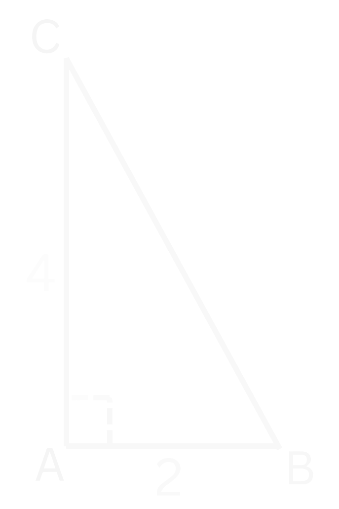
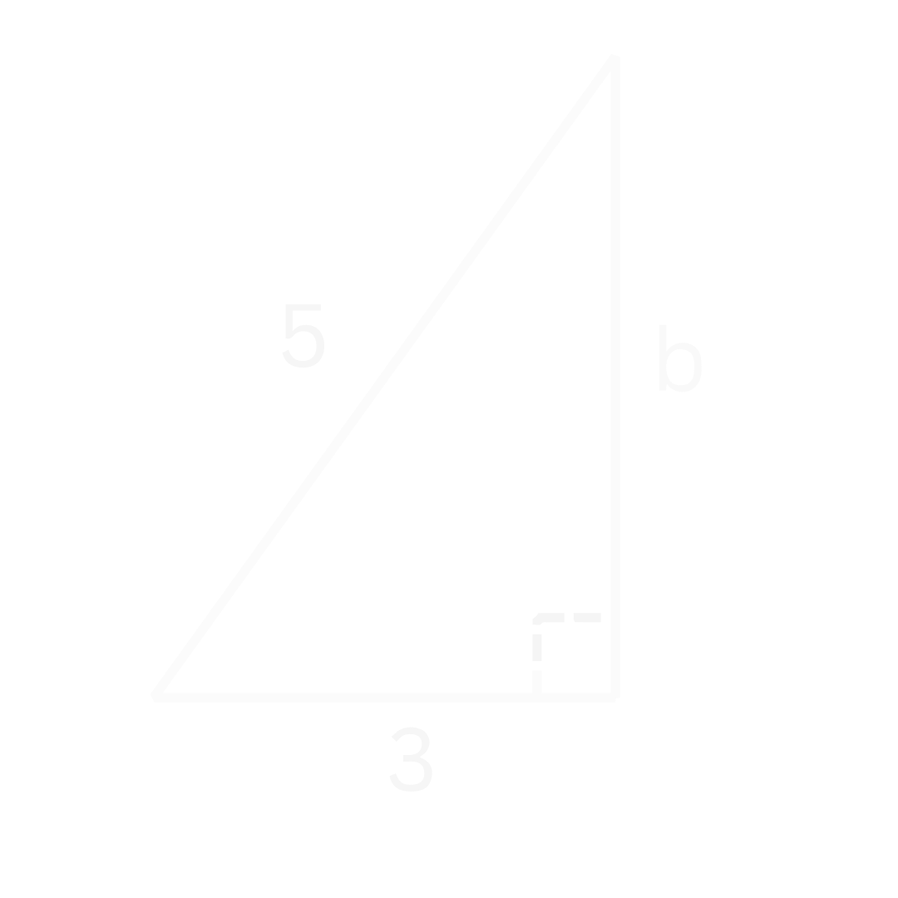
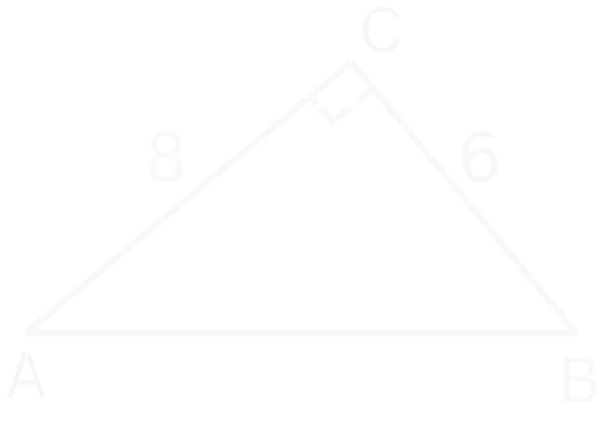
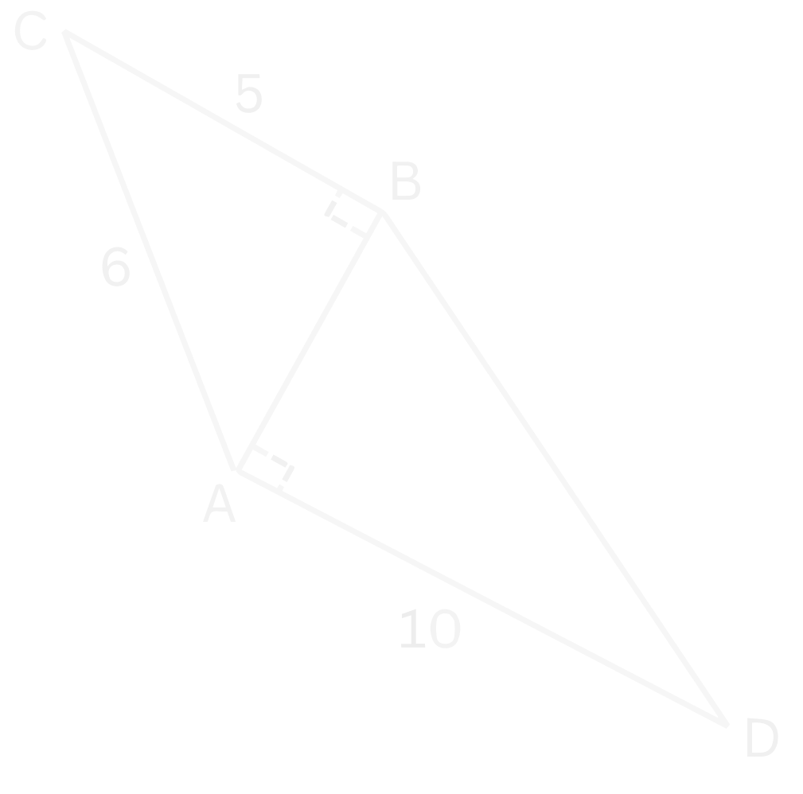

# *De Stelling van Pythagoras*
## **Theorie**

Met de stelling van Pythagoras kunnen we de zijdes van een rechthoekige driehoek bepalen. Dit is een driehoek waarvan één van de hoeken $90 ^{\circ}$ is. Deze hoek noemen we dan ook de *rechte hoek*. 

De stelling van Pythagoras gaat als volgt:

$$\large{\boxed{a^2 + b^2 = c^2}}$$

Hier zijn $a$ en $b$ de zijdes die verbonden zijn met de rechte hoek. Deze zijdes noemen we daarom ook de *rechthoekszijdes*. Verder is $c$ de schuine zijde van de driehoek. Deze schuine zijde is de zijde tegenover de rechte hoek en is altijd de langste zijde van de driehoek.

<figure markdown>
  
{ width="300"}
    <figcaption>Figuur 1. Een rechtehoekige driehoek, dus een driehoek waarbij 1 hoek 90° is. $a$ en $b$ zijn de rechthoekszijdes, $c$ is de schuine zijde. </figcaption>
</figure>

In Figuur 1 zijn $a$ en $b$ dus de rechthoekszijdes, want die zijdes zijn verbonden met de rechte hoek. Zijde $c$ is dan de schuine zijde, want dit is de zijde tegenover de rechte hoek. 

 
Maar waar komt de Stelling van Pythagoras vandaan? Hieronder is er een filmpje die dit laat zien:
???+ video
    **
Bewijs Stelling van Pythagoras
**
    <video controls>
      <source src="../assets/videos/Pythagoras.mp4" type="video/mp4">
    </video>

 
Laten we een voorbeeld bekijken. In Figuur 2 hieronder zien we dat we twee zijdes gegeven hebben gekregen.

<figure markdown>
  
{ width="200"}
    <figcaption>Figuur 2. Een rechtehoekige driehoek met de twee zijdes gegeven. Zijde $AC$ heeft lengte $4$ en zijde $AB$ heeft lengte $2$. </figcaption>
</figure>

Stel we willen de zijde $BC$ bepalen, hoe pakken we dat aan?

We gebruiken dan de Stelling van Pythagoras:

$$a^2 + b^2 = c^2$$

Als we kijken naar Figuur 2, dan zien we dat zowel $AB$ als $AC$ verbonden is met de rechte hoek. Dit betekent dus dat $AB$ en $AC$ de rechthoekszijdes $a$ en $b$ zijn. Zijde $c$ moet dan wel $BC$ zijn:

$$AB^2 + AC^2 = BC^2$$

Nu kunnen we $AB$ en $AC$ invullen:

$$4^2 + 2^2 = AC^2$$

Als we de kwadraten uitwerken, krijgen we:

$$16 + 4 = AC^2$$

en dus:

$$AC^2 = 20$$

Nu kunnen we de lengte van $AC$ bepalen door aan beide kanten de wortel te nemen:

$$AC = \sqrt{20}$$

Als we dit in onze rekenmachine invullen, dan vinden we:

!!! quote ""
    $$\large{AC \approx 4.47}$$

???+ Belangrijk
    **De Stelling van Pythagoras**

    Bij een rechthoekige driehoek zijn de twee rechthoekszijdes in het kwadraat samen gelijk aan de schuine zijde in het kwadraat:

    $$\Large{\boxed{a^2 + b^2 = c^2}}$$

    - **Rechthoekszijde:** Een zijde die verbonden is met de rechte hoek (hoek van $90^{\circ} \,$)
    - **Schuine zijde:** De zijde tegenover de rechte hoek. Het is ook altijd de langste zijde van de driehoek.

## **Voorbeelden**
??? example "Voorbeeld 1: Bereken de lengte van zijde $AC$"
    *
In Figuur 1 hieronder is er een rechthoekige driehoek weergegeven waarbij zijdes $AB$ en $BC$ allebei een lengte van $2$ hebben.
*

    <figure markdown>
      
{ width="200"}
      <figcaption>Figuur 1. Een rechtehoekige driehoek met twee rechte zijdes van lengte $2$.</figcaption>
    </figure>

     

    **Bereken de lengte van zijde $AC$. Rond zo nodig af op $2$ decimalen.**

         
    **
Uitwerking
**

    Als we kijken naar Figuur 1, dan zien we dat zijdes $AB$ en $BC$ verbonden zijn met de rechte hoek, dus dat zijn de rechthoekszijdes. Dit betekent dus ook dat zijde $AC$, die tegenover de rechte hoek is, de schuine zijde is. De Stelling van Pythagoras wordt dus:

    $$\large{AB^2 + BC^2 = AC^2}$$

    Nu kunnen we zijdes $AB$ en $BC$ invullen, want die hebben allebei een lengte $2$:

    $$\large{2^2 + 2^2 = AC^2}$$

    Als we de kwadraten uitwerken, dan krijgen we:

    $$\large{4 + 4 = AC^2}$$

    en dus:

    $$\large{AC^2 = 8}$$

    Om $AC$ te kunnen bepalen, moeten we aan beide kanten de wortel nemen. We krijgen dan:

    $$\large{AC = \sqrt{8}}$$

    En als we dit invullen op onze rekenmachine, dan vinden we:

    $$\large{AC = 2.82842712474619...}$$

    We moesten afronden op $2$ decimalen, dus we vinden dan:

    !!! quote ""
        $$\large{c \approx 2.83}$$

??? example "Voorbeeld 2: Bereken de lengte van zijde $AC$"
    *
In Figuur 2 hieronder zien we een rechthoekige driehoek waarbij zijde $AB$ een lengte $4$ heeft en zijde $AB$ een zijde $3$
*

    <figure markdown>
      
{ width="200"}
      <figcaption>Figuur 2. Een rechtehoekige driehoek met zijde $AB = 4$ en zijde $BC = 3$.</figcaption>
    </figure>

     

    **Bereken de lengte van zijde $AC$. Rond zo nodig af op $2$ decimalen.**

         
    **
Uitwerking
**

    Als we kijken naar Figuur 2, dan zien we dat zijde $AB$ tegenover de rechte hoek ligt, dus dit is de schuine zijde. Zijde $BC$ is verbonden met de rechte hoek, dus dit is een rechthoekszijde. Zijde $AC$ is dus de andere rechthoekszijde.

    Als we de Stelling van Pythagoras willen opstellen, moeten we goed opletten. We doen altijd de twee rechthoekszijdes in het kwadraat plus elkaar. Dus in dit geval wordt dat:

    $$\large{BC^2 + AC^2 = AB^2}$$

    We weten dat $BC = 3$ en $AB = 4$:

    $$\large{3^2 + AC^2 = 4^2}$$

    Nu werken we de kwadraten uit:

    $$\large{9 + AC^2 = 16}$$

    We krijgen dus dat $AC^2 + 9$ gelijk is aan $16$. Dit betekent dus dat $AC^2$ gelijk moet zijn aan $7$ (zie eventueel ook [Vergelijkingen Omschrijven](basisvaardigheden.md#vergelijkingen-omschrijven)):

    $$\large{AC^2 = 7}$$

    Nu kunnen we $AC$ bepalen door de wortel te nemen:

    $$\large{AC = \sqrt{7}}$$

    En als we dit invullen op onze rekemachine, dan vinden we:

    $$\large{x = 2.64575131106459...}$$

    !!! quote ""
        $$\large{b \approx 2}$$ 

??? example "Voorbeeld 3: Bereken de lengte van zijde $AB$"
    *
In Figuur 3 zien we een rechthoekige driehoek waarbij zijde $AC$ een lengte van $8$ heeft en zijde $BC$ een lengte $6$.
*

    <figure markdown>
      
{ width="250"}
      <figcaption>Figuur 3. Een rechtehoekige driehoek met met zijdes $AC = 8$ en $BC = 6$.</figcaption>
    </figure>

     

    **Bereken de lengte van zijde $AB$. Rond zo nodig af op $2$ decimalen.**

         
    **
Uitwerking
**

    We zien in Figuur 3 dat zijdes $AC$ en $BC$ allebei verbonden zijn met de rechte hoek. Dit betekent dus dat het allebei rechthoekszijdes zijn en dus ook dat zijde $AB$ de schuine zijde is. De Stelling van Pythagoras wordt dus:

    $$\large{AC^2 + BC^2 = AB^2}$$

    Nu vullen we de lengte van de zijdes $AC$ en $BC$ in:

    $$\large{8^2 + 6^2 = AB^2}$$

    Als we de kwadraten uitwerken, dan vinden we:

    $$\large{64 + 36 = AB^2}$$

    en dus:

    $$\large{AB^2 = 100}$$

    Om $AB$ te bepalen, moeten we de wortel nemen. We krijgen dus:

    $$\large{AB = \sqrt{100}}$$

    We kunnen dit invullen op onze rekenmachine. We vinden dan:

    !!! quote ""
        $$\large{AB = 10}$$

??? example "Voorbeeld 4: Bereken de lengte van zijde $AB$ en van zijde $BD$"
    *
We zien in Figuur 4 twee rechte driehoeken aan elkaar met de gegeven zijdes $AC=6$, $BC = 5$ en $AD = 10$
*

    <figure markdown>
      
{ width="250"}
      <figcaption>Figuur 4. Een rechtehoekige driehoek met twee rechte zijdes van lengte $2$.</figcaption>
    </figure>

     

    **Bereken de lengte van zijdes $AB$ en $BD$ zo nodig op $2$ decimalen nauwkeurig.**

         
    **
Uitwerking
**

    We beginnen eerst met zijde $AB$ bepalen. We hebben de driehoek $\Delta ABC$ en de driehoek $\Delta ABD$. Van driehoek $\Delta ABC$ weten we $2$ zijdes, van driehoek $\Delta ABD$ weten we maar $1$ zijde. We gebruiken dus driehoek $\Delta ABC$ om zijde $AB$ te bepalen.

    We zien in Figuur 4 dat zijde $AC$ tegenover de rechte hoek is, dus dat is de schuine zijde. Zijdes $BC$ en $AB$ zijn verbonden met de rechte hoek, dus dat zijn de rechthoekszijdes. De Stelling van Pythagoras wordt dus:

    $$\large{AB^2 + BC^2 = AC^2}$$

    We vullen nu de gegevens in die we hebben:

    $$\large{AB^2 + 5^2 = 6^2}$$

    En als we de kwadraten uitwerken:

    $$\large{AB^2 + 25 = 36}$$

    We zien dat $AB^2$ plus $25$ gelijk is aan $36$. We moeten $11$ optellen bij $25$ om $36$ te krijgen, dus dit moet betekenen dat $AB^2$ gelijk is aan $11$ (zie eventueel anders ook [Vergelijkingen Omschrijven](basisvaardigheden.md#vergelijkingen-omschrijven)):

    $$\large{AB^2 = 11}$$

    Om achter $AB$ te komen, moeten we aan beide kanten de wortel nemen om van het kwadraat af te komen:

    $$\large{AB = \sqrt{11}}$$

    Als we dit op onze rekenmachine invullen, dan vinden we:

    $$\large{AB = 3.3166247903554...}$$

    Afgerond op $2$ decimalen wordt dit:

    !!! quote ""
        $$\large{AB \approx 3.32}$$

     

    Nu dat we zijde $AB$ hebben bepaald, kunnen we ook zijde $BD$ bepalen. We hebben nu namelijk $2$ zijdes van driehoek $\Delta ABD$.

    Als we weer kijken naar Figuur 4, dan zien we dat zijde $AD$ en zijde $AB$ allebei verbonden zijn met de rechte hoek, dus het zijn allebei rechthoekszijcdes. Zijde $BD$ is dan dus de schuine zijde. De Stelling van Pythagoras word dus:

    $$\large{AB^2 + AD^2 = BD^2}$$

    En nu vullen we de lengte van de zijdes in:

    $$3.3166247903554...^2 + 10^2 = BD^2$$

    Het is hier heel belangrijk dat we voor $AB$ de niet afgeronde versie gebruiken zodat we geen afrondfouten maken. 

    Als we de kwadraten berekenen, dan vinden we:

    $$\large{11 + 100 = BD^2}$$

    en dus:

    $$\large{BD^2 = 111}$$

    Om de lengte $BD$ te bepalen moeten we aan beide kanten de wortel nemen zodat we van het kwadraat af komen:

    $$\large{BD = \sqrt{111}}$$

    Als we dit invullen op onze rekenmachine, dan vinden we:

    $$\large{BD = 10.5356537528527...}$$

    We moesten afronden op $2$ decimalen, dus ons eindantwoord wordt:

    !!! quote ""
        $$\large{BD \approx 10.54}$$

