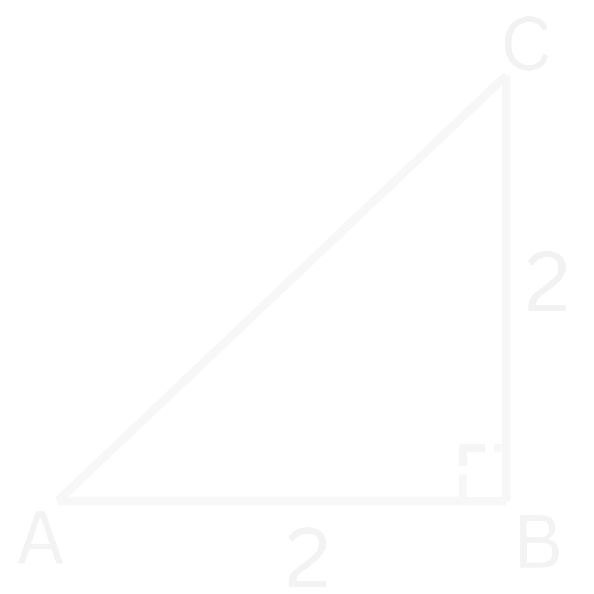

# *De Stelling van Pythagoras*
## **Theorie**

Met de stelling van Pythagoras kunnen we de zijdes van een rechte driehoek bepalen. De stelling gaat als volgt: Bij een rechte driehoek zijn de twee rechte zijdes in het kwadraat samen gelijk aan de schuine zijde in het kwadraat. De rechte zijdes zijn de zijdes die verbonden zijn met de rechte hoek van De schuine zijde is de zijde tegenover de rechte hoek van $90 ^{\circ}$.

<figure markdown>
  { width="300"}
  <figcaption>Figuur 1. Een rechte driehoek, dus een driehoek waarbij 1 hoek 90° is. <strong>a</strong> en <strong>b</strong> zijn de rechthoekszijdes, <strong>c</strong> is de schuine zijde. </figcaption>
</figure>

In formule form wordt de Stelling van Pythagoras:

!!! belangrijk
    $$\LARGE{a^2 + b^2 = c^2.}$$

Hier zijn $a$ en $b$ dus de rechthoekszijdes en $c$ is de schuine zijde. 

Hieronder is er een filmpje om te laten zien waar de Stelling van Pythagoras vandaan komt.
???+ video
    <video controls>
      <source src="../assets/videos/Pythagoras.mp4" type="video/mp4">
    </video>

    *
Filmpje: Visueel bewijs van de Stelling van Pythagoras
*

## **Voorbeelden**
??? example "Voorbeeld 1: Bereken de lengte van de schuine zijde"
    ### Voorbeeld 1
    **
Vraag: Wat is de lengte van de schuine zijde $c$?
**
        **
Uitwerking
**
    
    <figure markdown>
      { width="300"}
      <figcaption>Figuur 2. Een rechte driehoek met twee rechte zijdes met lengte 2.</figcaption>
    </figure>

    **
Uitwerking
**
    We beginnen met het opschrijven van de stelling van Pythagoras

    $$\large{a^2 + b^2 = c^2}$$

    We weten dat de rechthoekszijdes allebei een lengte van 2 hebben en dus dat $a = 2$ en $b = 2$. Dit kunnen we nu gaan invullen.

    $$\large{2^2 + 2^2 = c^2}$$

    $$\large{c^2 = 8}$$

    Nu nemen we aan beide kanten de wortel om van $c^2$ naar $c$ te gaan (zie eventueel de [Regels met Wortels](basisvaardigheden.md#regels-met-wortels))

    $$\large{c = \sqrt{8}}$$

    Dit kunnen we versimpelen tot:

    !!! quote ""
        $$\large{c = 2\sqrt{2}}$$
    
     

??? example "Voorbeeld 2: Bereken de lengte van een van de rechte zijdes"
    ### Voorbeeld 2
    **
Vraag: Wat is de lengte van de rechte zijde $b$?
**
    **
Uitwerking
** 

    <figure markdown>
      { width="300"}
      <figcaption>Figuur 3. Een rechte driehoek met 1 rechte zijde met lengte 3 en een schuine zijde met lengte 5.</figcaption>
    </figure>

    We schrijven eerst weer de Stelling van Pythagoras op:

    $$\large{a^2 + b^2 = c^2}$$

    Nu vullen we de gegevens in die we hebben. We weten dat 1 rechtehoekszijde een lengte heeft van 3 en dat de schuine zijde een lengte heeft van 5. Oftewel $a=3$ en $c=5$. Laten we dit invullen:

    $$\large{3^2 + b^2 = 5^2}$$

    $$\large{9 + b^2 = 25}$$

    We willen nu de $b^2$ term vrij maken om dit op te lossen. Dit doen we door aan beide kanten van het '$=$' teken $-9$ te doen. We krijgen dan:

    $$\large{b^2 = 25 - 9}$$

    $$\large{b^2 = 16}$$

    Om het kwadraat weg te werken nemen we aan beide kanten de wortel:

    $$\large{\sqrt{b^2} = \sqrt{16}}$$

    Het kwadraat en de wortel vallen tegen elkaar weg, dus we houden over:

    $$\large{b = \sqrt{16}}$$

    (zie eventueel regel 6 van de [Regels met Wortels](basisvaardigheden.md#regels-met-wortels)). Als we de wortel van $16$ nog verder versimpelen, dan krijgen we uiteindelijk: 

    !!! quote ""
        $$\large{b = 4}$$ 
