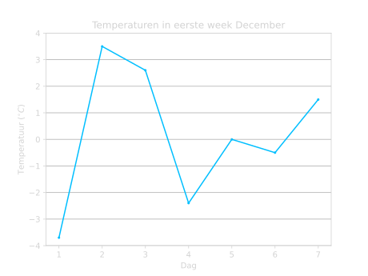

# *Statistiek*
We gebruiken statistiek om gegevens beter te kunnen begrijpen. Dit kunnen we doen door het op een begrijpelijke manier weer te geven. Bijvoorbeeld in een staafdiagram, histogram of een cirkeldiagram. Maar we kunnen ook bepaalde gegevens berekenen die ons helpen de data beter te begrijpen. Bijvoorbeeld het gemiddelde, de mediaan of de modus geeft ons een beeld van hoe de data eruit ziet. Dit is handig, want dan hoeven we niet alles te zien, maar we kunnen toch iets over deze data zeggen. Ook is dit handig als we data willen vergelijken.

## **Data weergeven**
We kunnen informatie handig weergeven in grafieken en in diagrammen. We kijken naar een paar verschillende type diagrammen en bekijken hoe je ze af moet lezen en zelf maken. 

### **Staafdiagrammen**
We beginnen met staafdiagrammen. Laten we naar een voorbeeld kijken om te zien hoe het werkt. Dus stel we willen kijken naar het aantal fietsen dat een fietsenwinkel verkoopt in 1 week. We krijgen de volgende data:

| Dag       | Aantal fietsen |
|-----------|----------------|
| Maandag   | 8              |
| Dinsdag   | 5              |
| Woensdag  | 9              |
| Donderdag | 4              |
| Vrijdag   | 15             |
| Zaterdag  | 24             |
| Zondag    | 11             |

Hoe kunnen we dit nu op een handige en duidelijke manier weergeven? We kunnen dit doen met een **staafdiagram**. In Figuur 1 is er een staafdiagram weergegeven van deze data. 

<figure markdown>
{ width="500"}
    <figcaption>Figuur 1. Staafdiagram van het aantal verkochte fietsen in 1 week.</figcaption>
</figure>

Hiermee kunnen we precies zien hoeveel fietsen er op elke dag zijn verkocht. Ook zien we meteen op welke dag de meeste fietsen zijn verkocht en op welke dag de minste fietsen.

We zien dat er op zaterdag de meeste fietsen zijn verkocht, want die staaf is het hoogst. We kunnen ook zien dat er toen 24 fietsen verkocht waren. Verder kunnen we ook zien dat op donderdag de minste fietsen zijn verkocht, want die staaf is het kleinst. Er waren namelijk toen maar 4 fietsen verkocht. 

???+ belangrijk
    **
Wanneer gebruiken we een Staafdiagram?
**
    Als we:

    - Frequentie van verschillende groepen of categorieën willen weergeven en vergelijken.
    - Frequenties willen vergelijken van dezelfde groep met meerdere datasets.
    
In ons voorbeeld is elke dag een andere groep en is de frequentie het aantal fietsen. We zien dus hoeveel fietsen (frequentie) er verkocht zijn per dag (groep).

### **Histogrammen**
Laten we nu kijken naar een klas die een wiskunde toets heeft gemaakt. De leerlingen hebben dus allemaal verschillende cijfers gehaald. We kunnen die data weergeven met een zogenaamde **histogram**. In Figuur 2 zien we hoe dit eruit ziet.

<figure markdown>
{ width="500"}
    <figcaption>Figuur 2. Histogram van de behaalde cijfers voor een wiskunde toets.</figcaption>
</figure>

Dus $4$ leerlingen hebben een $4$ gehaald, $8$ leerlingen hebben een $7$ gehaald en $3$ leerlingen hebben een $9$ gehaald.

???+ Belangrijk
    **
Wanneer gebruiken we een Histogram?
**
    Als we:

    - Continue dataverdeling willen weergeven.
    - Meerdere datasets tegelijk willen weergeven.
    - Verdelingen van verschillende datasets willen vergelijken.
    
In ons voorbeeld gaat de cijferverdeling van een 4 naar een 9. Dus de leerlingen hebben allemaal tussen een 4 en een 9 gehaald voor de wiskunde toets. En we kunnen dan precies zien hoeveel leerlingen een bepaald cijfer hebben gehaald.

### **Cirkeldiagrammen**
We kunnen het voorbeeld van net ook weergeven in een zogenaamde **cirkeldiagram**.

<figure markdown>
{ width="500"}
    <figcaption>Figuur 3. Cirkeldiagram van de behaalde cijfers voor een wiskunde toets.</figcaption>
</figure>

In Figuur 3 kunnen we zien welk deel van de leerlingen een bepaald cijfer heeft gehaald. Dus $26.7\%$ heeft een $7$ gehaald, $20\%$ een heeft een $8$ gehaald, $10\%$ heeft een $9$ gehaald, etc.

???+ Belangrijk
    **
Wanneer gebruiken we een Cirkeldiagram?
**
    Als we:

    - (Een klein aantal) verschillende groepen willen vergelijken.
    - Vooral de relatieve/procentuele verschillen willen weergeven.
    
We kunnen nu dus goed zien welk deel van de leerlingen een bepaald cijfer heeft gehaald. Maar we kunnen niet meer meteen zien hoeveel dat er waren. We kunnen dus niet meer meteen zien dat het 8 leerlingen waren die een 7 hebben gehaald. We kunnen alleen maar zien dat het $26.7\%$ is van alle leerlingen. 

### **Lijndiagrammen**
De laatste manier om data weer te geven is met een **lijndiagram**. We kijken nu naar de temperatuur in de maand Juli. 

<figure markdown>
{ width="500"}
    <figcaption>Figuur 4. Lijndiagram van de temperatuur in de maand Juli. De maximum temperatuur op een dag is aangegeven in het blauw en de minimum temperatuur in het groen.</figcaption>
</figure>

We kunnen in Figuur 4 precies aflezen wat de minimum temperatuur en wat de maximum temperatuur is op elke dag in Juli. Dus op $10$ Juli was de minimum temperatuur ongeveer $23 \ ^{\circ} \textrm C$ en de maximum temperatuur ongeveer $29 \ ^{\circ} \textrm C$.

???+ Belangrijk
    **
Wanneer gebruiken we een Lijndiagram?
**
    Als we:

    - Een verband tussen twee waardes willen weergeven.
    - Meerdere datasets met dezelfde grootheden tegelijk willen weergeven.

In dit geval kijken we naar het verband tussen de grootheden temperatuur en tijd. We kunnen dan precies zijn hoe de temperatuur verandert in de tijd. We vergelijken ook meerdere datasets met dezelfde grootheden. We kijken namelijk naar de maximum temperatuur en de minimum temperatuur per dag. Dus beide datasets hebben de grootheden temperatuur en tijd, maar met verschillende waardes.

## **Gemiddelde**
Het gemiddelde is handig om iets te kunnen zeggen over de hele dataset. Over het algemeen kun je dan kijken waar de meeste data zich bevindt. Dit maakt het vergelijken van verschillende datasets makkelijker. 

Laten we bijvoorbeeld naar twee verschillende klassen kijken: klas A en klas B. De twee klassen hebben net een toets gemaakt en alle leerlingen hebben hun cijfer terug. De cijfers van beide klassen is weergegeven in een histogram in Figuur 5.

<figure markdown>
{ width="500"}
    <figcaption>Figuur 5. Histogram van de behaalde cijfers voor een wiskunde toets van klas A en klas B.</figcaption>
</figure>

We zien hier dat de cijfers van klas A over het algemeen hoger zijn dan die van klas B. Maar hoeveel beter heeft klas A het over het algemeen gedaan? Om dit te bekijken, is het handig om de gemiddeldes te berekenen en die te vergelijken.

We berekenen een gemiddelde op de volgende manier:

???+ Belangrijk
    ### **
Gemiddelde berekenen
**

    1. Tel alle getallen bij elkaar op.

    2. Deel het door het aantal getallen.

    $$\Large{\textrm{Gemiddelde} = \frac{\textrm{Som van de getallen}}{\textrm{Aantal getallen}}}$$

??? example "Simpel Voorbeeld"
    Voor de getallen $2, 4, 6, 8$ kunnen we het gemiddelde als volgt berekenen:

    1. We tellen alle getallen bij elkaar op:

    $$\large{2 + 4 + 6 + 8 = 20}$$

    2. Dan delen we het door het aantal getallen:

    $$\large{\frac{20}{4} = 5}$$

    Het gemiddelde van deze reeks getallen is dus $5$.

Om het gemiddelde van de twee klassen te bepalen moeten we dus eerst alle cijfers van alle leerlingen bij elkaar op tellen. Hiervoor moeten we voor elk cijfer weten hoeveel leerlingen dat cijfer hebben gehaald. Uit Figuur 5 kunnen we de volgende tabel maken:

    

<h2 style="margin-left:70px;">Klas A</h2>

<table style="float:left;">
  <tr>
    <th>Cijfers</th>
    <th>Frequentie</th>
  </tr>
  <tr>
    <td>4.5</td>
    <td>5</td>
  </tr>
  <tr>
    <td>5.0</td>
    <td>4</td>
  </tr>
  <tr>
    <td>5.5</td>
    <td>5</td>
  </tr>
  <tr>
    <td>6.0</td>
    <td>6</td>
  </tr>
  <tr>
    <td>6.5</td>
    <td>7</td>
  </tr>
  <tr>
    <td>7.0</td>
    <td>7</td>
  </tr>
  <tr>
    <td>7.5</td>
    <td>9</td>
  </tr>
  <tr>
    <td>8.0</td>
    <td>8</td>
  </tr>
  <tr>
    <td>8.5</td>
    <td>6</td>
  </tr>
  <tr>
    <td>9.0</td>
    <td>4</td>
  </tr>
  <tr>
    <td>9.5</td>
    <td>1</td>
  </tr>
</table>

    

    

<h2 style="margin-left:100px;">Klas B</h2>
<table style="float:left; margin-left:20px;">
  <tr>
    <th>Cijfers</th>
    <th>Frequentie</th>
  </tr>
  <tr>
    <td>3.0</td>
    <td>5</td>
  </tr>
  <tr>
    <td>3.5</td>
    <td>6</td>
  </tr>
  <tr>
    <td>4.0</td>
    <td>9</td>
  </tr>
  <tr>
    <td>4.5</td>
    <td>10</td>
  </tr>
  <tr>
    <td>5.0</td>
    <td>11</td>
  </tr>
  <tr>
    <td>5.5</td>
    <td>9</td>
  </tr>
  <tr>
    <td>6.0</td>
    <td>8</td>
  </tr>
  <tr>
    <td>6.5</td>
    <td>7</td>
  </tr>
  <tr>
    <td>7.0</td>
    <td>3</td>
  </tr>
</table>

    

Om nu het gemiddelde te berekenen, berekenen we eerst de som van alle cijfers. We beginnen met klas A. Om dit te doen moeten we dus alle cijfers van alle leerlingen bij elkaar op tellen. We kunnen dit doen door steeds het cijfer keer het aantal mensen met dat cijfer te doen. En dit kunnen we dan allemaal bij elkaar optellen:

$\textrm{Som cijfers klas A} = 5 \times 4.5 + 4 \times 5.0 + 5 \times 5.5 + 6 \times 6.0 + 7 \times 6.5 + 7 \times 7.0$
 
$\phantom{\textrm{Som cijfers klas A ...}} + 9 \times 7.5 + 8 \times 8.0 + 6 \times 8.5 + 4 \times 9.0 + 1 \times 9.5$

$$\textrm{Som cijfers klas A} = 428.5$$

Nu berekenen we het totaal aantal leerlingen. Dit doen we door alle frequenties bij elkaar op te tellen. Elke leerling heeft namelijk maar 1 cijfer gehaald. Dus het aantal behaalde cijfers is dan ook meteen het aantal leerlingen.

$$\textrm{Aantal leerlingen klas A} = 5 + 4 + 5 + 6 + 7 + 7 + 9 + 8 + 6 + 4 + 1$$

$$\textrm{Aantal leerlingen klas A} = 62$$

We kunnen nu het [gemiddelde berekenen](#gemiddelde-berekenen) door deze twee waardes door elkaar te delen:

$$\textrm{Gemiddelde klas A} = \frac{428.5}{62} \approx 6.9$$

Het gemiddelde van klas A is dus een $6.9$. 

Om het gemiddelde van klas B te bepalen doen we precies dezelfde stappen:

We tellen eerst weer alle cijfers keer hun frequentie bij elkaar op:

$\textrm{Som cijfers klas B} = 5 \times 3.0 + 6 \times 3.5 + 9 \times 4.0 + 10 \times 4.5 + 11 \times 5.0 + 9 \times 5.5$
 
$\phantom{\textrm{Som cijfers klas B ...}} + 8 \times 6.0 + 7 \times 6.5 + 3 \times 7.0$

$$\textrm{Som cijfers klas B} = 336$$

Het totaal aantal leerlingen is alle frequenties bij elkaar opgeteld:

$$\textrm{Aantal leerlingen klas B} =  5 + 6 + 9 + 10 + 11 + 9 + 8 + 7 + 3$$

$$\textrm{Aantal leerlingen klas B} = 68$$

En het gemiddelde wordt dan:

$$\textrm{Gemiddelde klas B} = \frac{336}{68} \approx 4.9$$

Het gemiddelde van klas B is dus een $4.9$. 

Het gemiddelde van klas A is dus $2$ cijferpunten hoger dan die van klas B. Dus over het algemeen heeft een leerling uit klas A $2$ cijferpunten hoger gehaald dan een leerling uit klas B.

<figure markdown>
.svg){ width="500"}
    <figcaption>Figuur 5 (met gemiddelde). Histogram van de behaalde cijfers voor een wiskunde toets van klas A en klas B.</figcaption>
</figure>

### **Voorbeelden**
??? example "Voorbeeld 1: Gemiddelde temperatuur eerste week December"
    **
Bereken de gemiddelde temperatuur in de eerste week van December.
**

    *De temperaturen van de eerste week van December zijn weergegeven in Figuur 1. Wat is de gemiddelde temperatuur van deze week?*
    <figure markdown>

    { width="450"}
        <figcaption>Figuur 1. Temperatuur in de eerste week van December.</figcaption>
    </figure>

    **
Uitwerking
**

    We maken eerst een tabel van de temperatuur op elke dag. Hiermee kunnen we namelijk de gemiddelde temperatuur makkelijker berekenen.

    

    | Dag | Temperatuur (°C) |
    |-----|------------------|
    | 1   | -3.7             |
    | 2   | 3.5              |
    | 3   | 2.6              |
    | 4   | -2.4             |
    | 5   | 0.0              |
    | 6   | -0.5             |
    | 7   | 1.5              |

    

    Nu kunnen we het [gemiddelde berekenen](#gemiddelde-berekenen). We bepalen eerst de som van alle temperaturen:

    $$\large{\textrm{Som} = -3.7 + 3.5 + 2.6 + -2.4 + 0.0 + -0.5 + 1.5}$$

    $$\large{\textrm{Som} = 1}$$

    Nu moeten we dit delen door het aantal dagen, dus door $7$. We vinden dan als gemiddelde:

    $$\large{\textrm{Gemiddelde} \frac{1}{7}}$$

    !!! quote ""
        $$\large{\textrm{Gemiddelde} \approx 0.14 \ ^{\circ}\textrm{C}}$$

    Als we dit tekenen in Figuur 1, dan kunnen we controleren of ons antwoord een beetje logisch is. En inderdaad, dit antwoord zou best wel eens kunnen kloppen.

    <figure markdown>
    .svg){ width="450"}
        <figcaption>Figuur 1 (met Gemiddelde). Temperatuur in de eerste week van December.</figcaption>
    </figure>

??? example "Voorbeeld 2: Gemiddelde lengte van groep jongens en meisjes"
    **
Bereken de gemiddelde lengte van een groep met 5 jongens en 5 meisjes.
**

    *Een groep van 5 jongens en 5 meisjes meten allemaal hun lengte. De metingen zijn weergegeven in de onderstaande tabel. *
    
    *Bereken de gemiddelde lengte van de jongens en de gemiddelde lengte van de meisjes. Hoeveel zijn de jongens gemiddeld langer dan de meisjes?*

    |       | Lengte Meisje (cm) |       |       | Lengte Jongen (cm) |       |
    |-------|--------------------|-------|-------|--------------------|-------|
    | **1** | 161                |       | **1** | 176                |       |
    | **2** | 167                |       | **2** | 182                |       |
    | **3** | 172                |       | **3** | 187                |       |
    | **4** | 154                |       | **4** | 171                |       |
    | **5** | 176                |       | **5** | 191                |       |

    **
Uitwerking
**

    We beginnen met de [gemiddelde](#gemiddelde-berekenen) lengte te berekenen van de meisjes. We beginnen met alle lengtes bij elkaar op te tellen:

    $$\large{\textrm{Som meisjes} = 161 + 167 + 172 + 154 + 176}$$

    $$\large{\textrm{Som meisjes} = 830}$$

    Om het gemiddelde te berekenen delen we de som door het totaal aantal meisjes, dus door $5$:

    $$\large{\textrm{Gemiddelde meisjes}} = \frac{830}{5}$$

    !!! quote ""
        $$\large{\textrm{Gemiddelde meisjes}} = 166 \textrm{ cm}$$
    
    We herhalen deze stappen ook voor de jongens:

    $$\large{\textrm{Som jongens} = 176 + 182 + 187 + 171 + 191}$$

    $$\large{\textrm{Som jongens} = 907}$$

    Nu delen we de som weer door het totaal aantal jongens, dus ook door $5$:

    $$\large{\textrm{Gemiddelde jongens}} = \frac{907}{5}$$

    !!! quote ""
        $$\large{\textrm{Gemiddelde jongens}} = 181.4 \textrm{ cm}$$

    We kunnen nu bepalen hoeveel de jongens gemiddeld langer zijn dan de meisjes. We doen de gemiddelde lengte van de jongens min de gemiddelde lengte van de meisjes:

    $$\large{\textrm{Gemiddeld verschil} = 181.4 \textrm{ cm} - 166 \textrm{ cm}}$$

    !!! quote ""
        $$\large{\textrm{Gemiddeld verschil} = 15.4 \textrm{ cm}}$$

    Dus de jongens zijn gemiddeld $15.4$ cm langer dan de meisjes. 

??? example "Voorbeeld 3: Gemiddelde leeftijd"
    **
Bereken de gemiddelde leeftijd van kleinkinderen met én zonder hun grootouders.
**

    *Er zijn wat kleinkinderen op bezoek bij hun opa en oma. De kleinkinderen en hun grootouders verschillen best veel van leeftijd.* 
    
    *Bereken de gemiddelde leeftijd van de kleinkinderen met hun grootouders. Bereken ook de gemiddelde leeftijd van de kleinkinderen zonder hun grootouders.* 
    
    *Hoeveel neemt het gemiddelde af als we de grootouders weglaten?*

    

    | Persoon | Leeftijd |
    |---------|----------|
    | **1**   |  78      |
    | **2**   |  74      |
    | **3**   |  17      |
    | **4**   |  15      |
    | **5**   |  19      |
    | **6**   |  24      |
    | **7**   |  11      |
    | **8**   |  21      |

    

    **
Uitwerking
**

    Om het [gemiddelde](#gemiddelde-berekenen) te berekenen, tellen we eerst alle leeftijden bij elkaar op en dan delen we door het aantal mensen. We beginnen met het gemiddelde berekenen met de grootouders erbij. 

    $$\large{\textrm{Som met grootouders} = 78 + 74 + 17 + 15 + 19 + 24 + 11 + 21}$$

    $$\large{\textrm{Som met grootouders} = 259}$$

    Het totaal aantal mensen met grootouders erbij is $8$, en dus moeten we door $8$ delen. Het gemiddelde wordt dus:

    $$\large{\textrm{Gemiddelde met grootouders} = \frac{259}{8}}$$

    !!! quote ""
        $$\large{\textrm{Gemiddelde met grootouders} = 32.375 \approx 32 \textrm{ jaar}}$$

    Nu bereken we het gemiddelde zonder de grootouders. We berekenen eerst de som:
    
    $$\large{\textrm{Som zonder grootouders} = 17 + 15 + 19 + 24 + 11 + 21}$$

    $$\large{\textrm{Som zonder grootouders} = 107}$$

    Er zijn $6$ kleinkinderen en dus delen we door $6$.

    $$\large{\textrm{Gemiddelde zonder grootouders} = \frac{107}{6}}$$

    !!! quote ""
        $$\large{\textrm{Gemiddelde zonder grootouders} \approx 18 \textrm{ jaar}}$$

    Als we de grootouders weglaten, neemt het gemiddelde dus af met ongeveer:

    !!! quote ""
        $$\large{32 - 18 = 14 \textrm{ jaar}}$$ 

??? example "Voorbeeld 4: Gemiddelde van cijfers met weging"
    **
Bereken het gewogen gemiddelde van alle cijfers.
**

    *Een leerling heeft de volgende cijfers gehaald (zie Figuur 2). Wat staat de leerling gemiddeld voor alle vakken samen als we de weging van de cijfers meenemen?*

    { width="250" align=right }

    Om het [gemiddelde](#gemiddelde-berekenen) te berekenen, berekenen we eerst de som van alle cijfers. We willen het gewogen gemiddelde, dus moeten we de cijfers een weging meegeven. 
    
    Dit doen we door alle individuele cijfers te vermenigvuldigen met hun weging. Hoe zwaarder de weging, hoe meer het gemiddelde erdoor wordt beïnvloed:

    
    $\large{\textrm{Som} = 4 \times 8.5 + 1 \times 6.3 + 1 \times 5.1 + 2 \times 8.9 + \phantom{.}}$
     
    $\large{\phantom{\textrm{Som ....}} 2 \times 4.4 + 1.6 \times 8.1 + 5 \times 8.2 + 4 \times 9.1}$
    

    $$\large{\textrm{Som} = 162.36}$$

    Als we het aantal cijfers willen bepalen, dan moeten we de wegingen bij elkaar op tellen. Dit doen we zodat we niet opeens een cijfer krijgen dat hoger is dan een $10$.

    $\large{\textrm{Aantal cijfers} = 4 + 1 + 1 + 2 + 2 + 1.6 + 5 + 4}$

    $$\large{\textrm{Aantal cijfers} = 20.6}$$

    

        Figuur 2. Cijfers voor verschillende vakken met hun verschillende wegingen.
    

    Nu delen we de som door het aantal cijfers om het gemiddelde te berekenen:

    $$\large{\textrm{Gemiddelde} = \frac{162.36}{20.6}}$$

    !!! quote ""
        $$\large{\textrm{Gemiddelde} \approx 7.9}$$

    Het gewogen gemiddelde van de cijfers is dus een $7.9$.
        

## **Mediaan en Modus**
We hebben net gezien dat een gemiddelde heel erg handig kan zijn om data te vergelijken. Maar soms kan het gemiddelde juist een verkeerd beeld geven. Laten we kijken naar inkomens van $100$ mensen waar er $1$ biljonair bij zit. In Figuur 6 is het inkomen weergegeven van de andere $99$ mensen.

<figure markdown>
{ width="500"}
    <figcaption>Figuur 6. Inkomen van 99 mensen weergegeven in een histogram.</figcaption>
</figure>

Nu voegen we aan deze groep mensen de biljonair toe die een inkomen heeft van $1$ miljard euro. Nu berekenen we het gemiddelde. Als we dit doen, dan vinden we het volgende:

$$\large{\textrm{Gemiddelde} = \Large{\textrm{€}} \large 10.052.841}$$

Het gemiddelde is dus ongeveer 10 miljoen euro! Maar dit is een vertekend beeld, want bijna niemand uit deze groep komt in de buurt van dit gemiddelde. De biljonair zorgt er dus voor dat het gemiddelde heel erg hoog wordt. Het gemiddelde is dus erg gevoelig voor extreem hoge of extreem lage waardes. Daarom is het in dit geval handiger om de **mediaan** te gebruiken.

???+ Belangrijk
    ### **Mediaan bepalen**

    De mediaan is de middelste waarde uit een dataset wanneer de data gesorteerd is van laag naar hoog. Dus om de mediaan te bepalen moeten we het volgende doen:
      
  
    1. Sorteer de data van laag naar hoog.

    2. Is de data oneven? $\Longrightarrow$ Kies het middelste getal.   $\phantom{..}$ Is de data even? $\Longrightarrow$ Bereken het gemiddelde van de middelste twee getallen.

    

??? example "Simpel Voorbeeld: Mediaan"
    **
Oneven dataset
**
    Stel we hebben de volgende dataset: 

    $$\large{9,4,2,3,5}$$

    We willen van deze dataset de mediaan bepalen. Hoe doen we dat?
    
    We beginnen met het sorteren van laag naar hoog:

    $$\large{2,3,4,5,9}$$

    Deze data set is oneven en dus kunnen we gelijk het middelste getal kiezen. In dit geval is dit $4$ en dus is onze mediaan $4$.

    !!! quote ""
        $$\large{\textrm{Mediaan} = 4}$$
      
    **
Even dataset
**

    Stel we hebben nu de volgende dataset:

    $$\large{5,4,8,12,78,2}$$

    Nu willen we weer de mediaan bepalen. Dus we sorteren eerst dit weer van laag naar hoog:

    $$\large{2,4,5,8,12,78}$$

    Deze dataset is even en dus moeten we het gemiddelde nemen van de middelste twee getallen. De middelste twee getallen zijn $5$ en $8$, dus onze mediaan wordt:

    !!! quote ""
        $$\large{\textrm{Mediaan} = \frac{5 + 8}{2} = 6.5}$$

Laten we weer terug gaan naar de inkomens van de groep van 100 mensen. Als we de mediaan willen bepalen, dan moeten we dus alle $100$ inkomens op volgorde van laag naar hoog zetten. $100$ is een even getal en dus berekenen we het gemiddelde van de middelste twee waardes. Als we dit doen, dan vinden we als mediaan:

$$\large{\textrm{Mediaan} = \Large{\textrm{€}} \large 55.834}$$

En we zien dat dit meer lijkt op het inkomen van de meeste mensen, in tegenstelling tot het gemiddelde.

Apart van de **mediaan**, kunnen we ook de **modus** bepalen om de data beter te begrijpen. De modus vertelt ons welk getal het vaakst voorkomt.

???+ Belangrijk
    ### **Modus bepalen**
    Over de modus:

    - De modus is het getal dat het vaakst voorkomt.
    - Het is handig om de data te sorteren van laag naar hoog om dit makkelijk te zien.
    - Als er twee getallen zijn die allebei het meest voorkomen, dan is er geen modus.

??? example "Simpel Voorbeeld: Modus"
    **
Modus bepalen
**
    Stel we hebben de volgende dataset:

    $$\large{1,4,2,3,2}$$

    Stel we willen weten wat de modus is van deze getallen, dus welk getal het vaakst voorkomt. Om dat te doen, is het handig om de data te sorteren van laag naar hoog. We vinden dan:

    $$\large{1,2,2,3,4}$$

    We zien dat het getal $2$ het vaakst voorkomt en dus is onze modus $2$.

    $$\large{\textrm{Modus} = 2}$$

    **
Geen Modus
**

    Stel we willen weer de modus bepalen van deze dataset:

    $$\large{1,3,4,3,6,4,7,8}$$

    We sorteren het dan eerst weer van laag naar hoog:

    $$\large{1,3,3,4,4,6,7,8}$$

    We zien nu dat $3$ en $4$ allebei het meest voorkomen en omdat dit meer dan 1 getal is, hebben we geen modus.

    $$\large{\textrm{Geen Modus}}$$

### **Voorbeelden**

??? example "Voorbeeld 1: Mediaan en Modus van het aantal dobbelsteen ogen"
    **
Bepaal de Mediaan en de Modus van het aantal dobbelsteen ogen
**

    *Er is meerdere keren met een dobbelsteen gegooid. De uitslagen van het aantal ogen is hier rechts weergegeven in Figuur 1. Wat is de mediaan en wat is de modus van deze worpen?*

    **
Uitwerking
**

    { width="200" align=right }

    Om te bepalen wat de mediaan is, is het handig om het aantal ogen per worp te sorteren van laag naar hoog. Als we dit doen, dan vinden we:

    $$\large{1,1,1,2,2,2,2,3,3,4,5,6}$$

    Nu berekenen we de mediaan. Er waren $12$ worpen en dit is een even getal. We moeten dus de middelste twee getallen nemen en daar het gemiddelde van nemen. De middelste twee getallen zijn:

    

        Figuur 1. Weergave van de verschillende worpen van een dobbelsteen.
    

    $$\large{1,1,1,2,2, \boxed{2,2} ,3,3,4,5,6}$$

    Het gemiddelde van $2$ met zichzelf is gewoon $2$ en dus krijgen we:

    !!! quote ""
        $$\large{\textrm{Mediaan} = 2}$$

    Om de modus te bepalen moeten we kijken welk getal het vaakst voorkomt. Met het gesorteerd aantal ogen kunnen we zien dat $2$ ogen het vaakst is gegooid. De modus is dus $2$.

    !!! quote ""
        $$\large{\textrm{Modus} = 2}$$

??? example "Voorbeeld 2: Mediaan en Modus van verschillende schoenmaten"
    **
Bepaal de Mediaan en de Modus van de verschillende schoenmaten
**

    *
Een groep leerlingen heeft allemaal gemeten wat hun schoenmaat is. Dit is weergegeven in Figuur 2. Bepaal van deze data de mediaan en de modus.
*

    { width="300" align=right }

    **
Uitwerking
**
    Om te bepalen wat de mediaan is, moeten we eerst alle schoenmaten sorteren van laag naar hoog. Als we dit doen, dan vinden we het volgende:

    $$\large{35, 36, 37, 38, 39, 40, 41, 42, 43, 44}$$

    Dit is een even dataset, dus moeten we het gemiddelde nemen van de middelste twee getallen. De middelste twee getallen zijn:

    

        Figuur 2. De verschillende schoenmaten van de groep leerlingen.
    

    $$\large{35, 36, 37, 38, \boxed{39, 40} , 41, 42, 43, 44}$$

    De mediaan is dus het gemiddelde van $39$ en $40$:

    $$\large{\textrm{Mediaan} = \frac{39 + 40}{2}}$$

    !!! quote ""
        $$\large{\textrm{Mediaan} = 39.5}$$

    De modus is het getal dat het vaakst voorkomt. In dit geval komen alle getallen even vaak voor, en is er dus geen modus

    !!! quote ""
        $$\large{\textrm{Geen Modus}}$$

??? example "Voorbeeld 3: Mediaan en Modus van het aantal huisdieren"
    **
Bepaal de Mediaan en de Modus van het aantal huisdieren
**

    *Leerlingen uit een klas hebben allemaal doorgegeven hoeveel huisdieren ze hebben. Dit is weergegeven in een histogram in Figuur 3. Bepaal van deze data de mediaan en de modus.*

    <figure markdown>
    .svg){ width="500"}
        <figcaption>Figuur 3. Histogram van het aantal huisdieren per leerling.</figcaption>
    </figure>

    **
Uitwerking
**

    We kunnen uit Figuur 3 meteen aflezen dat $1$ huisdier per leerling het vaakst voorkomt en dus is de modus $1$.

    !!! quote ""
        $$\large{\textrm{Modus} = 1}$$

    Om de mediaan te bepalen zouden we de data uitkunnen schrijven, maar we kunnen het ook doen met de grafiek. De totaal aantal leerlingen is:

    $$\large{\textrm{Aantal leerlingen} = 8 + 9 + 7 + 3 + 2 + 1}$$

    $$\large{\textrm{Aantal leerlingen} = 30}$$

    Dit is een even aantal en dus moeten we het gemiddelde nemen van de middelste twee getallen. De middelste twee getallen zijn het $15^{\textrm{e}}$ en het $16^{\textrm{e}}$ getal uit de gesorteerde dataset. 
    
    In Figuur 3 is de data al gesorteerd. We kunnen daar zien dat we eerst 8 keer 0 huisdieren hebben en daarna 9 keer 1 huisdier. Samen zijn dit de eerste $17$ getallen van de dataset en dus weten we dat zowel het $15^{\textrm{e}}$ als het $16^{\textrm{e}}$ getal $1$ moet zijn. Het gemiddelde van twee keer hetzelfde getal is het getal zelf, en dus vinden we dat de mediaan $1$ is. 

    !!! quote ""
        $$\large{\textrm{Mediaan} = 1}$$